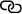

An algorithm that learns through rewards may show how our brain does too - MIT Technology Review

### [Artificial Intelligence](https://www.technologyreview.com/artificial-intelligence/) / [Machine Learning](https://www.technologyreview.com/artificial-intelligence/machine-learning/)

# An algorithm that learns through rewards may show how our brain does too

## By optimizing reinforcement-learning algorithms, DeepMind uncovered new details about how dopamine helps the brain learn.

by [Karen Hao](https://www.technologyreview.com/profile/karen-hao/)
Jan 15, 2020

In 1951, Marvin Minsky, then a student at Harvard, borrowed observations from animal behavior to try to design an intelligent machine. Drawing on the work of physiologist Ivan Pavlov, who famously used dogs to show how animals learn through punishments and rewards, Minsky [created a computer](https://www.the-scientist.com/foundations/machine--learning--1951-65792) that could continuously learn through similar reinforcement to solve a virtual maze.

At the time, neuroscientists had yet to figure out the mechanisms within the brain that allow animals to learn in this way. But Minsky was still able to loosely mimic the behavior, thereby advancing artificial intelligence. Several decades later, as [reinforcement learning](https://www.technologyreview.com/s/603501/10-breakthrough-technologies-2017-reinforcement-learning/) continued to mature, it in turn helped the field of neuroscience [discover](https://www.jneurosci.org/content/jneuro/16/5/1936.full.pdf) those mechanisms, feeding into a virtuous cycle of advancement between the two fields.

In a [paper published](https://doi.org/10.1038/s41586-019-1924-6) in Nature today, DeepMind, Alphabet’s AI subsidiary, has once again used lessons from reinforcement learning to propose a new theory about the reward mechanisms within our brains. The hypothesis, supported by initial experimental findings, could not only improve our understanding of mental health and motivation. It could also validate the current direction of AI research toward building more human-like general intelligence.

![](data:image/svg+xml,%3csvg xmlns='http://www.w3.org/2000/svg' viewBox='0 0 58 60.1' class='jsx-3449101280 js-evernote-checked' data-evernote-id='542'%3e%3cg class='jsx-3449101280 js-evernote-checked' data-evernote-id='543'%3e%3cg class='jsx-3449101280 js-evernote-checked' data-evernote-id='544'%3e%3cg class='jsx-3449101280 js-evernote-checked' data-evernote-id='545'%3e%3cg class='jsx-3449101280 js-evernote-checked' data-evernote-id='546'%3e%3cg class='jsx-3449101280 js-evernote-checked' data-evernote-id='547'%3e%3cpolyline points='42.6%2c18.5 55.9%2c58.6 43.3%2c58.6 39.7%2c49.6 18.9%2c49.6 15.4%2c58.6 2.1%2c58.6 6.7%2c46.2' class='jsx-3449101280 st0 js-evernote-checked' data-evernote-id='548'%3e%3c/polyline%3e%3cg class='jsx-3449101280 js-evernote-checked' data-evernote-id='549'%3e%3cpath d='M38.9%2c19.9c-0.7-2.1%2c0.4-4.3%2c2.5-5c2.1-0.7%2c4.3%2c0.4%2c5%2c2.5c0.7%2c2.1-0.4%2c4.3-2.5%2c5 C41.8%2c23.1%2c39.6%2c22%2c38.9%2c19.9z' class='jsx-3449101280 st1 js-evernote-checked' data-evernote-id='550'%3e%3c/path%3e%3c/g%3e%3cg class='jsx-3449101280 js-evernote-checked' data-evernote-id='551'%3e%3cpath d='M10.3%2c47.7c0.7-2-0.3-4.3-2.4-5.1c-2-0.7-4.3%2c0.3-5.1%2c2.4c-0.7%2c2%2c0.3%2c4.3%2c2.4%2c5.1 C7.3%2c50.8%2c9.6%2c49.8%2c10.3%2c47.7z' class='jsx-3449101280 st1 js-evernote-checked' data-evernote-id='552'%3e%3c/path%3e%3c/g%3e%3c/g%3e%3c/g%3e%3c/g%3e%3cg class='jsx-3449101280 js-evernote-checked' data-evernote-id='553'%3e%3cg class='jsx-3449101280 js-evernote-checked' data-evernote-id='554'%3e%3cpolyline points='37.4%2c39.6 29.9%2c12.5 29.7%2c12.5 22.3%2c38.4 29%2c38.4' class='jsx-3449101280 st0 js-evernote-checked' data-evernote-id='555'%3e%3c/polyline%3e%3cg class='jsx-3449101280 js-evernote-checked' data-evernote-id='556'%3e%3cpath d='M41.1%2c38.3c0.6%2c2.1-0.7%2c4.3-2.8%2c4.9s-4.3-0.7-4.9-2.8c-0.6-2.1%2c0.7-4.3%2c2.8-4.9 C38.4%2c35%2c40.5%2c36.2%2c41.1%2c38.3z' class='jsx-3449101280 st1 js-evernote-checked' data-evernote-id='557'%3e%3c/path%3e%3c/g%3e%3c/g%3e%3c/g%3e%3cg class='jsx-3449101280 js-evernote-checked' data-evernote-id='558'%3e%3cg class='jsx-3449101280 js-evernote-checked' data-evernote-id='559'%3e%3cpolyline points='10.8%2c34.3 22.6%2c1.5 36.2%2c1.5 38.4%2c7.5' class='jsx-3449101280 st0 js-evernote-checked' data-evernote-id='560'%3e%3c/polyline%3e%3cg class='jsx-3449101280 js-evernote-checked' data-evernote-id='561'%3e%3cpath d='M14.5%2c35.5c-0.7%2c2.1-3%2c3.1-5.1%2c2.4c-2.1-0.7-3.1-3-2.4-5.1c0.7-2.1%2c3-3.1%2c5.1-2.4 C14.2%2c31.2%2c15.3%2c33.4%2c14.5%2c35.5z' class='jsx-3449101280 st1 js-evernote-checked' data-evernote-id='562'%3e%3c/path%3e%3c/g%3e%3cg class='jsx-3449101280 js-evernote-checked' data-evernote-id='563'%3e%3cpath d='M34.6%2c8.6c0.7%2c2.1%2c3%2c3.1%2c5.1%2c2.4c2.1-0.7%2c3.1-3%2c2.4-5.1c-0.7-2.1-3-3.1-5.1-2.4 C34.9%2c4.3%2c33.9%2c6.6%2c34.6%2c8.6z' class='jsx-3449101280 st1 js-evernote-checked' data-evernote-id='564'%3e%3c/path%3e%3c/g%3e%3c/g%3e%3c/g%3e%3c/g%3e%3c/g%3e%3c/svg%3e)

#### Sign up for **The Algorithm** — artificial intelligence, demystified

Also stay updated on MIT Technology Review initiatives and events?
YesNo

At a high level, reinforcement learning follows the insight derived from Pavlov’s dogs: it’s possible to teach an agent to master complex, novel tasks through only positive and negative feedback. An algorithm begins learning an assigned task by randomly predicting which action might earn it a reward. It then takes the action, observes the real reward, and adjusts its prediction based on the margin of error. Over millions or even billions of trials, the algorithm’s prediction errors converge to zero, at which point it knows precisely which actions to take to maximize its reward and so complete its task.

It turns out the brain’s reward system works in much the same way—a discovery made in the 1990s, inspired by reinforcement-learning algorithms. When a human or animal is about to perform an action, its dopamine neurons make a prediction about the expected reward. Once the actual reward is received, they then fire off an amount of dopamine that corresponds to the prediction error. A better reward than expected triggers a strong dopamine release, while a worse reward than expected suppresses the chemical’s production. The dopamine, in other words, serves as a correction signal, telling the neurons to adjust their predictions until they converge to reality. The phenomenon, known as reward prediction error, works much like a reinforcement-learning algorithm.

DeepMind’s new paper builds on the tight connection between these natural and artificial learning mechanisms. In 2017, its researchers introduced an improved reinforcement-learning algorithm that has since unlocked increasingly impressive performance on various tasks. They now believe this new method could offer an even more precise explanation of how dopamine neurons work in the brain.

Specifically, the improved algorithm changes the way it predicts rewards. Whereas the old approach estimated rewards as a single number—meant to equal the average expected outcome—the new approach represents them more accurately as a distribution. (Think for a moment about a slot machine: you can either win or lose following some distribution. But in no instance would you ever receive the average expected outcome.)

The modification lends itself to a new hypothesis: Do dopamine neurons also predict rewards in the same distributional way?

To test this theory, DeepMind partnered with a group at Harvard to observe dopamine neuron behavior in mice. They set the mice on a task and rewarded them based on the roll of dice, measuring the firing patterns of their dopamine neurons throughout. They found that every neuron released different amounts of dopamine, meaning they had all predicted different outcomes. While some were too “optimistic,” predicting higher rewards than actually received, others were more “pessimistic,” lowballing the reality. When the researchers mapped out the distribution of those predictions, it closely followed the distribution of the actual rewards. This data offers compelling evidence that the brain indeed uses distributional reward predictions to strengthen its learning algorithm.

Through measuring dopamine neuron behavior in mice, the researchers found that the distribution of the neurons' predictions (decoded) closely followed the distribution of the actual rewards (ground truth).

DeepMind

“This is a nice extension to the notion of dopamine coding of reward prediction error,” wrote Wolfram Schultz, a pioneer in dopamine neuron behavior who wasn’t involved in the study, in an email. “It is amazing how this very simple dopamine response predictably follows intuitive patterns of basic biological learning processes that are now becoming a component of AI.”

The study has implications for both AI and neuroscience. First, it validates distributional reinforcement learning as a promising path to more advanced AI capabilities. “If the brain is using it, it’s probably a good idea,” said Matt Botvinick, DeepMind’s director of neuroscience research and one of the lead authors on the paper, during a press briefing. “It tells us that this is a computational technique that can scale in real-world situations. It’s going to fit well with other computational processes.”

Second, it could offer an important update to one of the canonical theories in neuroscience about reward systems in the brain, which in turn could improve our understanding of everything from motivation to mental health. What might it mean, for example, to have “pessimistic” and “optimistic” dopamine neurons? If the brain selectively listened to only one or the other, could it lead to chemical imbalances and induce depression?

Fundamentally, by further decoding processes in the brain, the results also shed light on what creates human intelligence. “It gives us a new perspective on what's going on in our brains during everyday life,” Botvinick said.' class='jsx-671803276 js-evernote-checked' data-evernote-id='608'%3e%3c/path%3e%3c/svg%3e)

Share

[**](https://www.facebook.com/dialog/share?app_id=140586622674265&display=popup&title=An%20algorithm%20that%20learns%20through%20rewards%20may%20show%20how%20our%20brain%20does%20too&description=By%20optimizing%20reinforcement-learning%20algorithms%2C%20DeepMind%20uncovered%20new%20details%20about%20how%20dopamine%20helps%20the%20brain%20learn.&href=https%3A%2F%2Fwww.technologyreview.com%2Fs%2F615054%2Fdeepmind-ai-reiforcement-learning-reveals-dopamine-neurons-in-brain%2F%3Futm_campaign%3Dsite_visitor.unpaid.engagement%26utm_source%3Dfacebook%26utm_medium%3Dsocial_share%26utm_content%3D2020-01-17)

[**](https://twitter.com/intent/tweet?text=An%20algorithm%20that%20learns%20through%20rewards%20may%20show%20how%20our%20brain%20does%20too%20-%20via%20%40techreview&url=https%3A%2F%2Fwww.technologyreview.com%2Fs%2F615054%2Fdeepmind-ai-reiforcement-learning-reveals-dopamine-neurons-in-brain%2F%3Futm_campaign%3Dsite_visitor.unpaid.engagement%26utm_source%3Dtwitter%26utm_medium%3Dsocial_share%26utm_content%3D2020-01-17)

[**](https://reddit.com/submit?text=An%20algorithm%20that%20learns%20through%20rewards%20may%20show%20how%20our%20brain%20does%20too&url=https%3A%2F%2Fwww.technologyreview.com%2Fs%2F615054%2Fdeepmind-ai-reiforcement-learning-reveals-dopamine-neurons-in-brain%2F%3Futm_campaign%3Dsite_visitor.unpaid.engagement%26utm_source%3Dreddit%26utm_medium%3Dsocial_share%26utm_content%3D2020-01-17)

[**](https://linkedin.com/shareArticle?text=An%20algorithm%20that%20learns%20through%20rewards%20may%20show%20how%20our%20brain%20does%20too&url=https%3A%2F%2Fwww.technologyreview.com%2Fs%2F615054%2Fdeepmind-ai-reiforcement-learning-reveals-dopamine-neurons-in-brain%2F%3Futm_campaign%3Dsite_visitor.unpaid.engagement%26utm_source%3Dlinkedin%26utm_medium%3Dsocial_share%26utm_content%3D2020-01-17&summary=By%20optimizing%20reinforcement-learning%20algorithms%2C%20DeepMind%20uncovered%20new%20details%20about%20how%20dopamine%20helps%20the%20brain%20learn.)

[**](https://api.whatsapp.com/send?text=An%20algorithm%20that%20learns%20through%20rewards%20may%20show%20how%20our%20brain%20does%20too%20https%3A%2F%2Fwww.technologyreview.com%2Fs%2F615054%2Fdeepmind-ai-reiforcement-learning-reveals-dopamine-neurons-in-brain%2F%3Futm_campaign%3Dsite_visitor.unpaid.engagement%26utm_source%3Dwhatsapp%26utm_medium%3Dsocial_share%26utm_content%3D2020-01-17)

[**](https://www.technologyreview.com/s/615054/deepmind-ai-reiforcement-learning-reveals-dopamine-neurons-in-brain/mailto:?subject=An%20algorithm%20that%20learns%20through%20rewards%20may%20show%20how%20our%20brain%20does%20too&body=From%20MIT%20Technology%20Review%3A%0A%0AAn%20algorithm%20that%20learns%20through%20rewards%20may%20show%20how%20our%20brain%20does%20too%0ABy%20optimizing%20reinforcement-learning%20algorithms%2C%20DeepMind%20uncovered%20new%20details%20about%20how%20dopamine%20helps%20the%20brain%20learn.%0A%0Ahttps%3A%2F%2Fwww.technologyreview.com%2Fs%2F615054%2Fdeepmind-ai-reiforcement-learning-reveals-dopamine-neurons-in-brain%2F%3Futm_campaign%3Dsite_visitor.unpaid.engagement%26utm_source%3Demail%26utm_medium%3Dsocial_share%26utm_content%3D2020-01-17)

Link

Tagged[Deep Learning](https://www.technologyreview.com/g/deep-learning/), [Neural Networks](https://www.technologyreview.com/g/neural-networks/)

Author
[(L)](https://www.technologyreview.com/profile/karen-hao/)
[Karen Hao](https://www.technologyreview.com/profile/karen-hao/)