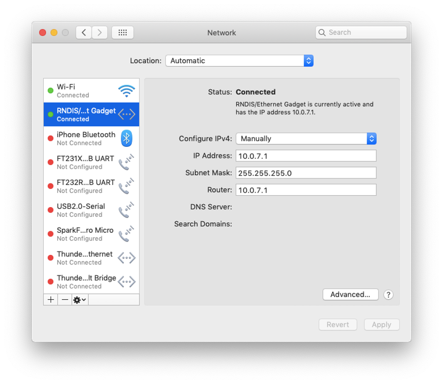
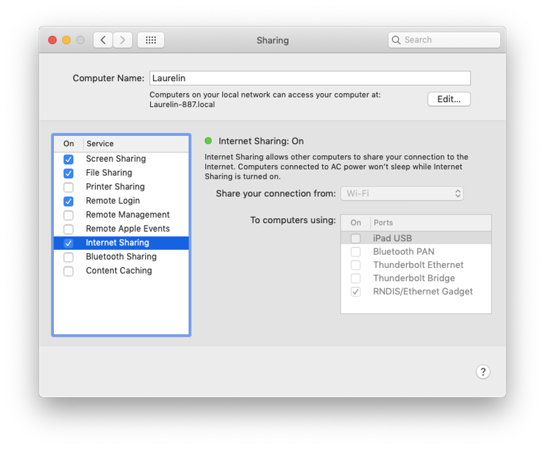

An always-available, online-capable Raspberry Pi in your pocket

# An always-available, online-capable Raspberry Pi in your pocket

Sep 21, 2019

These days, I’m building a lot of hardware projects based on the ubiquitous Raspberry Pi mini computer. Especially with the Raspberry Pi Zero W (an even tinier version, with the `W` denoting the wifi-capable version), you can have one anywhere and can power it from any USB power source.

A number of write-ups exist telling you how to enable “Ethernet gadget mode”, which essentially lets you use one of the Zero’s USB ports as a hardwired network connection. But one additional thing that I wanted was the ability for the Zero to proxy through my development computer when attached and when *that* computer was on wifi. That is, I can talk to the Zero from my laptop anytime (such as when offline on an airplane), but if my laptop is on wifi, the Zero can also reach the internet—for downloading updates, developing applications, whatever—just like my Mac can. That way, I don’t have to mess with the Linux-based wifi configuration on the Pi for each and every network I find myself on.

Want to know more? Read on.

I’m going to assume you know your way around both the Raspberry Pi ecosystem and the Mac development environment.

## On the Pi

1.   Get a Raspberry Pi Zero W setup and online so that you can get into it over SSH. I really like [BerryLAN](http://www.berrylan.org/), which is a light layer over Raspian plus an iOS app, because I can get a brand new Pi setup without ever plugging in a keyboard or monitor to it.

2.   Change the last line of `/etc/network/interfaces` to read:

	source /etc/network/interfaces.d/*

This is a slight tweak over the default which does what was originally intended, which is to actually pay attention to files in that directory. What a great idea!

3.   Create a file at `/etc/network/interfaces.d/usb0.conf` which contains:

	allow-hotplug usb0
	iface usb0 inet static
	    address 10.0.7.2/24
	    gateway 10.0.7.1
	    dns-nameservers 10.0.7.1

4. Add `nameserver 10.0.7.1` to `/etc/resolv.conf`.

5. Add `modules-load=dwc2,g_ether` after `rootwait` to `/boot/cmdline.txt`. These are related to USB mode and ethernet support.

6. Add `dtoverlay=dwc2` to the end of `/boot/config.txt`.

7. Reboot the Pi (`sudo reboot`).

## On the Mac

1.   Update the default *Internet Sharing* configuration NAT (proxying, essentially) network. This won’t affect internet sharing to other devices (other than to use this new LAN for them, too).

	$ sudo defaults write /Library/Preferences/SystemConfiguration/com.apple.nat NAT -dict-add SharingNetworkNumberStart 10.0.7.1

	$ sudo defaults write /Library/Preferences/SystemConfiguration/com.apple.nat NAT -dict-add SharingNetworkNumberEnd 10.0.7.254

	$ sudo defaults write /Library/Preferences/SystemConfiguration/com.apple.nat NAT -dict-add SharingNetworkMask 255.255.255.0

2.   Once your Pi is plugged into the Mac and booted up, configure the new *RNDIS/Ethernet Gadget* interface manually:

    - IP Address: `10.0.7.1`

    - Subnet Mask: `255.255.255.0`

    - Router: `10.0.7.1`

Despite its name, this “gadget” is actually the Mac side of the equation, so you are basically setting yourself up as the router for this shared, physical LAN. If this interface is green, your Pi should be reachable. If you issue a `sudo halt` on the Pi, the interface will go red once the Pi is shut down.

3.   Configure your *Internet Sharing* to share wifi (if available) with the gadget interface.

## You’re all set!

Once you’ve done this, you will always be able to plug your Pi into your Mac and then SSH into it (`ssh pi@10.0.7.2`). If you are on wifi, the Pi will also have an internet connection through your Mac.

Enjoy! I hope this helps folks get some work done a little more conveniently.

## References

- [HowToOTGFast.md](https://gist.github.com/gbaman/975e2db164b3ca2b51ae11e45e8fd40a)

- [Files in /etc/network/interfaces.d ignored, but not /etc/network/interfaces itself](https://askubuntu.com/questions/853615/files-in-etc-network-interfaces-d-ignored-but-not-etc-network-interfaces-itse)

- [Good detailed explanation of /etc/network/interfaces syntax?](https://unix.stackexchange.com/questions/128439/good-detailed-explanation-of-etc-network-interfaces-syntax)

- [Debian Reference Manual - Chapter 5. Network setup](https://wiki.debian.org/NetworkConfiguration)

- [Change the default subnet for Internet Sharing](http://hints.macworld.com/article.php?story=20090510120814850)

- [Change default subnet IP with internet sharing](https://discussions.apple.com/thread/2726049)

- [How can I setup my mac (OS X Yosemite) as an internet gateway](https://apple.stackexchange.com/questions/192089/how-can-i-setup-my-mac-os-x-yosemite-as-an-internet-gateway#192183)