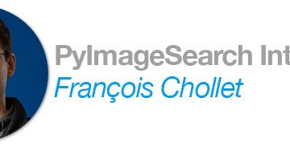

An interview with Francois Chollet - PyImageSearch

An interview with Francois Chollet - PyImageSearch

https://www.pyimagesearch.com/2018/07/02/an-interview-with-francois-chollet/

Check out this interview with Francois Chollet, Google AI researcher and creator of the Keras deep learning library.