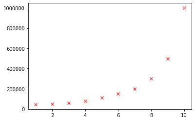
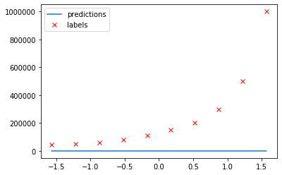
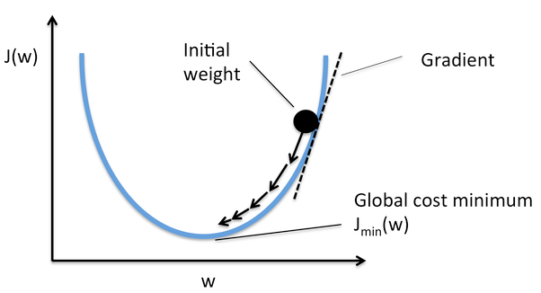
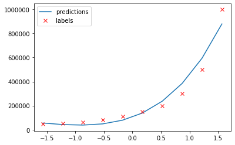
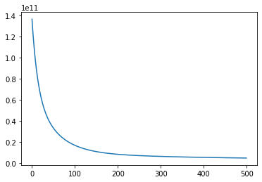
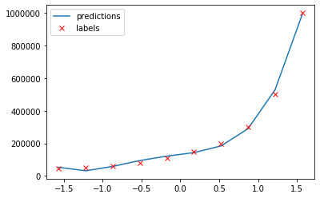

An introduction to machine learning through polynomial regression

December 22, 2019

# An introduction to machine learning through polynomial regression

Machine learning is one of the hottest topics in computer science today. And not without a reason: it has helped us do things that couldn’t be done before like image classification, image generation and natural language processing. But all of it boils down to a really simple concept: you give the computer data and the computer then finds patterns in that data. This is called “learning” or “training”, depending on your point of view. These learnt patterns can be extrapolated to make predictions. How? That’s what we are looking at today.

By working through a real world example you will learn how to build a polynomial regression model to predict salaries based on job position. Polynomial regression is one of the core concepts that underlies machine learning. I will discuss the mathematical motivations behind each concept. We will also look at *overfitting* and *underfitting* and why you want to avoid both.

This tutorial assumes you are familiar with the basics of [linear algebra](https://www.youtube.com/watch?v=fNk_zzaMoSs&list=PLZHQObOWTQDPD3MizzM2xVFitgF8hE_ab) and [calculus](https://www.youtube.com/watch?v=WUvTyaaNkzM&list=PLZHQObOWTQDMsr9K-rj53DwVRMYO3t5Yr).

## The data

The first thing to always do when starting a new machine learning model is to load and inspect the data you are working with. As I mentioned in the introduction we are trying to predict the salary based on job prediction. To do so we have access to the following dataset:

As you can see we have three columns: position, level and salary. Position and level are the same thing, but in different representation. Because it’s easier for computers to work with numbers than text we usually map text to numbers.

In this case the levels are the *input data* to the model. While we the numbers are already known, the salary is the *output data*. With this data we will build a model at *training time*, where both are available. At *inference time*, we will only have input data. Our job as machine learning engineers is to build a model that outputs good data at *inference time*.

The input data is usually called X∈ℝm×nX∈Rm×n where mm is the number of *training examples*, 1010 in our case, and nn the dimensionality, or number of features, 1 in our case. A training example is a row in the *input dataset* which has *features*, or aspects, which we are using to make predictions.

The output data is called y⃗ ∈ℝmy→∈Rm, a vector because it typically has only one column.

So in our case

X=⎡⎣⎢⎢⎢⎢⎢⎢⎢⎢⎢⎢⎢⎢⎢12345678910⎤⎦⎥⎥⎥⎥⎥⎥⎥⎥⎥⎥⎥⎥⎥y=⎡⎣⎢⎢⎢⎢⎢⎢⎢⎢⎢⎢⎢⎢⎢450005000060000800001100001500002000003000005000001000000⎤⎦⎥⎥⎥⎥⎥⎥⎥⎥⎥⎥⎥⎥⎥X=[12345678910]y=[450005000060000800001100001500002000003000005000001000000]

Of course
‖y‖=m‖y‖=m
In Python:

	X = np.array([[1, 2, 3, 4, 5, 6, 7, 8, 9, 10]]).T
	y = np.array([45000, 50000, 60000, 80000, 110000, 150000, 200000, 300000, 500000, 1000000])
	m, n = X.shape

The iith training exmple is X(i),y(i)X(i),y(i). The jjth feature is XjXj.
We can inspect our training set in a plot, (since n=1n=1)

	plt.plot(X, y, 'rx')

## The hypothesis function

To predict output values from input values we use an hypothesis function called hh, paramaterized by θ∈ℝn+1θ∈Rn+1. We will fit hh to our datapoints so that it can be extrapolated for new values of XX.

hθ(x)=θ0+θ1x1hθ(x)=θ0+θ1x1

In order to ease the computation later on we usually add a column of 11’s at X0X0 giving

X=⎡⎣⎢⎢⎢⎢⎢⎢⎢⎢⎢⎢⎢⎢⎢111111111112345678910⎤⎦⎥⎥⎥⎥⎥⎥⎥⎥⎥⎥⎥⎥⎥X=[111213141516171819110]
so that
hθ(x)=θTx.hθ(x)=θTx.

Because these 11s change the hypothesis independently from the input xx it’s sometimes called the bias factor. The bias vector is also the reason θ∈ℝn+1θ∈Rn+1 and not θ∈ℝnθ∈Rn

	*# Add a bias factor to X.
	*X = np.hstack((np.ones((m, 1)), X))

By changing the values of θθ we can change the hypothesis hθ(x)hθ(x).

### Adding polynomial features

As you will probably have noticed hh is a polynomial of degree 11 while our dataset is nonlinear. This function will always be a bad fit, no matter which values of θθ we use.

To fix that we will add polynomial features to XX, which, of course, also increases nn.

By inspecting the plot we learn that adding polynomial features like (Xj)2(Xj)2 could fit our dataset. Nonpolynomial features like Xj‾‾√Xj are also allowed, but not used in this tutorial because it’s called “An introduction to machine learning through **polynomial regression**.”

In this model I added 3 additional polynomials, increasing nn to 33.

	X = np.hstack((X, (X[:, 1] ** 2).reshape((m, 1)), (X[:, 1] ** 3).reshape((m, 1)), (X[:, 1] ** 4).reshape((m, 1)))); X

You should try adding or removing polynomial features yourself.

### Normalization

When we added the features a new problem emerged: their ranges are very different from X1X1. Every feature XjXj has an associated weight θjθj (more in that later). This means that a small change in a weight associated with a generally large feature has a much bigger impact than the same change has on a generally small feature. This causes problems when we are fitting the values θθ later on.

To fix this problem we use a technique called *normalization*, defined as
Xj:=Xj−μjσjfor x in 1…jXj:=Xj−μjσjfor x in 1…j

where μjμj and σjσj are the mean and standard deviation of XjXj respectively. Normalization sets the mean close to 00 and the standard deviation to 11, which always benefits training. Note that we don’t normalize X0X0 because σ0=X0−μ0=0σ0=X0−μ0=0.

	X[:, 1:] = (X[:, 1:] - np.mean(X[:, 1:], axis=0)) / np.std(X[:, 1:], axis=0)

## Initializing θθ and making predictions

Before we make a prediction I would like to make a small change to the hypothesis function. Remember hθ(x)=θ0x0+θ1x1hθ(x)=θ0x0+θ1x1. Note that it only supports one feature, and a bias. We can generalize it as follows:

hθ(x)=∑inθixi=θ0x0+θ1x1+…+θnxnhθ(x)=∑inθixi=θ0x0+θ1x1+…+θnxn
Here you can see the link between XjXj and θjθj.

Because we will be using the hypothesis function many times in the future it should be very fast. Right now hh can only compute one the prediction for one training example at a time.

We can change that by *vectorizing* it. If we implemented the sum function by looping each xx with associated θθ, it would take a very long time. We can change that by vectorizing the function. With vectorization you can compute the outputs for an entire matrix, or vector, at once. While you technically compute the same values, good linear algebra libraries such as numpy will optimize the use of the available hardware to speed up the process. A vectorized implementation of hh:

hθ(X)=Xθhθ(X)=Xθ

You can validate it works by writing down a few examples. This function takes the whole matrix XX as an input and produces the prediction ŷ y^ in one computation.

In Python hθ(X)hθ(X) can be implemented as:

	def h(X, theta):
	  return X @ theta

Before we can make predictions we need to initialize θθ. By convention we fill it with random numbers, but it does not make a difference in this program*.

	theta = np.random.random(n+1)
	predictions = h(X, theta)

In a graph:

* Random initialization is crucial for symmetry braking in neural networks.

## Loss

As you can see our current predictions are frankly quite bad. But what does “bad” mean? It’s much too vague for mathematicians.

To measure we models accuracy we use a loss function. In this case mean square error, or MSE for short. While many loss functions exist, MSE is proven to be one of the best for regression problems like ours. It is defined as

J(θ)=1m∑im(hθ(x(i))−y(i))2J(θ)=1m∑im(hθ(x(i))−y(i))2

JJ is a function of the current state of the model—the parameters θθ which make up the model. It takes our prediction for example ii, squares it (signs do not matter). This number is the distance from our prediction to the actual datapoint, squared. We take the average of these “distances”.

A vectorized Python implementation:

	def J(theta, X, y):
	  return np.mean(np.square(h(X, theta) - y))

In my case I had a loss of 142 911 368 743142 911 368 743, which may vary slightly as a result of the random initialization.

## Regression with gradient descent

We can improve our model, decrease our loss, by chaning the paramters of θθ. We do that using an algorithm called gradient descent.

Gradient descent caculates the *gradient* of a model using the partial derivative of the cost function. This gradient is multiplied by a learning rate, often denoted as αα, to control the pace of learning*. The result of this multiplication is then substracted from the weights to decrease the loss of further predictions.

Below is a plot of the loss function. The gradient decreases as JJ approaches the minimum. [source](https://www.quora.com/Whats-the-difference-between-gradient-descent-and-stochastic-gradient-descent)

More formally, the partial derivative of JJ with respect to paramters θθ is
∂J(θ)∂θj=1mxTj(Xθ−y)∂J(θ)∂θj=1mxjT(Xθ−y)
. In vectorized form for all XjXj
∇J(θ)=1mxT(Xθ−y)∇J(θ)=1mxT(Xθ−y)
The gradient descent step is
θ:=θ−α∇J(θ)=θ−α1mXT(Xθ−y).θ:=θ−α∇J(θ)=θ−α1mXT(Xθ−y).
We repeat this computation very many times. This is called training.

*Choosing a value of αα is an interesting topic on itself so I’m not going to discuss it in this article. If you’re interested you can learn more [here](https://heartbeat.fritz.ai/an-empirical-comparison-of-optimizers-for-machine-learning-models-b86f29957050).

### In Python

A typical value for αα is 0.010.01. It’s interesting to play around with this value yourself.

	alpha = 0.01

A gradient descent step can be implemented as follows:

	theta = theta - alpha * (1/m) * (X.T @ ((X @ theta) - y))

While training we often keep track of the loss to make sure it decreases as we progress. A training loop is a fancy term for performing multiple gradient descent step. Our training loop:

	losses = []
	for _ in range(500):
	  theta = theta - alpha * (1/m) * (X.T @ ((X @ theta) - y))
	  losses.append(J(theta, X, y))

We train for 500500  *epochs*.
Looking at our fit again:

	predictions = h(X, theta)
	plt.plot(X[:, 1], predictions, label='predictions')
	plt.plot(X[:, 1], y, 'rx', label='labels')
	plt.legend()

That looks much more promising than what we had before.
Let’s look at how loss decreased during training:

We still have loss of 2 596 116 9022 596 116 902. While this may seem like a huge number, it’s an improvement of almost 98.2%98.2%. Since we are working with huge numbers in this project we expect the loss to be high. This is one of the reasons you need to be familiar with the data you are working with.

Now that we have fitted θθ, we can make predictions by passing new values of xx to hθ(x)hθ(x).

## The normal equation

Even though it is a very popular choice, gradient descent is not the only way to find values for θθ. Another method called the *normal equation* also exists. With this formula you can compute the optimal values for θθ without choosing αα and without iterating.

The normal equation is defined as
θ=(XTX)−1XTyθ=(XTX)−1XTy

For more information on where this comes from check out [this](https://eli.thegreenplace.net/2014/derivation-of-the-normal-equation-for-linear-regression) post.

The biggest advantage of this is you always find the optimal value of θθ. Note that this is the best fit for the model (hh) you built, and might not the best solution for your problem in general.

A drawback of using this method over gradient descent is the computational cost. Computing the inverse (XTX)−1(XTX)−1 is O(n3)O(n3) so when you have many features, it might be very expensive. In cases where nn is large, think n>10 000n>10 000, you would probably want to switch to gradient descent or another training algorithm.

Implementing the normal equation in Python is just a matter of implementing the formula:

	theta = np.linalg.pinv(X.T @ X) @ X.T @ y

Note that we use the pseudo inverse instead of the real inverse because a training set might be noninvertable.

Another risk over using the normal equation is overfitting, which I will cover in the next section.

## Overfitting, underfitting, and some tips

Before I wrap up this tutorial I would like to share a little more theory behind machine learning.

### Splitting datasets

In this tutorial we used every available training example. In real world applications you would want to split your data into three categories:

- **Training data**: is the data you train your model on.

- **Validation data**: is used to optimize hyperparameters, such as αα and the number of your epochs. While not very important in regression models, it is a very crucial part of *deep learning**. You do not use validation data using training because this subset is designed to optimize hyperparameters instead of weights. Confusing them leads to worse performance.

- **Test data**: is used to get a sense of how a model would perform in production. This dataset must not be used to improve the model. Changing parameters based on the test dataset will invalidate your ideas about its performce—use the validation set for this.

* Deep learning is a subfield of machine learning.

### Feature selection

No two features in a dataset should be dependent on each other. If they were it would put an excessive emphasis on the underlying cause leading to worse accuracy. For example, we could add a “years of experience” feature to our dataset, but “main task” would not be good idea since it’s highly correlated with the job position.

Remember that machine learning models are not magic applications. As a rule of thumb a human must be able to draw the same conclusions given the same input data. The color of someones hair is most likely not related to their salary so adding it to the dataset would only confuse gradient descent. The model could find random correlations though which do not generalize well in production.

### Overfitting & underfitting

Underfitting but particularly overfitting are perhaps the biggest problems in machine learning today. To really understand it we have to go back to the fundamental concept of machine learning: learning from data to make predictions about or in the future, using a model.

When your model is fit too specifically to your dataset it’s overfitted. While it has a very low loss, in extreme cases even 00, it does not generalize well in the real world. The normal equation we used earlier actually overfitted the dataset, because it found a function which passes through our training values very closely, but it does not represent a function of position to salary. For example, notice how it predicts a higher salary for lowest position.

Overfitting can occur when you train your model for too long. Another cause for overfitting is having too many features. To reduce overfitting you should try training your model for fewer epochs, or removing some features. You always want m>nm>n.

Underfitting is the opposite of overfitting. When your model is too simple, for example when you try fitting a one degree polynomial to a multidegree dataset, it will underfit.

To reduce underfitting you should try adding polynomial features to your dataset. Another cause might be a bad train/test split—you always want your data to be divided equally over your train and test set. For example, we could put some randomly selected job positions in a test set. But if we used only the highest positions for testing, and everything else for training, the model would underfit because it has not seen the full environment it will be used in.

Another technique to reduce overffiting is called *data augmentation*. With data augmentation you can create more training examples, without actively gathering more data which might not even be available. If you were working with images for example, you could try flipping them horizontally or cropping them.

## What’s next?

Machine learning is not just predicting salaries based on job titles, or even predicting any number based on input data. Predicting values in a continuous space as we’ve done today is called regression, a form of *supervised learning* because we had labelled (we know yy) available at training time.

Another form of *supervised learning* is classification where your goal is to assign a label to an input. For example, classifying images of handwritten digits would be a classification problem.

*Unsupervised learning* also exists. Grouping items based on similarity, for example. But also recommendation systems like the YouTube algorithm use machine learning under the hood.

Here are two great courses if you want to learn more about machine learning:

- [Stanford CS229 Machine Learning](https://www.coursera.org/learn/machine-learning) + [Python Notebooks](https://github.com/rickwierenga/cs229-python)

- [fast.ai](https://www.fast.ai/)

- TensorFlow’s machine learning curriculum which I lay out in [this thread](https://twitter.com/rickwierenga/status/1196879291063164928).

You can view the complete code for this project [here](https://colab.research.google.com/drive/18MpkRiZCEDg0BZgpqrS_3_mQs_0VpQJ4).

* * *

If you have any questions or comments, feel free to reach out on [Twitter](https://twitter.com/rickwierenga) or email me directly at rick_wierenga [at] icloud [dot] com.