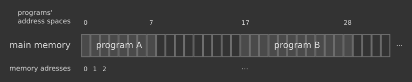
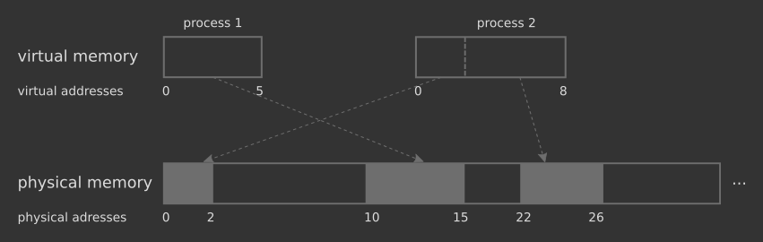
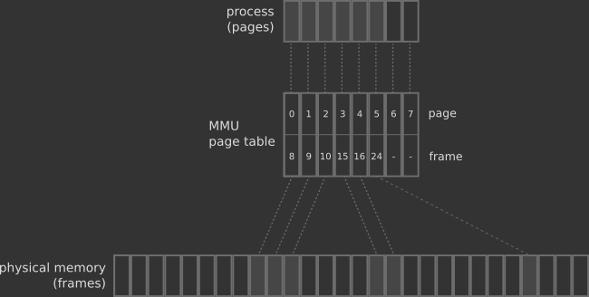

An introduction to virtual memory - Internal Pointers

— Written by Triangles on April 27, 2020 • updated on May 02, 2020 • ID 80 —

# An introduction to virtual memory

...and the crucial role it plays in modern operating systems.

[Compliance Training Online](https://googleads.g.doubleclick.net/aclk?sa=l&ai=CA1JaQUK4XvKBJoKQ3wPFoZywBbjFgOBcsv6I47YKsJAfEAEg5Lj8JmC7vq6D0AqgAe3pqIoDyAEBqQIpN_mFyi-yPqgDAcgDywSqBPgBT9Cg5G7CCy-ziG9I5TsKTZ_VZ72OrBY68lA0aAeu_PbNYs70PkDGFvlXU1zV_CqKHITr7lJ-4k0Oltur0XgjF7OqQPuK0pvWnIPk6bdlJCh1sVcSKlOl8N3dB48JL4-XQkNvd6-m7Pj42EvxhfktfZMhMUVfk_UBU3oCWrVUmqvfx8Ko8tJOQMyawkRDHAC5IVy64W-PZ1byaMe5kzs_R10WAmJ3IQqPb1SRQHpAURxvmQH8BLCa30w0oJUS4Oe-hvn5vTY6Cdhi45xV3jYA1Y4aApH0lGAIFbXqIudBIo5BZaEE-DsnFY66OVuW8r6Qw1WGyR2ImePABNb22MakAoAH-5XXdagHjs4bqAfVyRuoB5PYG6gHugaoB_DZG6gH8tkbqAemvhuoB-zVG6gH89EbqAfs1RuoB5bYG6gHwtob2AcB0ggJCIzjgHAQARgesQmSg57L2Ql2kIAKAZgLAcgLAdgTDQ&ae=1&num=1&sig=AOD64_08KHx3HwRfVXGHskVorJt6A6OYcg&client=ca-pub-1778432007040046&nb=0&adurl=https://interactiveservices.com/sexual-harassment-training/%3Fkeyword%3D%26creative%3D389335401766%26gclid%3DEAIaIQobChMIsqb3h_Gp6QIVAsh3Ch3FEAdWEAEYASAAEgLWxvD_BwE)

[Easy to Customize. Mobile Ready. 20+ Languages. Free Trial!](https://googleads.g.doubleclick.net/aclk?sa=l&ai=CA1JaQUK4XvKBJoKQ3wPFoZywBbjFgOBcsv6I47YKsJAfEAEg5Lj8JmC7vq6D0AqgAe3pqIoDyAEBqQIpN_mFyi-yPqgDAcgDywSqBPgBT9Cg5G7CCy-ziG9I5TsKTZ_VZ72OrBY68lA0aAeu_PbNYs70PkDGFvlXU1zV_CqKHITr7lJ-4k0Oltur0XgjF7OqQPuK0pvWnIPk6bdlJCh1sVcSKlOl8N3dB48JL4-XQkNvd6-m7Pj42EvxhfktfZMhMUVfk_UBU3oCWrVUmqvfx8Ko8tJOQMyawkRDHAC5IVy64W-PZ1byaMe5kzs_R10WAmJ3IQqPb1SRQHpAURxvmQH8BLCa30w0oJUS4Oe-hvn5vTY6Cdhi45xV3jYA1Y4aApH0lGAIFbXqIudBIo5BZaEE-DsnFY66OVuW8r6Qw1WGyR2ImePABNb22MakAoAH-5XXdagHjs4bqAfVyRuoB5PYG6gHugaoB_DZG6gH8tkbqAemvhuoB-zVG6gH89EbqAfs1RuoB5bYG6gHwtob2AcB0ggJCIzjgHAQARgesQmSg57L2Ql2kIAKAZgLAcgLAdgTDQ&ae=1&num=1&sig=AOD64_08KHx3HwRfVXGHskVorJt6A6OYcg&client=ca-pub-1778432007040046&nb=7&adurl=https://interactiveservices.com/sexual-harassment-training/%3Fkeyword%3D%26creative%3D389335401766%26gclid%3DEAIaIQobChMIsqb3h_Gp6QIVAsh3Ch3FEAdWEAEYASAAEgLWxvD_BwE)

[Interactive Services](https://googleads.g.doubleclick.net/aclk?sa=l&ai=CA1JaQUK4XvKBJoKQ3wPFoZywBbjFgOBcsv6I47YKsJAfEAEg5Lj8JmC7vq6D0AqgAe3pqIoDyAEBqQIpN_mFyi-yPqgDAcgDywSqBPgBT9Cg5G7CCy-ziG9I5TsKTZ_VZ72OrBY68lA0aAeu_PbNYs70PkDGFvlXU1zV_CqKHITr7lJ-4k0Oltur0XgjF7OqQPuK0pvWnIPk6bdlJCh1sVcSKlOl8N3dB48JL4-XQkNvd6-m7Pj42EvxhfktfZMhMUVfk_UBU3oCWrVUmqvfx8Ko8tJOQMyawkRDHAC5IVy64W-PZ1byaMe5kzs_R10WAmJ3IQqPb1SRQHpAURxvmQH8BLCa30w0oJUS4Oe-hvn5vTY6Cdhi45xV3jYA1Y4aApH0lGAIFbXqIudBIo5BZaEE-DsnFY66OVuW8r6Qw1WGyR2ImePABNb22MakAoAH-5XXdagHjs4bqAfVyRuoB5PYG6gHugaoB_DZG6gH8tkbqAemvhuoB-zVG6gH89EbqAfs1RuoB5bYG6gHwtob2AcB0ggJCIzjgHAQARgesQmSg57L2Ql2kIAKAZgLAcgLAdgTDQ&ae=1&num=1&sig=AOD64_08KHx3HwRfVXGHskVorJt6A6OYcg&client=ca-pub-1778432007040046&nb=1&adurl=https://interactiveservices.com/sexual-harassment-training/%3Fkeyword%3D%26creative%3D389335401766%26gclid%3DEAIaIQobChMIsqb3h_Gp6QIVAsh3Ch3FEAdWEAEYASAAEgLWxvD_BwE)

[Open](https://googleads.g.doubleclick.net/aclk?sa=l&ai=CA1JaQUK4XvKBJoKQ3wPFoZywBbjFgOBcsv6I47YKsJAfEAEg5Lj8JmC7vq6D0AqgAe3pqIoDyAEBqQIpN_mFyi-yPqgDAcgDywSqBPgBT9Cg5G7CCy-ziG9I5TsKTZ_VZ72OrBY68lA0aAeu_PbNYs70PkDGFvlXU1zV_CqKHITr7lJ-4k0Oltur0XgjF7OqQPuK0pvWnIPk6bdlJCh1sVcSKlOl8N3dB48JL4-XQkNvd6-m7Pj42EvxhfktfZMhMUVfk_UBU3oCWrVUmqvfx8Ko8tJOQMyawkRDHAC5IVy64W-PZ1byaMe5kzs_R10WAmJ3IQqPb1SRQHpAURxvmQH8BLCa30w0oJUS4Oe-hvn5vTY6Cdhi45xV3jYA1Y4aApH0lGAIFbXqIudBIo5BZaEE-DsnFY66OVuW8r6Qw1WGyR2ImePABNb22MakAoAH-5XXdagHjs4bqAfVyRuoB5PYG6gHugaoB_DZG6gH8tkbqAemvhuoB-zVG6gH89EbqAfs1RuoB5bYG6gHwtob2AcB0ggJCIzjgHAQARgesQmSg57L2Ql2kIAKAZgLAcgLAdgTDQ&ae=1&num=1&sig=AOD64_08KHx3HwRfVXGHskVorJt6A6OYcg&client=ca-pub-1778432007040046&nb=8&adurl=https://interactiveservices.com/sexual-harassment-training/%3Fkeyword%3D%26creative%3D389335401766%26gclid%3DEAIaIQobChMIsqb3h_Gp6QIVAsh3Ch3FEAdWEAEYASAAEgLWxvD_BwE)

Computers are complex machines designed to perform a simple task: to run programs — browsers, text editors, web servers, video games, ... — that operate on data — photos, music, text files, databases and so on.

When not in use, such programs and data live peacefully in the **hard drive**, the device responsible for keeping information alive even if your computer is turned off. Running an application means to ask the **processor (a.k.a. Central Processing Unit or CPU)** to read and execute the machine instructions that make up the computer program, along with any additional data processing.

Hard drives store huge amount of information, yet they are terribly *slow*. Way slower than the processor: a CPU that reads instructions from a hard drive directly would become a serious bottleneck for the whole system. For this reason, the program and its data are first copied to the **main memory (a.k.a. Random Access Memory or RAM)**, another storage hardware component smaller than a hard drive but much faster, so that the processor can read instructions from there without speed penalties.

The main memory can be seen as a long list of *cells*, each one containing some binary data and marked with a number called the **memory address**. Memory addresses span from 0 to N, based on the amount of main memory available in the system. The range of addresses used by a program is called the **address space**.

1. Two programs loaded in memory. Each cell is a memory address. Space between program A and program B might be used by other programs or data.

## Usage of the main memory in early computers

In the beginning of the computer history (and also nowadays in [embedded systems](https://en.wikipedia.org/wiki/Embedded_system)), programs had access to the *entire* main memory and its management was left to the programmer. Writing software for those machines was challenging: part of the developer's job was to devise a good way to manage RAM accesses and make sure that the whole program would not overflow the available memory.

Things got trickier with the advent of [multitasking](https://www.internalpointers.com/post/gentle-introduction-multithreading), when multiple programs could run on the same computer. Programmers had to face new critical issues:

1. memory layout — programs located in RAM after the first one would have their address space offset by a certain amount, no longer in the initial range 0 to N. An additional pain point to take care of during development;

2. [memory fragmentation](https://en.wikipedia.org/wiki/Fragmentation_%28computing%29) — as things are moved back and forth to memory, the available space becomes fragmented into smaller and smaller chunks. This would make it harder to find available space to load new programs and data in memory;

3. security — what if program A accidentally overwrites program B's memory? Or, even worse: what if it deliberately reads sensitive data from another program, such as passwords or credit card information?

So it was pretty obvious to hardware architects in the early 1960s that a form of automatic memory management could significantly simplify programming and fix the more critical memory protection problem. Eventually they came up with what is known today as **virtual memory**.

## Virtual memory in a nutshell

In virtual memory, a program does not have direct access to physical RAM. Instead, it interacts with an *illusory* address space called **virtual address space**. The operating system works together with the processor to provide such virtual address space and convert it, sooner or later, into the physical one.

Every memory access is performed through a **virtual address** that does not refer to the actual physical location in memory. A program always reads or write the virtual address, and it's completely unaware of what is going on in the underlying hardware.

2. Two processes with their own virtual address spaces. Notice how the physical memory is not contiguous for process 2.

### Benefits of the virtual memory

In the picture above you can see an example of virtual to physical translation in action, which reveals two main benefits of the virtual memory:

1. each program has a virtual address space that starts from 0 — this simplifies a lot the programmer's life: no need to manually keep track of memory offsets anymore;

2. virtual memory is always contiguous, even if the underlying physical counterpart isn't — the operating system does the hard job of gathering the available pieces together into a single, uniform virtual memory chunk.

The virtual memory mechanism also solves the problem of a limited RAM: every process is given the impression that it is working with an undefined amount of memory, often larger than the physical one. Moreover, the virtual memory guarantees *security*: program A can't read or write virtual memory assigned to program B without triggering an operating system error. We will see how all of this magic is possible in the following paragraphs.

[](https://googleads.g.doubleclick.net/aclk?sa=l&ai=Cc_VhRkK4XrerLq6EzAb-p42ICtrTqdJatYqr7fQKloLNhYgWEAEg5Lj8JmC7vq6D0AqgAa73mdIDyAECqQKuqAwR1BeoPqgDAcgDyQSqBIYCT9DHl0mPWsKW6KbLCn4bgoI0QNMInqo9kmyFBCjVovOg4YSpbvb4bc_zxv2JjDlm48BKynppZIvw7oGgNCfTYTM-dWHvflV7GMI00UwPCwdJVlrDlFSjlyazme5AiUUozGUh_2-DJAR6L5fP0uqh2pJEN4zr5zZaI0OLeHqbYdCeFYxEO7mMvNnMqh3i2CTghiMqJRuKAIb7qByzRpN5Y8zL6NL0fdYBh2irBS8EBE4SzkBxdF_kme8mLBO_9mu1LXw_UCxGJ9IDz_DTemh6sCMOk2Yhaz48H_vpaPDngi_pNE3ofDKzZCQ1jvOpCxqUnB9lNjabF8WZckKTKI_2DeSj7fcGEMAEm7qL0IACoAYCgAe6iOYtqAeOzhuoB9XJG6gHk9gbqAe6BqgH8NkbqAfy2RuoB6a-G6gH7NUbqAfz0RuoB-zVG6gHltgbqAfC2hvYBwHSCAkIjOOAcBABGB6xCWi2lkgjSb1TgAoBmAsByAsB2BMM&ae=1&num=1&sig=AOD64_25IFvdInrbTLyAFKBbRjkmS0bf3w&client=ca-pub-1778432007040046&nb=17&adurl=https://foreverspin.com/%3Fc%3Dss1%26gclid%3DEAIaIQobChMIt-awivGp6QIVLgLTCh3-UwOhEAEYASAAEgKrjfD_BwE)

## Pages and frames: where it all begins

The virtual memory mechanism needs a place to store the mapping between virtual and physical addresses. That is, given a virtual address X, the system must be able to find the corresponding physical address Y. However, you can't save such information as a 1:1 relationship: it would require a database as big as the whole RAM!

Modern virtual memory implementations overcome this problem (and many others) by interpreting the virtual and the physical memory as a long list of small, fixed-size chunks. The chunks of the virtual memory are called **pages** and the chunks of the physical one are called **frames**. The **Memory Management Unit (MMU)** is a hardware component in the CPU that stores the mapping information between pages and frames inside a special data structure called **page table**. A page table is like a database table where each row contains a page index and the frame index it corresponds to. Every running program has a page table in the MMU, as you can see in the picture below.

3. The MMU mapping in action. Each cell is a process page or a physical memory frame. Some pages may not have a corresponding frame mapped: we will see why in the next paragraphs.

### Converting pages to frames

A virtual address is made up of two things:
1. a *page index*, that tells the page the virtual address belongs to;

2. a *frame offset*, that tells the position of the physical address inside the frame;

This information is enough for the MMU to perform the virtual to physical conversion. When a program reads or write a virtual address, it wakes up the MMU which in turn grabs the page index (1) and searches for the corresponding frame in the program's page table. Once the frame is found, the MMU makes use of the frame offset (2) to find the exact physical memory address and pass it back to the program. At this point the conversion is done: the program has a physical address in RAM to read or write through the virtual one.

## Under the hood of virtual memory

While programs are provided with a continguous, clean and tidy virtual address space, both the operating system and the hardware are allowed to do crazy things in the background with data residing in the physical memory.

For example, the operating system often delays loading parts of a program from the hard drive until the program attempts to use it. Some of the code will only be run during initialization or when a special condition occurs. A program's page table may be filled with entries that point to non-existing or not yet allocated frames. This case is depicted by the image 3. above, where the last two pages map to nowhere.

Tricks like this one are completely transparent to the application, which keeps reading and writing its own virtual address space unaware of the background noise. However, sooner or later the program may want to access one of the virtual addresses that don't map to the RAM: what to do?

### Page faults

A **page fault** (also known as **page miss**) occurs when a program accesses a virtual address on a page not currently mapped to a physical frame. More specifically, a page fault takes place when the page exists in the program's page table but points to a non-existent or not yet available frame in the physical memory.

The MMU detects the page fault and redirects the message to the operating system, which will do its best to find a frame in the physical memory for the mapping. Most of the time this is a straightforward operation, unless the system is running out of RAM.

### Paging, or when the physical memory is not enough

**Paging** is another memory management trick: the operating system moves *some pages* to the hard drive, to make room for other programs or data when there is no more physical memory available. Sometimes it is also called **swapping**, although not 100% correct. Swapping is about moving the *entire* process to disk. Some operating systems do this too, when needed.

Paging gives programs the illusion of an unlimited amount of available RAM. The operating system optimistically allows for a virtual memory address space larger than the physical one, knowing that data can be moved in and out the hard drive in case of need. Some systems (e.g. Windows) make use of a special file called **paging file** for this purpose. Others (e.g. Linux) have a dedicated hard drive partition called **swap area** (for historical reasons though, modern Linux performs paging instead of swapping).

Unfortunately the hard drive is way slower than the main memory. So when a page fault occurs *and* the page was temporarily moved to the hard drive, the operating system has to read data from the sluggish medium and move it back to memory, causing a lag. All in all, less paging means a system that runs more efficiently.

### Thrashing

**Thrashing** occurs when the system spends more time in paging than running applications, triggered by a constant stream of page faults. This is an extreme corner case that happens if you are running too many programs that fill up the entire RAM and/or the paging area on the hard drive is unoptimized. The operating system tries to keep up with the large amount of page fault requests, constantly moving data between the hard drive and the physical memory, grinding the system to a halt. Thrashing can be avoided by increasing the amount of RAM, reducing the number of programs being run or again by adjusting the size of the swap file.

[](https://googleads.g.doubleclick.net/aclk?sa=l&ai=CNDUNvkK4XvfPN-amzAbt-bOQCIvFvetcou2Fyr0Kr4G649cCEAEg5Lj8JmC7vq6D0AqgAfmSlbkDyAECqAMByAPJBKoE9AFP0LbKGsgK6qHdmZtwSXufJVltOE9KnjewsZq3DYfscK5nDc7z9nFn3d8-L9HFAkjwjjJRsTFwOp_BS9J1umRoTgFlGX9YNweUiok0-atMYdHAhQK36KJfU6t5zoQuRViG6mDoAEmWljlwoD-oh83abLlrYRxcV5xdEGO8aVxPN24VzeAp4Nd7Nc5IBJPZHhsDpAqceeTAJbWNEZ_rYOlFpyoE559bSr1QQazjGGCEFZg_UzGTmQvpJriofsppA-K7VUYSz4sYS_FqbnNr9pW8OxsUjWY0naW_Z9vVqo4iB6gSX_ZN9xWCHc88G-ZmSDEDwlphwATO1Ljj1AKgBgKAB-_s6kaoB47OG6gH1ckbqAeT2BuoB7oGqAfw2RuoB_LZG6gHpr4bqAfs1RuoB_PRG6gH7NUbqAeW2BuoB8LaG9gHAdIICQiM44BwEAEYHrEJg7XiI159KZiACgGYCwHICwHYEwI&ae=1&num=1&sig=AOD64_11hov0GuU7g8bgILqg1c2GAp0i0w&client=ca-pub-1778432007040046&nb=17&adurl=https://envato.com/elements/lp/design_d/%3Fadposition%3Dnone%26gclid%3DEAIaIQobChMI96bWw_Gp6QIVZhPTCh3t_AyCEAEYASAAEgLx__D_BwE)

## Memory protection

Virtual memory also provides *security* across running applications: your browser can't peep into your text editor's virtual memory and vice versa without triggering an error. The main purpose of memory protection is to prevent a process from accessing memory that doesn't belong to it.

The memory protection mechanism is usually provided by the MMU and the page tables it manages, while other architectures may use different hardware strategies. When a program tries to access a portion of virtual memory it doesn't own, an **invalid page fault** is triggered. The MMU and the operating system catch the signal and raise a failure condition called **segmentation fault** (on Unix) or **access violation** (on Windows). The operating system usually kills the program in response.

Segmentation faults and access violations are also often raised by mistake. Programming languages that perform manual memory management give you the ability to set aside portions of memory to be used to store program data: the operating system will provide you with a nice chunk of free memory (a.k.a. a **buffer**) to read and write according to your program's needs. However, nothing prevents you to read or write outside the buffer boundaries, accessing memory that doesn't belong to your program or simply doesn't exist. The operating system would detect the illegal access and raise the usual violation signal.

## Read more

Virtual memory paves the road for many other interesting topics. For example, [**memory-mapped files**](https://en.wikipedia.org/wiki/Memory-mapped_file) are a powerful abstraction over the traditional way of reading and writing files. Instead of manually copying data into memory in order to operate on it, memory mapping allows a program to access a file directly from the hard drive as if it was already fully loaded in RAM. The virtual memory mechanism will take care of moving data from the hard drive to RAM as usual, when necessary. Memory-mapped files simplify the programmer's work and usually speed up file access operations. More information [here](https://stackoverflow.com/questions/192527/what-are-the-advantages-of-memory-mapped-files).

Virtual memory also makes more difficult to reason about memory consumption. Suppose one of your programs is taking up 300 megabytes of memory: is it virtual or physical? Is part of that space paged to disk? And if it is, will the paging operations be fast enough? Also, tuning the paging file/swap area is an important step if you want to keep your system in a good shape. Operating systems provide many tools to measure and adjust memory: more information [here](https://superuser.com/questions/437918/how-do-i-find-whats-eating-up-all-of-my-systems-memory-not-superfetch) and [here](https://www.linux.com/training-tutorials/5-commands-checking-memory-usage-linux/).

## Sources

Computer Hope — [Memory](https://www.computerhope.com/jargon/m/memory.htm)

Peter J. Denning — [Before memory was virtual](http://160592857366.free.fr/joe/ebooks/ShareData/Before%20Memory%20was%20Virtual%20By%20Peter%20J.%20Denning%20from%20George%20Mason%20University.pdf)

Android Authority — [What is virtual memory?](https://www.youtube.com/watch?v=2quKyPnUShQ)

Kernel.org — [Memory Management](https://www.kernel.org/doc/html/latest/admin-guide/mm)

Operating Systems: Three Easy Pieces — [Chapter 18: Paging](http://pages.cs.wisc.edu/~remzi/OSTEP/vm-paging.pdf)

Philippe's Oppermann — [Introduction to Paging](https://os.phil-opp.com/paging-introduction)

Computer Science from the Bottom Up — [Chapter 6. Virtual Memory](https://www.bottomupcs.com/chapter05.xhtml)

Dr. John T. Bell — [Operating systems, Virtual Memory](https://www.cs.uic.edu/~jbell/CourseNotes/OperatingSystems/9_VirtualMemory.html)

StackOverflow — [Do modern OS's use paging and segmentation?](https://stackoverflow.com/questions/24358105/do-modern-oss-use-paging-and-segmentation/)

StackOverflow — [What is thrashing? Why does it occur?](https://stackoverflow.com/questions/19031902/what-is-thrashing-why-does-it-occur)

Wikipedia — [Memory address](https://en.wikipedia.org/wiki/Memory_address)
Wikipedia — [Paging](https://en.wikipedia.org/wiki/Paging)
Wikipedia — [Address space](https://en.wikipedia.org/wiki/Address_space)
Wikipedia — [Virtual memory](https://en.wikipedia.org/wiki/Virtual_memory)

Wikipedia — [Virtual address space](https://en.wikipedia.org/wiki/Virtual_address_space)

Wikipedia — [Thrashing](https://en.wikipedia.org/wiki/Thrashing_%28computer_science%29)

Wikipedia — [Segmentation fault](https://en.wikipedia.org/wiki/Segmentation_fault)

ITPro Today — [Paging Performance](https://www.itprotoday.com/cloud-computing/paging-peformance)

Aleph One — [Smashing The Stack For Fun And Profit](http://phrack.org/issues/49/14.html)

[OS](https://www.internalpointers.com/tag/os)•[memory](https://www.internalpointers.com/tag/memory)•[hardware](https://www.internalpointers.com/tag/hardware)•[software](https://www.internalpointers.com/tag/software)

comments
Winston Smith onApril 29, 2020 at 09:00

Very good 101 on Virtual Memory. Some fundamentals are worthy to know, although they have been happening behind the scene and self-managed for decades.

Anonymous onMay 08, 2020 at 02:18

Excellent write up, very easy to read and helpful for somebody with limited knowledge of the subject.

Rohit Bhat onMay 08, 2020 at 05:46

Great article! Helped me understand lot of behind the scene stuff which I wasn’t knowing earlier. Thanks.

Ziad Hilal onMay 09, 2020 at 05:59

What a fantastic write up, thank you!