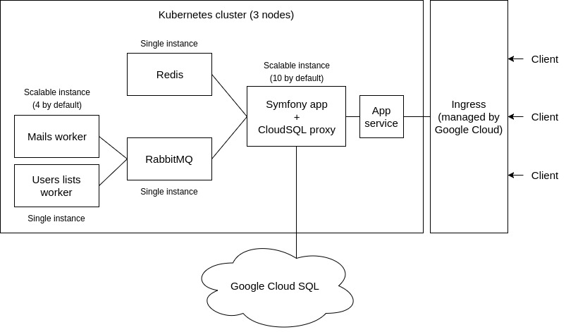
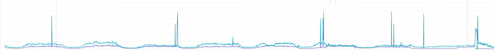

An open-source web platform for the new President of France

1.   [Home](https://symfony.com/)

2. /   [Blog](https://symfony.com/blog/)

3. /   [An open-source web platform for the new President of France](https://symfony.com/blog/an-open-source-web-platform-for-the-new-president-of-france)

#  An open-source web platform for the new President of France

  May 19, 2017        [Javier Eguiluz](https://connect.sensiolabs.com/api/alternates/17170f22-52c0-4adf-a75d-29cb01d53176)

*This Case Study is a guest post written by [Titouan Galopin](https://connect.sensiolabs.com/profile/tgalopin), lead engineer and product lead at [EnMarche project](https://github.com/EnMarche). Please note that this is a strictly technical article; any political comment will be automatically deleted.*

*Want your company featured on the official Symfony blog? Send a proposal or case study to fabien.potencier@sensiolabs.com*

* * *

## Project Background

In April 2016, [Emmanuel Macron](https://en.wikipedia.org/wiki/Emmanuel_Macron), now President of France, [created a political movement](https://www.theguardian.com/world/2017/apr/03/emmanuel-macron-french-presidential-candidate-grassroots-movement)called *"En Marche!"* (*"On the Move"* in English), initially as a door-to-door operation to ask the public what was wrong with France.

Unlike established political parties, *En Marche!* didn't have any infrastructure, budget or members to support its cause. That's why *En Marche!* relied on the power of Internet since its very beginning to find supporters, promote events and collect donations.

I started to work for *En Marche!* as a volunteer in October 2016. The team was small and all of the IT operations were maintained by just one person. So they gladly accepted my proposal to help them. At that time, the platform was created with WordPress, but we needed to replace it with something that allowed faster and more customized development. The choice of Symfony was natural: it fits the project size well, I have experience with it and it scales easily to handle the large number of users we have.

## Architecture overview

Scalability was the top priority of the project, especially after the issues they faced with the first version of the platform that wasn't built with Symfony. The following diagram shows an overview of the project architecture, which is extremely scalable and redundant where needed:

We use Google Container Engine and [Kubernetes](https://kubernetes.io/) to provide scalability, rolling updates and load balancing.

The Symfony app is built from the ground as a Dockerized application. The configuration uses environment variables and the application is read-only to keep it scalable: we don't generate any files at run-time in the container. The application cache is generated when building the Docker image and then is synchronized amongst the servers using the [Symfony Cache component](https://symfony.com/components/Cache)combined with a Redis instance.

There are two workers, fed by RabbitMQ, to process some heavy operations in the background: sending emails (sometimes we have to send 45k emails in a single request) and building the serialized JSON users lists that are used by several parts of the application to avoid dealing with slow and complex SQL queries.

The database uses Google Cloud SQL, a centralized MySQL database we don’t have to manage. To connect to it, we use the[Cloud SQL proxy Docker image](https://cloud.google.com/sql/docs/mysql/connect-container-engine).

## Deployment

The project uses a Continuous Delivery strategy, which is different from the Continuous Deployment approach: each commit is automatically deployed on a staging server but the production deployment is manual. Google Container Engine and Kubernetes are the key components to our deployment flow.

The Continuous Delivery process, as well as the unit and functional tests, is handled by CircleCI. We also use StyleCI (to ensure that new code matches the coding style of the rest of the project) and SensioLabsInsight (to perform automatic code quality analyses). These three services are configured as checks that each Pull Request must pass before merging it.

When a Pull Request is merged, the Continuous Delivery process starts (see the[configuration file](https://github.com/EnMarche/en-marche.fr/blob/master/circle.yml)):

1. Authenticate on Google Cloud using a Circle CI environment variable.
2. Build the Javascript files for production.

3. Build the three Docker images of the project (app, mails worker, users lists worker).

4. Push the built images to Google Container Registry.

5. Use the `kubectl` command line tool to update the staging server (a rolling update).

The only process performed manually (on purpose) is the SQL migration. Even if that can be automated, we prefer to carefully review those migrations before applying them to prevent serious errors on production.

## Front-end

The application front-end doesn't follow the single-page application pattern. In fact, we wanted to use the least amount of Javascript possible to improve performance and rely on the native browser features.

### React + Webpack

The JavaScript code of the application is implemented using React compiled with Webpack. We don't use Redux - or even React-Router - but pure React code, and we load the components only in specific containers on the page, instead of building the whole page with them. This is useful for two reasons:

- The HTML content is fully rendered before React is loaded, and then React modifies the page contents as needed. This makes the application usable without JavaScript, even when the page is still loading on slow networks. This technique is called "progressive enhancement" and it dramatically improves the perceived performance.
- We use Webpack 2 with tree shaking and chunks loading, so the components of each page are only loaded when necessary and therefore do not bloat the minified application code.

This technique lead us to organize the front-end code as following:

- A [front/ directory](https://github.com/EnMarche/en-marche.fr/tree/master/front)at the root of the application stores all the SASS and JavaScript files.
- A tiny [kernel.js](https://github.com/EnMarche/en-marche.fr/blob/master/front/kernel.js)file loads the JavaScript vendors and application code in parallel.
- An [app.js](https://github.com/EnMarche/en-marche.fr/blob/master/front/app.js)file loads the different application components.
- In the Twig templates, we load the components needed for each page (for example, the [address autocomplete component](https://github.com/EnMarche/en-marche.fr/blob/master/app/Resources/views/procuration/proposal.html.twig).

### Front-end performance

Front-end performance is often overlooked, but the network is usually the biggest bottleneck of your application. Saving a few milliseconds in the backend won't take you too far, but saving 3 or more seconds of loading time for the images will change the perception of your web site.

Images were the main front-end performance issue. Campaign managers wanted to publish lots of images, but the users want fast-loading pages. The solution was to use powerful compression algorithms and apply other tricks.

First, we stored the image contents on Google Cloud Storage and their metadata in the database (using a [Doctrine entity called Media](https://github.com/EnMarche/en-marche.fr/blob/master/src/AppBundle/Entity/Media.php)). This allows us, for example, to know the image dimensions without needing to load it. This helps us creating a web page design that doesn't jump around while images load.

Second, we combined the Media entity date with the [Glide library](http://glide.thephpleague.com/) to implement:

- Contextual image resizing: for example, the images displayed on the small grid blocks in the homepage can be much smaller and of lower resolutions than the same images displayed as the main article image.
- Better image compression: all images are encoded as progressive jpegs with a quality of 70%. This change improved the loading time dramatically compared to other formats such as PNG.

The integration of Glide into Symfony was made with a simple endpoint in the[AssetController](https://github.com/EnMarche/en-marche.fr/blob/master/src/AppBundle/Controller/AssetsController.php)and we used signatures and the cache to mitigate DDoS attacks on this endpoint.

Third, we lazy loaded all images below the scroll, which consists in three steps:

1. Load all the elements above the scroll as fast as possible, and wait for the ones below it.

2. Load ultra low resolution versions of the images below the scroll (generated with Glide) and use local JavaScript code to apply a gaussian blur filter to them.

3. Replace these blurred placeholders when the high quality images are loaded.

We implemented an application wide [Javascript listener](https://github.com/EnMarche/en-marche.fr/blob/master/front/listeners/progressive-background.js)to apply this behavior everywhere on the web site.

## Forms

The project includes some interesting forms. The first one is the[form to sign up for the web](https://en-marche.fr/inscription): depending upon the country and postal code fields, the city field changes from an input text to a prepopulated select list.

Technically there are two fields: “cityName” and “city” (the second one is the code assigned to the city according to the French regulations). The Form component populates these two fields from the request, as usual.

On the view side, only the cityName field is displayed initially. If the selected country is France, we use some JavaScript code to show the select list of cities. This JavaScript code also listens to the change event of the postal code field and makes an AJAX request to get the list of related cities. On the server side, if the selected country is France, we require a city code to be provided and otherwise we use the cityName field.

This technique is a good example of the *progressive enhancement* technique discussed a bit earlier in this article. The JavaScript code, as everything else, is just a helper to make some things nicer, but it's not critical to make the feature work.

As these of address fields are used a lot in the application, we abstracted it to an [AddressType form type](https://github.com/EnMarche/en-marche.fr/blob/master/src/AppBundle/Form/AddressType.php)associated with [an address Javascript component](https://github.com/EnMarche/en-marche.fr/tree/master/front/services/address).

[The other interesting form](https://en-marche.fr/pourquoivotermacron) is the one that lets you send an email to someone trying to convince them to vote for the candidate. It's a multi-step form that asks some questions about that other person (gender, age, job type, topics of interest, etc.) and then generates customized content that can be sent by email.

Technically the form combines a highly dynamic Symfony Form with the Workflow component, which is a good example of how to integrate both. The implementation is based on a model class called [InvitationProcessor](https://github.com/EnMarche/en-marche.fr/blob/master/src/AppBundle/TonMacron/InvitationProcessor.php)populated from a multi-step and [dynamic form type](https://github.com/EnMarche/en-marche.fr/blob/master/src/AppBundle/Form/TonMacronInvitationType.php)and storing the contents in the session. The Workflow component was used to ensure that the model object is valid, defining which transitions were allowed for each model state: see [InvitationProcessorHandler](https://github.com/EnMarche/en-marche.fr/blob/master/src/AppBundle/TonMacron/InvitationProcessorHandler.php)and [workflows.yml config](https://github.com/EnMarche/en-marche.fr/blob/master/app/config/services/workflows.yml).

## Search Engine

The search engine, which is blazing fast and provides real-time search results, is powered by [Algolia](https://www.algolia.com/). The integration to index the application entities (articles, pages, committees, events, etc.) is made with the [AlgoliaSearchBundle](https://github.com/algolia/AlgoliaSearchBundle).

This bundle is really useful. We just added a few annotations to the Doctrine entities and after that, the search index was automatically updated whenever an entity is created, updated or deleted. Technically, the bundle listens to the Doctrine events, so you don't need to do anything to keep the search contents always updated.

## Security

As any other high-profile web site, we were the target of some attacks coordinated and carried out by powerful organizations. Most of the attacks were of brute-force nature and the aim was to take the web site down rather than infiltrate it.

The web site was targeted by [DDoS attacks](https://en.wikipedia.org/wiki/Denial-of-service_attack)eight times in the whole campaign, five of them in the final two weeks. They had no impact on the Symfony app because of the Cloudflare mitigation and our on-demand scalability based on Kubernetes.

First, we suffered three attacks based on WordPress pingbacks. The attackers used thousands of hacked WordPress websites to send pingback requests to our website, quickly overloading it. We added[some checks](https://github.com/EnMarche/en-marche.fr/blob/master/docker/prod/nginx.conf#L59)in the nginx configuration to mitigate this attack.

The other attacks were more sophisticated and required both Cloudflare and Varnish to mitigate them. Using Cloudfare to cache assets was so efficient that we thought there was no need for a reverse proxy. However, a reverse proxy was proven necessary during DDoS attacks: in the last days of the campaign, the attacks were huge (up to 300,000 requests per second) and we had to disable the user system and enable the "Cache Everything" flag on Cloudfare.

There's nothing you can do to prevent security attacks, but you can mitigate them by complying with the best practices of Symfony, which, by the way, is one of the few open source projects that has[conducted a public security audit](https://symfony.com/blog/symfony2-security-audit).

## Open Source

The [en-marche.fr web platform](https://github.com/EnMarche/en-marche.fr) and its related projects have been open sourced in the[@EnMarche GitHub account](https://github.com/EnMarche). We didn't promote this idea much though, because open source is pretty complex to explain to non-technical people. However, we received some contributions from people that found the project and were glad that it was open source.

We are also thinking about giving back to Symfony by contributing some elements developed for the project. For example, the[UnitedNationsCountryType form type](https://github.com/EnMarche/en-marche.fr/blob/master/src/AppBundle/Form/UnitedNationsCountryType.php)could be useful for some projects. We also developed an integration with the Mailjet service that could be released as a Symfony bundle.

##  Comments [](https://feeds.feedburner.com/symfony/blog/comments)

-

 

 **  [Sebastiaan Stok](https://connect.sensiolabs.com/api/alternates/00036d4f-dbe1-4146-bdbc-39cda890d816)  **   said on May 19, 2017 at 11:06   [#1](https://symfony.com/blog/an-open-source-web-platform-for-the-new-president-of-france#comment-21352)

What I'm missing in the introduction is what this project is about exactly, it is a CMS? And what were the technical requirements (what must users be able to do with it, etc.).

Good to see this open-source and definitely a case study!

-

 

 **  [Javier Eguiluz](https://connect.sensiolabs.com/api/alternates/17170f22-52c0-4adf-a75d-29cb01d53176)  **   said on May 19, 2017 at 11:10   [#2](https://symfony.com/blog/an-open-source-web-platform-for-the-new-president-of-france#comment-21353)

@Sebastiaan we didn't explain in detail, but it's a web platform for a political party, so you can expect: articles/news of the candidate, forms to collect donations, forms to sign up for the party, a lot of multimedia contents (videos, photos of political rallies), etc. So it's not only a CMS but a more general-purpose platform.

-

 

 **  [Titouan Galopin](https://connect.sensiolabs.com/api/alternates/9aa65b94-9860-4c98-9e92-cd19c9913df0)  **   said on May 19, 2017 at 11:15   [#3](https://symfony.com/blog/an-open-source-web-platform-for-the-new-president-of-france#comment-21354)

@Sebastiaan There are two main parts in the application :

- the content and public website (including the donation system) which can be seen as a custom CMS suited to our need
- the core platform which can be seen as a very specific meetup platform, where members can create groups (committees) in which other members can join and participate to events, be notified about the local news of the movement, etc.

-

 

 **  [Sebastiaan Stok](https://connect.sensiolabs.com/api/alternates/00036d4f-dbe1-4146-bdbc-39cda890d816)  **   said on May 19, 2017 at 11:30   [#4](https://symfony.com/blog/an-open-source-web-platform-for-the-new-president-of-france#comment-21355)

Thanks for the explanation 👍

-

 

 **  [Pablo Godel](https://connect.sensiolabs.com/api/alternates/6115ce11-9493-4ada-950e-b5a19bb11bcc)  **   said on May 19, 2017 at 13:59   [#5](https://symfony.com/blog/an-open-source-web-platform-for-the-new-president-of-france#comment-21356)

Thanks for sharing this story. You made my day. For all of us that work on Open Source this is incredible. We have no idea of the power we can have when writing a few lines of code or documentation.

Without thinking about it, by working in Symfony we helped change the course of a whole country, and in this particular case of Europe too. This is incredible!

-

 

 **  [Juan Urquiza](https://connect.sensiolabs.com/api/alternates/75d66eb5-3d31-44b3-8aa5-ebfb2dd4eceb)  **   said on May 19, 2017 at 15:26   [#6](https://symfony.com/blog/an-open-source-web-platform-for-the-new-president-of-france#comment-21357)

Great explanation, Maybe is possible to make this in my country.
All project open source is perfect for me is incredible !!

Regards

-

 

 **  [Ismael Molina](https://connect.sensiolabs.com/api/alternates/fb8f3a3a-2ff2-4cfb-bc69-1ca2f3e32ef0)  **   said on May 19, 2017 at 15:49   [#7](https://symfony.com/blog/an-open-source-web-platform-for-the-new-president-of-france#comment-21358)

Very educative use case, nice!

-

 

 **  [jah](https://connect.sensiolabs.com/api/alternates/b5580202-d420-4285-81ba-884744a32911)  **   said on May 19, 2017 at 20:05   [#8](https://symfony.com/blog/an-open-source-web-platform-for-the-new-president-of-france#comment-21359)

This is really interesting; thank you for sharing.

Some of the links in the post will rot in the future, but can be replaced with ones that will remain accessible for as long as GitHub lives. For example, the link to the Wordpress pingback check in the Nginx config:-

bad: https://github.com/EnMarche/en-marche.fr/blob/master/docker/prod/nginx.conf#L59

good: https://github.com/EnMarche/en-marche.fr/blob/d555956d648db8a70ed5a259fe192cd0b95704db/docker/prod/nginx.conf#L59

-

 

 **  [Quentin Fahrner](https://connect.sensiolabs.com/api/alternates/24bdb420-8115-417f-85c0-55113b5c18ef)  **   said on May 21, 2017 at 06:48   [#9](https://symfony.com/blog/an-open-source-web-platform-for-the-new-president-of-france#comment-21360)

Excellent case study with very interesting technical examples, thanks for sharing !

 [Login with SensioLabsConnect](https://symfony.com/session/new?target=/blog/an-open-source-web-platform-for-the-new-president-of-france%23comment-form) to post a comment