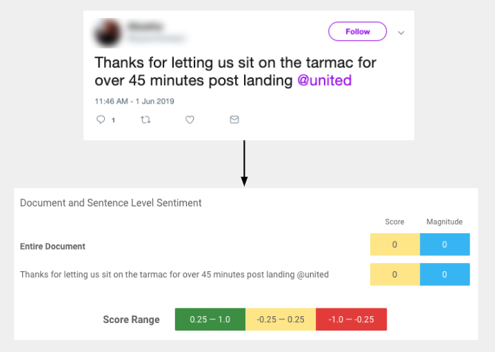
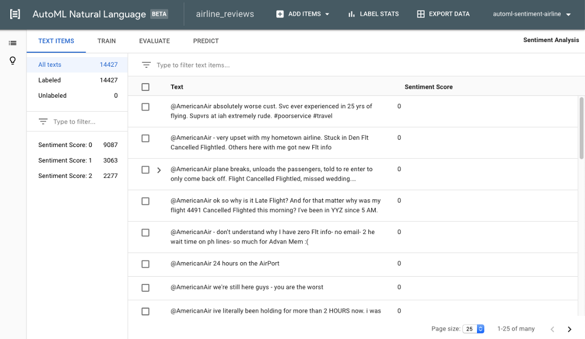
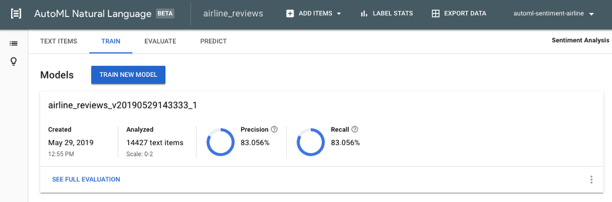
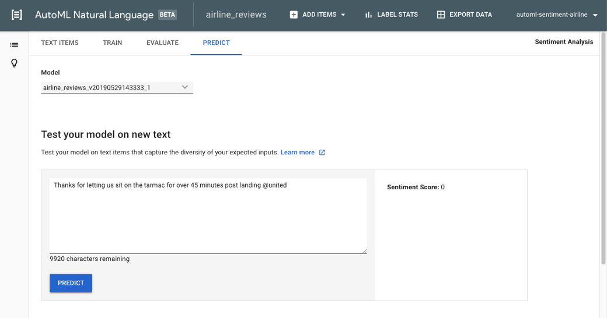

Analyzing sentiment of text with domain-specific vocabulary and topics

# Analyzing sentiment of text with domain-specific vocabulary and topics

## Part 1: Creating a custom machine learning model with AutoML

[Alicia Williams](https://medium.com/@presactlyalicia)
Jun 10·6 min read

Awhile back, I used [Cloud Natural Language](https://cloud.google.com/natural-language/) (NL)to [analyze sentiment for hundreds of reviews of a particular vacation rental](https://cloud.google.com/blog/products/gcp/analyzing-text-in-a-google-sheet-using-cloud-natural-language-api-and-apps-script). It turned out to be a quick, consistent way to pull out and summarize what reviewers were talking about and how they felt about it. Was the location good or bad? What about the value? Cloud NL was able to identify what reviewers were talking about and assign quantitative values to the sentiment expressed for each topic.

For that scenario, the pre-trained model worked well because the text data it was analyzing was not nuanced with domain-specific language or situations. The topics discussed in vacation rental reviews, such as a “leaky faucet” or “good wifi”, are common situations that the pre-trained model understands and for which it can determine underlying sentiment.

But what does the model know about sitting on a tarmac?

Sentiment results when running an airline-related tweet through the [Cloud Natural Language pre-trained model](https://cloud.google.com/natural-language/).

In this case, the pre-trained model isn’t aware of the strong negative feelings one can get when stuck on a plane with hundreds of strangers, breathing recycled air, and experiencing a sharp reduction in personal space. When interpreted by the pre-trained model, **the sentiment prediction for this tweet registers as solidly neutral**.

So today I’m going to show you how to create a model that provides **domain-specific sentiment scores** for feelings and attitudes expressed in a piece of text, made possible with [AutoML Natural Language](https://cloud.google.com/natural-language/automl/docs/).

AutoML Natural Language uses transfer learning to take the knowledge of the pre-trained model (leaky faucets are bad!) and infuse in new learnings about domain-specific topics you provide with your own data. **You do not need to be a machine learning expert or know how to code to create a custom model with AutoML.** So no excuses, here we go! We’ll be following along the steps of my teammate Dale’s video, with a few minor changes.

Video overview of the written tutorial that follows!

Note: If you follow along, the computing costs will be ~$15. This can be offset by $300 free credit if you [sign up for a new Google Cloud Platform account](https://cloud.google.com/free/).

### Prepare your data

Training a machine learning model requires labeled examples; this is how the model learns. For sentiment analysis, the examples are phrases with related sentiment scores. Having the right quantity, accuracy, and mix of data is one of the biggest challenges in creating a good model.

You will likely need to invest the time in sourcing, and potentially hand-labeling, data. You don’t have to necessarily do the hand-labeling in-house. You can use a service like Google Cloud’s [data labeling service](https://cloud.google.com/data-labeling/docs/), where for a [fee](https://cloud.google.com/data-labeling/pricing) they will manage the human labeling for a collection of data that you plan to use to train a custom model. For now, you may follow along using[labeled tweet data sourced from Kaggle](https://www.kaggle.com/crowdflower/twitter-airline-sentiment). These are airline-related tweets and each have been labeled as “positive”, “neutral”, or “negative”.

1. 1.Download [Tweets.csv](https://www.kaggle.com/crowdflower/twitter-airline-sentiment) to your desktop, and import it into a new Google Sheet.

2. 2.Delete all columns except text and airline_sentiment, and position them as columns A and B, respectively.

3. 3.In the airline_sentiment column, replace “negative” with 0, “neutral” with 1, and “positive” with 2. You can use a nested IF statement, or Find and Replace for something quick.

4. 4.Download the current sheet as a CSV file.

A quick note on step 3, you are allowed to have more than three unique labels. If your own data has higher granularity, you may use labels up to the number 10. More info [here](https://cloud.google.com/natural-language/automl/sentiment/docs/prepare).

### Uploading your dataset to AutoML

Creating a custom model with AutoML requires a [Google Cloud Platform project](https://cloud.google.com/), and once you have one ready, head to [AutoML Natural Language](https://console.cloud.google.com/natural-language).

1. 1.Click **+ NEW DATASET** in the top bar of the webpage.
2. 2.Give the dataset a name, and choose “Sentiment analysis” under Objective.

3. 3.Choose the option to upload the CSV file from your computer and select your prepared file.

4. 4.Click **CREATE DATASET**. It will take several minutes to upload and you will receive an email when it’s complete.

5. 5.Once you receive the email, click the link to review the items that were uploaded.

Here’s what you’ll see once your dataset has been uploaded.

### Training your model

Once your dataset has been created, it’s time to start training your custom model. The training [costs $3/hour](https://cloud.google.com/natural-language/automl/pricing) and takes several hours (this model took 3–4 hours).

1. 1.Navigate to the **TRAIN** sub-menu and click **TRAIN NEW MODEL**.
That’s it!

You’ll get an email when it is complete. The email will provide a link to see the evaluation metrics.

Once model training is complete, you can review the model’s precision and recall.

The precision and recall for this model are both around 83%. Model performance needs are variable to how predictions will be used for your specific use case. I recommend[clicking into the documentation](https://cloud.google.com/natural-language/automl/sentiment/docs/evaluate) to read more. The[Beginner’s Guide](https://cloud.google.com/natural-language/automl/docs/beginners-guide) is also very useful for understanding precision and recall, and how to evaluate machine learning models.

To see if this model fared better than using a pre-trained model, I ran a subset of the tweets through the Cloud Natural Language API to analyze the document-level sentiment. Classifying sentiment score ranges for “positive” (0.25 to 1), “neutral” (-0.25 to 0.25) and “negative” (-1 to -0.25), the overall precision score hovered around 60%. So for my purposes, the AutoML custom model does have a marked increase in precision over the pre-trained model.

### Analyze sentiment on new text

Try out your model by analyzing sentiment directly in the product!

1. 1.Navigate to the **PREDICT** sub-menu, enter a new text sample into the text box, and click **PREDICT.**

The model you created will take the text and predict a sentiment score at the trained granularity (0 = negative, 1= neutral, 2= positive)

Here’s the result we were looking for: a clearly negative sentiment score for our example phrase.

AutoML cannot tell me *why *the custom model is assigning the sentiment score of 0 (“negative”) while the pre-trained model result is neutral. Perhaps it is better understanding the mention of tarmac, which is a term represented 90 times in the training data. Perhaps it is the custom model’s training on tweet-like phrases over formal writing. Perhaps the custom model decided every tweet with @United is negative (just kidding! not the case here, at least).

But remember, the model only learns when it receives examples, so if tarmac is never mentioned in the data, or is not well-represented (for example, only in tweets with negative sentiment) the model will not be able to take that domain-specific nuance accurately into account. This is something to keep in mind when building your training data and managing your expectations of the model when predicting on new data.

### Next steps

You now have a custom machine learning model to analyze airline tweet sentiment at will! It’s pretty fun to do in the product interface itself, but stay tuned. Next, I’m going to show you how to use a bit of code with a Google Sheet so that you can **analyze several rows of tweets in a spreadsheet against this custom model with one click.**