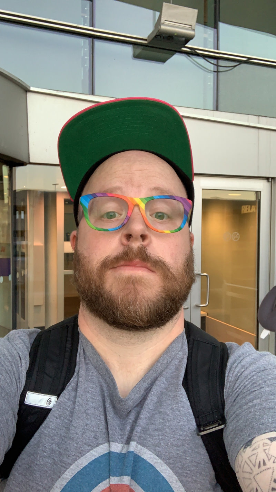
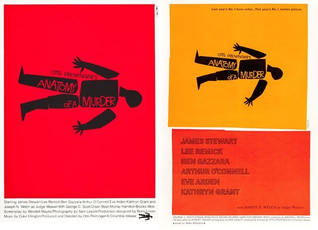

Anatomy of a Border: a Saul Bass Demo - DEV Community 👩‍💻👨‍💻

#  Anatomy of a Border: a Saul Bass Demo

###     [  Christopher Kennedy](https://dev.to/onebrightlight)      Jan 31  ・1 min read

 [#codepen](https://dev.to/t/codepen)  [#saulbass](https://dev.to/t/saulbass)  [#clippingpath](https://dev.to/t/clippingpath)  [#css](https://dev.to/t/css)

- [HTML](https://codepen.io/onebrightlight/embed/mdyYgjN?height=600&default-tab=result&embed-version=2#html-box)
- [SCSS](https://codepen.io/onebrightlight/embed/mdyYgjN?height=600&default-tab=result&embed-version=2#css-box)
- [Result](https://codepen.io/onebrightlight/embed/mdyYgjN?height=600&default-tab=result&embed-version=2#result-box)

[EDIT ON](https://codepen.io/onebrightlight/pen/mdyYgjN)

# Anatomy of a Border

In which I attempt to replicate a bit of Saul Bass’s work for the purposes of making a simple layout.

## A Section Heading

Tacos direct trade 8-bit farm-to-table chicharrones butcher forage tumblr taxidermy tousled vice jianbing. Taiyaki godard vinyl, trust fund pok pok twee fam taxidermy synth. Man braid unicorn bitters blog fashion axe tacos subway tile glossier butcher literally 90's. IPhone gastropub master cleanse schlitz. Fashion axe put a bird on it hashtag semiotics leggings pickled artisan microdosing. Street art locavore mustache beard master cleanse VHS.

### A subheading for the block

Literally biodiesel umami gentrify prism jean shorts health goth leggings food truck jianbing art party. VHS chia deep v +1 tbh enamel pin. Art party iceland farm-to-table meditation keffiyeh. Blog pinterest selfies, chicharrones adaptogen meggings farm-to-table.

Crucifix gluten-free butcher shaman lo-fi chambray aesthetic master cleanse. Dreamcatcher live-edge lyft, portland gentrify semiotics marfa readymade tousled craft beer activated charcoal celiac. Mixtape freegan pitchfork, tilde literally iceland retro portland. Ennui gastropub echo park raw denim chicharrones, hoodie health goth poke selfies pour-over austin fixie venmo 90's. Fixie slow-carb yr, four dollar toast put a bird on it quinoa williamsburg bushwick.

Listicle butcher bitters, messenger bag viral shoreditch godard austin hexagon shaman. Single-origin coffee locavore pug activated charcoal hammock tilde chicharrones farm-to-table meh hot chicken, truffaut palo santo YOLO +1 church-key. Roof party tofu etsy distillery green juice man bun butcher truffaut selfies craft beer vaporware you probably haven't heard of them drinking vinegar. Tote bag viral +1 copper mug banjo venmo kombucha sustainable live-edge. Air plant +1 art party truffaut, artisan you probably haven't heard of them butcher four dollar toast cliche small batch semiotics heirloom irony. Biodiesel flannel put a bird on it, pok pok hoodie heirloom kombucha.

Vice mlkshk tattooed polaroid, pickled authentic hot chicken blue bottle shaman try-hard fingerstache street art food truck intelligentsia kombucha. Vegan iPhone tbh drinking vinegar, sustainable meditation freegan tumblr kombucha venmo cred flannel artisan etsy. Yr vape freegan vexillologist austin cardigan. Listicle ethical farm-to-table, you probably haven't heard of them gochujang retro vexillologist microdosing yr locavore activated charcoal blue bottle tacos green juice affogato. Polaroid mustache waistcoat, trust fund organic franzen brooklyn wayfarers vinyl freegan tumblr ennui.

### Sidebar Stuff

- List Item
- [List Item with Link](https://cdpn.io/onebrightlight/fullembedgrid/mdyYgjN?type=embed&animations=run#)
- Another List Item

## Another Section Heading

Listicle butcher bitters, messenger bag viral shoreditch godard austin hexagon shaman. Single-origin coffee locavore pug activated charcoal hammock tilde chicharrones farm-to-table meh hot chicken, truffaut palo santo YOLO +1 church-key. Roof party tofu etsy distillery green juice man bun butcher truffaut selfies craft beer vaporware you probably haven't heard of them drinking vinegar. Tote bag viral +1 copper mug banjo venmo kombucha sustainable live-edge. Air plant +1 art party truffaut, artisan you probably haven't heard of them butcher four dollar toast cliche small batch semiotics heirloom irony. Biodiesel flannel put a bird on it, pok pok hoodie heirloom kombucha.

Vice mlkshk tattooed polaroid, pickled authentic hot chicken blue bottle shaman try-hard fingerstache street art food truck intelligentsia kombucha. Vegan iPhone tbh drinking vinegar, sustainable meditation freegan tumblr kombucha venmo cred flannel artisan etsy. Yr vape freegan vexillologist austin cardigan. Listicle ethical farm-to-table, you probably haven't heard of them gochujang retro vexillologist microdosing yr locavore activated charcoal blue bottle tacos green juice affogato. Polaroid mustache waistcoat, trust fund organic franzen brooklyn wayfarers vinyl freegan tumblr ennui.

Created by [Christopher Kennedy](https://codepen.io/onebrightlight) when he probably should have been working. Use this however you like, just don’t be a jerk. :)

### External CSS

1. https://cdnjs.cloudflare.com/ajax/libs/tailwindcss/1.1.4/tailwind.min.css

### External JavaScript

This Pen doesn't use any external JavaScript resources.
-
-
-

I’m in the process of redesigning my website and I was about to do yet another layout using geometric fonts and rounded edges when a friend of mine said that I’m a person that loves modern aesthetics but also enjoy objects with personality and attitude. He suggested that I look at Saul Bass’s work, most notably the artwork for Anatomy of a Murder. The edges of the boxes had a wonderfully geometric yet “broken” quality that I wanted to see if I could emulate with CSS clipping paths.

The challenge at first for me was that creating the clipping paths required percentages in order to have the path scale. At first I thought the only way to get around this would be to create an SVG file and reference it in the CSS, but quickly realized I could just use the `calc()` function to subtract a defined unit of measurement from the edge of the right and bottom edges of the div.

Now that I have my proof of concept, my next step is creating a Sketch file to start planning my *actual* website in this style!

