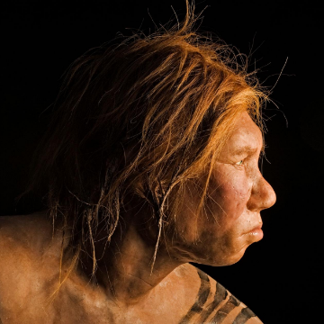

Ancient Girl’s Parents Were Two Different Human Species

Ancient Girl’s Parents Were Two Different Human Species

https://www.nationalgeographic.com/science/2018/08/news-denisovan-neanderthal-hominin-hybrid-ancient-human/?utm_source=nextdraft&utm_medium=email

Born 90,000 years ago, the child is the first direct evidence of interbreeding among Neanderthals and their cousins the Denisovans.