Andreas Kirsch | Better intuition for information theory

# Better intuition for information theory

November 25, 2019

The following blog post is based on Yeung’s beautiful paper “[A new outlook on Shannon’s information measures](https://ieeexplore.ieee.org/document/79902)”: it shows how we can use concepts from set theory, like unions, intersections and differences, to capture information-theoretic expressions in an intuitive form that is also correct.

The paper shows one can indeed construct a signed measure that consistently maps the sets we intuitively construct to their information-theoretic counterparts.

This can help develop new intuitions and insights when solving problems using information theory and inform new research. In particular, our paper “[BatchBALD: Efficient and Diverse Batch Acquisition for Deep Bayesian Active Learning](https://arxiv.org/abs/1906.08158)” was informed by such insights.

For a gentle introduction to information theory, Christopher Olah’s [Visual Information Theory](https://colah.github.io/posts/2015-09-Visual-Information/) is highly recommended. The original work “[A Mathematical Theory of Communication](https://en.wikipedia.org/wiki/A_Mathematical_Theory_of_Communication)” by Claude Shannon is also highly accessible, but more geared towards signal transmission.

## Information theory with I-diagrams[](https://www.blackhc.net/blog/2019/better-intuition-for-information-theory/#information-theory-with-i-diagrams)

If we treat our random variables as sets (without being precise as to what the sets contain), we can represent the different information-theoretic concepts using an Information diagram or short: **I-diagram**. It’s essentially a Venn diagram but concerned with information content.

An *I-diagram* for two random variables X*X* and Y*Y* looks as follows:
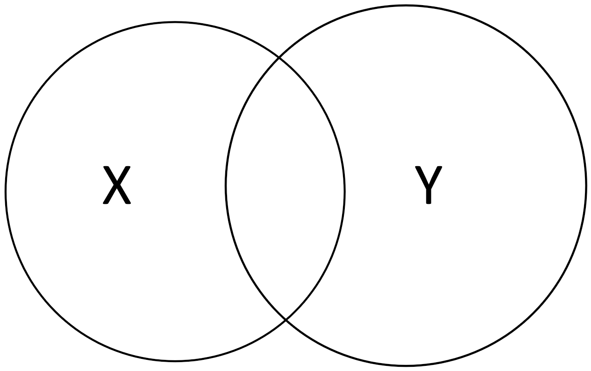
We can easily visualize concepts from information theory in I-diagrams.

|     |     |
| --- | --- |
| The [entropy](https://en.wikipedia.org/wiki/Entropy)  H(X)*H*(*X*) of X*X*, respectively H(Y)*H*(*Y*) of Y*Y*, is the “area” of either set 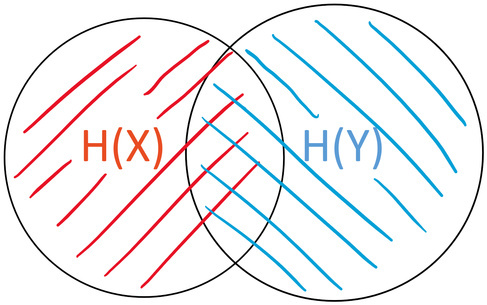 | The [joint entropy](https://en.wikipedia.org/wiki/Joint_entropy) \| H(X,Y)*H*(*X*,*Y*) is the “area” of the union X \cup Y*X*∪*Y* 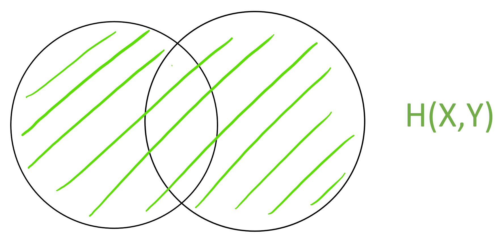 |
| The [mutual information](https://en.wikipedia.org/wiki/Mutual_information)  MI(X;Y)*M**I*(*X*;*Y*) is the “area” of the intersection X \cap Y*X*∩*Y* 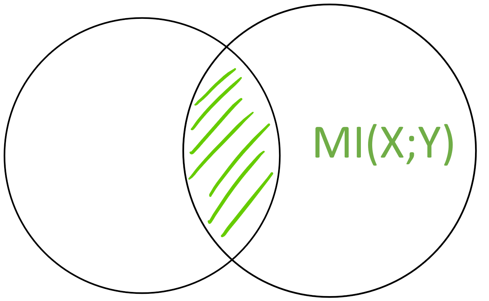 | The [conditional entropy](https://en.wikipedia.org/wiki/Conditional_entropy)  H(X\|Y)*H*(*X*∣*Y*) is the “area” of X - Y*X*−*Y* 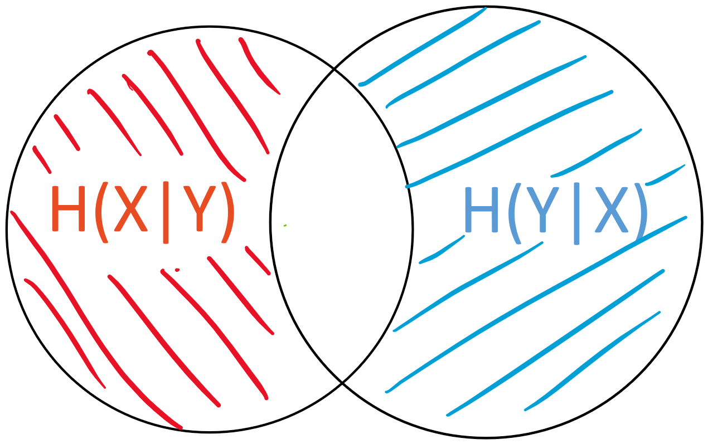 |

## Benefits[](https://www.blackhc.net/blog/2019/better-intuition-for-information-theory/#benefits)

This intuition allows us to create and visualize more complex expressions instead of having to rely on the more cumbersome notation used in information theory.

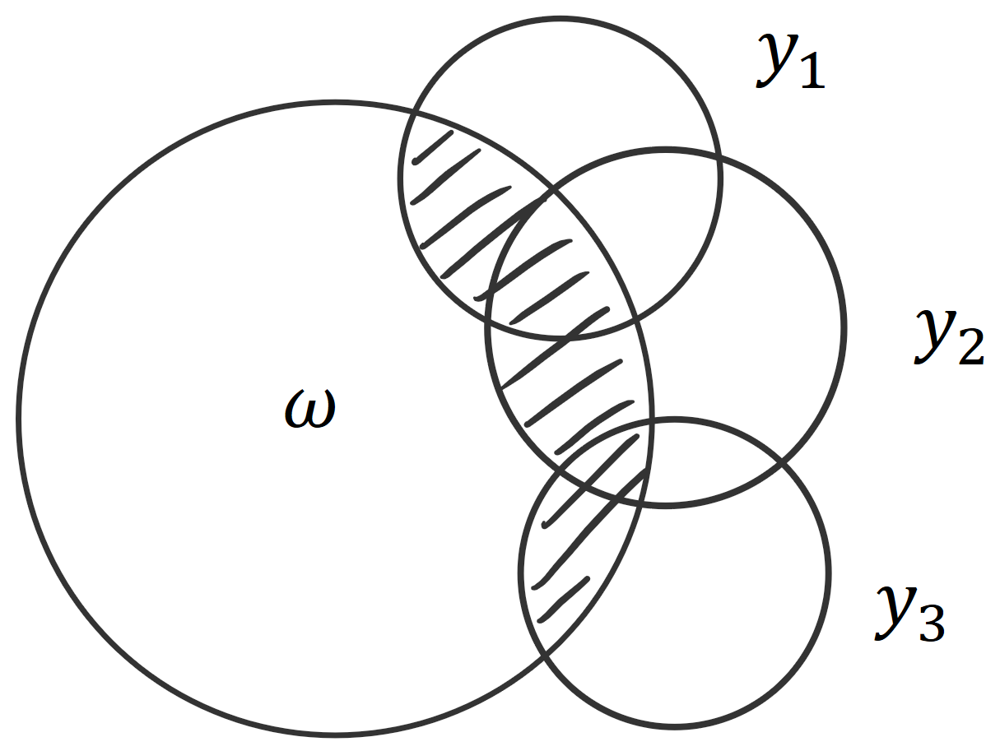 For example, BatchBALD relies on this intuition. We were looking for an information-theoretic measure that would allow us to capture the union of the predictions y_i*y**i*​ intersected with the parameters \omega*ω* (to see why that is: [read the blog pos](http://batchbald.ml/)t). Using an I-diagram, it’s easy to see that this is the same as the joint of all the predictions minus the joint of all the predictions conditioned on the parameters. This in turn is the same as the mutual information of the joint of predictions and the parameters: MI(y_1, y_2, y_3;\omega) = H(y_1, y_2, y_3) - H(y_1, y_2, y_3|\omega).*M**I*(*y*1​,*y*2​,*y*3​;*ω*)=*H*(*y*1​,*y*2​,*y*3​)−*H*(*y*1​,*y*2​,*y*3​∣*ω*).

It is not immediately clear why this holds. However, using set operations, where \mu*μ* signifies the area of a set, we can express the same as : \mu( (y_1 \cup y_2 \cup y_3) \cap \omega ) = \mu ( y_1 \cup y_2 \cup y_3 ) - \mu ( (y_1 \cup y_2 \cup y_3) - \omega )*μ*((*y*1​∪*y*2​∪*y*3​)∩*ω*)=*μ*(*y*1​∪*y*2​∪*y*3​)−*μ*((*y*1​∪*y*2​∪*y*3​)−*ω*) From looking at the set operations, it’s clear that the left-hand side and the second term on the right-hand side together form the union: \mu( (y_1 \cup y_2 \cup y_3) \cap \omega ) + \mu ( (y_1 \cup y_2 \cup y_3) - \omega ) = \mu ( y_1 \cup y_2 \cup y_3 )*μ*((*y*1​∪*y*2​∪*y*3​)∩*ω*)+*μ*((*y*1​∪*y*2​∪*y*3​)−*ω*)=*μ*(*y*1​∪*y*2​∪*y*3​)

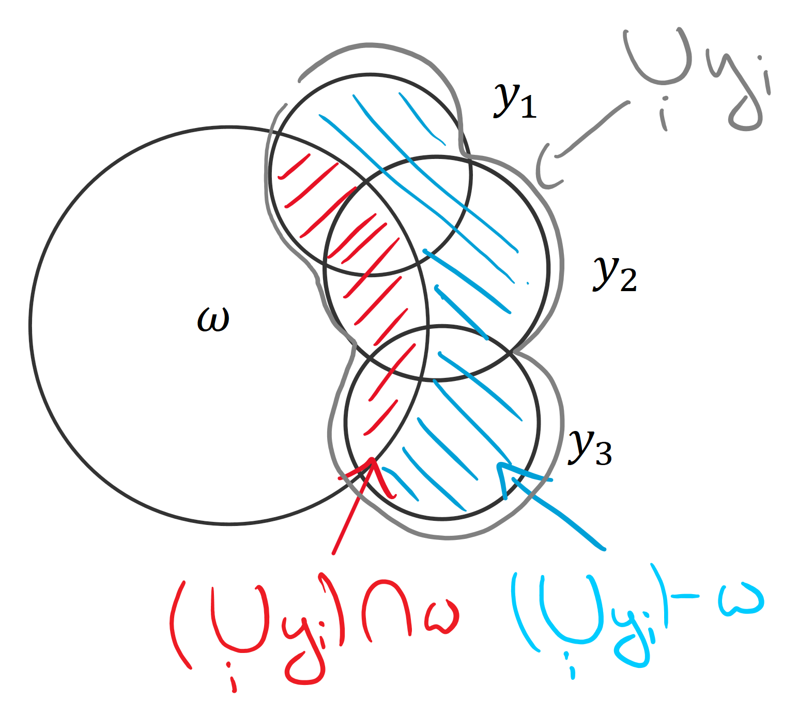

Visualizings how the terms on the left-hand side (blue and red) complement each other to form the right-hand side (gray).

The equivalence can be either proven algebraically or by looking at the areas and set operations.

This is the advantage of I-diagrams.

## Grounding: it’s not just an intuition—it’s true

Yeung’s “[A new outlook on Shannon’s information measures](https://ieeexplore.ieee.org/document/79902)” shows that our intuition is more than just that: it is actually correct!

The paper defines a signed measure \mu*μ* that maps any set back to the value of its information-theoretic counterpart and allows us to compute all possible set expressions for a finite number of random variables. The variables have to be discrete because differential entropy is not consistent. (This is not a weakness of the approach but a weakness of differential entropies in general.)

Using \mu*μ*, we can write, for example:

- \mu(X \cap Y) = MI(X;Y)*μ*(*X*∩*Y*)=*M**I*(*X*;*Y*),
- \mu(X \cup Y) = H(X,Y)*μ*(*X*∪*Y*)=*H*(*X*,*Y*), or
- \mu(X - Y) = H(X|Y)*μ*(*X*−*Y*)=*H*(*X*∣*Y*).

\mu*μ* is a signed measure because [the mutual information between more than two variables can be negative](https://en.wikipedia.org/wiki/Multivariate_mutual_information#Examples_of_negative_multivariate_mutual_information_(synergy)). This means that, while I-diagrams are correct for reading off equalities, we cannot use them to intuit about inequalities (which we could with regular Venn diagrams).

### Proof sketch[](https://www.blackhc.net/blog/2019/better-intuition-for-information-theory/#proof-sketch)

The proof works by showing that we can uniquely express any set expression using a union of “atoms” that can be computed using joint entropies and then show that this is consistent with the laws of information theory. I will focus on the first part here.

Intuitively, each atom is exactly a non-overlapping area in an I-diagram.

For two variables, these atoms would be the three non-overlapping areas: H(X|Y)*H*(*X*∣*Y*), MI(X;Y)*M**I*(*X*;*Y*) and H(Y|X)*H*(*Y*∣*X*).

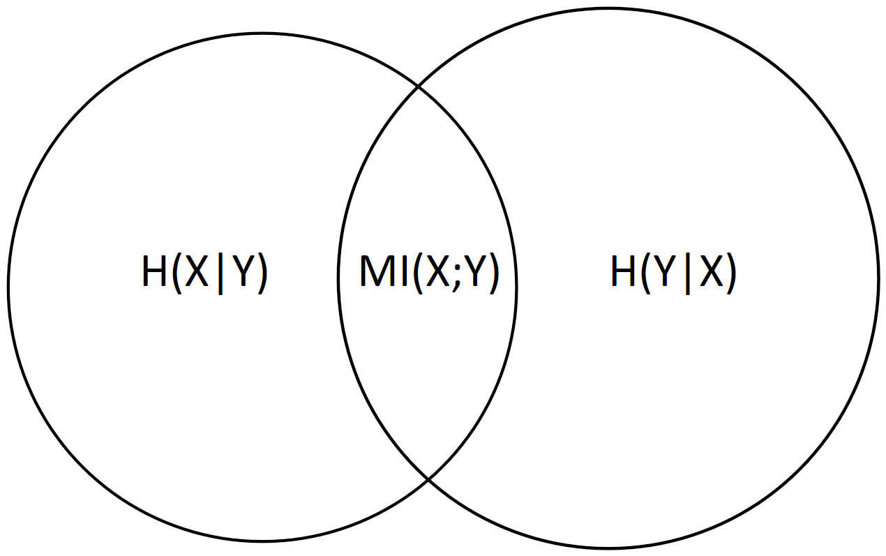

For more than two variables, it becomes more complicated, and these atoms cannot necessarily be described using simple information-theoretical expressions. However, the beauty of the proof is that it shows that the atoms can be expressed using information-theoretical values and that the values are consistent with the rules of signed measures and information theory and that there is a canonical extension of the concept of mutual information to more than two variables, which I will use below.

We can establish that given any finite set of random variables A*A*, B*B*, C*C*, …, we can write any set expression based on them using a union of atoms, where:

- *As sets*: each atom is an intersection of the variables or of some of their complements,

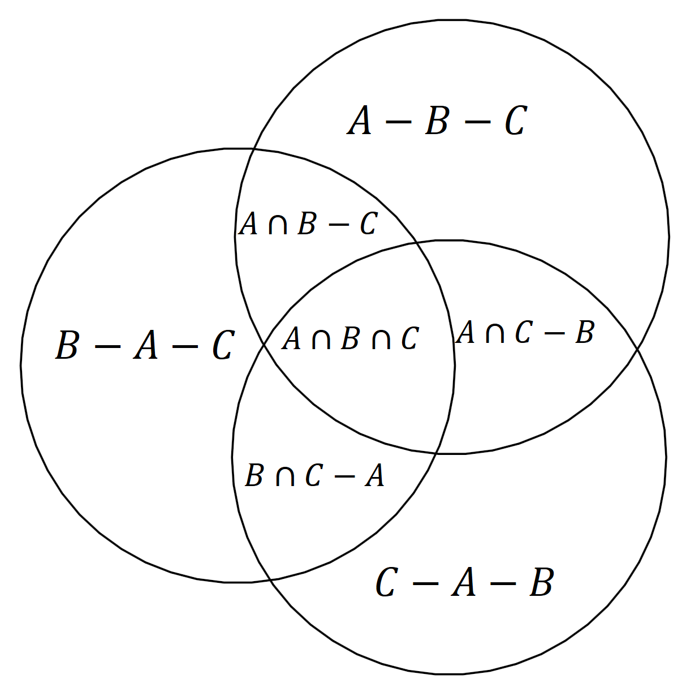
Expressing atoms using set differences and intersections.
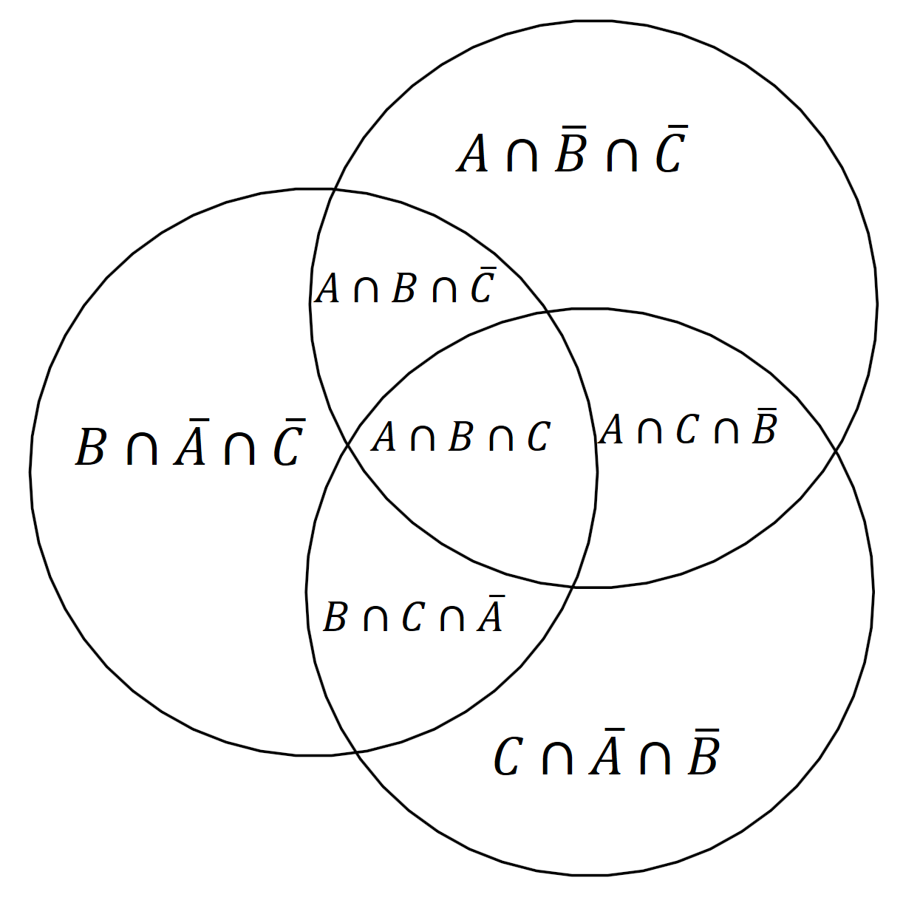
Expressing set differences using intersections and complements.

- *As information-theoretic concept*: each atom is a mutual information of some of the variables conditioned on the remaining variables.

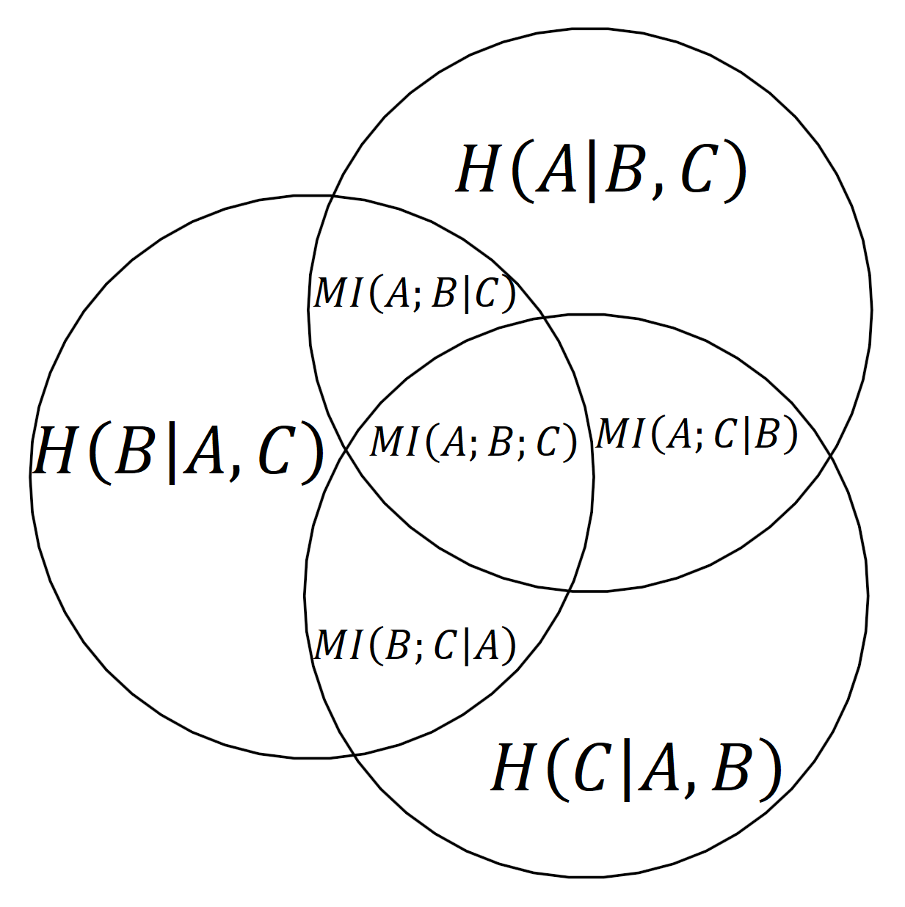
Using information-theoretic concepts

For example, we can immediately read from the diagram that the joint entropy of all three variables H(A, B, C)*H*(*A*,*B*,*C*), that is the union of all three, can be written as:

H(A, B, C) = H(A|B,C) + H(B|A,C) + H(C|A, B) + MI(A;B|C) + MI(A;C|B) + MI(B;C|A) + MI(A;B;C).*H*(*A*,*B*,*C*)=*H*(*A*∣*B*,*C*)+*H*(*B*∣*A*,*C*)+*H*(*C*∣*A*,*B*)+*M**I*(*A*;*B*∣*C*)+*M**I*(*A*;*C*∣*B*)+*M**I*(*B*;*C*∣*A*)+*M**I*(*A*;*B*;*C*).

MI(A;B;C)*M**I*(*A*;*B*;*C*) is a [multivariate mutual information](https://en.wikipedia.org/wiki/Multivariate_mutual_information), which is the canonical extension of the two-variable mutual information mentioned above. It can be negative, so it could happen that

MI(A;B) = MI(A;B|C) + MI(A;B;C) \le MI(A;B|C),*M**I*(*A*;*B*)=*M**I*(*A*;*B*∣*C*)+*M**I*(*A*;*B*;*C*)≤*M**I*(*A*;*B*∣*C*),

which can be surprising to people that are new to information theory.

#### How many atoms are there?[](https://www.blackhc.net/blog/2019/better-intuition-for-information-theory/#how-many-atoms-are-there)

For n*n* variables, there are 2^n - 12*n*−1 such atoms as we choose for each variable if it goes into the atom as part of the mutual information or as variable to be conditioned on (so two options for each of the n*n* variables). The degenerate case that conditions on all variables can be excluded. Moreover, H(X) = MI(X;X)*H*(*X*)=*M**I*(*X*;*X*).

Thus, there are 2^n - 12*n*−1 meaningful atoms, which yields 2^{2^n-1}22*n*−1 possible set expressions because each set expression can be written as union of some of the atoms, so there are two options for each atm.

#### How can we compute the atoms?[](https://www.blackhc.net/blog/2019/better-intuition-for-information-theory/#how-can-we-compute-the-atoms)

Every set expression is a union of some these atoms and their area is a sum where each atom contributes with a factor of 00 or 11. Such a binary combination is a special case of a linear combination.

The main idea of the proof is that whereas the atoms themselves have no easily defined information-theoretic analogue, we can look at all possible joint entropies and show that they uniquely determine these atoms.

There are 2^n - 12*n*−1 possible joint entropies as each variable is either part of a joint entropy or not, and we can again exclude the degenerate case without any variables.

We can express each joint entropy as a linear combination of the atoms we defined above. Using induction, one can see that these linear combinations are independent of each other. This means that the (2^n-1)\times(2^n-1)(2*n*−1)×(2*n*−1) matrix made up of these linear combinations is invertible, which allows us to solve for the atoms.

For example:

MI(A;B;C) = H(A,B,C)-H(A,B)-H(A,C)-H(B,C)+H(A)+H(B)+H(C)*M**I*(*A*;*B*;*C*)=*H*(*A*,*B*,*C*)−*H*(*A*,*B*)−*H*(*A*,*C*)−*H*(*B*,*C*)+*H*(*A*)+*H*(*B*)+*H*(*C*)

All joint entropies are well-defined and thus we can compute the information measure of every atom, which we can use in turn to compute the information measure for any other set expression.

This proof idea is related to [conjunctive and disjunctive normal forms](https://en.wikipedia.org/wiki/Disjunctive_normal_form) in boolean logic. In boolean logic, every proposition can be expressed in either form. A disjunctive normal form is an *OR of ANDs*, which can be viewed as a *UNION of INTERSECTIONS*, which is exactly what we have used above to express set expressions using different atoms based.

Alternatively, this is like saying that we have two different bases for all possible set expressions: all possible joint entropies form one basis, and all possible atoms form another. The former is easier to compute and well-defined in information theory, and the latter is useful for constructing and computing new expressions, but both are equivalent.

For the actual proof and details, see the paper by Yeung.

## Conclusion[](https://www.blackhc.net/blog/2019/better-intuition-for-information-theory/#conclusion)

*I-diagrams* are not just an intuition, but something we can build upon in a grounded fashion! This can provide as with another useful tool to come up with new ideas and translate them into new insights and research contributions. I hope that this was as useful to you as it was to me when I found out about it.

Please leave some feedback or share this article!

* * *

For more blog posts by OATML in Oxford, check out our group’s blog https://oatml.cs.ox.ac.uk/blog.html.

Thanks to [Joost van Amersfoort](https://joo.st/), [Lewis Smith](http://www.robots.ox.ac.uk/~lsgs/) and [Yarin Gal](http://www.cs.ox.ac.uk/people/yarin.gal/website/) for helpful comments!

 center center / contain no-repeat%3b display: block%3b margin: auto%3b width: 80px%3b height: 80px%3b' data-evernote-id='30' class='js-evernote-checked'%3e%3c/svg%3e)

Disqus seems to be taking longer than usual. [Reload](https://www.blackhc.net/blog/2019/better-intuition-for-information-theory/#)?