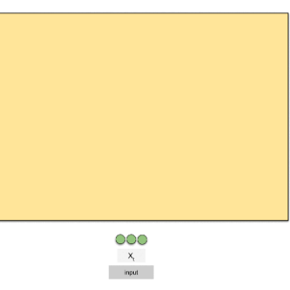

Animated RNN, LSTM and GRU – Towards Data Science

Animated RNN, LSTM and GRU – Towards Data Science

https://towardsdatascience.com/animated-rnn-lstm-and-gru-ef124d06cf45

Recurrent neural network cells in GIFs