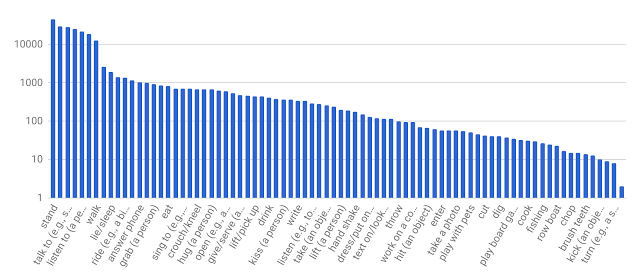

Announcing AVA: A Finely Labeled Video Dataset for Human Action Understanding

## [Announcing AVA: A Finely Labeled Video Dataset for Human Action Understanding](https://research.googleblog.com/2017/10/announcing-ava-finely-labeled-video.html)

Thursday, October 19, 2017
 Posted by Chunhui Gu & David Ross, Software Engineers

Teaching machines to understand human actions in videos is a fundamental research problem in Computer Vision, essential to applications such as personal video search and discovery, sports analysis, and gesture interfaces. Despite exciting breakthroughs made over the past years in [classifying](https://research.googleblog.com/2014/09/building-deeper-understanding-of-images.html) and [finding objects](https://research.googleblog.com/2017/06/supercharge-your-computer-vision-models.html) in images, recognizing human actions still remains a big challenge. This is due to the fact that actions are, by nature, less well-defined than objects in videos, making it difficult to construct a finely labeled action video dataset. And while many benchmarking datasets, e.g., [UCF101](http://crcv.ucf.edu/data/UCF101.php), [ActivityNet](http://activity-net.org/) and DeepMind’s [Kinetics](https://deepmind.com/research/open-source/open-source-datasets/kinetics/), adopt the labeling scheme of image classification and assign one label to each video or video clip in the dataset, no dataset exists for complex scenes containing multiple people who could be performing different actions.

In order to facilitate further research into human action recognition, we have released AVA, coined from “atomic visual actions”, a new dataset that provides multiple action labels for each person in extended video sequences. AVA consists of URLs for publicly available videos from YouTube, annotated with a set of 80 atomic actions (e.g. “walk”, “kick (an object)”, “shake hands”) that are spatial-temporally localized, resulting in 57.6k video segments, 96k labeled humans performing actions, and a total of 210k action labels. You can browse the [website](https://research.google.com/ava/) to explore the dataset and download annotations, and read our [arXiv paper](https://arxiv.org/abs/1705.08421) that describes the design and development of the dataset.

Compared with other action datasets, AVA possesses the following key characteristics:

- **Person-centric annotation.** Each action label is associated with a person rather than a video or clip. Hence, we are able to assign different labels to multiple people performing different actions in the same scene, which is quite common.
- **Atomic visual actions.** We limit our action labels to fine temporal scales (3 seconds), where actions are physical in nature and have clear visual signatures.
- **Realistic video material. **We use movies as the source of AVA, drawing from a variety of genres and countries of origin. As a result, a wide range of human behaviors appear in the data.

|     |
| --- |
|  |
| Examples of 3-second video segments (from [Video Source](https://www.youtube.com/watch?v=Z0FEElATNjk)) with their bounding box annotations in the middle frame of each segment. (For clarity, only one bounding box is shown for each example.) |

To create AVA, we first collected a diverse set of long form content from YouTube, focusing on the “film” and “television” categories, featuring professional actors of many different nationalities. We analyzed a 15 minute clip from each video, and uniformly partitioned it into 300 non-overlapping 3-second segments. The sampling strategy preserved sequences of actions in a coherent temporal context.

Next, we manually labeled all bounding boxes of persons in the middle frame of each 3-second segment. For each person in the bounding box, annotators selected a variable number of labels from a pre-defined atomic action vocabulary (with 80 classes) that describe the person’s actions within the segment. These actions were divided into three groups: pose/movement actions, person-object interactions, and person-person interactions. Because we exhaustively labeled all people performing all actions, the frequencies of AVA’s labels followed a long-tail distribution, as summarized below.

|     |
| --- |
|  |
| Distribution of AVA’s atomic action labels. Labels displayed in the x-axis are only a partial set of our vocabulary. |

The unique design of AVA allows us to derive some interesting statistics that are not available in other existing datasets. For example, given the large number of persons with at least two labels, we can measure the co-occurrence patterns of action labels. The figure below shows the top co-occurring action pairs in AVA with their co-occurrence scores. We confirm expected patterns such as people frequently play instruments while singing, lift a person while playing with kids, and hug while kissing.

|     |
| --- |
|  |
| Top co-occurring action pairs in AVA. |

To evaluate the effectiveness of human action recognition systems on the AVA dataset, we implemented an existing baseline deep learning model that obtains highly competitive performance on the much smaller [JHMDB dataset](http://jhmdb.is.tue.mpg.de/). Due to challenging variations in zoom, background clutter, cinematography, and appearance variation, this model achieves a relatively modest performance when correctly identifying actions on AVA (18.4% [mAP](https://en.wikipedia.org/wiki/Information_retrieval#Mean_average_precision)). This suggests that AVA will be a useful testbed for developing and evaluating new action recognition architectures and algorithms for years to come.

We hope that the release of AVA will help improve the development of human action recognition systems, and provide opportunities to model complex activities based on labels with fine spatio-temporal granularity at the level of individual person’s actions. We will continue to expand and improve AVA, and are eager to hear feedback from the community to help us guide future directions. Please join the AVA users [mailing list](https://groups.google.com/forum/#!forum/ava-dataset-users) to receive dataset updates as well as to send us emails for feedback.

**Acknowledgements**

The core team behind AVA includes Chunhui Gu, Chen Sun, David Ross, Caroline Pantofaru, Yeqing Li, Sudheendra Vijayanarasimhan, George Toderici, Susanna Ricco, Rahul Sukthankar, Cordelia Schmid, and Jitendra Malik. We thank many Google colleagues and annotators for their dedicated support on this project.

54 comments

Add a comment as Marc Cohen

Top comments

## Stream

### [Research at Google](https://apis.google.com/u/0/wm/1/117790530324740296539) via Google+

[1 week ago](https://apis.google.com/u/0/wm/1/+ResearchatGoogle/posts/DgYtNrLUhMs)  -  Shared publicly

Teaching machines to understand human actions in videos is a fundamental research problem in Computer Vision. To help advance the state of the art, today we’re announcing the release of AVA, a dataset of finely-labeled atomic visual actions in video.

+
59
60
59

 ·
Reply

[Sigfredo Zamorano](https://plus.google.com/+SigfredoZamorano)

[1 week ago](https://apis.google.com/u/0/wm/1/+ResearchatGoogle/posts/DgYtNrLUhMs)

+
1
2
1

Wow. This is a big challenge. Thanks for sharing +[Research at Google](https://apis.google.com/117790530324740296539).

[Multiling O Keyboard](https://plus.google.com/108476491967142053511)

[1 week ago](https://apis.google.com/u/0/wm/1/+ResearchatGoogle/posts/DgYtNrLUhMs)

+
0
1
0

This technology can be used for 🆂🅴🅲🆄🆁🅸🆃🆈　🅲🅰🅼🅴🆁🅰 too. Alert the guard if something suspicious going on.

### [Peggy K](https://apis.google.com/u/0/wm/1/103172072345300450419) via Google+

[1 week ago](https://apis.google.com/u/0/wm/1/+PeggyKTC/posts/FiowapqL8Z7)  -  Shared publicly

**AVA: a video dataset for teaching computers to understand human actions**

For computers to be able to understand what is happening in a video, they need to be able to recognize human actions: watch a person or a TV, dance, answer a phone, hug, drink, eat, play a board game, sleep, talk, swim and so forth.

*To create AVA, we first collected a diverse set of long form content from YouTube, focusing on the “film” and “television” categories, featuring professional actors of many different nationalities. We analyzed a 15 minute clip from each video, and uniformly partitioned it into 300 non-overlapping 3-second segments. The sampling strategy preserved sequences of actions in a coherent temporal context.*

*Next, we manually labeled all bounding boxes of persons in the middle frame of each 3-second segment. For each person in the bounding box, annotators selected a variable number of labels from a pre-defined atomic action vocabulary (with 80 classes) that describe the person’s actions within the segment. These actions were divided into three groups: pose/movement actions, person-object interactions, and person-person interactions.*

The data also lets you see actions that frequently occur together.

*We confirm expected patterns such as people frequently play instruments while singing, lift a person while playing with kids, and hug while kissing.*

Browse the dataset:
https://research.google.com/ava/

One of the interesting things I notice is that some activities like "dance" actually include a variety of actions, some of which might be hard for a computer to distinguish from walking, running or hugging.

Learn more on the +[Research at Google](https://apis.google.com/117790530324740296539) blog:

https://research.googleblog.com/2017/10/announcing-ava-finely-labeled-video.html

+
5
6
7
6

 ·
Reply
View all 18 replies

[XGN MLG](https://plus.google.com/113112109864907059463)

[3 days ago](https://apis.google.com/u/0/wm/1/+PeggyKTC/posts/FiowapqL8Z7)

+
0
1
0

M

[joey clayton](https://plus.google.com/117584892248046307299)

[1 day ago](https://apis.google.com/u/0/wm/1/+PeggyKTC/posts/FiowapqL8Z7)

+
0
1
0

DON'T SEND ME ANYMORE VIDEOS

### [Peter Teoh](https://apis.google.com/u/0/wm/1/116279478726976353287) via Google+

[12 hours ago](https://apis.google.com/u/0/wm/1/+PeterTeoh6969/posts/fWTieBG4xbk)  -  Shared publicly

https://research.googleblog.com/2017/10/announcing-ava-finely-labeled-video.html

+
0
1
0

 ·
Reply

### [Priyam Chatterjee](https://apis.google.com/u/0/wm/1/112000220562765955280)

[1 week ago](https://apis.google.com/u/0/wm/1/112000220562765955280/posts/56zjphPPMby)  -  Shared publicly

Unfortunate acronym :( AVA is a popular dataset for image aesthetics training: http://ieeexplore.ieee.org/document/6247954/

+
0
1
0

 ·
Reply

### [Amy Unruh](https://apis.google.com/u/0/wm/1/109136855341297709165) via Google+

[1 week ago](https://apis.google.com/u/0/wm/1/+AmyUnruh/posts/UXmKnGVcBgm)  -  Shared publicly

https://research.googleblog.com/2017/10/announcing-ava-finely-labeled-video.html

+
0
1
0

 ·
Reply

### [Berita Intermezo](https://apis.google.com/u/0/wm/1/107633616774873306635) shared this

[1 week ago](https://apis.google.com/u/0/wm/1/107633616774873306635/posts/BmrC3ZLNswJ)  -  Shared publicly

+
0
1
0

 ·
Reply

### [Martin Peniak](https://apis.google.com/u/0/wm/1/106505645235518117168)

[3 days ago](https://apis.google.com/u/0/wm/1/+mpeniak/posts/CmSK87Evpx5)  -  Shared publicly

We've developed a state-of-the-art action recognition system achieving top performance on the most challenging action datasets. We have very recent publications available. Contact [www.cortexica.com](http://www.cortexica.com/) for more details.

+
1
2
1

### [Octavio Herrera](https://apis.google.com/u/0/wm/1/103351208309622110554)

[1 week ago](https://apis.google.com/u/0/wm/1/103351208309622110554/posts/99EmLa3E7eY)  -  Shared publicly

So, soon enough, the videos and movies we stream with Chromecast might have advertising depending on the action being done by some person at that moment. Think, "drink CocaCola" when someone drinks Pepsi, or "Order this pizza now" when some domino's box is shown, etc ...

+
0
1
0

 ·
Reply

### [Xitao Zhang](https://apis.google.com/u/0/wm/1/109026702552951947304)

[4 days ago](https://apis.google.com/u/0/wm/1/109026702552951947304/posts/SBByfgjRe64)  -  Shared publicly

好玩！！
+
0
1
0

 ·
Reply

### [CHARLENE KALEINA](https://apis.google.com/u/0/wm/1/117495810352093334272)

[4 days ago](https://apis.google.com/u/0/wm/1/117495810352093334272/posts/NDCAEgScu71)  -  Shared publicly

Perhaps you should teach humans how to understand machine actions and how machine actions are destroying thier humanity

+
0
1
0

 ·
Reply

### [Jiqiang Zhou](https://apis.google.com/u/0/wm/1/108571452261887539484)

[5 days ago](https://apis.google.com/u/0/wm/1/108571452261887539484/posts/ZtpiuNvUgHf)  -  Shared publicly

great
+
1
2
1

 ·
Reply

### [Christos Malliopoulos](https://apis.google.com/u/0/wm/1/114165965714267690797) shared this via Google+

[1 week ago](https://apis.google.com/u/0/wm/1/+ChristosMalliopoulos/posts/EtzRNUJAVx5)  -  Shared publicly

+
0
1
0

 ·
Reply

### [Emad Barsoum](https://apis.google.com/u/0/wm/1/114126308045090257233) shared this via Google+

[1 week ago](https://apis.google.com/u/0/wm/1/+EmadBarsoumPi/posts/fLBMHQ6DMpz)  -  Shared publicly

+
0
1
0

 ·
Reply

### [Cynthia Kay](https://apis.google.com/u/0/wm/1/117267219460476073993) via Google+

[1 week ago](https://apis.google.com/u/0/wm/1/+CynthiaKayCastle/posts/1V6QfcJKrMZ)  -  Shared publicly

Announcing AVA: A Finely Labeled Video Dataset for Human Action Understanding
Thursday, October 19, 2017
Posted by Chunhui Gu & David Ross, Software Engineers

"Teaching machines to understand human actions in videos is a fundamental research problem in Computer Vision, essential to applications such as personal video search and discovery, sports analysis, and gesture interfaces. "

+
0
1
0

 ·
Reply

### [Malte Steckmeister (Stecki)](https://apis.google.com/u/0/wm/1/102951224065923126631) shared this via Google+

[1 week ago](https://apis.google.com/u/0/wm/1/+MalteSteckmeister/posts/Y6rm5baVT29)  -  Shared publicly

+
0
1
0

 ·
Reply

### [tapazzal hosain](https://apis.google.com/u/0/wm/1/101864984180467819031) via Google+

[4 days ago](https://apis.google.com/u/0/wm/1/101864984180467819031/posts/LvEsEYYiKC5)  -  Shared publicly

[(L)](https://apis.google.com/u/0/wm/1/103172072345300450419)[Peggy K](https://apis.google.com/u/0/wm/1/103172072345300450419) originally shared [this](https://apis.google.com/u/0/wm/1/+PeggyKTC/posts/FiowapqL8Z7)

**AVA: a video dataset for teaching computers to understand human actions**

For computers to be able to understand what is happening in a video, they need to be able to recognize human actions: watch a person or a TV, dance, answer a phone, hug, drink, eat, play a board game, sleep, talk, swim and so forth.

*To create AVA, we first collected a diverse set of long form content from YouTube, focusing on the “film” and “television” categories, featuring professional actors of many different nationalities. We analyzed a 15 minute clip from each video, and uniformly partitioned it into 300 non-overlapping 3-second segments. The sampling strategy preserved sequences of actions in a coherent temporal context.*

*Next, we manually labeled all bounding boxes of persons in the middle frame of each 3-second segment. For each person in the bounding box, annotators selected a variable number of labels from a pre-defined atomic action vocabulary (with 80 classes) that describe the person’s actions within the segment. These actions were divided into three groups: pose/movement actions, person-object interactions, and person-person interactions.*

The data also lets you see actions that frequently occur together.

*We confirm expected patterns such as people frequently play instruments while singing, lift a person while playing with kids, and hug while kissing.*

Browse the dataset:
https://research.google.com/ava/

One of the interesting things I notice is that some activities like "dance" actually include a variety of actions, some of which might be hard for a computer to distinguish from walking, running or hugging.

Learn more on the +[Research at Google](https://apis.google.com/117790530324740296539) blog:

https://research.googleblog.com/2017/10/announcing-ava-finely-labeled-video.html

+
0
1
0

 ·
Reply

### [Rahul Sukthankar](https://apis.google.com/u/0/wm/1/117069715888599808144) via Google+

[1 week ago](https://apis.google.com/u/0/wm/1/+RahulSukthankar/posts/PCg5ZvQDNcp)  -  Shared publicly

New video dataset from our group -- encourage researchers to use it!

[(L)](https://apis.google.com/u/0/wm/1/117790530324740296539)[Research at Google](https://apis.google.com/u/0/wm/1/117790530324740296539) originally shared [this](https://apis.google.com/u/0/wm/1/+ResearchatGoogle/posts/DgYtNrLUhMs)

Teaching machines to understand human actions in videos is a fundamental research problem in Computer Vision. To help advance the state of the art, today we’re announcing the release of AVA, a dataset of finely-labeled atomic visual actions in video.

+
6
7
6

 ·
Reply

### [على, نجاتى‎](https://apis.google.com/u/0/wm/1/116852831691622764701) via Google+

[1 week ago](https://apis.google.com/u/0/wm/1/116852831691622764701/posts/EKwMUAPbgH5)  -  Shared publicly

[(L)](https://apis.google.com/u/0/wm/1/117790530324740296539)[Research at Google](https://apis.google.com/u/0/wm/1/117790530324740296539) originally shared [this](https://apis.google.com/u/0/wm/1/+ResearchatGoogle/posts/DgYtNrLUhMs)

Teaching machines to understand human actions in videos is a fundamental research problem in Computer Vision. To help advance the state of the art, today we’re announcing the release of AVA, a dataset of finely-labeled atomic visual actions in video.

+
0
1
0

 ·
Reply

### [Greg Linden](https://apis.google.com/u/0/wm/1/102076128417589427747) via Google+

[1 week ago](https://apis.google.com/u/0/wm/1/+GregLinden/posts/3edDj3YWmuL)  -  Shared publicly

[(L)](https://apis.google.com/u/0/wm/1/117790530324740296539)[Research at Google](https://apis.google.com/u/0/wm/1/117790530324740296539) originally shared [this](https://apis.google.com/u/0/wm/1/+ResearchatGoogle/posts/DgYtNrLUhMs)

Teaching machines to understand human actions in videos is a fundamental research problem in Computer Vision. To help advance the state of the art, today we’re announcing the release of AVA, a dataset of finely-labeled atomic visual actions in video.

+
1
2
1

 ·
Reply

### [Tau-Mu Yi](https://apis.google.com/u/0/wm/1/106756946037071810677) via Google+

[1 week ago](https://apis.google.com/u/0/wm/1/+TauMuYi/posts/RXLLnukeBeT)  -  Shared publicly

[(L)](https://apis.google.com/u/0/wm/1/117790530324740296539)[Research at Google](https://apis.google.com/u/0/wm/1/117790530324740296539) originally shared [this](https://apis.google.com/u/0/wm/1/+ResearchatGoogle/posts/DgYtNrLUhMs)

Teaching machines to understand human actions in videos is a fundamental research problem in Computer Vision. To help advance the state of the art, today we’re announcing the release of AVA, a dataset of finely-labeled atomic visual actions in video.

+
0
1
0

 ·
Reply

Show more

Labels:[Computer Vision](https://research.googleblog.com/search/label/Computer%20Vision) , [datasets](https://research.googleblog.com/search/label/datasets) , [video](https://research.googleblog.com/search/label/video)