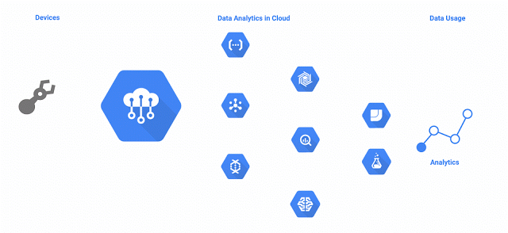
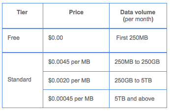

Announcing Cloud IoT Core public beta

# Announcing Cloud IoT Core public beta

By Indranil Chakraborty, Product Manager, Google Cloud

At Google I/O, we introduced [Google Cloud IoT Core](https://cloudplatform.googleblog.com/2017/05/introducing-Google-Cloud-IoT-Core-for-securely-connecting-and-managing-IoT-devices-at-scale.html), a fully managed service on Google Cloud Platform (GCP) to help securely connect and manage IoT devices at scale. Since then, many customers across industries such as transportation, oil and gas, utilities, healthcare and ride-sharing have used the service and provided us with insightful feedback.

[Cloud IoT Core](https://cloud.google.com/iot) is now publicly available to all users in beta, and we have introduced new set of features in this release. With Cloud IoT Core, you can easily connect and centrally manage millions of globally dispersed IoT devices. When used as part of the broader [Google Cloud IoT solution](https://cloud.google.com/solutions/iot/), you can ingest all your IoT data and connect to our state-of-the-art analytics services including [Google Cloud Pub/Sub](https://cloud.google.com/pubsub/), [Google Cloud Dataflow](https://cloud.google.com/dataflow/), [Google Cloud Bigtable](https://cloud.google.com/bigtable/), [Google BigQuery](https://cloud.google.com/bigquery/), and [Google Cloud Machine Learning Engine](https://cloud.google.com/ml-engine/) to gain actionable insights.

### Key new features

#### Bring your own certificate

Cloud IoT Core private beta users have asked for the ability to verify the ownership of device keys. In addition to asymmetric key-based authentication per individual device, users can now bring their own device key signed by their Certificate Authority (CA), and IoT Core verifies the signature of the key provided by the device with the CA certificate during the authentication process. This, for example, enables device manufacturers to provision their devices offline in bulk with their CA-issued certificate, and then register the CA certificates and the device public keys with Cloud IoT Core.

#### Connect existing devices with HTTP

In addition to the standard MQTT protocol, you can now more securely connect existing IoT devices and gateways to Cloud IoT Core over HTTP to easily ingest data into GCP at scale.

#### Logical device representation

Certain use cases require an IoT application to retrieve the last state and properties of an IoT device even when the device is not connected. Cloud IoT Core now maintains a logical representation of the physical IoT device, including device properties, and its last reported state. It provides APIs for your applications to retrieve and update the device properties and state even when the device is not connected.

Private beta users of Cloud IoT Core have built innovative IoT solutions in a short period of time. For example, transportation and logistics firms have used it to proactively stage the right vehicles in the right places at the right times. Utilities have enabled monitoring, analysis and prediction of consumer energy usage in real-time.

### Our customers share feedback

Smart Parking designs, develops and produces leading-edge technology that enables clients to manage parking efficiently and cost effectively. The company recently introduced the latest version of its platform that expands its scope from smart parking to smart cities. This new platform, built on GCP, leverages Cloud IoT Core to allow input from any number of distributed devices within a city. Smart Parking is now able to drive city-wide analytics and interconnected logic using powerful streams of real-time data.

*> “Our devices are heavily used and constantly send us a huge volume of data. By connecting these devices to Cloud IoT Core, we have a secure and reliable way to not only ingest that data but then also use it to gain valuable insights. We know exactly how our systems are performing and can push updates to devices to ensure we deliver the best products and services as cost effectively as possible.”*>  John Heard, Group CTO, > [> Smart Parking Limited](https://www.smartparking.com/)>

Tellmeplus’ award-winning AI platform, Predictive Objects, leverages machine learning and big data for predictive models in domains like customer or asset intelligence. As such, it helps experts make faster and more accurate predictions in IoT-based applications. By integrating Predictive Objects with Cloud IoT Core, joint customers can deploy and run predictive models on GCP as well as inside devices managed by Predictive Objects*.*

*> “Our disruptive approach to automated embedded artificial intelligence is ideally suited for deployment using Google Cloud IoT Core. This integration enables our predictive models to not only run inside Google Cloud Platform but also inside the objects themselves, whether they are connected or not, with a single point of control and a unified management console. We are proud to have been selected by Google to help extend the value of AI in their IoT ecosystem.”*>  Benoit Gourdon, CEO, > [> Tellmeplus](http://www.tellmeplus.com/)>

### Partner ecosystem

We continue to work with our partners to offer devices and kits that work seamlessly with Cloud IoT Core. You can now [procure kits from our partners](https://cloud.google.com/solutions/iot/kit/) and start building IoT solution relevant to your business case.

Cloud IoT Core device partners:

### Pricing

We are also introducing a simple pricing plan based on the volume of data exchanged with Cloud IoT Core. You can register as many IoT devices as you want, and you pay only when the devices connect to and exchange data with Cloud IoT Core. To make it simple to build quick prototypes with just a few devices, we have added a free tier that lets you try the service at no cost.

Ready to take it for a spin? To get started check out [this quick-start tutorial](https://cloud.google.com/iot/docs/quickstart) on Cloud IoT Core. We look forward to [your feedback](https://stackoverflow.com/tags/google-cloud-iot) and are excited to see what you build!