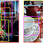

Announcing Open Images V4 and the ECCV 2018 Open Images Challenge

Announcing Open Images V4 and the ECCV 2018 Open Images Challenge

https://ai.googleblog.com/2018/04/announcing-open-images-v4-and-eccv-2018.html

Posted by Vittorio Ferrari, Research Scientist, Machine Perception In 2016, we introduced Open Images , a collaborative release of ~9 mill...