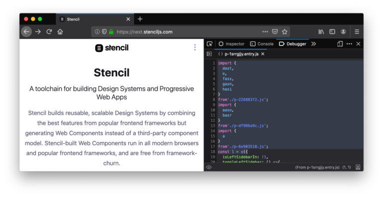
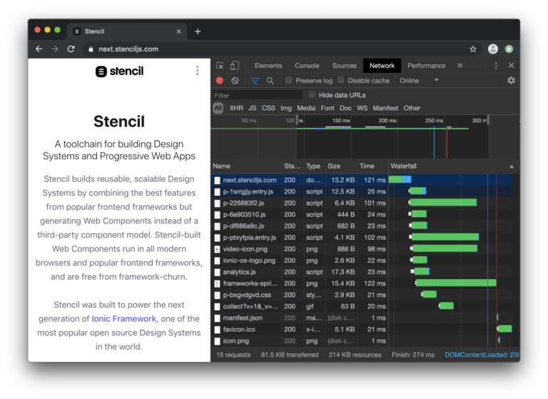
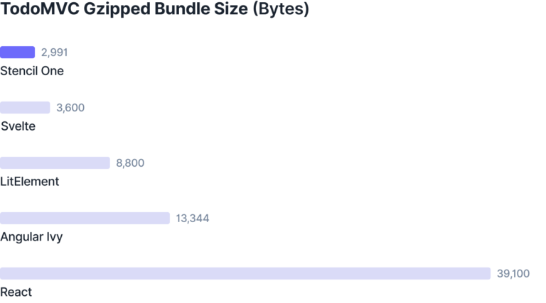
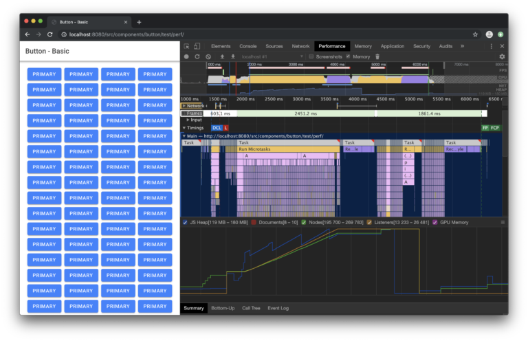
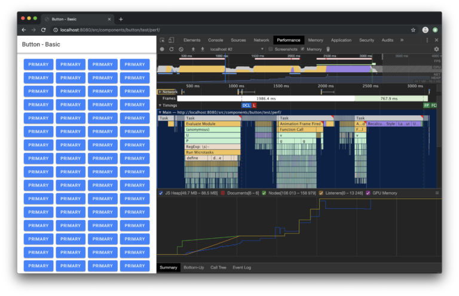

Announcing Stencil One: Beta

Today, we’re thrilled to announce the release of Stencil 1.0 beta (what we’re calling **Stencil One**), featuring an all-new compiler architecture. It is not only able to better optimize your components, but is designed to be completely future-proof.

## What is Stencil?

If you’re not familiar with [Stencil](https://next.stenciljs.com/), it is an open source (MIT) toolchain that builds reusable, scalable Design Systems by combining the best features from popular frontend frameworks and generating standard Web Components (instead of a third-party component model).

Stencil was first announced in 2017 at [Polymer Summit](https://www.youtube.com/watch?v=UfD-k7aHkQE) by my colleagues, [Adam Bradley](https://github.com/adamdbradley) and [Max Lynch](https://github.com/mlynch). Originally called “Ionic core” internally, Stencil was born out of our desire to solve our own JS Framework dependency problems and increase performance for Ionic Framework. As it turns out, Stencil ended up solving a lot more than that.

Building Stencil allowed us to [release Ionic 4](https://blog.ionicframework.com/introducing-ionic-4-ionic-for-everyone/) for Angular, React, Vue, or for no framework at all, powering roughly 100 cross-platform UI components in two separate styles (iOS and Material Design). As a result, the Ionic Framework team is now able to focus 100% of its time on shipping the best collection of UI components, gestures, animations, etc. without having to worry about browser-support, framework integrations, or performance—as Stencil automatically applies these built-in best practices.

Over the last two years, we’ve been surprised and incredibly humbled by the groundswell of community adoption Stencil has garnered. The project has over 200 contributors around the world, with thousands of developers, teams, and large organizations building on it. Frankly, we couldn’t be more grateful!

With that said, let’s dive into some of the exciting features shipping with Stencil One.

## Machine Learning-inspired Bundling

Stencil One uses a new bundling algorithm inspired by [“word embedding”](https://en.wikipedia.org/wiki/Word_embedding), a popular Machine Learning technique. It allows us to pack components more efficiently, therefore reducing the network throughput and round-trips. In order to do this, we generate a *N-dimensional* vector space where each component represents a coordinate. These coordinates are generated based on the previous static analysis of how components depend on each other. Later, the components that are located close enough in the vectorial space are bundled together. A blog post explaining this technique will be coming soon!

While we bundle components to reduce the number of scripts, Stencil relies on ES modules that execute natively in the browser. Today, all major browsers (Chrome, Firefox, Safari and Edge) implement ES2017 and ES modules, which means we don’t ship any runtime to load modules.

At the same time, we still support old browsers such as IE11, thanks to “[differential bundling](https://developers.google.com/web/fundamentals/primers/modules#browser)”, which automatically generates the smallest possible bundle for each browser based on their capabilities.

In addition, all the metadata collected by the compiler and the dependency graph generated by rollup can be used to automatically create [“modulepreload” links](https://developers.google.com/web/updates/2017/12/modulepreload), reducing the amount of network round-trips required to download all the JS in the critical path to zero. This drastically reduces the Time-To-Interactive of apps built with Stencil.

## Advanced Runtime Removal

With the new compiler, Stencil now shrinks the size and number of bundles sent to users. The metadata collected during the static analysis phase is used together with tree-shaking to *completely* remove the parts of the runtime that are not used.

While the `hello-world` demo is clearly an artificial example, we are excited about being able to generate incredibly small dependency-free components that include only what they need. Our **133bytes Hello World app** (including runtime) is an example of the power of the compiler.

This optimization also scales as the complexity of the components increases. Here’s an example with the [TodoMVC app](https://todomvc-stencil-one.firebaseapp.com/):

## JIT-friendly Runtime

We have also profiled and refactored the runtime to be smaller and much faster at execution-time. The new runtime avoids patterns that lead to non-optimal bytecode (usually called optimization killers), improves our async scheduler, and adopts new APIs like [Constructable Stylesheets](https://developers.google.com/web/updates/2019/02/constructable-stylesheets), native ES modules, and [native async-await](https://v8.dev/blog/fast-async).

In this benchmark, we add 8,000 `ion-button` components (yes, eight-THOUSAND) to an app. At first glance, `ion-button` might appear simple, but it hides a great deal of complexity. It’s comprised of many classes and nested elements which give it the professional and polished visual appearance on both iOS and Android. Put another way, this stress test is attaching more than *200,000* nodes to the DOM.

Historically, it took ~6 seconds to fully initialize the app with well over 269,000 nodes:

With Stencil One, the exact same test finishes in 3 seconds. That’s **2x times faster**! In addition, the memory usage is reduced from **180MB to 80MB**.

Best of all, Ionic developers don’t have to go through any painful rewrites. Instead, they will automatically unlock these performance improvements on their existing projects just from the compiler upgrade.

## A lot more in Stencil One…

The above is just a preview of some of the amazing features built into Stencil One. Here’s what else it will ship with:

- New prerendering architecture compatible with Shadow DOM and designed to be integrated with third party tools, such as **Angular Universal**.
- Generation of raw web components that extend directly from HTMLElement.
- A new and powerful plugin system for third party output targets.
- A continuing effort to ensure Stencil is as future-proof as possible.
- A new compiler architecture that relies on ECMA features instead of Typescript for metadata collection.
- Better built-in generation of Service Workers.
- Better asset generation for more efficient cache policies.

We can’t wait to dive into all of these topics in upcoming blog posts!

## Building a Design System?

We provide expert Advisory services & Software to large companies around the world building out the Design Systems that their company’s software will be built on for years and years to come.

If you or your company would like our help along the way, as well as other software surrounding Stencil and Design Systems, check out our [Stencil DS](https://stenciljs.com/design-systems) product offering for building future-proof, production-ready Design Systems at scale.

## Try the Beta!

We’d love for you to test out the Stencil One beta and to give us your early feedback. Upgrading your components to Stencil One is as easy as running the following command:

	npm install @stencil/core@one

And remember to look at our [breaking-changes file](https://github.com/ionic-team/stencil/blob/master/BREAKING_CHANGES.md) for any changes you might have to apply to your app.

We also released a [new version of our Docs](https://next.stenciljs.com/), documenting some of the new APIs of Stencil One.

## What’s Next?

The Stencil One 1.0 release sets an important milestone in the development of Stencil, switching focus from being solely an open sourced internal tool, to an actual product that can help any developer or company building design systems or blazing fast apps using pure web components.

We are currently targeting early June 2019 for the final release. This is just the beginning for Stencil.