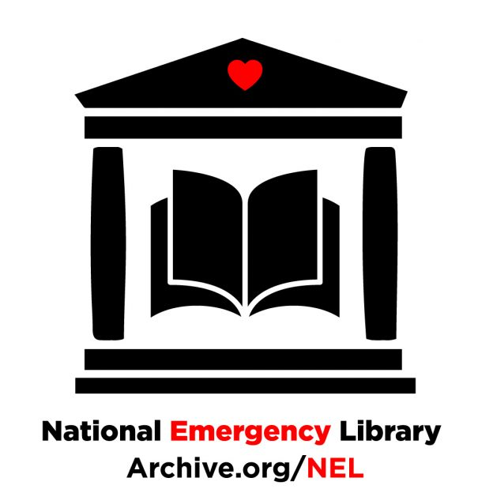

Announcing a National Emergency Library to Provide Digitized Books to Students and the Public | Internet Archive Blogs

# Announcing a National Emergency Library to Provide Digitized Books to Students and the Public

Posted on [March 24, 2020](http://blog.archive.org/2020/03/24/announcing-a-national-emergency-library-to-provide-digitized-books-to-students-and-the-public/) by [chrisfreeland](http://blog.archive.org/author/chrisfreeland/)

To address our unprecedented global and immediate need for access to reading and research materials, as of today, March 24, 2020, the Internet Archive will suspend waitlists for the 1.4 million (and growing) books in our lending library by creating a [National Emergency Library](https://archive.org/details/nationalemergencylibrary) to serve the nation’s displaced learners. This suspension will run through June 30, 2020, or the end of the US national emergency, whichever is later.

During the waitlist suspension, users will be able to borrow books from the [National Emergency Library](https://archive.org/details/nationalemergencylibrary) without joining a waitlist, ensuring that students will have access to assigned readings and library materials that the Internet Archive has digitized for the remainder of the US academic calendar, and that people who cannot physically access their local libraries because of closure or self-quarantine can continue to read and thrive during this time of crisis, keeping themselves and others safe.

This library brings together all the books from [Phillips Academy Andover](https://archive.org/details/phillipsacademy) and [Marygrove College](https://archive.org/details/marygrovecollege), and much of [Trent University’s](https://archive.org/details/trent_university) collections, along with over a million other books donated from other libraries to readers worldwide that are locked out of their libraries.

This is a response to the scores of inquiries from educators about the capacity of our lending system and the scale needed to meet classroom demands because of the closures. Working with librarians in Boston area, led by Tom Blake of Boston Public Library, who gathered course reserves and reading lists from college and school libraries, we determined which of those books the Internet Archive had already digitized.  Through that work we quickly realized that our lending library wasn’t going to scale to meet the needs of a global community of displaced learners. To make a real difference for the nation and the world, we would have to take a bigger step.

“The library system, because of our national emergency, is coming to aid those that are forced to learn at home, ” said Brewster Kahle, Digital Librarian of the Internet Archive. “This was our dream for the original Internet coming to life: the Library at everyone’s fingertips.”

[Public support](https://docs.google.com/document/d/1vkl3RX4CzpRTQsoG1tsdHC0foYiU7A8U_Vt1UyVboP8/edit) for this emergency measure has come from over 100 individuals, libraries and universities across the world, including the Massachusetts Institute of Technology (MIT).  “Ubiquitous access to open digital content has long been an important goal for MIT and MIT Libraries. Learning and research depend on it,” said Chris Bourg, Director of MIT Libraries. “In a global pandemic, robust digital lending options are key to a library’s ability to care for staff and the community, by allowing all of us to work remotely and maintain the recommended social distancing.”

We understand that we’re not going to be able to meet everyone’s needs; our collection, at 1.4 million modern books, is a fraction of the size of a large metropolitan library system or a great academic library. The books that we’ve digitized have been acquired with a focus on materials published during the 20th century, the vast majority of which do not have a commercially available ebook.  This means that while readers and students are able to access latest best sellers and popular titles through services like OverDrive and Hoopla, they don’t have access to the books that only exist in paper, sitting inaccessible on their library shelves. That’s where our collection fits in—we offer digital access to books, many of which are otherwise unavailable to the public while our schools and libraries are closed. In addition to the [National Emergency Library](https://archive.org/details/nationalemergencylibrary), the Internet Archive also offers free public access to 2.5 million fully downloadable public domain books, which do not require waitlists to view.

We recognize that authors and publishers are going to be impacted by this global pandemic as well. We encourage all readers who are in a position to buy books to do so, ideally while also supporting your local bookstore. If they don’t have the book you need, then Amazon or [Better World Books](https://www.betterworldbooks.com/) may have copies in print or digital formats. We hope that authors will support our effort to ensure temporary access to their work in this time of crisis. We are empowering authors to explicitly opt in and donate books to the National Emergency Library if we don’t have a copy. We are also making it easy for authors to contact us to take a book out of the library. [Learn more in our FAQ](https://docs.google.com/document/d/1QjErbouWG7pUlzcxPcRk4YEtbYs8ItlVTgLa1DfGh68/edit?usp=sharing).

A final note on calling this a “National Emergency” Library.  We lend to the world, including these books. We chose that language deliberately because we are pegging the suspension of the waitlists to the duration of the US national emergency.  Users all over the world have equal access to the books now available, regardless of their location.

**How you can help:**

1. Read books, recommend books, and teach using books from the [National Emergency Library](https://archive.org/details/nationalemergencylibrary)

2. [Sponsor a book](https://openlibrary.org/sponsorship) to be digitized and preserved

3. [Endorse this effort](https://docs.google.com/document/d/1vkl3RX4CzpRTQsoG1tsdHC0foYiU7A8U_Vt1UyVboP8/edit?usp=sharing) institutionally or individually

4. Share news about the [National Emergency Library](https://archive.org/details/nationalemergencylibrary) with your social media followers using #NationalEmergencyLibrary

5. [Donate](https://archive.org/donate) to the Internet Archive

If you have additional questions, please [check out our FAQ](https://docs.google.com/document/d/1QjErbouWG7pUlzcxPcRk4YEtbYs8ItlVTgLa1DfGh68/edit?usp=sharing) or contact [Chris Freeland](http://blog.archive.org/2020/03/24/announcing-a-national-emergency-library-to-provide-digitized-books-to-students-and-the-public/mailto:info@archive.org), Director of Open Libraries.

*Update 3/30*: To read our latest announcement about the National Emergency Library, please read our post [Internet Archive responds: Why we released the National Emergency Library](http://blog.archive.org/2020/03/30/internet-archive-responds-why-we-released-the-national-emergency-library/)

Posted in [Announcements](http://blog.archive.org/category/announcements/), [News](http://blog.archive.org/category/news/) |[76 Replies](http://blog.archive.org/2020/03/24/announcing-a-national-emergency-library-to-provide-digitized-books-to-students-and-the-public/#comments)

## About chrisfreeland

Chris Freeland is the Director of Open Libraries at Internet Archive.

[View all posts by chrisfreeland →](http://blog.archive.org/author/chrisfreeland/)