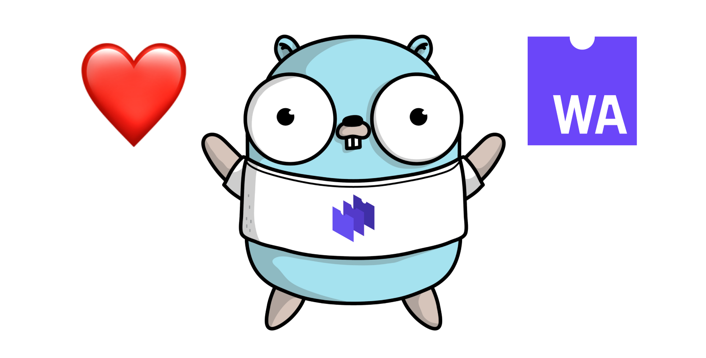
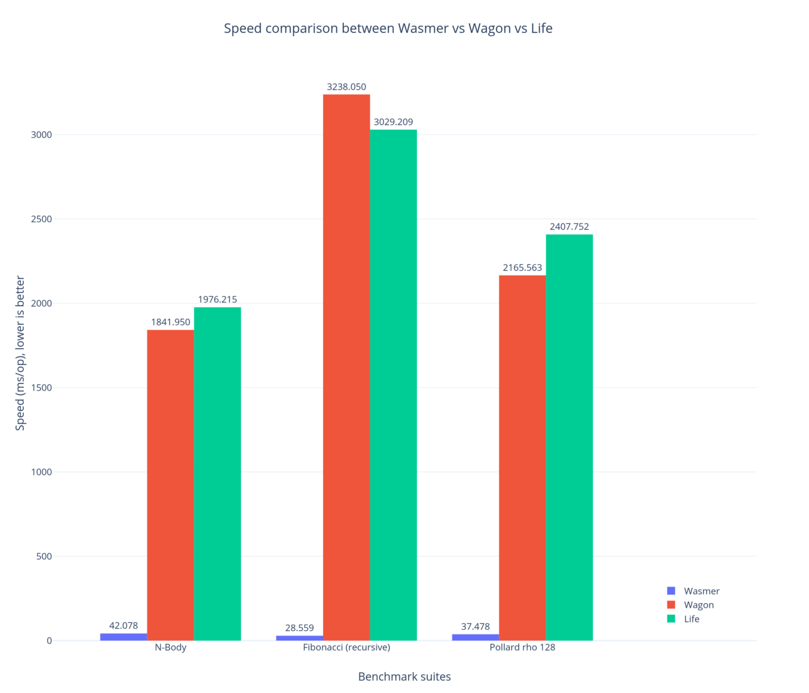

Announcing the fastest WebAssembly runtime for Go: wasmer

# Announcing the fastest WebAssembly runtime for Go: `wasmer`

[Ivan Enderlin](https://medium.com/@hywan)
May 29·5 min read

Go loves WebAssembly — image attributions to the original [Gopher drawing](https://vkt.sh/go-mongodb-driver-cookbook/).

WebAssembly is a portable binary format. That means the same file can run anywhere.

> To uphold this bold statement, each language, platform and system must be able to run WebAssembly — as fast and safely as possible.

[Wasmer](https://github.com/wasmerio/wasmer) is a WebAssembly runtime written in [Rust](https://www.rust-lang.org/). It goes without saying that the runtime can be used in any Rust application. We have also successfully embedded the runtime in other languages:

- •Using [C and C++ bindings](https://github.com/wasmerio/wasmer/tree/master/lib/runtime-c-api)
- •In PHP, using `[php-ext-wasm](https://github.com/wasmerio/php-ext-wasm)`
- •In Python, using `[python-ext-wasm](https://github.com/wasmerio/python-ext-wasm)` — [wasmer package on PyPI](https://pypi.org/project/wasmer/)
- •In Ruby, using `[ruby-ext-wasm](https://github.com/wasmerio/ruby-ext-wasm)` — [wasmer gem on RubyGems](https://rubygems.org/gems/wasmer)
- •**It is now time to hang around **[**Go**](https://golang.org/)** !**

We are super happy to announce `github.com/wasmerio/go-ext-wasm/wasmer`, a [Go library to run WebAssembly binaries, fast](https://github.com/wasmerio/go-ext-wasm).

[**wasmerio/go-ext-wasm** *️ Go library to run WebAssembly binaries. Contribute to wasmerio/go-ext-wasm development by creating an account on…*github.com](https://github.com/wasmerio/go-ext-wasm)[(L)](https://github.com/wasmerio/go-ext-wasm)

### Calling a WebAssembly function from Go

First, let’s install `wasmer` in your go environment (*with cgo support*).

export CGO_ENABLED=1; export CC=gcc; go install github.com/wasmerio/go-ext-wasm/wasmer

Let’s jump immediately into some examples.`github.com/wasmerio/go-ext-wasm/wasmer` is a regular Go library. The installation is automated with `import "github.com/wasmerio/go-ext-wasm/wasmer"`.

Let’s get our hands dirty. We will write a program that compiles to WebAssembly easily, using Rust for instance:

|     |     |
| --- | --- |
| 1   | #[no_mangle] |
| 2   | pub  extern  fn  sum(x: i32, y: i32) -> i32 { |
| 3   | x + y |
| 4   | }   |

 [view raw](https://gist.github.com/Hywan/99c8cf7d58df846e222ca163788cc3aa/raw/5247e0fa4f38a7780aa7e988a6e09d9add77007a/simple.rs)  [simple.rs](https://gist.github.com/Hywan/99c8cf7d58df846e222ca163788cc3aa#file-simple-rs) hosted with ❤ by [GitHub](https://github.com/)

simple.rs, a small Rust program that compiles to WebAssembly.

After compilation to WebAssembly, we get a file like [this one](https://github.com/wasmerio/go-ext-wasm/blob/master/wasmer/test/testdata/examples/simple.wasm), named `simple.wasm`.

The following Go program executes the `sum` function by passing `5` and `37` as arguments:

|     |     |
| --- | --- |
| 1   | package main |
| 2   |     |
| 3   | import ( |
| 4   | "fmt" |
| 5   | wasm "github.com/wasmerio/go-ext-wasm/wasmer" |
| 6   | )   |
| 7   |     |
| 8   | func  main() { |
| 9   | // Reads the WebAssembly module as bytes. |
| 10  | bytes, _  := wasm.ReadBytes("simple.wasm") |
| 11  |     |
| 12  | // Instantiates the WebAssembly module. |
| 13  | instance, _  := wasm.NewInstance(bytes) |
| 14  | defer instance.Close() |
| 15  |     |
| 16  | // Gets the `sum` exported function from the WebAssembly instance. |
| 17  | sum  := instance.Exports["sum"] |
| 18  |     |
| 19  | // Calls that exported function with Go standard values. The WebAssembly |
| 20  | // types are inferred and values are casted automatically. |
| 21  | result, _  :=  sum(5, 37) |
| 22  |     |
| 23  | fmt.Println(result) // 42! |
| 24  | }   |

 [view raw](https://gist.github.com/Hywan/82ce861a6e03991d9f23f6a4172eb486/raw/0b10acb988d2e04343dd62a97be346d38360948e/simple.go)  [simple.go](https://gist.github.com/Hywan/82ce861a6e03991d9f23f6a4172eb486#file-simple-go) hosted with ❤ by [GitHub](https://github.com/)

simple.go, a small Go program that executes the WebAssembly file (result of the compilation of the Rust program).

Great! We have successfully executed a WebAssembly file inside Go.

*> Note: Go values passed to the WebAssembly exported function are automatically cast to WebAssembly values. Types are inferred and casting is done automatically. Thus, a WebAssembly function acts as any regular Go function.*

### WebAssembly calling Go funtions

A WebAssembly module *exports* some functions, so that they can be called from the outside world. This is the entry point to execute WebAssembly.

Nonetheless, a WebAssembly module can also have *imported* functions. Let’s consider the following Rust program:

|     |     |
| --- | --- |
| 1   | extern { |
| 2   |  fn  sum(x: i32, y: i32) -> i32; |
| 3   | }   |
| 4   |     |
| 5   | #[no_mangle] |
| 6   | pub  extern  fn  add1(x: i32, y: i32) -> i32 { |
| 7   |  unsafe { sum(x, y) } +  1 |
| 8   | }   |

 [view raw](https://gist.github.com/Hywan/7217487ffa1a6725e1a5fb6a9cebdd88/raw/52b5993aa34312ca9a9b75f8794921b914a8ea07/import.rs)  [import.rs](https://gist.github.com/Hywan/7217487ffa1a6725e1a5fb6a9cebdd88#file-import-rs) hosted with ❤ by [GitHub](https://github.com/)

import.rs, the `sum` function implementation is in another language. Download the [WebAssembly file here](https://github.com/wasmerio/go-ext-wasm/blob/master/wasmer/test/testdata/examples/imported_function.wasm)

The exported function `add1` calls the `sum` function. Its implementation is absent, only its signature is defined. This is an “extern function”, and for WebAssembly, this is an *imported* function, because its implementation must be *imported*.

Let’s implement the `sum` function in Go! To do so, *need* to use [cgo](https://blog.golang.org/c-go-cgo):

1. 1.The `sum` function signature is defined in C (see the comment above `import "C"`),

2. 2.The `sum` implementation is defined in Go. Notice the `//export` which is the way cgo uses to map Go code to C code,

3. 3.`NewImports` is an API used to create WebAssembly imports. In this code `"sum"` is the WebAssembly imported function name, `sum` is the Go function pointer, and `C.sum` is the cgo function pointer,

4. 4.Finally, `NewInstanceWithImports` is the constructor to use to instantiate the WebAssembly module with imports. That’s it.

Let’s see the complete program:

|     |     |
| --- | --- |
| 1   | package main |
| 2   |     |
| 3   | // // 1️⃣ Declare the `sum` function signature (see cgo). |
| 4   | //  |
| 5   | // #include <stdlib.h> |
| 6   | //  |
| 7   | // extern int32_t sum(void *context, int32_t x, int32_t y); |
| 8   | import  "C" |
| 9   |     |
| 10  | import ( |
| 11  | "fmt" |
| 12  | wasm "github.com/wasmerio/go-ext-wasm/wasmer" |
| 13  | "unsafe" |
| 14  | )   |
| 15  |     |
| 16  | // 2️⃣ Write the implementation of the `sum` function, and export it (for cgo). |
| 17  | //export sum |
| 18  | func  sum(context  unsafe.Pointer, x  int32, y  int32) int32 { |
| 19  | return x + y |
| 20  | }   |
| 21  |     |
| 22  | func  main() { |
| 23  | // Reads the WebAssembly module as bytes. |
| 24  | bytes, _  := wasm.ReadBytes("import.wasm") |
| 25  |     |
| 26  | // 3️⃣ Declares the imported functions for WebAssembly. |
| 27  | imports, _  := wasm.NewImports().Append("sum", sum, C.sum) |
| 28  |     |
| 29  | // 4️⃣ Instantiates the WebAssembly module with imports. |
| 30  | instance, _  := wasm.NewInstanceWithImports(bytes, imports) |
| 31  |     |
| 32  | // Close the WebAssembly instance later. |
| 33  | defer instance.Close() |
| 34  |     |
| 35  | // Gets the `add1` exported function from the WebAssembly instance. |
| 36  | add1  := instance.Exports["add1"] |
| 37  |     |
| 38  | // Calls that exported function. |
| 39  | result, _  :=  add1(1, 2) |
| 40  |     |
| 41  | fmt.Println(result) |
| 42  | // add1(1, 2) |
| 43  | // = sum(1 + 2) + 1 |
| 44  | // = 1 + 2 + 1 |
| 45  | // = 4 |
| 46  | // QED |
| 47  | }   |

 [view raw](https://gist.github.com/Hywan/83d06597ce2888ad953371803c918fa4/raw/ca6b979b89e60a710e496e6de4d51e4917911bfd/import.go)  [import.go](https://gist.github.com/Hywan/83d06597ce2888ad953371803c918fa4#file-import-go) hosted with ❤ by [GitHub](https://github.com/)

import.go, the sum implementation is written in Go.

### Reading the memory

A WebAssembly instance has a linear memory. Let’s see how to read it. Consider the following Rust program:

|     |     |
| --- | --- |
| 1   | #[no_mangle] |
| 2   | pub  extern  fn  return_hello() -> *const  u8 { |
| 3   |  b"Hello, World!\0".as_ptr() |
| 4   | }   |

 [view raw](https://gist.github.com/Hywan/f76c8f41afcc26426cc39a864af5fcfa/raw/2cfc4db2cbe764b22809b5c75959dca9328b2443/memory.rs)  [memory.rs](https://gist.github.com/Hywan/f76c8f41afcc26426cc39a864af5fcfa#file-memory-rs) hosted with ❤ by [GitHub](https://github.com/)

memory.rs, a small Rust function that returns a pointer to a string.

The `return_hello` function returns a pointer to a string. The string terminates by a null byte, *à la *C. Let’s jump on the Go side:

|     |     |
| --- | --- |
| 1   | bytes, _  := wasm.ReadBytes("memory.wasm") |
| 2   | instance, _  := wasm.NewInstance(bytes) |
| 3   | defer instance.Close() |
| 4   |     |
| 5   | // Calls the `return_hello` exported function. |
| 6   | // This function returns a pointer to a string. |
| 7   | result, _  := instance.Exports["return_hello"]() |
| 8   |     |
| 9   | // Gets the pointer value as an integer. |
| 10  | pointer  := result.ToI32() |
| 11  |     |
| 12  | // Reads the memory. |
| 13  | memory  := instance.Memory.Data() |
| 14  |     |
| 15  | fmt.Println(string(memory[pointer : pointer+13])) // Hello, World! |

 [view raw](https://gist.github.com/Hywan/ef13524c7d06a82888452f06de3a3e0f/raw/8a1768b7aaa4e5f04f924f330019f8755bbe906b/memory.go)  [memory.go](https://gist.github.com/Hywan/ef13524c7d06a82888452f06de3a3e0f#file-memory-go) hosted with ❤ by [GitHub](https://github.com/)

memory.go, a Go program that reads a string based on a pointer returned by WebAssembly.

The `return_hello` function returns a pointer as an `i32` value. We get its value by calling `ToI32`. Then, we fetch the memory data with `instance.Memory.Data()`.

This function returns a slice over the WebAssembly instance memory. It can be used as any regular Go slice.

Fortunately for us, we already know the length of the string we want to read, so `memory[pointer : pointer+13]` is enough to read the bytes, that are then cast to a string. *Et voilà !*

> You can read > [> the Greet Example](https://github.com/wasmerio/go-ext-wasm/blob/6934a0fa06558f77884398a2371de182593e6a6c/wasmer/test/example_greet_test.go)>  to see a more advanced usage of the memory API.

### Benchmarks

So far, `github.com/wasmerio/go-ext-wasm/wasmer` has a nice API, but …*is it fast*?

Contrary to PHP or Ruby, there are already existing runtimes in the Go world to execute WebAssembly. The main candidates are:

- •[Life](https://github.com/perlin-network/life), from Perlin Network, a WebAssembly interpreter
- •[Wagon](https://github.com/go-interpreter/wagon), from Go Interpreter, a WebAssembly interpreter and toolkit.

In [our blog post about the PHP extension](https://medium.com/wasmer/php-ext-wasm-migrating-from-wasmi-to-wasmer-4d1014f41c88), we have used [the n-body algorithm](https://benchmarksgame-team.pages.debian.net/benchmarksgame/description/nbody.html) to benchmark the performance. Life provides more benchmarks: [the Fibonacci algorithm](https://en.wikipedia.org/wiki/Fibonacci_number) (the recursive version), [the Pollard’s rho algorithm](https://en.wikipedia.org/wiki/Pollard%27s_rho_algorithm), and the Snappy Compress operation. The latter works successfully with `github.com/wasmerio/go-ext-wasm/wasmer` but not with Life or Wagon. We have removed it from the benchmark suites. [Benchmark sources](https://github.com/wasmerio/go-ext-wasm/tree/master/benchmarks) are online.

We use Life 20190521143330–57f3819c2df0, and Wagon 0.4.0, i.e. *the latest versions to date*.

The benchmark numbers represent the average result for 10 runs each. The computer that ran these benchmarks is a MacBook Pro 15" from 2016, 2.9Ghz Core i7 with 16Gb of memory.

Results are grouped by benchmark algorithm on the X axis. The Y axis represents the time used to run the algorithm, expressed in milliseconds. The lower, the better.

Speed comparison between Wasmer, Wagon and Life. Benchmark suites are the n-body, Fibonacci, and Pollard’s rho algorithms. Speed is expressed in ms. Lower is better.

While both Life and Wagon provide on average the same speed, Wasmer (`github.com/wasmerio/go-ext/wasmer`) is on average **72 times faster** .

It is important to know that Wasmer comes with 3 backends: [Singlepass](https://github.com/wasmerio/wasmer/tree/master/lib/singlepass-backend), [Cranelift](https://github.com/wasmerio/wasmer/tree/master/lib/clif-backend), and [LLVM](https://github.com/wasmerio/wasmer/tree/master/lib/llvm-backend). The default backend that is used by the Go library is Cranelift ([learn more about Cranelift](https://github.com/CraneStation/cranelift)). Using LLVM will provide performance close to native, but we decided to start with Cranelift as it offers the best tradeoff between compilation-time and execution-time ([learn more about the different backends](https://medium.com/wasmer/a-webassembly-compiler-tale-9ef37aa3b537), when to use them, pros and cons etc.).

### Conclusion

`[github.com/wasmerio/go-ext-wasm/wasmer](https://github.com/wasmerio/go-ext-wasm)` is a new Go library to execute WebAssembly binaries. It embeds the [Wasmer](https://github.com/wasmerio/wasmer) runtime. The first version supports all the required API for the most common usages.

The current benchmarks (a mix from our benchmark suites and from Life suites) show that **Wasmer is — on average — 72 times faster than Life and Wagon**, the two major existing WebAssembly runtimes in the Go world.

If you want to follow the development, take a look at [@wasmerio](https://twitter.com/wasmerio) and [@mnt_io](https://twitter.com/mnt_io) on Twitter, or [@wasmer@webassembly.social](https://webassembly.social/@wasmer) on Mastodon. And of course, everything is open source at https://github.com/wasmerio/go-ext-wasm.

[**wasmerio/go-ext-wasm** *️ Go library to run WebAssembly binaries. Contribute to wasmerio/go-ext-wasm development by creating an account on…*github.com](https://github.com/wasmerio/go-ext-wasm)[(L)](https://github.com/wasmerio/go-ext-wasm)

Thank you for your time, we can’t wait to see what you build with us!