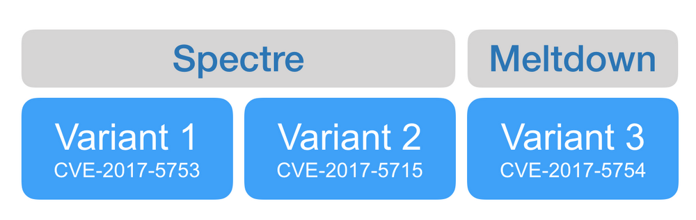

Answering your questions about “Meltdown” and “Spectre”

# Answering your questions about “Meltdown” and “Spectre”

Matt Linton

Senior Security Engineer

Matthew O'Connor

Office of the CTO

This week, security vulnerabilities dubbed “Spectre” and “Meltdown” made news headlines. On Wednesday, we explained [what these vulnerabilities are](https://googleprojectzero.blogspot.com/2018/01/reading-privileged-memory-with-side.html) and [how we're protecting you against them](https://blog.google/topics/google-cloud/what-google-cloud-g-suite-and-chrome-customers-need-know-about-industry-wide-cpu-vulnerability/).

Since then, there's been considerable discussion about what this means for Google Cloud and the industry at large. Today, we’d like to clear up some confusion and highlight several key considerations for our customers.

## What are “Spectre” and “Meltdown”?

Last year, [Google’s Project Zero](https://googleprojectzero.blogspot.com/2014/07/announcing-project-zero.html) team discovered serious security flaws caused by “[speculative execution](https://en.wikipedia.org/wiki/Speculative_execution),” a technique used by most modern processors (CPUs) to optimize performance.

Independent researchers separately discovered and named these vulnerabilities “Spectre” and “Meltdown.”

Project Zero described three variants of this new class of speculative execution attack. Variant 1 and Variant 2 have been referred to as “Spectre.” Variant 3 has been referred to as “Meltdown.” Most vendors are referring to them by Common Vulnerabilities and Exposures aka “CVE” labels, which are an industry standard way of identifying vulnerabilities.

There's no single fix for all three attack variants; each requires protection individually.

Here's an overview of each variant:

- Variant 1 ([CVE-2017-5753](http://cve.mitre.org/cgi-bin/cvename.cgi?name=CVE-2017-5753)), “bounds check bypass.” This vulnerability affects specific sequences within compiled applications, which must be addressed on a per-binary basis. This variant is currently the basis for concern around browser attacks, Javascript exploitation and vulnerabilities within individual binaries.
- Variant 2 ([CVE-2017-5715](http://cve.mitre.org/cgi-bin/cvename.cgi?name=CVE-2017-5715)), “branch target injection.” This variant may either be fixed by a CPU microcode update from the CPU vendor, or by applying a software protection called “[Retpoline](https://support.google.com/faqs/answer/7625886)” to binaries where concern about information leakage is present. This variant is currently the basis for concern around Cloud Virtualization and “Hypervisor Bypass” concerns that affect entire systems.
- Variant 3 ([CVE-2017-5754](http://cve.mitre.org/cgi-bin/cvename.cgi?name=CVE-2017-5754)), “rogue data cache load.”  This variant is the basis behind the discussion around “KPTI,” or “Kernel Page Table Isolation.” When an attacker already has the ability to run code on a system, they can access memory which they do not have permission to access.

For more information on these variants, please read this week’s [Google Security post](https://security.googleblog.com/2018/01/more-details-about-mitigations-for-cpu_4.html).

## Am I protected from Spectre and Meltdown?

Google’s engineering teams began working to protect our customers from these vulnerabilities upon our learning of them in June 2017. We applied solutions [across the entire suite of Google products](https://security.googleblog.com/2018/01/todays-cpu-vulnerability-what-you-need.html), and we collaborated with the industry at large to help protect users across the web.

G Suite and Google Cloud Platform (GCP) are [updated](https://blog.google/topics/google-cloud/what-google-cloud-g-suite-and-chrome-customers-need-know-about-industry-wide-cpu-vulnerability/) to protect against all known attack vectors. Some customers may worry that they have not been protected since they were not asked to reboot their instance. Google Cloud is architected in a manner that enables us to update the environment while providing operational continuity for our customers. Via [live migration](https://cloud.google.com/compute/docs/instances/live-migration)we can patch our infrastructure without requiring customers to reboot their instances.

Customers who use their own operating systems with Google Cloud services should continue to follow security best practices and apply security updates to their images just as they would for any other operating system vulnerability. We're providing an up-to-date reference on the availability of vendor patches for common operating systems on our [GCE Security Bulletin](https://cloud.google.com/compute/docs/security-bulletins) page.

## I’ve heard that Spectre is nearly impossible to protect against. Is this true?

There has been significant concern in particular about “Spectre.” The use of the name “Spectre” to refer to both Variants 1 and 2 has caused some confusion over whether it's “fixed” or not.

Google Cloud instances are protected against all known inter-VM attacks, regardless of the patch status of the guest environments, and attackers do not have access to any customers’ data as a result of these vulnerabilities. Google Cloud and other public clouds use virtualization technology to isolate neighboring customer workloads. A virtualization component known as a hypervisor connects the physical machine to virtual machines. This hypervisor can be updated to address Variant 2 threats. Google Cloud has updated its hypervisor using “[Retpoline](https://support.google.com/faqs/answer/7625886),” which addresses all currently known Variant 2 attack methods.

Variant 1 is the basis behind claims that Spectre is nearly impossible to protect against. The difficulty is that Variant 1 affects individual software binaries, so it must be handled by discovering and addressing exploits within each binary.

Risks that Variant 1 would pose to the infrastructure underpinning Google Cloud are addressed by the multiple security controls that make up our layered “defense in depth” security posture. Because Google is in full control of our infrastructure from the hardware up to our secure software development practices, our infrastructure is protected against Variant 1. You can read more about the security foundations of our infrastructure in our [whitepaper](https://cloud.google.com/security/security-design/resources/google_infrastructure_whitepaper_fa.pdf?utm_medium=et&utm_source=google.com%2Fcloud&utm_campaign=multilayered_security&utm_content=download_the_whitepaper).

We work continuously to stay ahead of the constantly-evolving threat landscape and will continue to roll out additional protections to address potential risks.

## As a user of the public cloud, am I more vulnerable to Spectre and Meltdown than others?

In many respects, public cloud users are better-protected from security vulnerabilities than are users of traditional datacenter-hosted applications. Security best practices rely on discovering vulnerabilities early, and patching them promptly and completely. Each of these activities is aided by the scale and automation that top public cloud providers can offer — for example, few companies maintain a several-hundred-person security research team to find vulnerabilities and patch them before they're discovered by others or disclosed. Having the ability to update millions of servers in days, without causing user disruption or requiring maintenance windows, is difficult technology to develop but it allows patches and updates to be deployed quickly after they become available, and without user disruption that can damage productivity.

Spectre and Meltdown are new and troubling vulnerabilities, but it’s important to remember that there are many different types of threats that Google (and other cloud providers) protect against every single day. Google’s cloud infrastructure doesn’t rely on any single technology to make it secure. Our stack builds security through progressive layers that deliver defense in depth. From the physical premises to the purpose-built servers, networking equipment, and custom security chips to the low-level software stack running on every machine, our entire hardware infrastructure is Google-controlled, -secured, -built and -hardened.

## Is performance impacted?

On most of Google’s workloads, including our cloud infrastructure, we've seen negligible impact on performance after applying remediations. This was explained further in our follow-up Security [blog post](https://security.googleblog.com/2018/01/more-details-about-mitigations-for-cpu_4.html) on January 4.

There are many conflicting reports about patch impacts being publicly discussed. In some cases, people have published results of tests that focus solely on making API calls to the operating system, which does not represent the real-world scenario that customer software will encounter. There's no substitute for testing to determine for yourself what performance you can expect in your actual situation. We believe solutions exist that introduce minimal performance impact, and expect such techniques will be adopted by software vendors over time. We designed and tested our mitigations for this issue to have minimal performance impact, and the rollout has been uneventful.

## Where can I get additional information?

- Technical [details from Project Zero](https://googleprojectzero.blogspot.com/2018/01/reading-privileged-memory-with-side.html) about these vulnerabilities
- Information about these vulnerabilities and mitigations [across all Google products](https://security.googleblog.com/2018/01/todays-cpu-vulnerability-what-you-need.html)
- Additional information about [impacts to performance](https://security.googleblog.com/2018/01/more-details-about-mitigations-for-cpu_4.html)
- Our Support page offers a [list of affected Google products](https://support.google.com/faqs/answer/7622138) and will be updated with their current status of mitigation against these risks
- Our GCP [Security Bulletins](https://cloud.google.com/compute/docs/security-bulletins) page will provide notifications as other operating system maintainers publish patches for this vulnerability and as Compute Engine releases updated OS images