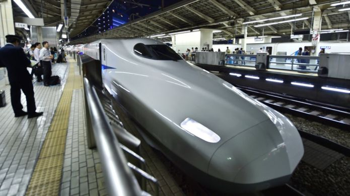
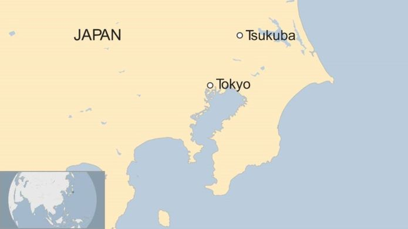
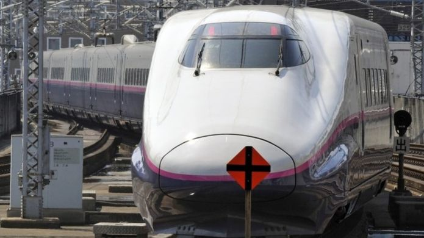

Apology after Japanese train departs 20 seconds early

# Apology after Japanese train departs 20 seconds early

- 16 November 2017

- [Asia](https://www.bbc.co.uk/news/world/asia)

   Share this with Email      Share this with Facebook      Share this with Twitter

* * *

   Image copyright   AFP   

 Image caption   Japan has one of the world's most reliable railways

A rail company in Japan has apologised after one of its trains departed 20 seconds early.

Management on the Tsukuba Express line between Tokyo and the city of Tsukuba say they "sincerely apologise for the inconvenience" caused.

In a statement, [the company said the train had been scheduled to leave at 9:44:40 local time but left at 9:44:20.](http://www.mir.co.jp/company/release/2017/post_109.html)

Many social media users reacted to the company's apology with surprise.

The mistake happened because staff had not checked the timetable, the company statement said.

"The crew did not sufficiently check the departure time and performed the departure operation," it said.

- [Cats invited on to local Japan train](http://www.bbc.co.uk/news/av/world-asia-41221930/cats-invited-on-to-local-japan-train)

It added that no customers had complained about the early departure from Minami Nagareyama Station, which is just north of Tokyo.

   

The Tsukuba Express line takes passengers from Akihabara in eastern Tokyo to Tsukuba in about 45 minutes.

It is rare for trains in Japan, which has one of the world's most reliable railways, to depart at a different time to the one scheduled.

The country's Tokaido line, which runs from Tokyo to the city of Kobe, is by far the world's busiest and carries nearly 150 million passengers a year.

## More on this story

[    ### India launches first bullet train project  14 September 2017](https://www.bbc.co.uk/news/world-asia-india-41251210)

[    ### Japan etiquette video discourages applying make-up on trains  28 October 2016](https://www.bbc.co.uk/news/world-asia-37796036)

* * *

Copyright © 2017 BBC. The BBC is not responsible for the content of external sites.