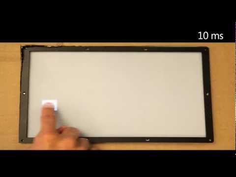

Applied Sciences Group: High Performance Touch - YouTube

Applied Sciences Group: High Performance Touch
https://www.youtube.com/watch?v=vOvQCPLkPt4
[Microsoft Research](https://www.youtube.com/channel/UCCb9_Kn8F_Opb3UCGm-lILQ)
1,285,676 views views
Published on Mar 6, 2012

|     |
| --- |
| [(L)](https://www.youtube.com/watch?v=vOvQCPLkPt4) |

Description

Modern touch devices allow one to interact with virtual objects. However, there is a substantial delay between when a finger moves and the display responds. Microsoft researchers, Albert Ng and Paul Dietz, have built a laboratory test system that allows us to experience the impact of different latencies on the user experience. The results help us to understand how far we still have to go in improving touch performance.