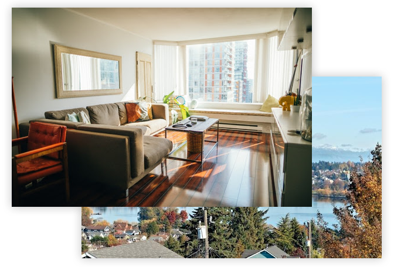

Arrived

## Build home ownership,

with the freedom of renting.

We’ll help you find a home you love while building your home ownership in a real estate fund. It’s debt free, and when you move, you take your home investment with you.

Get early access to Arrived

We’re built for people who want to build home investment,
even if they aren’t ready to commit to a single home or city.

#

How it works

## 1

**Find a home**
Our team helps you find a home on the market that you’ll love.

## 2

**Move in**
Arrived purchases the home and covers all closing fees.

You sign a lease agreement and contribute an initial investment towards your account.

## 3

**Build investment**
With each rent payment, you continue growing your investment.
[See your investment >](https://arrivedhomes.com/#see-your-investment)

## 4

**Find your next home**

Once you’re ready to relocate, you can either continue contributing to your Arrived account or cash out and use the funds however you like.

#

Calculate your home investment over time with Arrived
Monthly Rent

$1,500

Initial Investment

$3,000

Length of Stay

36 Months

###

Your Arrived Home:
**Initial Investment**
$3,000
?
**Monthly Rent***
$1,500
?
**Investment Return**
$8,421
?

*****  **7%** of your Monthly Rent will build towards your Investment Return.

#

A better way to build home ownership

##### Diversified

Your home equity is spread across a portfolio of homes instead of a single asset.

##### Zero Debt

There’s no need for you to take on a mortgage. You can build ownership while renting and still obtain the benefit of appreciation on your investment.

##### Freedom

Move to a new home or city without losing the equity you’ve built or paying 7-10% in real estate commissions and fees.

##### Passive Income

Your ownership position in our fund provides you with a passive income stream that can help you accelerate your home investment.

##### Community

Welcome to the neighborhood! Join a community of like-minded people who live the way you do.

#

Why invest in real estate while renting?

Real estate is one of the oldest and highest performing asset classes - known for producing long-term wealth over generations. However, more people are choosing to rent now than at any point in the last 50 years, either for affordability or freedom to move. While individuals can achieve greater flexibility through renting, they also miss out on the benefits of wealth creation that can come from owning real estate, and, therefore end up under invested in real estate compared to peers who purchase homes. Every year spent without holding real estate investments, real estate can become more expensive and further out of reach as property values rise.

We believe people should have the freedom to move around to pursue new opportunities in their life while still having access to the wealth creation long-term home ownership can provide.