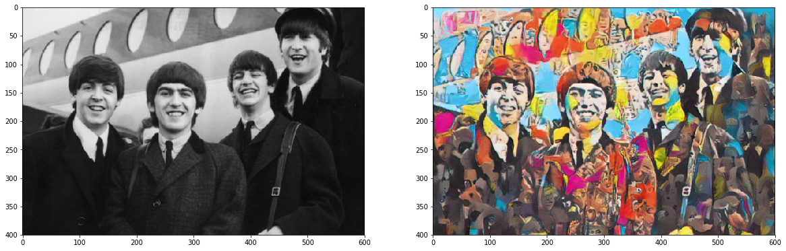
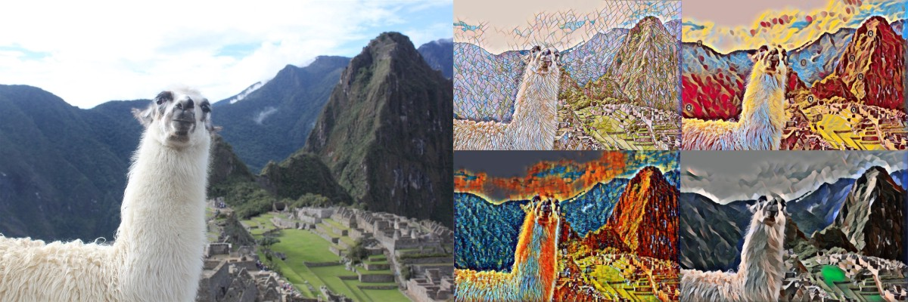
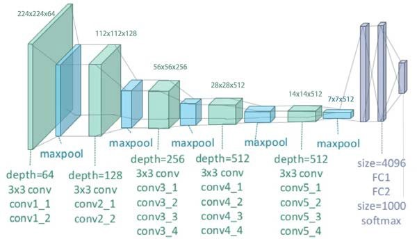
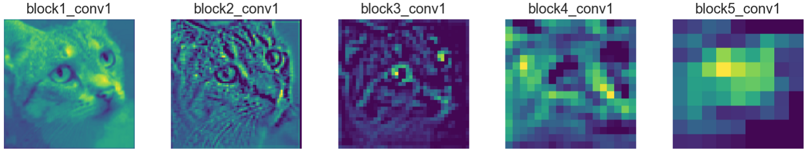
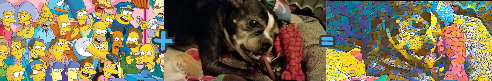
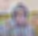
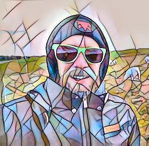

Art & AI: The Logic Behind Deep Learning ‘Style Transfer’

# Art & AI: The Logic Behind Deep Learning ‘Style Transfer’

## A Look Into the ’Neural Algorithm of Artistic Style’

[Nick Kasten](https://medium.com/@kastentx)
Feb 21·9 min read

When humans and machines collaborate, we can produce things neither would create on their own. The intersection of art and AI is an area that I find really exciting, but with all the business impact AI can have, I personally feel it doesn’t always get enough attention. In this spirit, I recently set out on a personal quest to learn more about [**PyTorch**](https://pytorch.org/), the machine learning library that’s been creating a lot of buzz since its `1.0` release late last year, and I was pleasantly surprised by what I found.

For me, PyTorch turned out to be more than just an interesting alternative to [TensorFlow](https://www.tensorflow.org/), with dynamic graphs and an imperative coding style. One of the [examples from their official docs](https://pytorch.org/tutorials/advanced/neural_style_tutorial.html) inspired me to track down some academic papers and take a closer look at the inner-workings of a deep learning technique that’s fascinated me for quite some time — ‘Neural Style Transfer’.

In this post, I want to share what I learned about style transfer during my deep dive, along with a couple of pretty cool examples.

### What is ‘Style Transfer’?

From a high level, what the algorithm does is pretty straightforward. Take 3 images as input: one for **content**, one for **style**, and a **target**. The ‘target’ image is typically a blank canvas that we build our output from, so it can be ignored for now. What we’re really concerned with are the other two — our content image and the image that we’ll extract artistic style from. What we end up with is one brand new image, representing the original content from one image in the other image’s style. For an even better idea of what style transfer looks like, all of the images in this article have been produced with this method to give some examples.

In this example, I transferred the style from one of the Beatles’ iconic album covers to an old photo. Can you guess which album was used?

When I realized what was going on here, all kinds of possibilities flooded my mind. I thought of all the iconic artists throughout history that could be applied to modern-day works of art, creating never-before-possible collaborations. Famous band photos could be recreated in the style of popular album covers, I could “draw myself into” my favorite video games, and more!

At this point I was eager to start playing around with some images of my own, but I still had a lot to learn about how this all worked. Luckily, there’s a model available on the [Model Asset eXchange](https://developer.ibm.com/exchanges/models/) (MAX) that makes it possible to experiment with a working PyTorch implementation of [Neural Style Transfer](https://developer.ibm.com/exchanges/models/all/max-fast-neural-style-transfer/) without having to write any code. After seeing what was possible with some of the sample styles included with the MAX model, I was more determined than ever to understand how this algorithm worked and to come up with some creations using models trained on styles of my own.

A friendly llama depicted in the four different styles available from the MAX ‘Fast Neural Style Transfer’ model I tested with.

### You CAN Teach an Old Model New Tricks

The question I thought I needed to answer to figure all of this out was “How do I train a style transfer model?” I quickly found, however, that this was entirely the wrong question to be asking! I guess I knew *even less* than I thought, but that realization is often times the first step towards learning more. The correct questions, and answers, are all laid out in the paper “[Image Style Transfer Using Convolutional Neural Networks](https://www.cv-foundation.org/openaccess/content_cvpr_2016/papers/Gatys_Image_Style_Transfer_CVPR_2016_paper.pdf)” written by Leon Gatys, Alexander Ecker, and Mathias Bethge, in which they described a method of using a well-known, existing architecture in a brand new way. I was surprised to learn this, since I hadn’t yet seen a model being repurposed in this way and just assumed a task like this would require a new type of model.

The architecture Gatys and his team used was called **VGG-19** and was [already well known as an image classification model](http://www.robots.ox.ac.uk/~vgg/research/very_deep/), but I didn’t understand how it could be used to separate style from content in an image. How could a ‘classifier’ type model like this even be used to generate something new? It seemed like I was generating more questions than answers, but as I worked through each head-scratching moment I was inching closer to the truth.

### Wading Into the Deep End

Before I was going to understand the details of how this architecture could be used for something unexpected like style transfer, I knew I’d need to refresh myself on some deep learning basics. How do Convolutional Neural Networks (CNNs) typically work? I’ll go over the relevant parts here, but if you’re looking for more in-depth information on CNNs, I’d recommend [this course on Coursera](https://www.coursera.org/learn/convolutional-neural-networks) or [this entertaining video from Siraj Rival](https://www.youtube.com/watch?v=FTr3n7uBIuE).

The first step towards understanding how Gatys, et al, pulled off something new and impressive like style transfer is to take a look at the way CNNs handle input.

Normally, with this kind of neural network, an image gets fed in as input from the left-hand side, processed as it moved through the convolutional and max pooling layers in the network, and then gets classified by the final ‘classifier’ layers that you can see on the right-hand side of the diagram.

The architecture of the VGG-19 Convolutional Neural Network

The data used by these convolutional layers (pictured above in sea green) to identify an image is very different from what humans would use. As an image works its way through the network, it is being analyzed and transformed into smaller, more computer-vision-friendly representations called ‘feature maps’. These feature maps are built with data extracted from the image as the network scans over it with different ‘filters’, each looking for different details. To the human eye, these feature maps can look increasingly like scribbles or random blurred lines as they get deeper into the layers. To the neural network, however, these feature maps highlight precisely the shapes and patterns contained in an image which are then used to identify content.

The representation of this cat photo becomes increasingly hard to recognize as it moves through the network.

Again, this is a lightning-fast summary of a topic that can take a lifetime to master, but these details helped me to form a basis for what the paper was introducing with its “Neural Algorithm of Artistic Style” that I was finally ready to dive into.

To recap: As the name implies, the VGG-19 architecture features 19 convolutional layers which are separated into stacks by 5 max pooling layers. Without getting too technical, you can think of each max pooling layer as a ‘soft reset’ where the process of extracting data into feature maps starts all over again, with each max pooling layer starting with a smaller, more optimized image than the last.

### A Neural Algorithm of Artistic Style

Now that I understood a little more about the architecture I‘d been reading about in the paper, I was ready to take on the details. Let’s take a look at just how style gets transferred:

- •To get the ‘content’ from our content image, we’ll need to extract the representation of our image from just the right spot in our network. The authors have identified the output from the 2nd layer of the 4th convolutional stack as the perfect place to do this.
- •To get the ‘style’ from our style image, we take a similar approach and collect our image’s data *as it leaves the first convolutional layer in each stack*. This way, we’re getting a nice cross-section of the nuances contained in an image, ranging from things that may be obvious to the naked eye all the way to subtle patterns that a human might never pick up.

The observation that different parts of the network were looking at the image in different ways was key to the discovery made by Gatys and his team, and is central to the idea of separating content from style. It also nicely highlights some of the ‘dynamic’ properties of PyTorch.

I experimented with different levels of ‘Simpsonification’ on Shorty, my Boston Terrier.

There’s still one important part of this process that we haven’t talked about yet - training the model. Now that we’ve figured out how to get the data we need from our source images, how do we create a new image that reflects both of these? Well, those answers are in the paper as well:

- •Instead of minimizing the loss between ‘predicted’ and ‘actual’ output, like we do in a typical image classification problem, similar equations are used to minimize the ‘content’ loss, which is defined as the difference between our content and target images at the specified ‘content’ point in the network. This is what keeps our generated image looking similar to the content image.
- •To minimize ‘style’ loss, we compare the style data from each ‘style’ layer in our target image to the extracted style from the corresponding layer from our style image. These values are stored in structures known as [Gram Matrices](http://mlwiki.org/index.php/Gram_Matrices), which are useful when working with image feature maps like we are here.
- •Finally, these two values are multiplied by their individual weights to form a ‘total loss’ value, which is then minimized with back-propagation and traditional optimization functions. These content and style weights are among the many parameters that can be tuned to produce different results and output images, although in the paper they suggest values near 1 for content, and 10^-6 for style to maintain the right balance.

With a VGG network set up in this manner, and a few pre- and post-processing functions defined to assist in some of the data-wrangling, this is all you need to know to be able to train your own models with styles of your own, that can then be used or deployed anywhere you wish to create new images with a certain style. Be advised, training a model like this can take some fairly serious hardware, or a powerful cloud environment. If you just want to have some fun and experiment with style transfer, the quickest and easiest way to get going is still going to be the [MAX Fast Neural Style Transfer model](https://developer.ibm.com/exchanges/models/all/max-fast-neural-style-transfer/) I mentioned earlier.

[Bob Ross](https://en.wikipedia.org/wiki/Bob_Ross) paintings are great, but they get even cooler when reworked in the style of the artist [Skinner](https://www.instagram.com/theartofskinner/)!

### Conclusion

Without a doubt, the work of Leon Gatys, Alexander Ecker, and Mathias Bethge is groundbreaking. While they were among the first to explore techniques like this and publish their research, it’s important to note that concepts like artistic style transfer aren’t yet an exact science. For example, there are other, more performance-focused algorithms that can deliver similar results much more quickly, like the ‘[Fast Neural Style Transfer](https://developer.ibm.com/exchanges/models/all/max-fast-neural-style-transfer/)’ algorithm used in the MAX model. This technique improves upon the methods I’ve described here, and they claim to be *three orders of magnitude faster*. If that excites you, you can read all about it in this paper, “[Perceptual Losses for Real-Time Style Transfer and Super-Resolution](https://arxiv.org/abs/1603.08155)”, by [Justin Johnson](https://arxiv.org/search/cs?searchtype=author&query=Johnson%2C+J), [Alexandre Alahi](https://arxiv.org/search/cs?searchtype=author&query=Alahi%2C+A), and [Li Fei-Fei](https://arxiv.org/search/cs?searchtype=author&query=Fei-Fei%2C+L). Much like the paper I based this article on it’s pretty intense reading, but nothing beats getting your info from the source! If you’d like to check out more from Lean Gatys from the original paper, he released a [Jupyter Notebook showing his PyTorch implementation](https://github.com/leongatys/PytorchNeuralStyleTransfer).

Before I go, there are couple other exciting Art & AI projects I’ve found recently that are well worth a look: [GANPaint](http://gandissect.res.ibm.com/ganpaint.html) from the [MIT-IBM Watson AI Lab](https://mitibmwatsonailab.mit.edu/), and [Veremin](https://veremin.mybluemix.net/), a ‘video-based theremin’ developed by my colleague [va barbosa](https://medium.com/@vabarbosa). Both are great whether you’re looking to ‘wow’ your officemates or just to get inspired by what others are creating with this new technology.

> Thanks for reading! If you know of any good Art & AI projects that I’ve missed, please share in the comments!