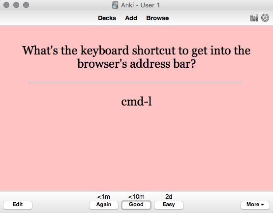
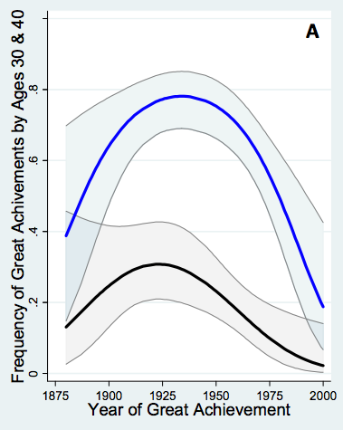
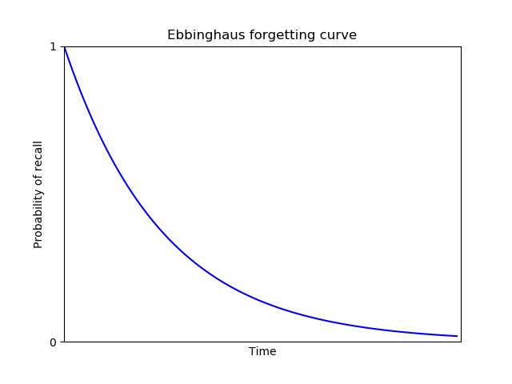
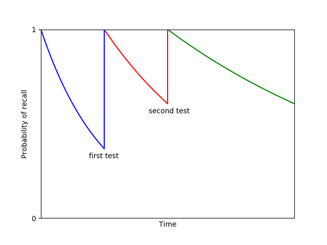

Augmenting Long-term Memory

# Augmenting Long-term Memory

[Michael Nielsen](http://michaelnielsen.org/)   |   [Y Combinator Research](https://ycr.org/)   |   July 2018

   **Related Resources**
 [Michael Nielsen on Twitter](https://twitter.com/michael_nielsen)
 [Michael Nielsen's project announcement mailing list](http://eepurl.com/0Xxjb)
 [cognitivemedium.com](http://cognitivemedium.com/)

* * *

 
By [Michael Nielsen](http://michaelnielsen.org/)

One day in the mid-1920s, a Moscow newspaper reporter named Solomon Shereshevsky entered the laboratory of the psychologist Alexander Luria. Shereshevsky's boss at the newspaper had noticed that Shereshevsky never needed to take any notes, but somehow still remembered all he was told, and had suggested he get his memory checked by an expert.

Luria began testing Shereshevsky's memory. He began with simple tests, short strings of words and of numbers. Shereshevsky remembered these with ease, and so Luria gradually increased the length of the strings. But no matter how long they got, Shereshevsky could recite them back. Fascinated, Luria went on to study Shereshevsky's memory for the next 30 years. In a book summing up his research** Alexander Luria, “The Mind of a Mnemonist”, Harvard University Press (1968)., Luria reported that:

>  [I]t appeared that there was no limit either to the *> capacity*>  of S.'s memory or to the *> durability of the traces he retained*> . Experiments indicated that he had no difficulty reproducing any lengthy series of words whatever, even though these had originally been presented to him a week, a month, a year, or even many years earlier. In fact, some of these experiments designed to test his retention were performed (without his being given any warning) fifteen or sixteen years after the session in which he had originally recalled the words. Yet invariably they were successful.

Such stories are fascinating. Memory is fundamental to our thinking, and the notion of having a perfect memory is seductive. At the same time, many people feel ambivalent about their own memory. I've often heard people say “I don't have a very good memory”, sometimes sheepishly, sometimes apologetically, sometimes even defiantly.

Given how central memory is to our thinking, it's natural to ask whether computers can be used as tools to help improve our memory. This question turns out to be highly generative of good ideas, and pursuing it has led to many of the most important vision documents in the history of computing. One early example was Vannevar Bush's 1945 proposal** Vannevar Bush, [As We May Think](https://www.theatlantic.com/magazine/archive/1945/07/as-we-may-think/303881/), The Atlantic (1945). for a mechanical memory extender, the memex. Bush wrote:

>  A memex is a device in which an individual stores all his books, records, and communications, and which is mechanized so that it may be consulted with exceeding speed and flexibility. It is an enlarged intimate supplement to his memory.

The memex vision inspired many later computer pioneers, including Douglas Engelbart's ideas about the augmentation of human intelligence, Ted Nelson's ideas about hypertext, and, indirectly, Tim Berners-Lee's conception of the world wide web** See, for example: Douglas Engelbart, [Augmenting Human Intellect](http://augmentingcognition.com/assets/Engelbart1962.pdf) (1962); Ted Nelson, [Complex information processing: a file structure for the complex, the changing and the indeterminate](https://dl.acm.org/citation.cfm?id=806036) (1965); and Tim Berners-Lee, [Information Management: a Proposal](https://w3.org/History/1989/proposal.html) (1989).. In his proposal for the web, Berners-Lee describes the need for his employer (the particle physics organization CERN) to develop a collective institutional memory,

>  a pool of information to develop which could grow and evolve with the organization and the projects it describes.

These are just a few of the many attempts to use computers to augment human memory. From the memex to the web to wikis to [org-mode](https://orgmode.org/) to [Project Xanadu](https://en.wikipedia.org/wiki/Project_Xanadu) to attempts to [make a map of every thought a person thinks](https://users.speakeasy.net/~lion/nb/book.pdf): the augmentation of memory has been an extremely generative vision for computing.

In this essay we investigate personal memory systems, that is, systems designed to improve the long-term memory of a single person. In the first part of the essay I describe my personal experience using such a system, named Anki. As we'll see, Anki can be used to remember almost anything. That is, Anki makes memory a *choice*, rather than a haphazard event, to be left to chance. I'll discuss how to use Anki to understand research papers, books, and much else. And I'll describe numerous patterns and anti-patterns for Anki use. While Anki is an extremely simple program, it's possible to develop virtuoso skill using Anki, a skill aimed at understanding complex material in depth, not just memorizing simple facts.

The second part of the essay discusses personal memory systems in general. Many people treat memory ambivalently or even disparagingly as a cognitive skill: for instance, people often talk of “rote memory” as though it's inferior to more advanced kinds of understanding. I'll argue against this point of view, and make a case that memory is central to problem solving and creativity. Also in this second part, we'll discuss the role of cognitive science in building personal memory systems and, more generally, in building systems to augment human cognition. In a future essay, [Toward a Young Lady's Illustrated Primer](http://augmentingcognition.com/taylip.html), I will describe more ideas for personal memory systems.

The essay is unusual in style. It's not a conventional cognitive science paper, i.e., a study of human memory and how it works. Nor is it a computer systems design paper, though prototyping systems is my own main interest. Rather, the essay is a distillation of informal, *ad hoc* observations and rules of thumb about how personal memory systems work. I wanted to understand those as preparation for building systems of my own. As I collected these observations it seemed they may be of interest to others. You can reasonably think of the essay as a how-to guide aimed at helping develop virtuoso skills with personal memory systems. But since writing such a guide wasn't my primary purpose, it may come across as a more-than-you-ever-wanted-to-know guide.

To conclude this introduction, a few words on what the essay won't cover. I will only briefly discuss visualization techniques such as memory palaces and the method of loci. And the essay won't describe the use of pharmaceuticals to improve memory, nor possible future brain-computer interfaces to augment memory. Those all need a separate treatment. But, as we shall see, there are already powerful ideas about personal memory systems based solely on the structuring and presentation of information.

## Part I: How to remember almost anything: the Anki system

I'll begin with an account of my own experience with the personal memory system [Anki](https://apps.ankiweb.net/)** I've no affiliation at all with Anki. Other similar systems include [Mnemosyne](https://mnemosyne-proj.org/) and [SuperMemo](https://supermemo.com/). My limited use suggests Mnemosyne is very similar to Anki. SuperMemo runs only on Windows, and I haven't had an opportunity to use it, though I have been influenced by essays on the [SuperMemo website](https://supermemo.com/).

I won't try to hide my enthusiasm for Anki behind a respectable facade of impartiality: it's a significant part of my life. Still, it has many limitations, and I'll mention some of them through the essay. . The material is, as mentioned above, quite personal, a collection of my own observations and informal rules of thumb. Those rules of thumb may not apply to others; indeed, I may be mistaken about how well they apply to me. It's certainly not a properly controlled study of Anki usage! Still, I believe there is value in collecting such personal experiences, even if they are anecdotal and impressionistic. I am not an expert on the cognitive science of memory, and I'd appreciate corrections to any errors or misconceptions.

At first glance, Anki seems nothing more than a computerized flashcard program. You enter a question:

 
And a corresponding answer:
 

Later you'll be asked to review the card: that is, shown the question, and asked whether you know the answer or not.

What makes Anki better than conventional flashcards is that it manages the review schedule. If you can answer a question correctly, the time interval between reviews gradually expands. So a one-day gap between reviews becomes two days, then six days, then a fortnight, and so on. The idea is that the information is becoming more firmly embedded in your memory, and so requires less frequent review. But if you ever miss an answer, the schedule resets, and you again have to build up the time interval between reviews.

While it's obviously useful that the computer manages the interval between reviews, it perhaps doesn't seem like that big a deal. The punchline is that this turns out to be a far more efficient way to remember information.

How much more efficient?

To answer that question, let's do some rough time estimates. On average, it takes me about 8 seconds to review a card. Suppose I was using conventional flashcards, and reviewing them (say) once a week. If I wanted to remember something for the next 20 years, I'd need 20 years times 52 weeks per year times 8 seconds per card. That works out to a total review time of just over 2 hours for each card.

By contrast, Anki's ever-expanding review intervals quickly rise past a month and then out past a year. Indeed, for my personal set of Anki cards the average interval between reviews is currently 1.2 years, and rising. In an [appendix](http://augmentingcognition.com/ltm.html#Anki_analysis) below I estimate that for an average card, I'll only need 4 to 7 minutes of total review time over the entire 20 years. Those estimates allow for occasional failed reviews, resetting the time interval. That's a factor of more than 20 in savings over the more than 2 hours required with conventional flashcards.

I therefore have two rules of thumb. First, if memorizing a fact seems worth 10 minutes of my time in the future, then I do it** I first saw an analysis along these lines in Gwern Branwen's review of spaced repetition: Gwern Branwen, [Spaced-Repetition](https://www.gwern.net/Spaced-repetition). His numbers are slightly more optimistic than mine – he arrives at a 5-minute rule of thumb, rather than 10 minutes – but broadly consistent. Branwen's analysis is based, in turn, on an analysis in: Piotr Wozniak, [Theoretical aspects of spaced repetition in learning](http://super-memory.com/articles/theory.htm).. Second, and superseding the first, if a fact seems striking then into Anki it goes, regardless of whether it seems worth 10 minutes of my future time or not. The reason for the exception is that many of the most important things we know are things we're not sure are going to be important, but which our intuitions tell us matter. This doesn't mean we should memorize everything. But it's worth cultivating taste in what to memorize.

The single biggest change that Anki brings about is that it means memory is no longer a haphazard event, to be left to chance. Rather, it guarantees I will remember something, with minimal effort. That is, *Anki makes memory a choice*.

What can Anki be used for? I use Anki in all parts of my life. Professionally, I use it to learn from papers and books; to learn from talks and conferences; to help recall interesting things learned in conversation; and to remember key observations made while doing my everyday work. Personally, I use it to remember all kinds of facts relevant to my family and social life; about my city and travel; and about my hobbies. Later in the essay I describe some useful patterns of Anki use, and anti-patterns to avoid.

I've used Anki to create a little over 10,000 cards over about 2 and a half years of regular use. That includes a 7-month break when I made very few new cards. When I'm keeping up with my card review, it takes about 15 to 20 minutes per day. If it routinely rises to much more than 20 minutes it usually means I'm adding cards too rapidly, and need to slow down. Alternately, it sometimes means I'm behind on my card review (which I'll discuss later).

At a practical level, I use the desktop Anki client for entering new cards, and the mobile client** The desktop client is free, but the mobile client is, at the time of writing, 25 dollars. Many people balk at that as “too expensive”. Personally, I've found the value is several orders of magnitude beyond 25 dollars. Mobile Anki is certainly far more valuable to me than a single meal in a moderately priced restaurant. for reviewing. I review my Anki cards while walking to get my morning coffee, while waiting in line, on transit, and so on. Provided my mind is reasonably relaxed to begin with, I find the review experience meditative. If, on the other hand, my mind is not relaxed, I find review more difficult, and Anki can cause my mind to jump around more.

I had trouble getting started with Anki. Several acquaintances highly recommended it (or similar systems), and over the years I made multiple attempts to use it, each time quickly giving up. In retrospect, there are substantial barriers to get over if you want to make it a habit.

What made Anki finally “take” for me, turning it into a habit, was a project I took on as a joke. I'd been frustrated for years at never really learning the Unix command line. I'd only ever learned the most basic commands. Learning the command line is a superpower for people who program, so it seemed highly desirable to know well. So, for fun, I wondered if it might be possible to use Anki to essentially completely memorize a (short) book about the Unix command line.

It was!

I chose O'Reilly Media's “Macintosh Terminal Pocket Guide”, by Daniel Barrett. I don't mean I literally memorized the entire text of the book** I later did an experiment with Charles Dickens' “A Tale of Two Cities”, seeing if it might actually be possible to memorize the entire text. After a few weeks I concluded that it would be possible, but would not be worth the time. So I deleted all the cards. An interesting thing has occurred post-deletion: the first few sentences of the book have gradually decayed in my memory, and I now have no more than fragments. I occasionally wonder what the impact would be of memorizing a good book in its entirety; I wouldn't be surprised if it greatly influenced my own language and writing.. But I did memorize much of the conceptual knowledge in the book, as well as the names, syntax, and options for most of the commands in the book. The exceptions were things I had no frame of reference to imagine using. But I did memorize most things I could imagine using. In the end I covered perhaps 60 to 70 percent of the book, skipping or skimming pieces that didn't seem relevant to me. Still, my knowledge of the command line increased enormously.

Choosing this rather ludicrous, albeit extremely useful, goal gave me a great deal of confidence in Anki. It was exciting, making it obvious that Anki would make it easy to learn things that would formerly have been quite tedious and difficult for me to learn. This confidence, in turn, made it much easier to build an Anki habit. At the same time, the project also helped me learn the Anki interface, and got me to experiment with different ways of posing questions. That is, it helped me build the skills necessary to use Anki well.

### Using Anki to thoroughly read a research paper in an unfamiliar field

I find Anki a great help when reading research papers, particularly in fields outside my expertise. As an example of how this can work, I'll describe my experience reading a 2016 paper** David Silver, Aja Huang, Chris J. Maddison, Arthur Guez *et al*, [Mastering the game of Go with deep neural networks and tree search](http://augmentingcognition.com/assets/Silver2016a.pdf), Nature (2016). describing AlphaGo, the computer system from Google DeepMind that beat some of the world's strongest players of the game Go.

After the match where AlphaGo beat Lee Sedol, one of the strongest human Go players in history, I suggested to [Quanta Magazine](https://www.quantamagazine.org/) that I write an article about the system** Michael Nielsen, [Is AlphaGo Really Such a Big Deal?](https://www.quantamagazine.org/is-alphago-really-such-a-big-deal-20160329/), Quanta (2016).. AlphaGo was a hot media topic at the time, and the most common angle in stories was human interest, viewing AlphaGo as part of a long-standing human-versus-machine narrative, with a few technical details filled in, mostly as color.

I wanted to take a different angle. Through the 1990s and first decade of the 2000s, I believed human-or-better general artificial intelligence was far, far away. The reason was that over that time researchers made only slow progress building systems to do intuitive pattern matching, of the kind that underlies human sight and hearing, as well as in playing games such as Go. Despite enormous effort by AI researchers, many pattern-matching feats which humans find effortless remained impossible for machines.

While we made only very slow progress on this set of problems for a long time, around 2011 progress began to speed up, driven by advances in deep neural networks. For instance, machine vision systems rapidly went from being terrible to being comparable to human beings for certain limited tasks. By the time AlphaGo was released, it was no longer correct to say we had no idea how to build computer systems to do intuitive pattern matching. While we hadn't yet nailed the problem, we were making rapid progress. AlphaGo was a big part of that story, and I wanted my article to explore this notion of building computer systems to capture human intuition.

While I was excited, writing such an article was going to be difficult. It was going to require a deeper understanding of the technical details of AlphaGo than a typical journalistic article. Fortunately, I knew a fair amount about neural networks – I'd written a book about them** Michael A. Nielsen, ["Neural Networks and Deep Learning"](http://neuralnetworksanddeeplearning.com/), Determination Press (2015).. But I knew nothing about the game of Go, or about many of the ideas used by AlphaGo, based on a field known as reinforcement learning. I was going to need to learn this material from scratch, and to write a good article I was going to need to really understand the underlying technical material.

Here's how I went about it.

I began with the AlphaGo [paper](http://augmentingcognition.com/assets/Silver2016a.pdf) itself. I began reading it quickly, almost skimming. I wasn't looking for a comprehensive understanding. Rather, I was doing two things. One, I was trying to simply identify the most important ideas in the paper. What were the names of the key techniques I'd need to learn about? Second, there was a kind of hoovering process, looking for basic facts that I could understand easily, and that would obviously benefit me. Things like basic terminology, the rules of Go, and so on.

Here's a few examples of the kind of question I entered into Anki at this stage: “What's the size of a Go board?”; “Who plays first in Go?”; “How many human game positions did AlphaGo learn from?”; “Where did AlphaGo get its training data?”; “What were the names of the two main types of neural network AlphaGo used?”

As you can see, these are all elementary questions. They're the kind of thing that are very easily picked up during an initial pass over the paper, with occasional digressions to search Google and Wikipedia, and so on. Furthermore, while these facts were easy to pick up in isolation, they also seemed likely to be useful in building a deeper understanding of other material in the paper.

I made several rapid passes over the paper in this way, each time getting deeper and deeper. At this stage I wasn't trying to obtain anything like a complete understanding of AlphaGo. Rather, I was trying to build up my background understanding. At all times, if something wasn't easy to understand, I didn't worry about it, I just keep going. But as I made repeat passes, the range of things that were easy to understand grew and grew. I found myself adding questions about the types of features used as inputs to AlphaGo's neural networks, basic facts about the structure of the networks, and so on.

After five or six such passes over the paper, I went back and attempted a thorough read. This time the purpose was to understand AlphaGo in detail. By now I understood much of the background context, and it was relatively easy to do a thorough read, certainly far easier than coming into the paper cold. Don't get me wrong: it was still challenging. But it was far easier than it would have been otherwise.

After doing one thorough pass over the AlphaGo paper, I made a second thorough pass, in a similar vein. Yet more fell into place. By this time, I understood the AlphaGo system reasonably well. Many of the questions I was putting into Anki were high level, sometimes on the verge of original research directions. I certainly understood AlphaGo well enough that I was confident I could write the sections of my article dealing with it. (In practice, my article ranged over several systems, not just AlphaGo, and I had to learn about those as well, using a similar process, though I didn't go as deep.) I continued to add questions as I wrote my article, ending up adding several hundred questions in total. But by this point the hardest work had been done.

Of course, instead of using Anki I could have taken conventional notes, using a similar process to build up an understanding of the paper. But using Anki gave me confidence I would retain much of the understanding over the long term. A year or so later DeepMind released papers describing followup systems, known as AlphaGo Zero and AlphaZero** For AlphaGo Zero, see: David Silver, Julian Schrittwieser, Karen Simonyan, Ioannis Antonoglou *et al*, [Mastering the game of Go without human knowledge](http://augmentingcognition.com/assets/Silver2017a.pdf), Nature (2017). For AlphaZero, see: David Silver, Thomas Hubert, Julian Schrittwieser, Ioannis Antonoglou *et al*, [Mastering Chess and Shogi by Self-Play with a General Reinforcement Learning Algorithm](https://arxiv.org/abs/1712.01815) (2017).. Despite the fact that I'd thought little about AlphaGo or reinforcement learning in the intervening time, I found I could read those followup papers with ease. While I didn't attempt to understand those papers as thoroughly as the initial AlphaGo paper, I found I could get a pretty good understanding of the papers in less than an hour. I'd retained much of my earlier understanding!

By contrast, had I used conventional note-taking in my original reading of the AlphaGo paper, my understanding would have more rapidly evaporated, and it would have taken longer to read the later papers. And so using Anki in this way gives confidence you will retain understanding over the long term. This confidence, in turn, makes the initial act of understanding more pleasurable, since you believe you're learning something for the long haul, not something you'll forget in a day or a week.

 OK, but what does one do with it? … [N]ow that I have all this power – a mechanical golem that will never forget and never let me forget whatever I chose to – what do I choose to remember? – [Gwern Branwen](https://www.gwern.net/Spaced-repetition)

This entire process took a few days of my time, spread over a few weeks. That's a lot of work. However, the payoff was that I got a pretty good basic grounding in modern deep reinforcement learning. This is an immensely important field, of great use in robotics, and many researchers believe it will play an important role in achieving general artificial intelligence. With a few days work I'd gone from knowing nothing about deep reinforcement learning to a durable understanding of a key paper in the field, a paper that made use of many techniques that were used across the entire field. Of course, I was still a long way from being an expert. There were many important details about AlphaGo I hadn't understood, and I would have had to do far more work to build my own system in the area. But this foundational kind of understanding is a good basis on which to build deeper expertise.

It's notable that I was reading the AlphaGo paper in support of a creative project of my own, namely, writing an article for Quanta Magazine. This is important: I find Anki works much better when used in service to some personal creative project.

It's tempting instead to use Anki to stockpile knowledge against some future day, to think “Oh, I should learn about the geography of Africa, or learn about World War II, or […]”. These are goals which, for me, are intellectually appealing, but which I'm not emotionally invested in. I've tried this a bunch of times. It tends to generate cold and lifeless Anki questions, questions which I find hard to connect to upon later review, and where it's difficult to really, deeply internalize the answers. The problem is somehow in that initial idea I “should” learn about these things: intellectually, it seems like a good idea, but I've little emotional commitment.

 Study hard what interests you the most in the most undisciplined, irreverent and original manner possible. – Richard Feynman

By contrast, when I'm reading in support of some creative project, I ask much better Anki questions. I find it easier to connect to the questions and answers emotionally. I simply care more about them, and that makes a difference. So while it's tempting to use Anki cards to study in preparation for some (possibly hypothetical) future use, it's better to find a way to use Anki as part of some creative project.

### Using Anki to do shallow reads of papers

Most of my Anki-based reading is much shallower than my read of the AlphaGo paper. Rather than spending days on a paper, I'll typically spend 10 to 60 minutes, sometimes longer for very good papers. Here's a few notes on some patterns I've found useful in shallow reading.

As mentioned above, I'm usually doing such reading as part of the background research for some project. I will find a new article (or set of articles), and typically spend a few minutes assessing it. Does the article seem likely to contain substantial insight or provocation relevant to my project – new questions, new ideas, new methods, new results? If so, I'll have a read.

This doesn't mean reading every word in the paper. Rather, I'll add to Anki questions about the core claims, core questions, and core ideas of the paper. It's particularly helpful to extract Anki questions from the abstract, introduction, conclusion, figures, and figure captions. Typically I will extract anywhere from 5 to 20 Anki questions from the paper. It's usually a bad idea to extract fewer than 5 questions – doing so tends to leave the paper as a kind of isolated orphan in my memory. Later I find it difficult to feel much connection to those questions. Put another way: if a paper is so uninteresting that it's not possible to add 5 good questions about it, it's usually better to add no questions at all.

One failure mode of this process is if you Ankify** I.e., enter into Anki. Also useful are forms such as Ankification *etc*. misleading work. Many papers contain wrong or misleading statements, and if you commit such items to memory, you're actively making yourself stupider.

How to avoid Ankifying misleading work?

As an example, let me describe how I Ankified a paper I recently read, by the economists Benjamin Jones and Bruce Weinberg** Benjamin F. Jones and Bruce A. Weinberg, [Age Dynamics in Scientific Creativity](http://augmentingcognition.com/assets/Jones2011a.pdf), Proceedings of the National Academy of Sciences (2011).. The paper studies the ages at which scientists make their greatest discoveries.

I should say at the outset: I have no reason to think this paper is misleading! But it's also worth being cautious. As an example of that caution, one of the questions I added to Anki was: “What does Jones 2011 claim is the average age at which physics Nobelists made their prizewinning discovery, over 1980-2011?” (Answer: 48). Another variant question was: “Which paper claimed that physics Nobelists made their prizewinning discovery at average age 48, over the period 1980-2011?” (Answer: Jones 2011). And so on.

Such questions qualify the underlying claim: we now know it was a claim made in Jones 2011, and that we're relying on the quality of Jones and Weinberg's data analysis. In fact, I haven't examined that analysis carefully enough to regard it as a fact that the average age of those Nobelists is 48. But it is certainly a fact that their paper claimed it was 48. Those are different things, and the latter is better to Ankify.

If I'm particularly concerned about the quality of the analysis, I may add one or more questions about what makes such work difficult, e.g.: “What's one challenge in determining the age of Nobel winners at the time of their discovery, as discussed in Jones 2011?” Good answers include: the difficulty of figuring out which paper contained the Nobel-winning work; the fact that publication of papers is sometimes delayed by years; that sometimes work is spread over multiple papers; and so on. Thinking about such challenges reminds me that if Jones and Weinberg were sloppy, or simply made an understandable mistake, their numbers might be off. Now, it so happens that for this particular paper, I'm not too worried about such issues. And so I didn't Ankify any such question. But it's worth being careful in framing questions so you're not misleading yourself.

Another useful pattern while reading papers is Ankifying figures. For instance, here's a graph from Jones 2011 showing the probability a physicist made their prizewinning discovery by age 40 (blue line) and by age 30 (black line):

 

I have an Anki question which simply says: “Visualize the graph Jones 2011 made of the probability curves for physicists making their prizewinning discoveries by age 30 and 40”. The answer is the image shown above, and I count myself as successful if my mental image is roughly along those lines. I could deepen my engagement with the graph by adding questions such as: “In Jones 2011's graph of physics prizewinning discoveries, what is the peak probability of great achievement by age 40 [i.e., the highest point in the blue line in the graph above]?” (Answer: about 0.8.) Indeed, one could easily add dozens of interesting questions about this graph. I haven't done that, because of the time commitment associated to such questions. But I do find the broad shape of the graph fascinating, and it's also useful to know the graph exists, and where to consult it if I want more details.

I said above that I typically spend 10 to 60 minutes Ankifying a paper, with the duration depending on my judgment of the value I'm getting from the paper. However, if I'm learning a great deal, and finding it interesting, I keep reading and Ankifying. Really good resources are worth investing time in. But most papers don't fit this pattern, and you quickly saturate. If you feel you could easily find something more rewarding to read, switch over. It's worth deliberately practicing such switches, to avoid building a counter-productive habit of completionism in your reading. It's nearly always possible to read deeper into a paper, but that doesn't mean you can't easily be getting more value elsewhere. It's a failure mode to spend too long reading unimportant papers.

### Syntopic reading using Anki

I've talked about how to use Anki to do shallow reads of papers, and rather deeper reads of papers. There's also a sense in which it's possible to use Anki not just to read papers, but to “read” the entire research literature of some field or subfield. Here's how to do it.

You might suppose the foundation would be a shallow read of a large number of papers. In fact, to really grok an unfamiliar field, you need to engage deeply with key papers – papers like the AlphaGo paper. What you get from deep engagement with important papers is more significant than any single fact or technique: you get a sense for what a powerful result in the field looks like. It helps you imbibe the healthiest norms and standards of the field. It helps you internalize how to ask good questions in the field, and how to put techniques together. You begin to understand what made something like AlphaGo a breakthrough – and also its limitations, and the sense in which it was really a natural evolution of the field. Such things aren't captured individually by any single Anki question. But they begin to be captured collectively by the questions one asks when engaged deeply enough with key papers.

So, to get a picture of an entire field, I usually begin with a truly important paper, ideally a paper establishing a result that got me interested in the field in the first place. I do a thorough read of that paper, along the lines of what I described for AlphaGo. Later, I do thorough reads of other key papers in the field – ideally, I read the best 5-10 papers in the field. But, interspersed, I also do shallower reads of a much larger number of less important (though still good) papers. In my experimentation so far that means tens of papers, though I expect in some fields I will eventually read hundreds or even thousands of papers in this way.

You may wonder why I don't just focus on only the most important papers. Part of the reason is mundane: it can be hard to tell what the most important papers are. Shallow reads of many papers can help you figure out what the key papers are, without spending too much time doing deeper reads of papers that turn out not to be so important. But there's also a culture that one imbibes reading the bread-and-butter papers of a field: a sense for what routine progress looks like, for the praxis of the field. That's valuable too, especially for building up an overall picture of where the field is at, and to stimulate questions on my own part. Indeed, while I don't recommend spending a large fraction of your time reading bad papers, it's certainly possible to have a good conversation with a bad paper. Stimulus is found in unexpected places.

Over time, this is a form of what Mortimer Adler and Charles van Doren dubbed *syntopic reading*** In their marvelous “How to Read a Book”: Mortimer J. Adler and Charles van Doren, “How to Read a Book: The Classic Guide to Intelligent Reading” (1972). I build up an understanding of an entire literature: what's been done, what's not yet been done. Of course, it's not literally reading an entire literature. But functionally it's close. I start to identify open problems, questions that I'd personally like answered, but which don't yet seem to have been answered. I identify tricks, observations that seem pregnant with possibility, but whose import I don't yet know. And, sometimes, I identify what seem to me to be field-wide blind spots. I add questions about all these to Anki as well. In this way, Anki is a medium supporting my creative research. It has some shortcomings as such a medium, since it's not designed with supporting creative work in mind – it's not, for instance, equipped for lengthy, free-form exploration inside a scratch space. But even without being designed in such a way, it's helpful as a creative support.

I've been describing how I use Anki to learn fields which are largely new to me. By contrast, with a field I already know well, my curiosity and my model of the field are often already so strong that it's easy to integrate new facts. I still find Anki useful, but it's definitely most useful in new areas. The great English mathematician John Edensor Littlewood wrote** In “Littlewood's miscellany”, edited by Béla Bollobás (1986).:

>  I have tried to learn mathematics outside my fields of interest; after any interval I had to begin all over again.

This captures something of the immense emotional effort I used to find required to learn a new field. Without a lot of drive, it was extremely difficult to make a lot of material in a new field stick. Anki does much to solve that problem. In a sense, it's an emotional prosthetic, actually helping create the drive I need to achieve understanding. It doesn't do the entire job – as mentioned earlier, it's very helpful to have other commitments (like a creative project, or people depending on me) to help create that drive. Nonetheless, Anki helps give me confidence that I can simply *decide* I'm going to read deeply into a new field, and retain and make sense of much of what I learn. This has worked for all areas of conceptual understanding where I've tried it** I'm curious how well it could be used for motor skills and problem solving, two areas where I haven't tried using Anki..

One surprising consequence of reading in this way is how much more enjoyable it becomes. I've always enjoyed reading, but starting out in a challenging new field was sometimes a real slog, and I was often bedeviled by doubts that I would ever really get into the field. That doubt, in turn, made it less likely that I would succeed. Now I have confidence that I can go into a new field and quickly attain a good, relatively deep understanding, an understanding that will be durable. That confidence makes reading even more pleasurable** Many people have written accounts of how to read using personal memory systems. My thinking was particularly stimulated by: Piotr Wozniak, [Incremental Reading](https://www.supermemo.com/help/read.htm)..

### More patterns of Anki use

Having looked at the use of Anki for reading technical papers, let's return to general patterns of use** Another useful list of patterns is: Piotr Wozniak, [Effective learning: Twenty rules of formulating knowledge](https://www.supermemo.com/en/articles/20rules).. There's a lot in this section, and upon a first read you may wish to skim through and concentrate on those items which most catch your eye.

**Make most Anki questions and answers as atomic as possible:** That is, both the question and answer express just one idea. As an example, when I was learning the Unix command line, I entered the question: “How to create a soft link from `linkname`to `filename`?” The answer was: “`ln -s filename 	  linkname`”. Unfortunately, I routinely got this question wrong.

The solution was to refactor the question by breaking it into two pieces. One piece was: “What's the basic command and option to create a Unix soft link?” Answer: “`ln -s …`”. And the second piece was: “When creating a Unix soft link, in what order do `linkname` and `filename` go?” Answer: “`filename 	linkname`”.

Breaking this question into more atomic pieces turned a question I routinely got wrong into two questions I routinely got right** An even more atomic version would be to break the first question into “What's the Unix command to create a link?” and “What's the option to the `ln` command to create a soft link?” In practice, I've known for years that `ln` is the command to create a link, and so this wasn't necessary.. Most of all: when I wanted to create a Unix soft link in practice, I knew how to do it.

I'm not sure what's responsible for this effect. I suspect it's partly about focus. When I made mistakes with the combined question, I was often a little fuzzy about where exactly my mistake was. That meant I didn't focus sharply enough on the mistake, and so didn't learn as much from my failure. When I fail with the atomic questions my mind knows exactly where to focus.

In general, I find that you often get substantial benefit from breaking Anki questions down to be more atomic. It's a powerful pattern for question refactoring.

Note that this doesn't mean you shouldn't also retain some version of the original question. I still want to know how to create a soft link in Unix, and so it's worth keeping the original question in Anki. But it becomes an integrative question, part of a hierarchy of questions building up from simple atomic facts to more complex ideas.

Incidentally, just because a question is atomic doesn't mean it can't involve quite complex, high-level concepts. Consider the following question, from the field of general relativity: “What is the *dr2* term in the Robertson-Walker metric?” Answer: *dr2/(1-kr^2)*. Now, unless you've studied general relativity that question probably seems quite opaque. It's a sophisticated, integrative question, assuming you know what the Robertson-Walker metric is, what *dr2* means, what *k* means, and so on. But conditional on that background knowledge, it's quite an atomic question and answer.

One benefit of using Anki in this way is that you begin to habitually break things down into atomic questions. This sharply crystallizes the distinct things you've learned. Personally, I find that crystallization satisfying, for reasons I (ironically) find difficult to articulate. But one real benefit is that later I often find those atomic ideas can be put together in ways I didn't initially anticipate. And that's well worth the trouble.

**Anki use is best thought of as a virtuoso skill, to be developed:** Anki is an extremely simple program: it lets you enter text or other media, and then shows you that media on a schedule determined by your responses. Despite that simplicity, it's an incredibly powerful tool. And, like many tools, it requires skill to use well. It's worth thinking of Anki as a skill that can be developed to virtuoso levels, and attempting to continue to level up toward such virtuosity.

**Anki isn't just a tool for memorizing simple facts. It's a tool for understanding almost anything.** It's a common misconception that Anki is just for memorizing simple raw facts, things like vocabulary items and basic definitions. But as we've seen, it's possible to use Anki for much more advanced types of understanding. My questions about AlphaGo began with simple questions such as “How large is a Go board?”, and ended with high-level conceptual questions about the design of the AlphaGo systems – on subjects such as how AlphaGo avoided over-generalizing from training data, the limitations of convolutional neural networks, and so on.

Part of developing Anki as a virtuoso skill is cultivating the ability to use it for types of understanding beyond basic facts. Indeed, many of the observations I've made (and will make, below) about how to use Anki are really about what it means to understand something. Break things up into atomic facts. Build rich hierarchies of interconnections and integrative questions. Don't put in orphan questions. Patterns for how to engage with reading material. Patterns (and anti-patterns) for question types. Patterns for the kinds of things you'd like to memorize. Anki skills concretely instantiate your theory of how you understand; developing those skills will help you understand better. It's too strong to say that to be a virtuoso Anki user is to be a virtuoso in understanding. But there's some truth to it.

 **Use one big deck:** Anki allows you to organize cards into decks and subdecks. Some people use this to create a complicated organizational structure. I used to do this, but I've gradually** It's gradual because questions sometimes need to be rewritten due to the changed context. For instance, both my Emacs and Unix command line decks had very similar questions, along the lines of: “How to delete a word?” Those questions need to be rewritten, e.g. as: “In Emacs, how to delete a word?” (This, by the way, may seem a strange question for a long-time Emacs user such as myself. In fact, I've used Anki to help me change the way I delete words in Emacs, which is why I have an Anki question on the subject. I have made many improvements to my Emacs workflow this way.) merged my decks and subdecks into one big deck. The world isn't divided up into neatly separated components, and I believe it's good to collide very different types of questions. One moment Anki is asking me a question about the temperature chicken should be cooked to. The next: a question about the JavaScript API. Is this mixing doing me any real good? I'm not sure. I have not, as yet, found any reason to use JavaScript to control the cooking of a chicken. But I don't think this mixing does any harm, and hope it is creatively stimulating, and helps me apply my knowledge in unusual contexts.

 **Avoid orphan questions:** Suppose I'm reading online and stumble across a great article about the grooming habits of the Albanian giant mongoose, a subject I never previously knew I was interested in, but which turns out to be fascinating. Pretty soon I've Ankified 5 to 10 questions. That's great, but my experience suggests that in a few months I'll likely find those questions rather stale, and frequently get them wrong. I believe the reason is that those questions are too disconnected from my other interests, and I will have lost the context that made me interested.

I call these *orphan questions*, because they're not closely related to anything else in my memory. It's not bad to have a few orphan questions in Anki – it can be difficult to know what will turn out to be of only passing interest, and what will grow into a substantial interest, connected to my other interests. But if a substantial minority of your questions are orphans, that's a sign you should concentrate more on Ankifying questions related to your main creative projects, and cut down on Ankifying tangential material.

It's particularly worth avoiding lonely orphans: single questions that are largely disconnected from everything else. Suppose, for instance, I'm reading an article on a new subject, and I learn an idea that seems particularly useful. I make it a rule to never put in one question. Rather, I try to put at least two questions in, preferably three or more. That's usually enough that it's at least the nucleus of a bit of useful knowledge. If it's a lonely orphan, inevitably I get the question wrong all the time, and it's a waste to have entered it at all.

 **Don't share decks:** I'm often asked whether I'd be willing to share my Anki decks. I'm not. Very early on I realized it would be very useful to put personal information in Anki. I don't mean anything terribly personal – I'd never put deep, dark secrets in there. Nor do I put anything requiring security, like passwords. But I do put some things I wouldn't sling about casually.

As an example, I've a (very short!) list of superficially charming and impressive colleagues who I would never work with, because I've consistently seen them treat other people badly. It's helpful to Ankify some details of that treatment, so I can clearly remember why that person should be avoided. This isn't the kind of information that is right to spread casually: I may have misinterpreted the other person's actions, or have misunderstood the context they were operating in. But it's personally useful for me to have in Anki.

 **Construct your own decks:** The Anki site has [many shared decks](https://ankiweb.net/shared/decks/), but I've found only a little use for them. The most important reason is that making Anki cards is an act of understanding in itself. That is, figuring out good questions to ask, and good answers, is part of what it means to understand a new subject well. To use someone else's cards is to forgo much of that understanding.

Indeed, I believe the act of constructing the cards actually helps with memory. Memory researchers have repeatedly found that the more elaborately you encode a memory, the stronger the memory will be. By elaborative encoding, they mean essentially the richness of the associations you form.

For instance, it's possible to try to remember as an isolated fact that 1962 was the year the first telecommunications satellite, Telstar, was put into orbit. But a better way of remembering it is to relate that fact to others. Relatively prosaically, you might observe that Telstar was launched just 5 years after the first Soviet satellite, Sputnik. It didn't take long to put space to use for telecommunications. Less prosaically – a richer elaboration – I personally find it fascinating that Telstar was put into orbit the year *before* the introduction of ASCII, arguably the first modern digital standard for communicating text. Humanity had a telecommunications satellite before we had a digital standard for communicating text! Finding that kind of connection is an example of an elaborative encoding.

The act of constructing an Anki card is itself nearly always a form of elaborative encoding. It forces you to think through alternate forms of the question, to consider the best possible answers, and so on. I believe this is true for even the most elementary cards. And it certainly becomes true if you construct more complex cards, cards relating the basic fact to be remembered to other ideas (like the Telstar-ASCII link), gradually building up a web of richly interrelated ideas.

With that said, there are some valuable deck-sharing practices. For instance, there are communities of medical students who find value in sharing and sometimes collaboratively constructing decks** See the [MedicalSchoolAnki subreddit](https://www.reddit.com/r/medicalschoolanki/), which contains frequent discussion of the best decks, how to use them, as well as an ever-changing canon of best decks to use for different purposes. See also the paper: Michael Hart-Matyas *et al*, [Twelve tips for medical students to establish a collaborative flashcard project](http://augmentingcognition.com/assets/Hart-Matyas2018.pdf), Medical Teacher (2018).. I've also found value in shared decks containing very elementary questions, such as [art decks](https://ankiweb.net/shared/info/685421036) which ask questions such as who painted a particular painting. But for deeper kinds of understanding, I've not yet found good ways of using shared decks.

**Cultivate strategies for elaborative encoding / forming rich associations:** This is really a meta-strategy, i.e., a strategy for forming strategies. One simple example strategy is to *use multiple variants of the “same” question*. For instance, I mentioned earlier my two questions: “What does Jones 2011 claim is the average age at which physics Nobelists made their prizewinning discovery, over 1980-2011?” And: “Which paper claimed that physics Nobelists made their prizewinning discovery at average age 48, over the period 1980-2011?” Logically, these two questions are obviously closely related. But in terms of how memory works, they are different, causing associations on very different triggers.

**What about memory palaces and similar techniques?** There is a well-known set of memory techniques based around ideas such as memory palaces, the method of loci, and others** An entertaining and informative overview is: Joshua Foer, “Moonwalking with Einstein” (2011).. This is an extreme form of elaborative encoding, making rich visual and spatial associations to the material you want to remember. Here's Joshua Foer recounting a conversation where mnemonist Ed Cooke describes one basic technique:

> Ed then explained to me his procedure for making a name memorable, which he had used in the competition to memorize the first and last names associated with ninety-nine different photographic head shots in the names-and-faces event. It was a technique he promised I could use to remember people's names at parties and meetings. “The trick is actually deceptively simple,” he said. “It is always to associate the sound of a person's name with something you can clearly imagine. It's all about creating a vivid image in your mind that anchors your visual memory of the person's face to a visual memory connected to the person's name. When you need to reach back and remember the person's name at some later date, the image you created will simply pop back into your mind… So, hmm, you said your name was Josh Foer, eh?” He raised an eyebrow and gave his chin a melodramatic stroke. “Well, I'd imagine you joshing me where we first met, outside the competition hall, and I'd imagine myself breaking into four pieces in response. Four/Foer, get it? That little image is more entertaining—to me, at least—than your mere name, and should stick nicely in the mind.”

I've experimented with these techniques, and while they're fun, they seem most useful for memorizing trivia – sequences of playing cards, strings of digits, and so on. They seem less well developed for more abstract concepts, and such abstractions are often where the deepest understanding lies. In that sense, they may even distract from understanding. That said, it's possible I simply need to figure out better ways of using these ideas, much as I needed to figure out Anki. In particular, it may be worth further investigating some of the techniques used by practitioners to form rich associations. As Foer says, quoting a memory expert, there is great value in learning to “think in more memorable ways”.

 **95% of Anki's value comes from 5% of the features:** Anki has ways of auto-generating cards, of tagging cards, a plugin ecosystem, and much else. In practice, I rarely use any of these features. My cards are always one of two types: the majority are simple question and answer; a substantial minority are what's called a *cloze*: a kind of fill-in-the-blanks test. For instance, I'll use clozes to test myself on favorite quotes:

>  “if the personal computer is truly a __ then the use of it would actually change the __ of an __", __, __” (Answer: new medium, thought patterns, entire civilization, Alan Kay, 1989).

Clozes can also be used to pose questions not involving quotes:

>  The Adelson illusion is also known as the ___ illusion. (Answer: checker-shadow)

Why not use more of Anki's features? Part of the reason is that I get an enormous benefit from just the core features. Furthermore, learning to use this tiny set of features well has required a lot of work. A basketball and hoop are simple pieces of equipment, but you can spend a lifetime learning to use them well. Similarly, basic Anki practice can be developed enormously. And so I've concentrated on learning to use those basic features well.

I know many people who try Anki out, and then go down a rabbit hole learning as many features as possible so they can use it “efficiently”. Usually, they're chasing 1% improvements. Often, those people ultimately give up Anki as “too difficult”, which is often a synonym for “I got nervous I wasn't using it perfectly”. This is a pity. As discussed earlier, Anki offers something like a 20-fold improvement over (say) ordinary flashcards. And so they're giving up a 2,000% improvement because they were worried they were missing a few final 5%, 1% and (in many cases) 0.1% improvements. This kind of rabbit hole seems to be especially attractive to programmers.

For this reason, when someone is getting started I advise not using any advanced features, and not installing any plugins. Don't, in short, come down with a bad case of programmer's efficiency disease. Learn how to use Anki for basic question and answer, and concentrate on exploring new patterns within that paradigm. That'll serve you far better than any number of hours spent fiddling around with the features. Then, if you build a regular habit of high-quality Anki use, you can experiment with more advanced features.

 **The challenges of using Anki to store facts about friends and family:** I've experimented with using Anki to store (non-sensitive!) questions about friends and family. It works well for things like “Is [my friend] a vegan?” But my use has run somewhat aground on thornier questions. For instance, suppose I talk with a new friend about their kids, but have never met those kids. I could put in questions like “What is the name of [my friend's] eldest child?” Or, if we'd chatted about music, I might put in: “What is a musician [my friend] likes?”

This kind of experiment is well intentioned. But posing such questions often leaves me feeling uncomfortable. It seems too much like faking interest in my friends. There's a pretty strong social norm that if you remember your friends' taste in music or their kids' names, it's because you're interested in that friend. Using a memory aid feels somehow ungenuine, at least to me.

I've talked with several friends about this. Most have told me the same thing: they appreciate me going to so much trouble in the first place, and find it charming that I'd worry so much about whether it was ungenuine. So perhaps it's a mistake to worry. Nonetheless, I still have trouble with it. I have adopted Anki for less personal stuff – things like people's food preferences. And maybe over time I'll use it for storing more personal facts. But for now I'm taking it slow.

 **Procedural versus declarative memory:** There's a big difference between remembering a fact and mastering a process. For instance, while you might remember a Unix command when cued by an Anki question, that doesn't mean you'll recognize an opportunity to use the command in the context of the command line, and be comfortable typing it out. And it's still another thing to find novel, creative ways of combining the commands you know, in order to solve challenging problems.

Put another way: to really internalize a process, it's not enough just to review Anki cards. You need to carry out the process, in context. And you need to solve real problems with it.

With that said, I've found the transfer process relatively easy. In the case of the command line, I use it often enough that I have plenty of opportunities to make real use of my Ankified knowledge of the command line. Over time, that declarative knowledge is becoming procedural knowledge I routinely use in context. That said, it'd be good to better understand when the transfer works and when it doesn't. Even better would be a memory system that integrates into my actual working environment. For instance, it could query me on Unix commands, while placing me at an actual command line. Or perhaps it would ask me to solve higher-level problems, while at the command line.

I've tried one experiment in this vein: miming the action of typing commands while I review my Anki cards. But my subjective impression was that it doesn't work so well, and it was also quite annoying to do. So I stopped.

 **Getting past “names don't matter”:** I'm a theoretical physicist by training. There is a famous story in physics, told by Richard Feynman, dismissing the value of knowing the names of things. As a child, Feynman was out playing in a field with a know-it-all kid. Here's what happened, in Feynman's telling** Richard P. Feynman, “What Do You Care What Other People Think? Further Adventures of a Curious Character” (1989).:

> One kid says to me, “See that bird? What kind of bird is that?”

> I said, “I haven't the slightest idea what kind of a bird it is.”

> He says, “It'a brown-throated thrush. Your father doesn't teach you anything!”

> But it was the opposite. He [Feynman's father] had already taught me: “See that bird?” he says. “It's a Spencer's warbler.” (I knew he didn't know the real name.) “Well, in Italian, it's a *> Chutto Lapittida*> . In Portuguese, it's a *> Bom da Peida*> … You can know the name of that bird in all the languages of the world, but when you're finished, you'll know absolutely nothing whatever about the bird! You'll only know about humans in different places, and what they call the bird. So let's look at the bird and see what it's *> doing*>  — that's what counts.” (I learned very early the difference between knowing the name of something and knowing something.)

Feynman (or his father) goes on to a thoughtful discussion of real knowledge: observing behavior, understanding the reasons for it, and so on.

It's a good story. But it goes too far: names do matter. Maybe not as much as the know-it-all kid thought, and they're not usually a deep kind of knowledge. But they're the foundation that allows you to build up a network of knowledge.

This trope that names don't matter was repeatedly drilled into me during my scientific training. When I began using Anki, at first I felt somewhat silly putting questions about names for things into the system. But now I do it enthusiastically, knowing that it's an early step along the way to understanding.

Anki is useful for names of all kinds of things, but I find it particularly helpful for non-verbal things. For instance, I put in questions about artworks, like: “What does the artist [Emily Hare's](https://www.emilyhare.co.uk/) painting *Howl* look like?” Answer:

 

I put that question in for two reasons. The main reason is that I like to remember the experience of the painting from time to time. And the other is to put a name to the painting** Actually, a better question for that is to be shown the painting and asked what its name is.. If I wanted to think more analytically about the painting – say, about the clever use of color gradients – I could add more detailed questions. But I'm pretty happy just committing the experience of the image to memory.

 **What do you do when you get behind?** Anki becomes challenging when you get behind with cards. If you skip a day or two – or fifty – the cards begin to back up. It's intimidating to come back to find you have 500 cards to review in a day. Even worse, if you fall out of the Anki habit, you can get a very long way behind. I largely stopped using Anki for a 7-month period, and came back to thousands of backlogged cards.

Fortunately, it wasn't that hard to catch up. I set myself gradually increasing quotas (100, 150, 200, 250, and eventually 300) of cards per day, and worked through those quotas each day for several weeks until I'd caught up.

While this wasn't too difficult, it was somewhat demoralizing and discouraging. It'd be better if Anki had a “catch up” feature that would spread the excess cards over the next few weeks in your schedule. But it doesn't. In any case, this is a gotcha, but it's not too difficult to address.

**Using Anki for APIs, books, videos, seminars, conversations, the web, events, and places:** Nearly everything I said earlier about Ankifying papers applies also to other resources. Here's a few tips. I've separated out the discussion for APIs into an appendix, which you can [read below](http://augmentingcognition.com/ltm.html#Anki_APIs), if interested.

For seminars and conversations with colleagues I find it surprisingly helpful to set Anki quotas. For instance, for seminars I try to find at least three high-quality questions to Ankify. For extended conversations, at least one high-quality question to Ankify. I've found that setting quotas helps me pay more attention, especially during seminars. (I find it much easier *a priori* to pay attention in one-on-one conversation.)

I'm more haphazard about videos, events, and places. It'd be good to, say, systematically Ankify 3-5 questions after going on an outing or to a new restaurant, to help me remember the experience. I do this sometimes. But I haven't been that systematic.

I tend to Ankify in real time as I read papers and books. For seminars, conversations, and so on I prefer to immerse myself in the experience. Instead of getting out Anki, I will quickly make a mental (or paper) note of what I want to Ankify. I then enter it into Anki later. This requires some discipline; it's one reason I prefer to set a small quota, so that I merely have to enter a few questions later, rather than dozens.

One caution is with books: reading an entire book is a big commitment, and adding Anki questions regularly can slow you down a lot. It's worth keeping this in mind when deciding how much to Ankify. Sometimes a book is so dense with great material that it's worth taking the time to add lots of questions. But unmindfully Ankifying everything in sight is a bad habit, one I've occasionally fallen into.

What you Ankify is not a trivial choice: Ankify things that serve your long-term goals. In some measure we become what we remember, so we must be careful what we remember** With apologies to Kurt Vonnegut, who wrote: “We are what we pretend to be, so we must be careful about what we pretend to be.”.. This is always true, but Anki makes it especially true.

With all that said, one fun pattern is to go back to my old, pre-Anki notes on books, and to Ankify them. This can often be done quickly, and gives me a greater return on the time I've invested in now mostly-forgotten books** Friends sometimes complain that many books are over-padded essays. Perhaps a benefit of such padding is that it enforces an Anki-like spaced repetition, since readers take weeks to read the book. This may be an inefficient way to memorize the main points, but is better than having no memory of the book at all..

Something I haven't yet figured out is how to integrate Anki with note taking for my creative projects. I can't replace note taking with Anki – it's too slow, and for many things a poor use of my long-term memory. On the other hand, there are many benefits to using Anki for important items – fluid access to memory is at the foundation of so much creative thought.Speed of associative thought is, I believe, important in creative work. – John Littlewood In practice, I find myself instinctively and unsystematically doing some things as notes, others as Anki questions, and still other things as both. Overall, it works okay, but my sense is that it could be a lot better if I applied more systematic thought and experimentation. Part of the problem is that I don't have a very good system for note taking, period! If I worked more on that, I suspect the whole thing would get a lot better. Still, it works okay.

**Avoid the yes/no pattern:** One bad habit I sometimes slide into is having lots of Anki questions with yes/no answers. For instance, here's a not-very-good question I added when learning about graphical models in machine learning:

> Is computing the partition function intractable for most graphical models?

The answer is “yes”. That's fine, as far as it goes. But it'd help my understanding to elaborate the ideas in the question. Can I add a question about for which graphical models the partition function is tractable? Can I give an example of a graphical model for which the partition function is intractable? What does it mean for computing the partition function to be intractable anyway? Yes/no questions should, at the least, be considered as good candidates for question refactoring** By analogy with code smells, we can speak of “question smells”, as suggesting a possible need for refactoring. A yes/no construction is an example of a question smell.

**Aren't external memory aids enough?** One common criticism of systems such as Anki is that external memory devices – systems such as Google, wikis, and notebooks – really ought to be enough. Used well, such systems are, of course, extremely useful as a complement to Anki. But for creative work and for problem-solving there is something special about having an internalized understanding. It enables speed in associative thought, an ability to rapidly try out many combinations of ideas, and to intuit patterns, in ways not possible if you need to keep laboriously looking up information.

Fluency matters in thinking. Alan Kay and Adele Goldberg have proposed** Alan Kay and Adele Goldberg, [Personal Dynamic Media](http://augmentingcognition.com/assets/Kay1977.pdf) (1977). the thought experiment of a flute in which there is “a one-second delay between blowing a note and hearing it!” As they observe, this is “absurd”. In a similar way, certain types of thoughts are much easier to have when all the relevant kinds of understanding are held in mind. And for that, Anki is invaluable.

**If personal memory systems are so great, why aren't they more widely used?** This question is analogous to the old joke about two economists who are walking along when one of them spots a $20 bill. They say: “Look! There's $20 on the ground!” The other replies: “Impossible! If it were really there, someone would have picked it up already.”

The analogy is only partial. In fact, Anki seems like a continual supply of $20 bills lying on the ground. And it's reasonable to ask why it's not more widely used. One of the most cited papers in the relevant research literature** Frank N. Dempster, [The Spacing Effect: A Case Study in the Failure to Apply the Results of Psychological Research](http://augmentingcognition.com/assets/Dempster1988.pdf) (1988). is a discussion of why these ideas aren't more widely used in education. Although written in 1988, many of the observations in the paper remain true today.

My own personal suspicion is that there are three main factors:

- In experimental research on memory, people consistently underestimate the gains that come from distributing their study in a manner similar to Anki. Instead, they prefer last-minute cramming, and believe it produces better results, though many studies show it does not.
- The psychologist Robert Bjork has suggested**Robert A. Bjork, [Memory and Metamemory Considerations in the Training of Human Beings](http://augmentingcognition.com/assets/Bjork1994.pdf)(1994). the “principle of desirable difficulty”, the idea that memories are maximally strengthened if tested when we're on the verge of forgetting them. This suggests that an efficient memory system will intrinsically be somewhat difficult to use. Human beings have a complex relationship to difficult activities, and often dislike performing them, unless strongly motivated (in which case they may become pleasurable).
- Systems such as Anki are challenging to use well, and easy to use poorly.

It is interesting to consider developing systems which may overcome some or all of these issues.

## Part II: Personal Memory Systems More Broadly

In the first part of this essay we looked at a particular personal memory system, Anki, through the lens of my personal experience. In the second, briefer, part of this essay we'll consider two broader questions about personal memory systems: how important is memory as a cognitive skill; and what is the role of cognitive science in building personal memory systems?

### How important is long-term memory, anyway?

Long-term memory is sometimes disparaged. It's common for people to denigrate “rote memory”, especially in the classroom. I've heard from many people that they dropped some class – organic chemistry is common – because it was “just a bunch of facts, and I wanted something involving more understanding”.

I won't defend bad classroom teaching, or the way organic chemistry is often taught. But it's a mistake to underestimate the importance of memory. I used to believe such tropes about the low importance of memory. But I now believe memory is at the foundation of our cognition.

There are two main reasons for this change, one a personal experience, the other based on evidence from cognitive science.

Let me begin with the personal experience.

Over the years, I've often helped people learn technical subjects such as quantum mechanics. Over time you come to see patterns in how people get stuck. One common pattern is that people think they're getting stuck on esoteric, complex issues. But when you dig down it turns out they're having a hard time with basic notation and terminology. It's difficult to understand quantum mechanics when you're unclear about every third word or piece of notation! Every sentence is a struggle.

It's like they're trying to compose a beautiful sonnet in French, but only know 200 words of French. They're frustrated, and think the trouble is the difficulty of finding a good theme, striking sentiments and images, and so on. But really the issue is that they have only 200 words with which to compose.

My somewhat pious belief was that if people focused more on remembering the basics, and worried less about the “difficult” high-level issues, they'd find the high-level issues took care of themselves.

But while I held this as a strong conviction about other people, I never realized it also applied to me. And I had no idea at all how strongly it applied to me. Using Anki to read papers in new fields disabused me of this illusion. I found it almost unsettling how much easier Anki made learning such subjects. I now believe memory of the basics is often the single largest barrier to understanding. If you have a system such as Anki for overcoming that barrier, then you will find it much, much easier to read into new fields.

This experience of how much easier Anki made learning a new technical field greatly increased my visceral appreciation for the importance of memory.

There are also many results from cognitive science on the key role memory plays in cognition.

One striking line of work was done (separately) by the researchers Adriaan de Groot and Herbert Simon, studying how people acquire expertise, focusing particularly on chess** See, for instance, Herbert A. Simon, [How Big is a Chunk?](http://augmentingcognition.com/assets/Simon1974.pdf), Science (1974), and Adriaan de Groot, *Thought and Choice in Chess*, Amsterdam University Press (2008, reprinted from 1965).. They found that world-class chess experts saw the board differently to beginners. A beginner would see “a pawn here, a rook there”, and so on, a series of individual pieces. Masters, by contrast, saw much more elaborate “chunks”: combinations of pieces that they recognized as a unit, and were able to reason about at a higher level of abstraction than the individual pieces.

Simon estimated chess masters learn between 25,000 and 100,000 of these chunks during their training, and that learning the chunks was a key element in becoming a first-rate chess player. Such players really see chess positions very differently from beginners.

Why does learning to recognize and reason about such chunks help so much in developing expertise? Here's a speculative, informal model – as far as I know, it hasn't been validated by cognitive scientists, so don't take it too seriously. I'll describe it in the context of mathematics, instead of chess, since mathematics is an area where I have experience talking with people at all ranges of ability, from beginners to accomplished professional mathematicians.

Many people's model of accomplished mathematicians is that they are astoundingly bright, with very high IQs, and the ability to deal with very complex ideas in their mind. A common perception is that their smartness gives them the ability to deal with very complex ideas. Basically, they have a higher horsepower engine.

It's true that top mathematicians are usually very bright. But here's a different explanation of what's going on. It's that, per Simon, many top mathematicians have, through hard work, internalized many more complex mathematical chunks than ordinary humans. And what this means is that mathematical situations which seem very complex to the rest of us seem very simple to them. So it's not that they have a higher horsepower mind, in the sense of being able to deal with more complexity. Rather, their prior learning has given them better chunking abilities, and so situations most people would see as complex they see as simple, and they find it much easier to reason about.

Now, the concept of chunks used by Simon in his study of chess players actually came from a famous 1956 paper by George Miller, “The Magical Number Seven, Plus or Minus Two”** George A. Miller, [The Magical Number Seven, Plus or Minus Two: Some Limits on our Capacity for Processing Information](http://psychclassics.yorku.ca/Miller/) (1956).. Miller argued that the capacity of working memory is roughly seven chunks. In fact, it turns out that there is variation in that number from person to person, and a substantial correlation between the capacity of an individual's working memory and their general intellectual ability (IQ)** A review of the correlation may be found in Phillip L. Ackerman, Margaret E. Beier, and Mary O. Boyle, [Working Memory and Intelligence: The Same or Different Constructs?](http://augmentingcognition.com/assets/Ackerman2006.pdf)Psychological Bulletin (2006).. Typically, the better your working memory, the higher your IQ, and vice versa.

Exactly what Miller meant by chunks he left somewhat vague, writing:

> The contrast of the terms bit and chunk also serves to highlight the fact that we are not very definite about what constitutes a chunk of information. For example, the memory span of five words that Hayes obtained… might just as appropriately have been called a memory span of 15 phonemes, since each word had about three phonemes in it. Intuitively, it is clear that the subjects were recalling five words, not 15 phonemes, but the logical distinction is not immediately apparent. We are dealing here with a process of organizing or grouping the input into familiar units or chunks, and a great deal of learning has gone into the formation of these familiar units.

Put another way, in Miller's account the chunk was effectively the *basic unit* of working memory. And so Simon and his collaborators were studying the basic units used in the working memory of chess players. If those chunks were more complex, then that meant a player's working memory had a higher effective capacity. In particular, someone with a lower IQ but able to call on more complex chunks would be able to reason about more complex situations than someone with a higher IQ but less complex internalized chunks.

In other words, having more chunks memorized in some domain is somewhat like an effective boost to a person's IQ in that domain.

Okay, that's a speculative informal model. Regardless of whether it's correct, it does seem that internalizing high-level chunks is a crucial part of acquiring expertise. However, that doesn't then necessarily imply that the use of systems such as Anki will speed up acquisition of such chunks. It's merely an argument that long-term memory plays a crucial role in the acquisition of some types of expertise. Still, it seems plausible that regular use of systems such as Anki may speed up the acquisition of the high-level chunks used by experts** To determine this it would help to understand exactly how these chunks arise. That still seems to be poorly understood. I wouldn't be surprised if it involved considerable analysis and problem-solving, in addition to long-term memory.. And that those chunks are then at the heart of effective cognition, including our ability to understand, to problem solve, and to create.

### Distributed practice

Why does Anki work? In this section we briefly look at one of the key underlying ideas from cognitive science, known as *distributed practice*.

Suppose you're introduced to someone at a party, and they tell you their name. If you're paying attention, and their name isn't too unusual, you'll almost certainly remember their name 20 seconds later. But you're more likely to have forgotten their name in an hour, and more likely still to have forgotten their name in a month.

That is, memories decay. This isn't news! But the great German psychologist Hermann Ebbinghaus had the good idea of studying memory decay systematically and quantitatively** Hermann Ebbinghaus, [Memory: A Contribution to Experimental Psychology](http://psychclassics.yorku.ca/Ebbinghaus/index.htm) (1885). A recent replication of Ebbinghaus's results may be found in: Jaap M. J. Murre and Joeri Dros, [Replication and Analysis of Ebbinghaus' Forgetting Curve](http://journals.plos.org/plosone/article?id=10.1371/journal.pone.0120644) (2015).. In particular, he was interested in how quickly memories decay, and what causes the decay. To study this, Ebbinghaus memorized strings of nonsense syllables – things like “fim“ and “pes” – and later tested himself, recording how well he retained those syllables after different time intervals.

Ebbinghaus found that the probability of correctly recalling an item declined (roughly) exponentially with time. Today, this is called the *Ebbinghaus forgetting curve*:

 

What determines the steepness of the curve, i.e., how quickly memories decay? In fact, the steepness depends on many things. For instance, it may be steeper for more complex or less familiar concepts. You may find it easier to remember a name that sounds similar to names you've heard before: say, Richard Hamilton, rather than Suzuki Harunobu. So they'd have a shallower curve. Similarly, you may find it easier to remember something visual than verbal. Or something verbal rather than a motor skill. And if you use more elaborate ways of remembering – mnemonics, for instance, or just taking care to connect an idea to other things you already know – you may be able to flatten the curve out** Although this expansion is much studied, there is surprisingly little work building detailed predictive models of the expansion. An exception is: Burr Settles and Brendan Meeder, [A Trainable Spaced Repetition Model for Language Learning](http://augmentingcognition.com/assets/Settles2016.pdf) (2016). This paper builds a regression model to predict the decay rate of student memory on Duolingo, the online language learning platform. The result was not only better prediction of decay rates, but also improved Duolingo student engagement..

Suppose you're introduced to a person at a party, and then don't think about their name for 20 minutes. But then you need to introduce them to someone else, and so need to bring it to mind. Immediately after that, your probability of recall will again be very high. Ebbinghaus's research suggested that the probability will decay exponentially after the re-test, but the rate of decay will be slower than it was initially. In fact, subsequent re-tests will slow the decay still more, a gradually flattening out of the decay curve as the memory is consolidated through multiple recall events:

 

This gradual increase in decay time underlies the design of Anki and similar memory systems. It's why Anki gradually expands the time periods between testing.

These phenomena are part of a broader set of ideas which have been extensively studied by scientists. There are several related terms used for this set of phenomena, but we'll use the phrase “distributed practice”, meaning practice which is distributed in time, ideally in a way designed to maximally promote retention. This is in contrast to cramming, often known as massed practice, where people try to fit all their study into just one session, relying on repetition.

### On the role of cognitive science in the design of systems to augment cognition

Since Ebbinghaus, there's been thousands of studies of different variations of distributed practice. These studies have taught us a great deal about the behavior of long-term memory. Most of all, they show emphatically that distributed practice outperforms massed practice** Many experiments also try to assess participants' perception of the effectiveness of massed practice versus distributed practice. Remarkably, they often believe that massed practice is more effective, despite the fact that it is reliably outperformed by distributed practice.. It's tempting to jump into that literature, and to use it as a guide to the design of memory systems** Rather than do such a review, let me point to several reviews which serve as useful entry points. Benedict Carey's book “How We Learn” (2015) is a good introduction at a popular level. Useful reviews of the distributed practice literature include: Cepeda *et al*, [Distributed Practice in Verbal Recall Tasks: A Review and Quantitative Synthesis](http://augmentingcognition.com/assets/Cepeda2006.pdf) (2006); and: Gwern Branwen, [Spaced-Repetition](https://www.gwern.net/Spaced-repetition).. But it's also worth thinking about the limitations of that literature as a guide to the development of systems.

While scientists have done a tremendous number of studies of distributed practice, many fundamental questions about distributed practice remain poorly understood.

We don't understand in detail why exponential decay of memory occurs, or when that model breaks down. We don't have good models of what determines the rate of decay, and why it varies for different types of memories. We don't understand why the decay takes longer after subsequent recalls. And we have little understanding of the best way of expanding the inter-study intervals.

Of course, there are many partial theories to answer these and other fundamental questions. But there's no single, quantitatively predictive, broadly accepted general theory. And so in that sense, we know little about distributed practice, and are probably decades (if not more) away from a reasonably full understanding.

To illustrate this point concretely, let me mention just one example: there are times when our memories don't decay, but get better over time, even when we're not aware of explicit acts of recall. Informally, you may have noticed this in your own life. The psychologist William James made the tongue-in-cheek observation, which he attributed to an unnamed German author, that** William James, “The Principles of Psychology” (1890).

>  we learn to swim during the winter and to skate during the summer.

In fact, exactly such an effect was experimentally verified in an 1895 study of Axel Oehrn** Axel Oehrn, Experimentelle Studien zur Individualpsychologie (1895).. While subsequent experiments have confirmed this result, it depends sensitively on the type of material being memorized, on the exact time intervals, and many other variables. Now, in some sense this contradicts the Ebbinghaus exponential forgetting curve. In practice, a pretty good heuristic is that the Ebbinghaus curve holds approximately, but there are exceptions, usually over limited times, and for very specific types of materials.

I don't mention this to undermine your belief in the Ebbinghaus model. But rather as a caution: memory is complicated, we don't understand many of the big picture questions well, and we should be careful before we put too much faith in any given model.

With all that said: the basic effects underlying distributed practice and the Ebbinghaus forgetting curve are real, large, and have been confirmed by many experiments. Effects like that discovered by Oehrn are less important by comparison.

This places us in a curious situation: we have enough understanding of memory to conclude that a system like Anki should help a lot. But many of the choices needed in the design of such a system must be made in an*ad hoc* way, guided by intuition and unconfirmed hypotheses. The experiments in the scientific literature do *not* yet justify those design choices. The reason is that those experiments are mostly not intended to address those questions. They'll focus on specific types of information to memorize. Or they'll focus on relatively short periods of time – memorization over a day or a week, not for years. Such work helps us build a better theory of memory, but it's not necessarily answering the questions designers need to build systems.

As a consequence, system designers must look elsewhere, to informal experiments and theories. Anki, for example, uses a spacing algorithm developed by Piotr Wozniak on the basis of personal experimentation** See: Piotr Wozniak, [Repetition spacing algorithm used in SuperMemo 2002 through SuperMemo 2006](https://www.supermemo.com/english/algsm11.htm). Anki uses algorithm SM-2.. Although Wozniak has published a [number of papers](https://www.supermemo.com/english/publicat.htm), they are informal reports, and don't abide by the norms of the conventional cognitive science literature.

In some sense, this is not satisfactory: we don't have a very good understanding of what spacing schedule to use. But a system has to use some schedule, and so designers do the best they can. This seems likely to work much better than naive approaches, but over the long run it'd be good to have an approach based on a detailed theory of human memory.

Now, one response to this is to say that you should design scientifically, and have good experimental evidence for all design choices. I've heard this used as a criticism of the designers of systems such as Anki, that they make too many *ad hoc* guesses, not backed by a systematic scientific understanding.

But what are they supposed to do? Wait 50 or 100 years, until those answers are in? Give up design, and become memory scientists for the next 30 years, so they can give properly “scientific” answers to all the questions they need answered in the design of their systems?

This isn't the way design works, nor the way it should work.

If designers waited until all the evidence was in, no-one would ever design anything. In practice, what you want is bold, imaginative design, exploring many ideas, but inspired and informed (and not too constrained) by what is known scientifically. Ideally, alongside this there would be a much slower feedback loop, whereby design choices would suggest questions about memory, which would lead to new scientific experiments, and thence to an improved understanding of memory, which would in turn suggest new avenues for design.

Such a balance is not easy to achieve. The human-computer interaction (HCI) community has tried to achieve it in the systems they build, not just for memory, but for augmenting human cognition in general. But I don't think it's worked so well. It seems to me that they've given up a lot of boldness and imagination and aspiration in their design** As an outsider, I'm aware this comment won't make me any friends within the HCI community. On the other hand, I don't think it does any good to be silent, either. When I look at major events within the community, such as the CHI conference, the overwhelming majority of papers seem timid when compared to early work on augmentation. It's telling that publishing conventional static papers (pdf, not even interactive JavaScript and HTML) is still so central to the field. . At the same time, they're not doing full-fledged cognitive science either – they're not developing a detailed understanding of the mind. Finding the right relationship between imaginative design and cognitive science is a core problem for work on augmentation, and it's not trivial.

In a similar vein, it's tempting to imagine cognitive scientists starting to build systems. While this may sometimes work, I think it's unlikely to yield good results in most cases. Building effective systems, even prototypes, is difficult. Cognitive scientists for the most part lack the skills and the design imagination to do it well.

This suggests to me the need for a separate field of human augmentation. That field will take input from cognitive science. But it will fundamentally be a design science, oriented toward bold, imaginative design, and building systems from prototype to large-scale deployment.

### Acknowledgments

I initially became intrigued by Anki in part due to the writing of [Gwern Branwen](https://www.gwern.net/Spaced-repetition), [Sasha Laundy](https://sasha.wtf/anki-post-1/amp/), and [Derek Sivers](https://sivers.org/srs). Thanks to Andy Matuschak, Kevin Simler, Mason Hartman, and Robert Ochshorn for many stimulating conversations about this essay. I'm particularly grateful to Andy Matuschak for many thoughtful and enjoyable conversations, and especially for pointing out how unusual is the view that Anki can be a virtuoso skill for understanding, not just a means of remembering facts. Finally, thanks to everyone who commented on [my Twitter thread](https://twitter.com/michael_nielsen/status/957763229454774272) about Anki.

## Appendix 1: analysis of Anki study time

Here's a ballpark analysis of the effort required to study an Anki card for recall over 20 years – what we might reasonably consider lifetime recall. Note that the analysis is sensitive to the detailed assumptions made, so the time estimates shouldn't be taken too seriously. Nonetheless, it's useful to get a sense of the times involved.

When a card is initially entered, Anki requires reviews after just 1 minute and then 10 minutes. After those reviews the interval between reviews rises substantially, to 1 day. The interval expansion rate after that may vary a little** The reason is that Anki allows you to specify that you found a card “easy” or “hard” when you review it, in addition to the generic “good” (meaning you got it right) or “again” (meaning you got it wrong). Those additional options vary the exact rate of interval expansion. In practice, I nearly always choose “good”, or tell Anki that I got the card wrong., but for my cards the typical expansion rate is by a factor of about 2.4 for each successful review. That means that successful reviews will raise the interval to 2.4 days, then to 2.4 * 2.4 = 6.76 days, and so on. On average, I get about 1 in 12 cards wrong, so by the 12th card we're up to about 2.49 = 2,642 days between reviews. Note that we raise to the 9th power rather than the 12th power, because it's not until the third repetition of a card that the interval reaches 1 day.

If you sum those intervals all up, it suggests the typical time between failed reviews is about 12 years. Note, however, that I haven't been using Anki for nearly that long, and this estimate may be over-optimistic. We can get a lower bound on the time between failures by observing that my mean interval between card reviews is already 1.2 years. To achieve an interval of 1.2 years requires about 0.9 years of successful prior reviews, so on average my cards involve at least 2.1 years between failures. However, the real number may be much higher, since there's no reason to assume my next review on most of those cards is going to fail. So let's say that a conservative estimate is a mean time between failures of between 4 and 7 years.

If we assume the mean time between failures is 4 years, then over 20 years that means 5 failures, and reviewing 5 failures * 10 reviews per period = 50 times, for a total of 50 * 8 seconds = 400 seconds, or about 7 minutes.

If instead we assume the mean time between failures is 7 years, then over 20 years that means roughly 3 failures, and reviewing 3 failures * 11 reviews per period = 33 times, for a total of 33 * 8 seconds ≈ 260 seconds, or about 4 minutes.

Note that in Anki's model a failure resets the review interval back to 10 minutes, then to 1 day, 2.4 days, and so on. In practice, that seems much too conservative. After one or two failures with a card I usually catch on, and it would be better if Anki wasn't so draconian in resetting the review schedule. A better review schedule would reduce the total study time, and I wouldn't be surprised if a typical commitment of ˜2 minutes was possible.

## Appendix 2: Using Anki to learn APIs

A good use for Anki is to assist in learning APIs. Here's some patterns which work for me, and a few warnings about anti-patterns.

It begins with me deciding there's some API I'd like to learn to use in a project. Some of the time, I just want to use the API a little – say, for 50-100 lines of code, or even just some 1-10 line code snippets. In that case I'm best off winging it, adapting snippets from elsewhere, and consulting the docs as needed.

But suppose I know I will use the API more seriously in a project. For instance, for my essay [Thought as a Technology](http://cognitivemedium.com/tat/) I wanted to build some prototypes using 3d graphics, and decided to learn the basics of the [three.js](https://threejs.org/) Javascript library.

One tempting failure mode is to think “Oh, I should master the API first”, and then to dive into tutorials or the documentation. Apart from a quick skim of a tutorial or the documentation, that's a mistake. A better approach is to find a small, functioning piece of code that does something related to the core functionality of my project. It doesn't need to be similar to the whole project, but ideally implements one or two similar features, and is a few tens or hundreds of lines of code long. I get that code running, then start making small tweaks, adding bits of functionality I need, taking out bits that I don't, and trying to understand and improve the code.

  I probably err on the side of just making things happen… I get so much of a thrill bringing things to life… as soon as it comes to life it starts telling you what it is. - Dan Ingalls

The great thing about this is that I need only change 1 to 5 lines of code at a time, and I see meaningful progress toward my goals. That's exciting. To use a metaphor from machine learning, it's like doing gradient descent in the space of meaningful projects.

Of course, while doing this, I'll constantly be looking up things in the docs, on StackOverflow, and so on. I'll also be reading and understanding pieces of the code I started from. It's tempting to Ankify all this, but it's a mistake: it takes too much time, and you Ankify too much that later turns out to be little use. However, when something is clearly a central concept, or I know I'll reuse it often, it's worth adding to Anki. In this way, I gradually build up a knowledge base of things I can use in real, live projects. And, slowly, I get better and better.

Once I'm making real progress on my project, and confident I've made a good choice of API, then it makes sense to work through a tutorial. I usually dip quickly into several such tutorials, and identify the one I believe I can learn most quickly from. And then I work through it. I do Ankify at this stage, but keep it relatively light. It's tempting to Ankify everything, but I end up memorizing lots of useless information, at great time cost. It's much better to only Ankify material I know I'll need repeatedly. Usually that means I can already see I need it right now, at the current stage of my project. On the first pass, I'm conservative, Ankifying less material. Then, once I've gone through a tutorial once, I go back over it, this time Ankifying everything I'm likely to need later. This second pass is usually quite rapid – often faster than the first pass – but on the second pass I have more context, and my judgment about what to Ankify is better.

I continue doing this, bouncing back and forth between working on my project and working on Anki as I make my way through tutorials and documentation, as well as material that comes up while reading code – code from others, and even code I've written myself. I find it surprisingly helpful to Ankify the APIs for code I've personally written, if they're likely to be useful in the future. Just because I wrote something doesn't mean I'll remember it in future!

So: don't jump into Ankifying tutorials and documentation straight away. Wait, and do it in tandem with serious work on your project. I must admit, part of the reason I advise this is because I find the advice hard to take myself. I nearly always regret not following it. I start a new project, think “Oh, I need such-and-such an API”, and then dive into a tutorial, spending hours on it. But I struggle and struggle and make very slow progress. Until I remember to find some working code to start from, and immediately find things are going much better. I then swear to never use the tutorial-first approach again. Unfortunately, in practice, I find it seductive.

The overall process is much like the common learning-by-doing approach to a new API, where you gradually learn the API through repetition, while working on a project. The main difference is that the occasional interspersed use of Anki considerably speeds up the rate at which you agglomerate new knowledge.

A potential failure mode is to think “Oh, I might want to learn such-and-such an API one day, so I should start adding cards, even though I don't currently have a project where I'm using the API.”

I've tried this a couple of times, and my advice is: don't do it.

It's a form of a problem I described in the main body of the essay: the temptation to stockpile knowledge against some day when you'll use it. You will learn far more quickly if you're simultaneously using the API seriously in a project. Using the API to create something new helps you identify what is important to remember from the API. And it also – this is speculation – sends a signal to your brain saying “this really matters”, and that helps your memory quite a bit. So if you're tempted to do speculative Ankification, please don't. And if you find yourself starting, stop.

A more challenging partial failure mode is Ankifying what turn into orphan APIs. That is, I'll use a new API for a project, and Ankify some material from the API. Then the project finishes, and I don't immediately have another project using the same API. I then find my mind won't engage so well with the cards – there's a half-conscious thought of “why am I learning this useless stuff?” I just no longer find the cards as interesting as when I was actively using the API.

This is a difficult situation. I use the rule of thumb that if it seems likely I'm not going to use the API again, I delete the cards when they come up. But if it seems likely I'll use the API in the next year or so, I keep them in the deck. It's not a perfect solution, since I really do slightly disconnect from the cards. But it's the best compromise I've found.

  In academic work, please cite this as: Michael A. Nielsen, “Augmenting Long-term Memory”, http://augmentingcognition.com/ltm.html, 2018

This work is licensed under a [Creative Commons Attribution-NonCommercial 3.0 Unported License](http://creativecommons.org/licenses/by-nc/3.0/deed.en_GB). This means you're free to copy, share, and build on this essay, but not to sell it. If you're interested in commercial use, please [contact me](http://augmentingcognition.com/ltm.htmlmailto:mn@michaelnielsen.org).    Last update: July 4, 2018

 