Auto formatters for Python 👨‍💻🤖 - 3YOURMIND-Tech - Medium

# Auto formatters for Python ‍

[Kevin Peters](https://medium.com/@kevin_peters?source=post_page-----8925065f9505----------------------)

[Jun 2, 2018](https://medium.com/3yourmind/auto-formatters-for-python-8925065f9505?source=post_page-----8925065f9505----------------------) · 9 min read

> This post can be found also on my personal blog here: > [https://www.kevinpeters.net/auto-formatters-for-python

As you can see in the recent [Stack Overflow developer survey](https://insights.stackoverflow.com/survey/2018/#most-popular-technologies), Python is one of the most popular programming languages available. With the recent rise of good auto formatters for Code like [gofmt](https://golang.org/cmd/gofmt/) for Golang or [prettier](https://prettier.io/) for JavaScript, there is a good question to ask: Which auto formatter to use with Python Code? An auto formatter is a tool which will format your code in a way it complies to the tool or any other standard it set.

First of all, we need to make sure that we know the reason automatic formatting tools exist. Prettier is an auto formatter for JavaScript code. It is used by many big companies like [Facebook](https://prettier.io/blog/#facebook-is-prettier), Paypal, Algolia, Yelp, Discord and many others which you can find [here](https://prettier.io/en/users/). Reasons for this are:

- You do not need a style guide for low-level problems since the auto formatter deals with those problems
- This directly reduces the number of discussions about unnecessary things and let the developers focus on writing actual code
- It will also help with onboarding developers on the code base because the style of the code is consistent
- Less merge conflicts since the style will almost always be the same

Those reasons are really good arguments for using auto formatters. It will save engineers time and company time because developers will be more productive.

For Python there are three solutions out there:

## autopep8 — [GitHub](https://github.com/hhatto/autopep8#features)

autopep8 is an auto formatter built and open-sourced and made [by several developers](https://github.com/hhatto/autopep8/graphs/contributors). It is maybe the most used right now since it is one of the oldest tools out there. It uses [pycodestyle](https://github.com/PyCQA/pycodestyle) to analyze which parts of your code do not fit to the pep-guidelines and will try to fix them. There is a list of features listed in the README of the repository on which pep guidelines are supported. You can find this list [here](https://github.com/hhatto/autopep8#features). The tool will also do small additional checks. As of the time of writing the repository had around 2200 stars (June 2018).

## yapf — [GitHub](https://github.com/google/yapf#knobs)

*Yet another Python formatter* is another tool which is produced and maintained by none other than [Google](https://github.com/google). It has ~7200 stars (June 2018) on GitHub and follows a different mindset in comparison to autopep8. It will not make code compliant with pep guidelines or try to fix linting issues. It will just format the code. This requires manual work then to make the code look nice which wastes developer time. Other than that yapf is really configurable. It includes defaults for pep8, Google, Facebook and Chromium styling. You can also change a lot of style rules. More information can be found in the [Knobs section](https://github.com/google/yapf#knobs) of the README. The tool also offers an online version where you can try out the formatting. It can be found [here](https://yapf.now.sh/).

## black — [GitHub](https://github.com/ambv/black)

The last popular auto formatter which is considered in this blog article. It is an initiative of [Łukasz Langa](http://lukasz.langa.pl/) who is a Python Core Developer. The tool is used by different open source libraries like [Fabric 2 and pytest](https://twitter.com/llanga/status/1001411218987302912). It has around 3800 stars on GitHub (June 2018) and the main incentive is to not have that many options so you do not even have to discuss the options. This mindset is also followed by prettier, a big JavaScript auto formatter.

* * *

*...*

All of these tools can be found on [PyPi](https://pypi.org/) and be installed via pip or similar Python package managers and can be used on the command line which makes them cross-environment friendly. You should also consider a tool like pre-commit or [husky](https://github.com/typicode/husky) and [lint-staged](https://github.com/okonet/lint-staged) for an automatic pre-commit hook which works in every environment and which is easy to install. With this pre-commit hook, unformatted code will never be pushed from the development machine to the remote repository. For the comparison of yapf, I will use the Facebook, Google and pep8 setting since the Chromium setting does not get that much usage (2 spaces indent is a reason for this).

In all examples, I will run the default configuration for each tool. For yapf, this is not possible that easy since there are different base configurations which I wanted to try. Those are pep8, Google and Facebook.

In our first example, we will just show a function call inside a model which is normally too long for a line and see how the auto formatters are restructuring the code here.

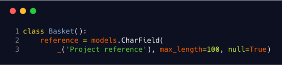

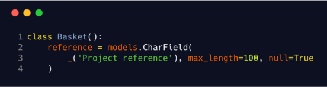

Left is the base code, yapf (Google, pep8) did not make any changes, the code in the middle is formatted by black and the right one is formatted by yapf (Facebook)

You can see that yapf (Facebook) and black are trying to convert the code to multi-line brackets while the rest do not do this. A difference between black and yapf (Facebook) is that strings also get formatted in black which you will see later too. Black uses double quotes for every string except for strings where double quotes are included.

* * *

*...*

The next example is again a real-world example. Here we have a tuple which includes a nested tuple. It works more or less like an enumeration. Also, the `_` is used to translate the strings in the application.

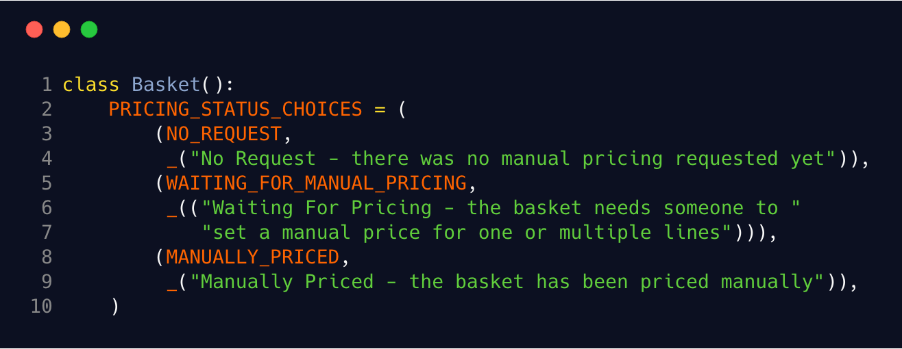
Base code, autopep8 and yapf (Google, pep8)

You can see that this was the input for the auto formatters but autopep8, yapf (Google) and yapf (pep8) did not change anything in the code.

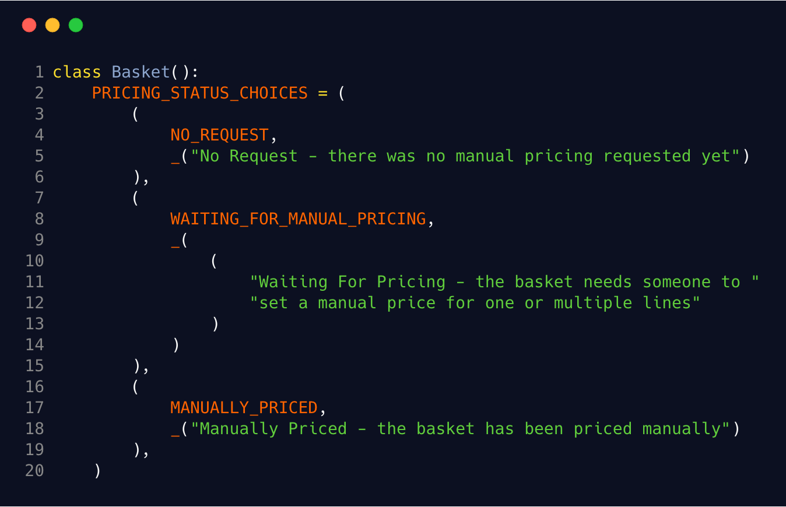
black and yapf (Facebook)

Black and yapf (Facebook) gave the same result in the end since the input was formatted with double quotes already. Also, both of the formatters split up the lines a bit.

* * *

*...*

The next example is testing a function with a lot of parameters. In reality, you should never do this, and instead pass an object as a parameter if you have more than three parameters. However, this is a great example for testing the auto formatters.

This time we get mostly different results. If you are trying to decide on an auto formatter, look at the next two examples. They will show you the real differences between the tools.

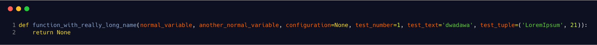
Base code

autopep8

Autopep8 is formatting the parameters below each other and also starting a new line since it analyzed that there are too many parameters to fit. With the default value for `test_tuple` it got some problems. The code is completely pep8-compliant but the tuple definition looks quite odd. We can also see again that closing brackets are not moved to a new line but instead it will do the minimum work to make the code pep8-compliant.

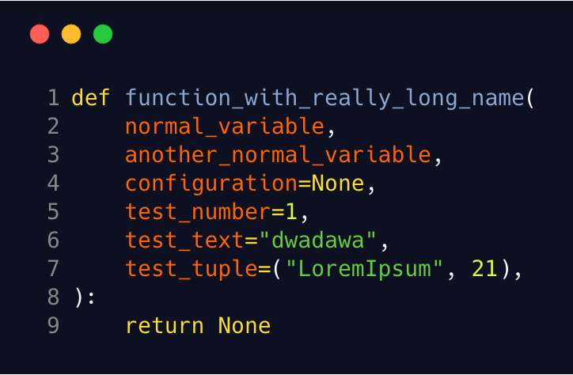
black

Black is formatting the code similar to autopep8 but is moving the closing brackets to a new line and also does not format the tuple in an unnecessary way.

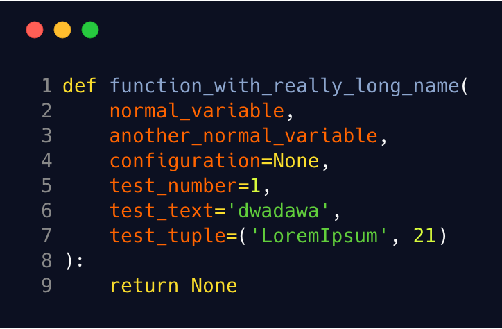
yapf (Facebook)

Yapf with the Facebook setting is formatting very similar to black here but is not changing the quotes here again. The only difference which happened.

yapf (Google), yapf (pep8)

Yapf with the Google and pep8 setting will put the parameters below each other but will try to put the first parameter on the same line where the function begins.

* * *

*...*

The last example which I will list in this article is quite an edge-case. First of all, we will create a namedtuple and then try to put tuples of this type into a list. This list will then work as parameters for a generator expression with specific filtering.

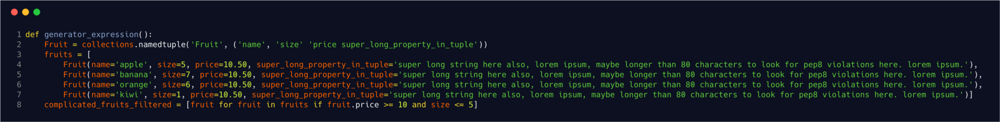
Base code

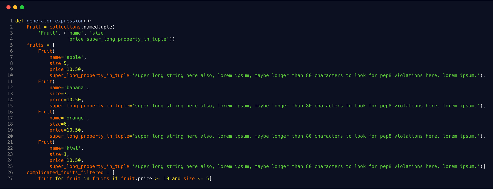
autopep8

Autopep8 also tries here to do the minimal work. The namedtuple will be split into multiple lines. The arguments for the names are also split into two lines. Other than that it will also try to leave the text on the same line in the `super_long_property_in_tuple` definition. The generator expression just gets put onto the next line.

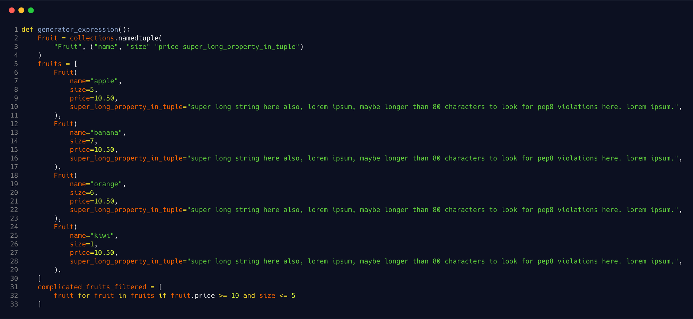
black

Black is formatting strings to double quotes. The namedtuple is split up into three lines where the second line is just the important data. The array splitting happens as usual and brackets are moved a lot and not put behind the last elements. What is really interesting is that the string on line 10, for example, is not moved to the next line.

The generator expression is also split up similar to autopep8 but the closing bracket was also moved to the next line.

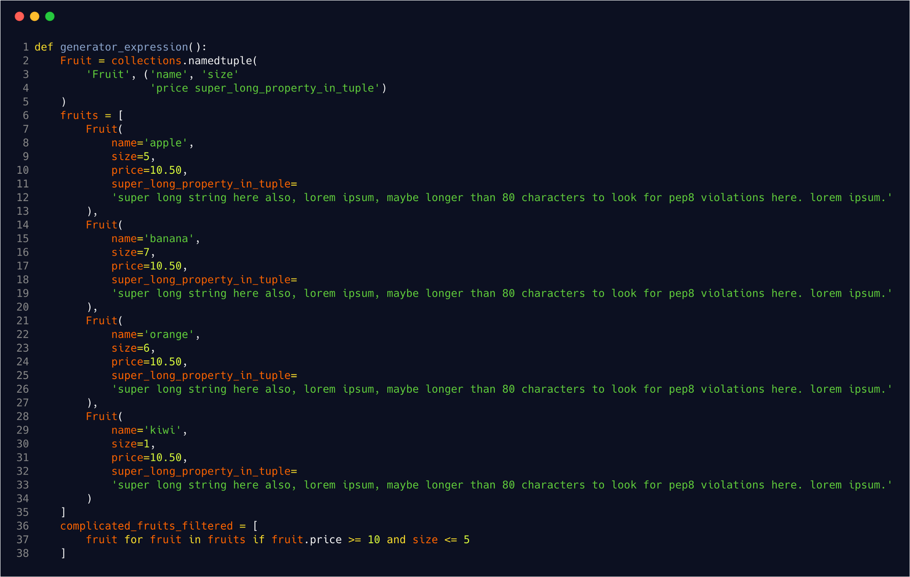
yapf (Facebook)

Yapf with the Facebook configuration also formats the tuples similarly to black but places the long parameter onto a new line. The `super_long_property_in_tuple` is also broken up into a new line. The generator expression looks exactly like the one which was generated by black.

yapf (Google), yapf (pep8)

Yapf with the Google and pep8 setting will format the code the same in this case. The main difference to the Facebook setting is that the namedtuple is formatted differently, as we saw in previous examples like the parameter splitting.

* * *

*...*

## Conclusion

All of the formatters are doing a good job at formatting the code. But in my opinion, autopep8 is not really formatting but more or less just trying make your code compliant to pep8. Still, the code might look bad and does not fulfill the requirement of being an auto formatter.

Black and yapf both have their own advantages and disadvantages. Yapf is highly configurable but I would recommend keeping the settings as little as possible. For yapf, the Facebook setting is quite similar to black’s but I think it is really weird that, for example, with the default configuration quotes are not formatted by default. Otherwise, it is just personal preference on which configuration to take or which formatter to choose.

For me, personally, I will choose black for future projects since it is close to prettier in its approach. Yapf might have the bigger backing but I think this will change over time.

Also, another note: Use one of the auto formatters presented in this article. Your development team will save so much time. It will be incredible. Also, your personal code will look the same throughout different projects and repositories and everyone will be much happier. And remember to not nitpick so much about code style. People are opinionated, but here efficiency and less communication are far more important than opinions.

* * *

*...*

This blog post was written in cooperation with the company [3YOURMIND](https://www.3yourmind.com/). We are looking for developers in Berlin. You can find openings [here](https://www.3yourmind.com/career). We are a 3D Printing startup with a lot of cool developers using *Vue.js*, *Django REST*, *Java*, *Docker* and many more cutting-edge frameworks and libraries to change the enterprise 3D printing world.

> Thanks for reading this. You rock*>   *

> If you have any feedback or want to add something to this article just comment here. You can also follow me on > [> twitter](https://twitter.com/kevinpeters_)>  or visit my > [> personal site](https://www.kevinpeters.net/)>  to stay up-to-date with my blog articles and many more things.