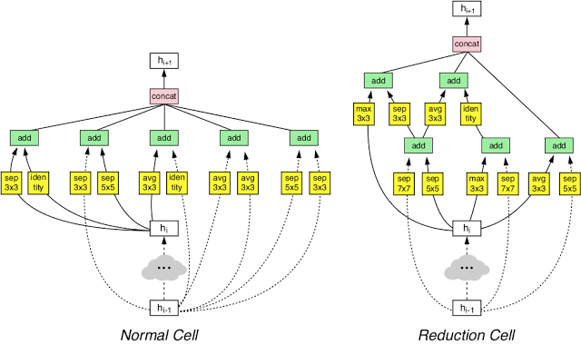
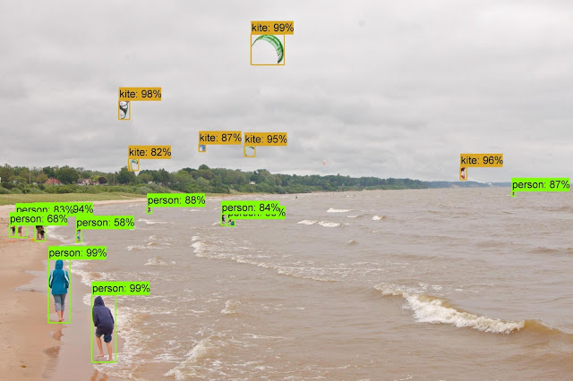

AutoML for large scale image classification and object detection

# AutoML for large scale image classification and object detection

Posted by Barret Zoph, Vijay Vasudevan, Jonathon Shlens and Quoc Le, Research Scientists, Google Brain Team

A few months ago, we introduced our [AutoML](https://research.googleblog.com/2017/05/using-machine-learning-to-explore.html) project, an approach that automates the design of machine learning models. While we found that AutoML can design small neural networks that perform on par with neural networks designed by human experts, these results were constrained to small academic datasets like CIFAR-10, and Penn Treebank. We became curious how this method would perform on larger more challenging datasets, such as [ImageNet](http://image-net.org/)image classification and COCO object detection. Many state-of-the-art machine learning architectures have been invented by humans to tackle these datasets in academic competitions.

In [Learning Transferable Architectures for Scalable Image Recognition](http://arxiv.org/abs/1707.07012), we apply AutoML to the ImageNet image classification and [COCO](http://cocodataset.org/#home)object detection dataset -- two of the most respected large scale academic datasets in computer vision. These two datasets prove a great challenge for us because they are orders of magnitude larger than CIFAR-10 and Penn Treebank datasets. For instance, naively applying AutoML directly to ImageNet would require many months of training our method.

To be able to apply our method to ImageNet we have altered the AutoML approach to be more tractable to large-scale datasets:

- We redesigned the search space so that AutoML could find the best layer which can then be stacked many times in a flexible manner to create a final network.
- We performed architecture search on CIFAR-10 and transferred the best learned architecture to ImageNet image classification and COCO object detection.

With this method, AutoML was able to find the best layers that work well on CIFAR-10 but work well on ImageNet classification and COCO object detection. These two layers are combined to form a novel architecture, which we called **“NASNet”**.

|     |
| --- |
|  |
| Our NASNet architecture is composed of two types of layers: Normal Layer (left), and Reduction Layer (right). These two layers are designed by AutoML. |

On ImageNet image classification, NASNet achieves a prediction accuracy of 82.7% on the validation set, surpassing all previous Inception models that we built [2, 3, 4]. Additionally, NASNet performs 1.2% better than all previous published results and is on par with the best unpublished result reported on arxiv.org [5]. Furthermore, NASNet may be resized to produce a family of models that achieve good accuracies while having very low computational costs. For example, a small version of NASNet achieves 74% accuracy, which is 3.1% better than equivalently-sized, state-of-the-art models for mobile platforms. The large NASNet achieves state-of-the-art accuracy while halving the computational cost of the best reported result on arxiv.org (i.e., SENet) [5].

|     |
| --- |
|  |
| Accuracies of NASNet and state-of-the-art, human-invented models at various model sizes on ImageNet image classification. |

We also transferred the learned features from ImageNet to object detection. In our experiments, combining the features learned from ImageNet classification with the Faster-RCNN framework [6] surpassed previous published, state-of-the-art predictive performance on the COCO object detection task in both the largest as well as mobile-optimized models. Our largest model achieves 43.1% mAP which is 4% better than the previous, published state-of-the-art.

|     |
| --- |
|  |
| Example object detection using Faster-RCNN with NASNet. |

We suspect that the image features learned by NASNet on ImageNet and COCO may be reused for many computer vision applications. Thus, we have open-sourced NASNet for inference on image classification and for object detection in the [Slim](https://github.com/tensorflow/models/tree/master/research/slim/) and [Object Detection](https://github.com/tensorflow/models/tree/master/research/object_detection) TensorFlow repositories. We hope that the larger machine learning community will be able to build on these models to address multitudes of computer vision problems we have not yet imagined.

**Special thanks** to Jeff Dean, Yifeng Lu, Jonathan Huang, Vivek Rathod, Sergio Guadarrama, Chen Sun, Jonathan Shen, Vishy Tirumalashetty, Xiaoqiang Zheng, Christian Sigg and the Google Brain team for the help with the project.

**References**

[1] [Learning Transferable Architectures for Scalable Image Recognition](https://arxiv.org/pdf/1707.07012.pdf), *Barret Zoph, Vijay Vasudevan, Jonathon Shlens, and Quoc V. Le. *Arxiv, 2017.

[2] [Going Deeper with Convolutions](https://arxiv.org/abs/1409.4842), *Christian Szegedy, Wei Liu, Yangqing Jia, Pierre Sermanet, Scott Reed, Dragomir Anguelov, Dumitru Erhan, Vincent Vanhoucke, and Andrew Rabinovich.* CVPR, 2015.

[3] [Rethinking the inception architecture for computer vision](https://arxiv.org/abs/1512.00567), *Christian Szegedy, Vincent Vanhoucke, Sergey Ioffe, Jonathon Shlens, and Zbigniew Wojna. *CVPR, 2016.

[4] [Inception-v4, Inception-ResNet and the Impact of Residual Connections on Learning](https://arxiv.org/abs/1602.07261), *Christian Szegedy, Sergey Ioffe, Vincent Vanhoucke, and Alex Alemi.* AAAI, 2017.

[5] [Squeeze-and-Excitation Networks](https://arxiv.org/abs/1709.01507), *Jie Hu, Li Shen and Gang Sun.* Arxiv, 2017.

[6] [Faster R-CNN: Towards Real-Time Object Detection with Region Proposal Networks](https://arxiv.org/abs/1506.01497), *Shaoqing Ren, Kaiming He, Ross Girshick and Jian Sun. *NIPS, 2015.