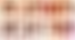
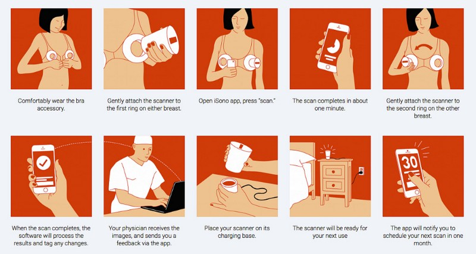
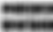
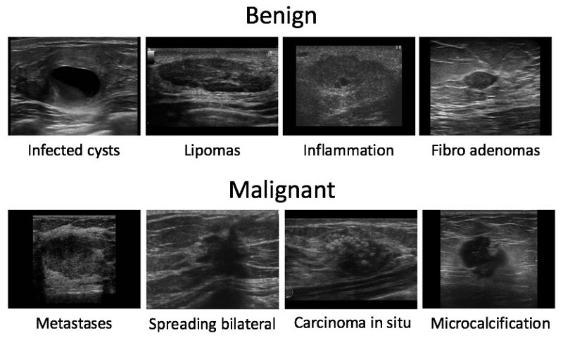
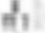
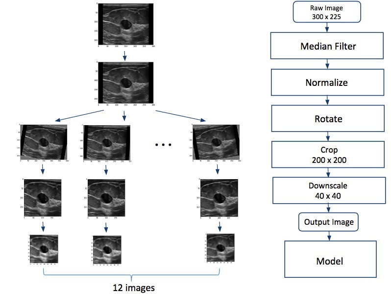
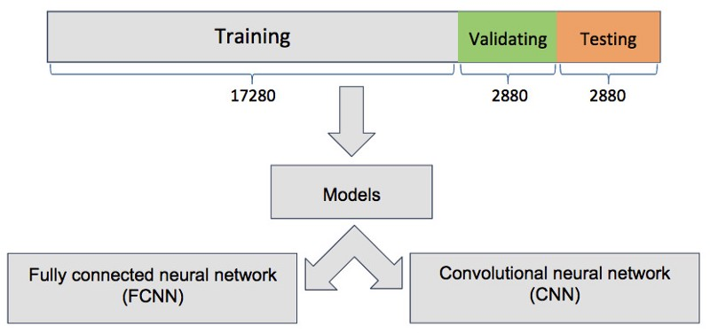
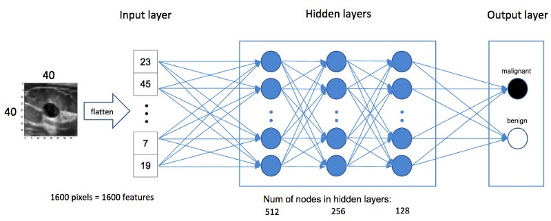
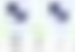
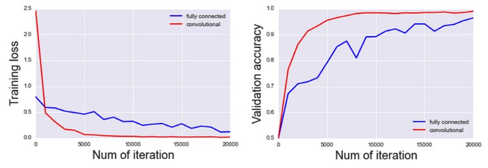

Automating Breast Cancer Detection with Deep Learning

# Automating Breast Cancer Detection with Deep Learning

* * *

*...*

*Sheng Weng, an *[*Insight Health Data*](http://insighthealthdata.com/)* Fellow (Winter 2017), obtained his Ph.D. in applied physics from Rice University. He studied translational biophotonics imaging and microscopy using ultrafast lasers. He is now a data scientist at Amazon Alexa.*

* * *

*...*

[iSono Health](http://www.isonohealth.com/) is a startup company committed to developing an affordable, automated ultrasound imaging platform to facilitate monthly self-monitoring for women to help with early breast cancer detection. The device is bundled with iSono app that can analyze the results and tag any changes in the back end in real time (see images below for details). During my time at the Insight Health Data Fellows program, I built a deep learning model for iSono Health to differentiate benign and malignant breast lesions using the ultrasound images.

Image Credit: [iSono Health](http://www.isonohealth.com/)
**Background**

Breast cancer is the second leading cause of cancer-related deaths in women. It has been reported that one in eight women in the U.S. is expected to be diagnosed with invasive breast cancer in their lifetime. In 2017, roughly 255,180 new cases of invasive breast cancer are expected to be diagnosed, and 40,610 breast cancer related deaths are anticipated in the U.S. [1].

Traditionally, once-a-year screening is recommended to check a woman’s breasts health before there are signs or symptoms of the disease, especially for those who are over 50 years old. The screening normally involves X-ray mammograms followed by ultrasound imaging. However, the diagnosis on breast ultrasound is a subjective procedure and highly dependent on the experience of the radiologists.

**Data Overview**

The raw dataset (courtesy of iSono Health) contains 2,684 labeled 2-D breast ultrasound images in JPEG format:

Benign cases: 1007
Malignant cases: 1499
Unusual cases: 178
Subtypes in benign: 12
Subtypes in malignant: 13
Subtypes in unusual: 3

Most images have the size of 300 x 225 pixels, each pixel has a value ranging from 0 to 255. There are 12 subtypes in the benign cases and 13 subtypes in the malignant cases. The images were obtained from different sources, so they have various field of views, resolutions, scales, etc. The picture below shows some benign and malignant breast lesions with different subtypes.

In order to make it a binary classification problem (benign or malignant), I ignored all the subtypes as well as the unusual cases. I randomly selected 1920 images to build and evaluate my model; half of them were benign and half of them were malignant, resulting in a balanced dataset.

**Data Preparation**

I applied a 3x3 median filter to remove the speckle noise on ultrasound images. I also normalized the pixel values on each image so that they had zero mean.

It is worth mentioning that 1920 images as a whole is still a relatively small dataset for such a complicated image classification problem. Data augmentation is an attractive solution to reduce overfitting and increase the generalization of the model. I first split the data randomly into 75% training, 12.5% validating, and 12.5% testing datasets. Then I applied rotation transformation on each image based on the assumption that the features that characterize breast lesions should be rotation invariant/insensitive. Specifically, I rotated each image a random small degree from -10° to 10° and I did it for 12 times, so I eventually got 1920 x 12 = 23040 images. I did not use other augmentation techniques such as cropping and shifting because I wanted to keep the whole lesion near the center of the image.

Based on the observation that the most interesting part (lesion and its surroundings) of almost all the images is located around the center of the image, it is safe to crop the images to 200 x 200 pixels to remove the paddings caused by image rotation. I then downsampled each image 5x to 40 x 40 pixels, in order to keep the input size of the network manageable. The flowchart of data preparation is shown below.

After the data augmentation, there were 17280 training images, 2880 validation images, and 2880 testing images. Each set consisted of 50% benign and 50% malignant cases. The holdout test and validation datasets were separated from the training set prior to the image augmentation, so there was no overlapping original images across the groups.

**Algorithms**

To achieve correct classification, the conventional method is often composed of three main steps: feature extraction, feature selection, and classification. These three steps need to be well-addressed separately and then integrated together. Extraction of discriminative features could potentially ease the latter steps of feature selection and classification. Nevertheless, the engineering of effective features is problem-oriented and highly depends on the quality of each intermediate result in the image processing, which often needs many passes of trial-and-error design and case-by-case user interventions [2].

The recent advances in deep learning technology can potentially change the design paradigm of image classification. Nature recently reported a work on classification of skin cancer using deep convolutional neural networks, which demonstrated a level of competence comparable to dermatologists [3]. When we speak of “deep” learning, we are not simply referring to the number of layers. While there is no concrete definition of what “deep” means, it is the number of possible causal connections each neuron has that really shapes the “depth” of deep learning structures.

Deep learning can directly uncover features from the training data without the explicit elaboration on feature extraction and selection. Neural networks operate by passing the input information through layers of neurons that transform the input information into the output. With the help of back propagation, the internal weights of neural networks get updated automatically based on the error information obtained from each iteration.

In this project, I investigated and compared the performances of two different deep learning architectures, namely fully connected neural network (FCNN) and convolutional neural network (CNN). Both models were implemented using python and TensorFlow on a Nvidia Tesla K80 GPU hosted by Amazon Web Services (AWS) EC2 p2.xlarge instance.

**Fully Connected Neural Network**

In a fully connected neural network, each neuron is connected to all the neurons in the previous layer, and each connection has its own weight. However, the information of the weights are not shared by the neurons. Before implementing a fully connected neural network, there was an extra step of converting each 2D image into a 1D array with a size of 1600.

The constructed fully connected neural network has one input layer, three hidden layers that have 512, 256, 128 nodes respectively, and one output layer that has two outputs. The detailed diagram is shown below.

**Convolutional Neural Network**

In a convolutional neural network, each neuron is only connected with a few local neurons in the previous layer, and the weight is shared for every neuron in that layer. Convolutional neural networks are effective for image classification problems because the convolution operation produces information on spatially correlated features of the image. For example, convolution may result in edges becoming more prominent.

The constructed convolutional neural network has three convolutional layers, and each of them is generated by convolving through a 5x5 filter/kernel with the previous layer image. By feeding the output of one convolutional layer to another, higher-order features can be extracted. After convolution, these features can be more readily learned by a fully connected neural network. The convolutional layers can be thought of as preparing the data so that the fully connected layers can take advantage of the spatial structure of the input image. The intuition is that after the image has been passed through multiple convolutional layers, the neurons will have been encoded with all the relevant spatial features. Following the convolutional layers, there are two fully connected layers with 512 and 256 nodes, respectively. This CNN architecture was inspired by the first few layers of AlexNet [4]. The detailed diagram is shown below.

**Model Evaluation**

The convolutional neural network outperformed the fully connected neural network in all the evaluation metrics as shown below. The prediction accuracy of CNN is 73%, while it’s only 66% for FCNN. In the confusion matrix below, the threshold used for classifying benign and malignant cases was the default 0.5. Lowering the threshold value can give higher sensitivity and reduce the false negative cases, but in this case there is a delicate trade-off, with the false positive cases having major implications — especially with regards to preventive mastectomy.

The advantages of using convolutional neural network can also be observed from the following two figures. As the number of training iteration increased, the validation accuracy of the convolutional neural network quickly and smoothly ramped up to 0.9 after 3000 iterations, while the fully connected neural network did not reach 0.9 until around 10000 iterations. On the other hand, the loss value of the convolutional neural network was lower than the fully connected neural network, which indicated that the gradient descent function inside the convolutional neural network had a better performance in converging to the local minimum point. The loss value is calculated by a cost function, which essentially defines how far the model is from the desired output. The gradient descent is attempting to converge on a result that minimizes the cost function by slowly changing the weights.

Stochastic gradient descent (SGD) and rectified linear unit (ReLU) were applied in both models. Also, learning rate decay was adopted to increase the performances. Dropout was used to prevent overfitting.

**Final Remarks**

The code will be the deliverable to iSono Health as a baseline model for further algorithm development. The convolutional neural network has many hyperparameters that can be further tuned, including but not limited to: number of convolutional layers, number of fully connected layers, number of filters, size of filters, number of hidden nodes, batch size, learning rate, max pooling size, dropout ratio, etc.. Also, more aggressive image augmentation along with images from consistent source will likely result in better performance.

Building a CNN from scratch can be time-consuming and computationally expensive. In practice, transfer learning is another viable solution which refers to the process of leveraging the features learned by a pre-trained deep learning model (for example, GoogleNet Inception v3) and then applying to a different dataset. If more data is available, transfer learning could potentially facilitate the training procedure.

Lastly, I want to thank all the people at Insight, my fellow Fellows, and Insight alumni for giving me a tremendous amount of help in this project. I also want to thank iSono Health and CTO Dr. Shadi Saberi for giving me the opportunity to work on this interesting and challenging problem. I really learned a lot during my journey at Insight.

* * *

*...*

***Interested in transitioning to a career in data science o*r a*rtificial intelligence? ****Find out more about the*[* Insight Fellows Programs*](http://insightdatascience.com/)* in New York, Silicon Valley, Boston,and Seattle*[* apply*](http://www.insightdatascience.com/apply.html)* today, or*[* sign up*](http://www.insightdatascience.com/notify.html)* for program updates.*

* * *

*...*
**Reference**
[1]http://www.breastcancer.org/about_us/press_room/press_kit/facts_figures

[2] Cheng, Jie-Zhi, et al. “Computer-Aided diagnosis with deep learning architecture: applications to breast lesions in us images and pulmonary nodules in CT scans.” Scientific reports 6 (2016).

[3] Esteva, Andre, et al. “Dermatologist-level classification of skin cancer with deep neural networks.” Nature (2017).

[4] MLA Krizhevsky, Alex, et al. “Imagenet classification with deep convolutional neural networks.” Advances in neural information processing systems (2012).