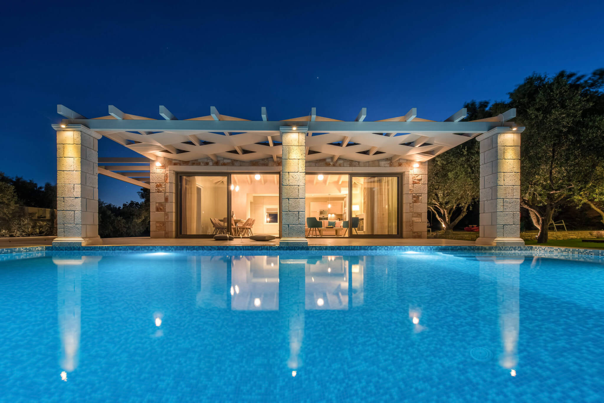
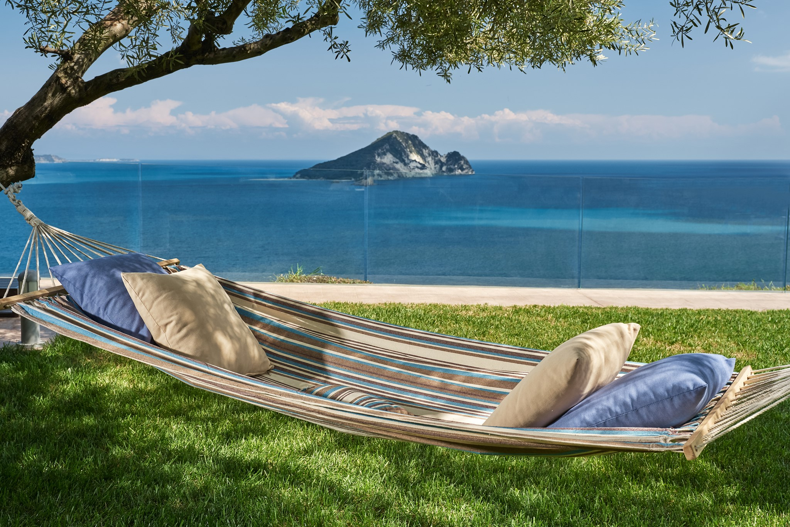
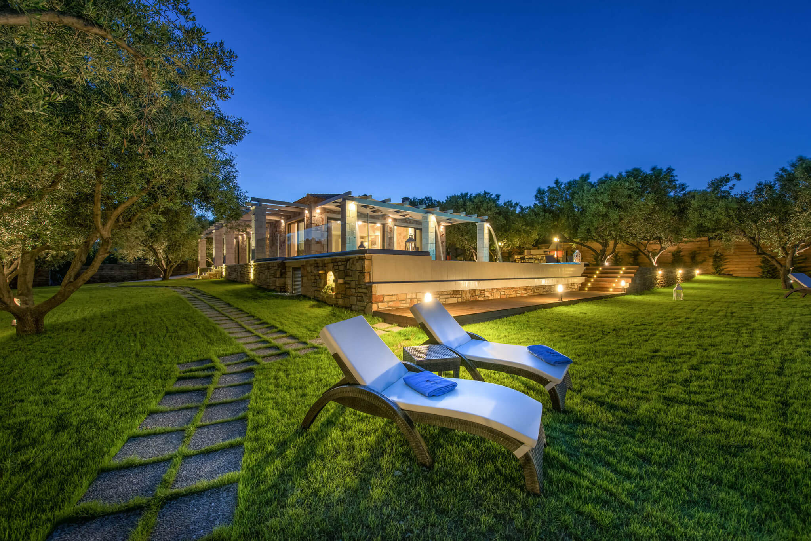
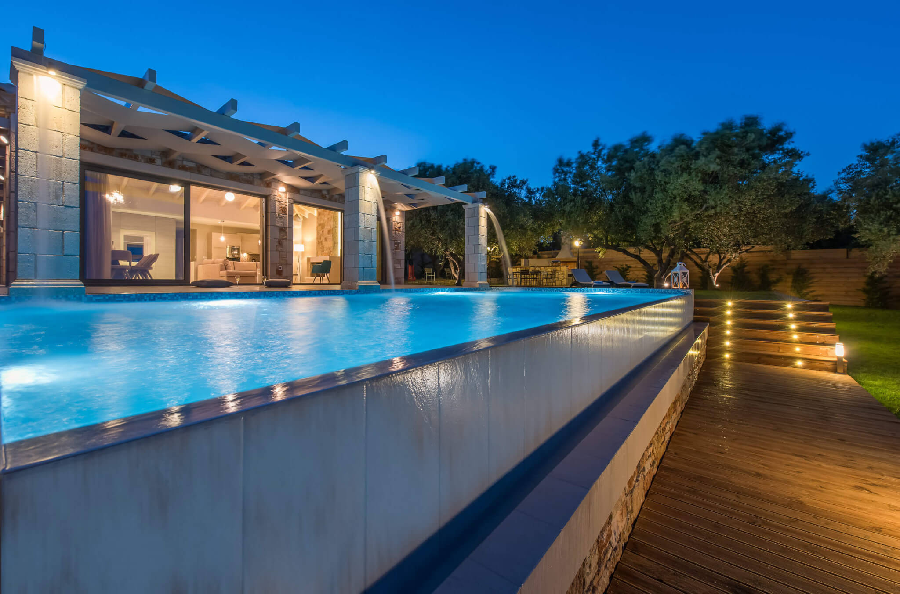
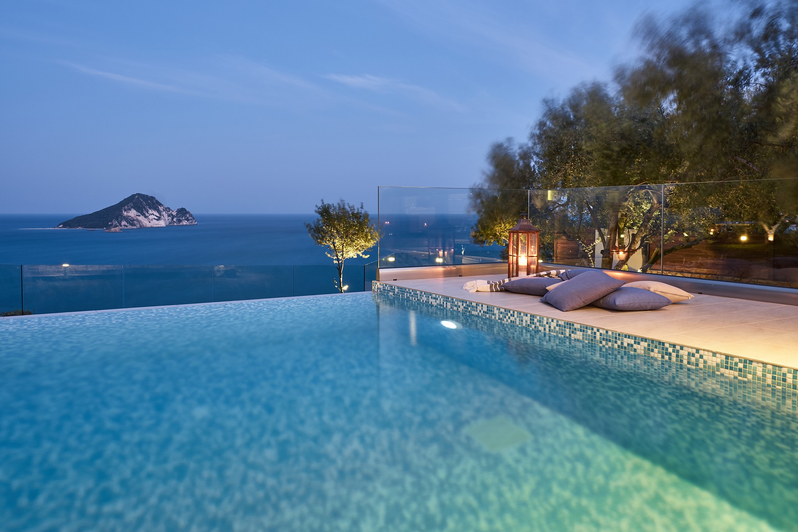
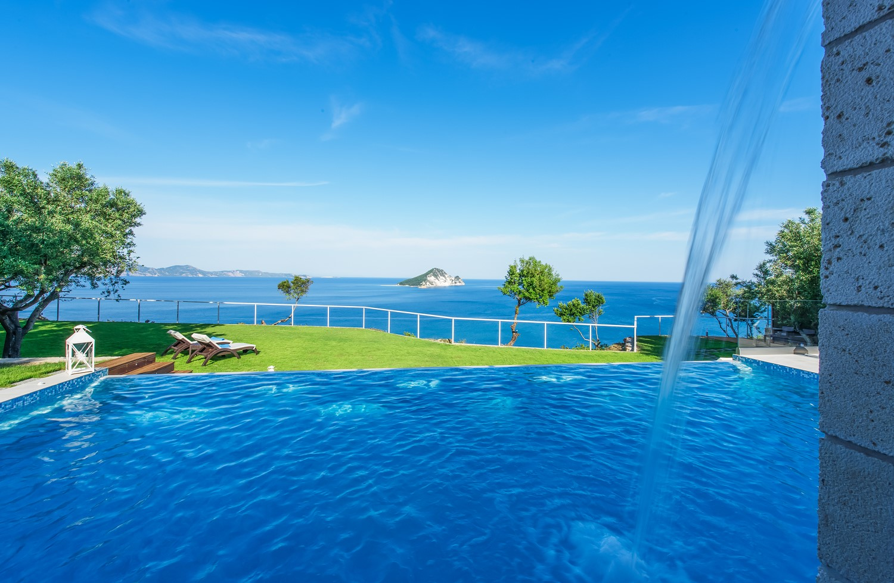
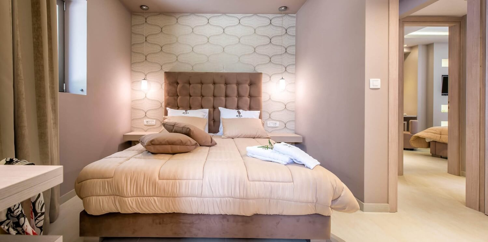
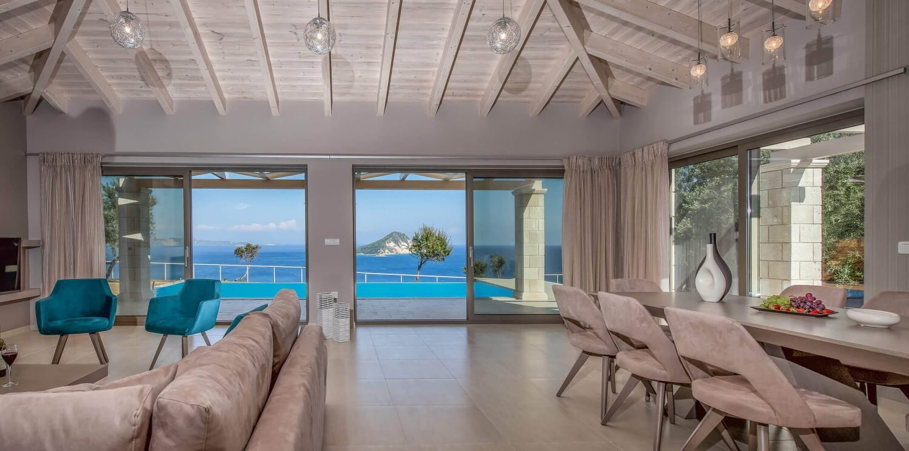
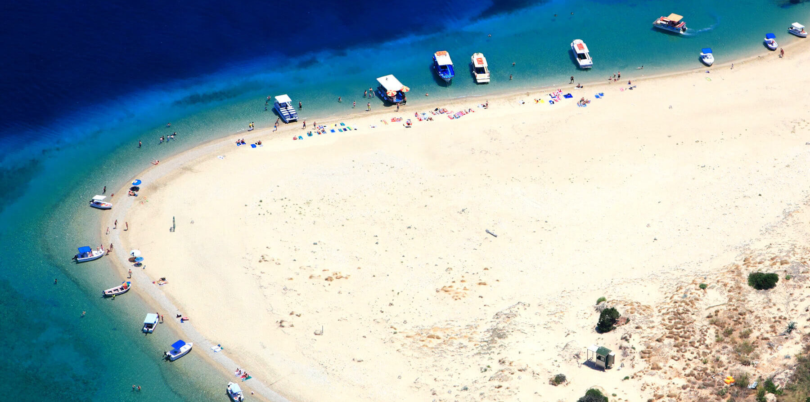

Avra Luxury Villa, Zante Zakynthos

- **+30 6976 839 130
- **[info@avravilla.gr](http://www.avravilla.gr/index.phpmailto:info@avravilla.gr)

- [Follow Us **](https://www.tripadvisor.com/VacationRentalReview-g1188672-d10314684-Avra_Villa_with_Private_Pool_Limni_Keri_Zakynthos-Limni_Keri_Zakynthos_Ionian_Island.html)

 [(L)](http://www.avravilla.gr/index.php)

- [Home](http://www.avravilla.gr/index.php)
- [The Villa](http://www.avravilla.gr/thevilla.php)
- [Facilities & Services](http://www.avravilla.gr/facilities.php)
- [Gallery](http://www.avravilla.gr/gallery.php)

- [Location](http://www.avravilla.gr/location.php)

- [Offers](http://www.avravilla.gr/offers.php)

- [Contact](http://www.avravilla.gr/contact.php)

 
 
 
 
 
.

## Welcome to Avra Luxury Villa

A perfect holiday depends enormously on the holiday home. The ideal accommodation must be warm and cosy just like your own home. Add a touch of luxury, modern appliances, total privacy, amazing views out to sea and peace and quiet. This is what we offer at the

 **Avra Luxury Villa in Zakynthos Greece**.

A newly built stone villa with a private swimming pool, well kept grounds where you can spend relaxing moments all to yourself and an inviting interior that will offer many happy memories.

Take a walk in the scenic olive groves and go for a swim following the path from the villa. What more can you ask from a summer holiday?

The Villa

Aura Luxury Private Pool villa in Zakynthos Greece is elegantly designed and features almost all modern amenities that fuse harmoniously with the charming island style architecture, creating one of the most picturesque holiday villas in the island of Zakynthos, providing an amazing atmosphere for your holidays and a magnificent view of the Ionian Sea.

[View Avra Villa Details](http://www.avravilla.gr/thevilla.php)

## Avra Villa

Keri Lake Zakynthos Greece

[     Avra Luxury Villa     The Avra Villa is a luxurious stone holiday home modernly equipped in order to accommodate up to 6-8 people.](http://www.avravilla.gr/thevilla.php)

[     Enjoy your dream holiday     We offer limitless facilities and services that will make even the most demanding guests fall in love with this villa.](http://www.avravilla.gr/facilities.php)

[     Ideal Location     Our villa is privately located in the village of Keri Lake, a quiet and scenic area among olive groves with amazing sea views.](http://www.avravilla.gr/location.php)

.



Watch the music clip filmed in **Avra Villa**by the Greek artist Thanos Kalliris

Do you need to make a Reservation?
[Book Now](http://www.avravilla.gr/contact.php)
**

#### About Avra Villa

Perched on a quiet hill above Keri Lake village and Keri Beach, Avra Luxury Villa is an elegant private pool villa, a fine example of style intertwined with the natural elements of Zakynthos Island and its traditional architecture. The location allows for great privacy while being within close proximity of the charming beach of Keri Lake and reasonable driving distance from Zante Town and the island's great sights.

#### Guestbook

""*From the moment we walked through the front door, the magic captivated us. Avra Villa is awesome, just delicious and truly felt like home. The simplicity, yet touch of class throughout the villa was such a delight to embrace each day. The view will remain in our hearts 4ever as will you both....*""

#### Get in Touch

- **

Avra Villa, Keri Lake, Zante Zakynthos, P.C. 29100, Greece

- **+30 6976 839 130
- **info@avravilla.gr

- **We Accept  

- [**](http://www.facebook.com/avraluxuryvilla)
- [**](https://www.tripadvisor.com/VacationRentalReview-g1188672-d10314684-Avra_Villa_with_Private_Pool_Limni_Keri_Zakynthos-Limni_Keri_Zakynthos_Ionian_Island.html)

- [**](https://www.instagram.com/explore/locations/799144846/avra-luxury-villa-spa/)

 MHTE 0428K91000444801

 [Zakynthos Island](https://www.booked.net/weather/zakynthos-island-11452)  

+32°C

- [Home](http://www.avravilla.gr/index.php)
- [The Villa](http://www.avravilla.gr/thevilla.php)

- [Facilities&Services](http://www.avravilla.gr/facilities.php)

- [Gallery](http://www.avravilla.gr/gallery.php)
- [Location](http://www.avravilla.gr/location.php)

- [Offers](http://www.avravilla.gr/offers.php)

- [Contact](http://www.avravilla.gr/contact.php)

© Avra Luxury Villa. All Rights Reserved 