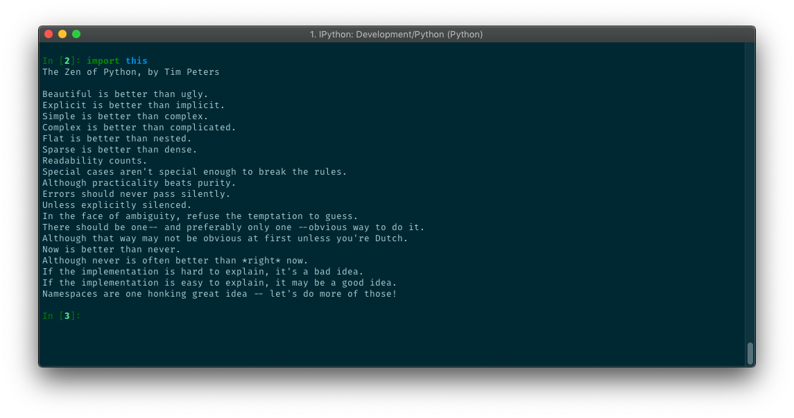
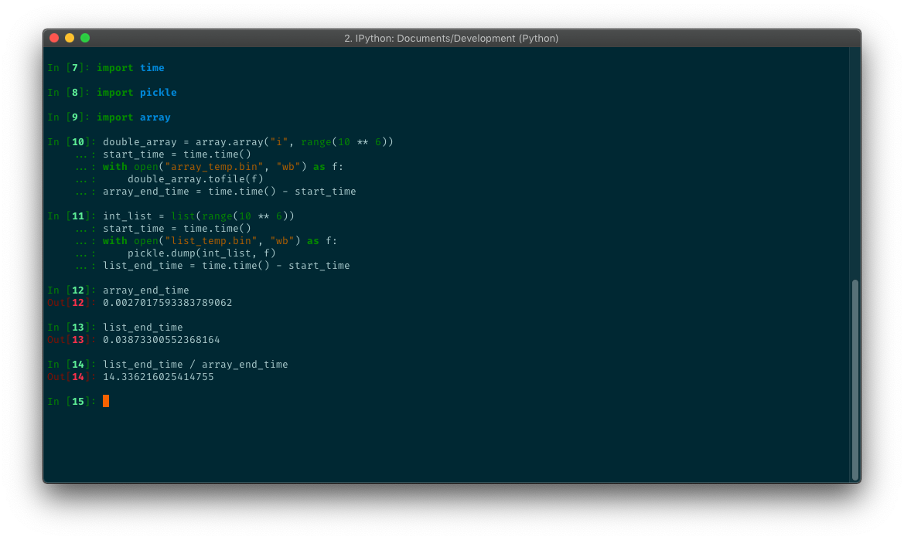

Awesome Python modules you probably aren’t using (but should be)

# Awesome Python modules you probably aren’t using (but should be)

[Adam Goldschmidt](https://medium.freecodecamp.org/@adamgoldschmidt)
Mar 15·3 min read

Photo by [Chris Ried](https://unsplash.com/@cdr6934?utm_source=medium&utm_medium=referral) on [Unsplash](https://unsplash.com/?utm_source=medium&utm_medium=referral)

**Python** is a beautiful language, and it contains many built-in modules that aim to help us write better, prettier code.

### Objective

Throughout this article, we will use some lesser-known modules and methods that I think can improve the way we code - both in visibility and in efficiency.

 [  [giphy.webp](../_resources/7324a6ea2ae73e8b79681c1cf1a9e45b.webp) ''](https://giphy.com/gifs/foxtv-isaac-the-orville-efficient-wHoKXCPj2NBcIoE3ZQ?utm_source=iframe&utm_medium=embed&utm_campaign=Embeds&utm_term=https%3A%2F%2Fcdn.embedly.com%2Fwidgets%2Fmedia.html%3Fsrc%3Dhttps%3A%2F%2Fgiphy.com%2Fembed%2FwHoKXCPj2NBcIoE3ZQ%2Ftwitter%2Fiframe&%3Burl=https%3A%2F%2Fmedia.giphy.com%2Fmedia%2FwHoKXCPj2NBcIoE3ZQ%2Fgiphy.gif&%3Bimage=https%3A%2F%2Fi.giphy.com%2Fmedia%2FwHoKXCPj2NBcIoE3ZQ%2Fgiphy.gif&%3Bkey=a19fcc184b9711e1b4764040d3dc5c07&%3Btype=text%2Fhtml&%3Bschema=giphy)

 [(L)](https://giphy.com/gifs/foxtv-isaac-the-orville-efficient-wHoKXCPj2NBcIoE3ZQ?utm_source=iframe&utm_medium=embed&utm_campaign=Embeds&utm_term=https%3A%2F%2Fcdn.embedly.com%2Fwidgets%2Fmedia.html%3Fsrc%3Dhttps%3A%2F%2Fgiphy.com%2Fembed%2FwHoKXCPj2NBcIoE3ZQ%2Ftwitter%2Fiframe&%3Burl=https%3A%2F%2Fmedia.giphy.com%2Fmedia%2FwHoKXCPj2NBcIoE3ZQ%2Fgiphy.gif&%3Bimage=https%3A%2F%2Fi.giphy.com%2Fmedia%2FwHoKXCPj2NBcIoE3ZQ%2Fgiphy.gif&%3Bkey=a19fcc184b9711e1b4764040d3dc5c07&%3Btype=text%2Fhtml&%3Bschema=giphy)

Related Gifs

 **

 [ FOX TV  @foxtv   ](https://giphy.com/foxtv?utm_source=iframe&utm_medium=embed&utm_campaign=Embeds&utm_term=https%3A%2F%2Fcdn.embedly.com%2Fwidgets%2Fmedia.html%3Fsrc%3Dhttps%3A%2F%2Fgiphy.com%2Fembed%2FwHoKXCPj2NBcIoE3ZQ%2Ftwitter%2Fiframe&%3Burl=https%3A%2F%2Fmedia.giphy.com%2Fmedia%2FwHoKXCPj2NBcIoE3ZQ%2Fgiphy.gif&%3Bimage=https%3A%2F%2Fi.giphy.com%2Fmedia%2FwHoKXCPj2NBcIoE3ZQ%2Fgiphy.gif&%3Bkey=a19fcc184b9711e1b4764040d3dc5c07&%3Btype=text%2Fhtml&%3Bschema=giphy)

 

  

Continue Watching on GIPHY

 

### NamedTuple

I believe that some of you already know the more popular `namedtuple` from the `collections` module (if you don't - [check it out](https://docs.python.org/3.6/library/collections.html#collections.namedtuple)), but since Python 3.6, a new class is available in the `typing` module: `NamedTuple`. Both are designed to help you quickly create readable immutable objects.

`NamedTuple` is actually a typed version of `namedtuple`, and in my opinion, is much more readable:

|     |     |
| --- | --- |
| 1   | In [2]: import typing |
| 2   |     |
| 3   | In [3]: class  BetterLookingArticle(typing.NamedTuple): |
| 4   |  ...: title: str |
| 5   |  ...: id: int |
| 6   |  ...: description: str  =  "No description given." |
| 7   |  ...: |
| 8   |     |
| 9   | In [4]: BetterLookingArticle(title="Python is cool.", id=1) |
| 10  | BetterLookingArticle(title='Python is cool.', id=1, description='No description given.') |

 [view raw](https://gist.github.com/AdamGold/12572fcbd0c851195603fd84a1c9b1d4/raw/6760b5a2d92a9a7a38421323ea5e559025d8a3c5/pythontips1.py)  [pythontips1.py](https://gist.github.com/AdamGold/12572fcbd0c851195603fd84a1c9b1d4#file-pythontips1-py) hosted with ❤ by [GitHub](https://github.com/)

Here’s the `namedtuple` alternative:

|     |     |
| --- | --- |
| 1   | In [6]: import collections |
| 2   |     |
| 3   | In [7]: Article = collections.namedtuple("Article", ["title", "description", "id"]) |
| 4   |     |
| 5   | In [8]: Article(title="Python is cool.", id=1, description="") |
| 6   | Article(title='Python is cool.', description='', id=1) |

 [view raw](https://gist.github.com/AdamGold/83afc1ecc510ae119e35c191d374c275/raw/7ea52723c304c0d71efb3c4d4cc2d746f741f199/pythontips2.py)  [pythontips2.py](https://gist.github.com/AdamGold/83afc1ecc510ae119e35c191d374c275#file-pythontips2-py) hosted with ❤ by [GitHub](https://github.com/)

### array.array

*> Efficient arrays of numeric values. Arrays are sequence types and behave very much like lists, except that the type of objects stored in them is constrained. — *> [*> Python docs*](https://docs.python.org/3.6/library/array.html)

When using the `array` module, we need to instantiate it with a typecode, which is the type all of its elements will use. Let's compare time efficiency with a normal list, writing many integers to a file (using `[pickle](https://docs.python.org/3.7/library/pickle.html)` module for a regular list):

https://gist.github.com/AdamGold/961758c66cdfe92642eabb61d9ce9866

**14 times **faster. That’s a lot. Of course it also depends on the `pickle` module, but still - the array is way more compact than the list. So if you are using simple numeric values, you should consider using the `array` module.

### itertools.combinations

`itertools` is an impressive module. It has so many different time-saving methods, all of them are listed [here](https://docs.python.org/3/library/itertools.html). There's even a GitHub repository containing [more itertools](https://github.com/erikrose/more-itertools)!

I got to use the `combinations` method this week and I thought I'd share it. This method takes an iterable and an integer as arguments, and creates a generator consisting of all possible combinations of the iterable with a maximum length of the integer given, without duplication:

|     |     |
| --- | --- |
| 1   | In [16]: import itertools |
| 2   | In [17]: list(itertools.combinations([1, 2, 3, 4], 2)) |
| 3   | [(1, 2), (1, 3), (1, 4), (2, 3), (2, 4), (3, 4)] |

 [view raw](https://gist.github.com/AdamGold/440af72d3961f87f0628a80b3bb11e29/raw/a31cc4f12ecd307cf5c0d5448b33902c3f99461c/pythontips4.py)  [pythontips4.py](https://gist.github.com/AdamGold/440af72d3961f87f0628a80b3bb11e29#file-pythontips4-py) hosted with ❤ by [GitHub](https://github.com/)

### dict.fromkeys

A quick and beautiful way of creating a dict with default values:

|     |     |
| --- | --- |
| 1   | In [18]: dict.fromkeys(["key1", "key2", "key3"], "DEFAULT_VALUE") |
| 2   | {'key1': 'DEFAULT_VALUE', 'key2': 'DEFAULT_VALUE', 'key3': 'DEFAULT_VALUE'} |

 [view raw](https://gist.github.com/AdamGold/2d5472eca16166e0636763d8fa6a0b4a/raw/2c53d5733a764fc24e970723788e2c903f63f4e4/pythontips5.py)  [pythontips5.py](https://gist.github.com/AdamGold/2d5472eca16166e0636763d8fa6a0b4a#file-pythontips5-py) hosted with ❤ by [GitHub](https://github.com/)

### Last but not least - the `dis` module

*> The *`[*dis*](https://docs.python.org/3/library/dis.html#module-dis)`*>  module supports the analysis of CPython *> [*> bytecode*](https://docs.python.org/3/glossary.html#term-bytecode)*>  by disassembling it.*

As you may or may not know, Python compiles source code to a set of instructions called “bytecode”. The `dis` module helps us handle these instructions, and it's a great debugging tool.

Here’s an example from the [Fluent Python book](http://shop.oreilly.com/product/0636920032519.do):

|     |     |
| --- | --- |
| 1   | In [22]: t = (1, 2, [3, 4]) |
| 2   | In [23]: t[2] += [30, 40] |
| 3   | --------------------------------------------------------------------------- |
| 4   | TypeError Traceback (most recent call last) |
| 5   | <ipython-input-25-af836a8d44a2>  in  <module> |
| 6   | ---->  1 t[2] += [30, 40] |
| 7   |     |
| 8   | TypeError: 'tuple'  object does not support item assignment |
| 9   |     |
| 10  | In [24]: t |
| 11  | Out[24]: (1, 2, [3, 4, 30, 40]) |

 [view raw](https://gist.github.com/AdamGold/7d9563a4f194f01e4d9b43d0cf9f02d0/raw/84d49e24611429cc14bbd3a0749c90d00d91f373/pythontips6.py)  [pythontips6.py](https://gist.github.com/AdamGold/7d9563a4f194f01e4d9b43d0cf9f02d0#file-pythontips6-py) hosted with ❤ by [GitHub](https://github.com/)

We got an error — but the operation still succeeded. How come? Well, if we look at the bytecode (I added comments near the important parts):

|     |     |
| --- | --- |
| 1   | In [25]: dis.dis("t[a] += b") |
| 2   |  1  0  LOAD_NAME  0 (t) |
| 3   |  2  LOAD_NAME  1 (a) |
| 4   |  4  DUP_TOP_TWO |
| 5   |  6  BINARY_SUBSCR |
| 6   |  8  LOAD_NAME  2 (b) |
| 7   |  10  INPLACE_ADD  --> (value in t[a]) += b --> succeeds because list  is mutable |
| 8   |  12  ROT_THREE |
| 9   |  14  STORE_SUBSCR  --> Assign t[a] = our list  --> Fails, t[a] is immutable. |
| 10  |  16  LOAD_CONST  0 (None) |
| 11  |  18  RETURN_VALUE |

 [view raw](https://gist.github.com/AdamGold/4253cd76d166b1d87d7cf6aedff9f977/raw/d9a2d77a45b7cfe771e7fad7a5c961c1b53eff0d/pythontips7.py)  [pythontips7.py](https://gist.github.com/AdamGold/4253cd76d166b1d87d7cf6aedff9f977#file-pythontips7-py) hosted with ❤ by [GitHub](https://github.com/)

### Before you go…

 [  [giphy.webp](../_resources/73e03908a1acd490ea05645b0a73d700.webp) ''](https://giphy.com/gifs/latelateshow-james-corden-late-show-l2R0eYcNq9rJUsVAA?utm_source=iframe&utm_medium=embed&utm_campaign=Embeds&utm_term=https%3A%2F%2Fcdn.embedly.com%2Fwidgets%2Fmedia.html%3Fsrc%3Dhttps%3A%2F%2Fgiphy.com%2Fembed%2Fl2R0eYcNq9rJUsVAA%2Ftwitter%2Fiframe&%3Burl=https%3A%2F%2Fmedia.giphy.com%2Fmedia%2Fl2R0eYcNq9rJUsVAA%2Fgiphy.gif&%3Bimage=https%3A%2F%2Fi.giphy.com%2Fmedia%2Fl2R0eYcNq9rJUsVAA%2Fgiphy.gif&%3Bkey=a19fcc184b9711e1b4764040d3dc5c07&%3Btype=text%2Fhtml&%3Bschema=giphy)

 [(L)](https://giphy.com/gifs/latelateshow-james-corden-late-show-l2R0eYcNq9rJUsVAA?utm_source=iframe&utm_medium=embed&utm_campaign=Embeds&utm_term=https%3A%2F%2Fcdn.embedly.com%2Fwidgets%2Fmedia.html%3Fsrc%3Dhttps%3A%2F%2Fgiphy.com%2Fembed%2Fl2R0eYcNq9rJUsVAA%2Ftwitter%2Fiframe&%3Burl=https%3A%2F%2Fmedia.giphy.com%2Fmedia%2Fl2R0eYcNq9rJUsVAA%2Fgiphy.gif&%3Bimage=https%3A%2F%2Fi.giphy.com%2Fmedia%2Fl2R0eYcNq9rJUsVAA%2Fgiphy.gif&%3Bkey=a19fcc184b9711e1b4764040d3dc5c07&%3Btype=text%2Fhtml&%3Bschema=giphy)

Related Gifs

 **

 [ The Late Late Show with James Corden  @latelateshow](https://giphy.com/latelateshow?utm_source=iframe&utm_medium=embed&utm_campaign=Embeds&utm_term=https%3A%2F%2Fcdn.embedly.com%2Fwidgets%2Fmedia.html%3Fsrc%3Dhttps%3A%2F%2Fgiphy.com%2Fembed%2Fl2R0eYcNq9rJUsVAA%2Ftwitter%2Fiframe&%3Burl=https%3A%2F%2Fmedia.giphy.com%2Fmedia%2Fl2R0eYcNq9rJUsVAA%2Fgiphy.gif&%3Bimage=https%3A%2F%2Fi.giphy.com%2Fmedia%2Fl2R0eYcNq9rJUsVAA%2Fgiphy.gif&%3Bkey=a19fcc184b9711e1b4764040d3dc5c07&%3Btype=text%2Fhtml&%3Bschema=giphy)

 

  

Continue Watching on GIPHY

 

Thanks for reading! For more Python related articles and other cool stuff, you can follow me on [Medium](https://medium.com/@adamgoldschmidt) or [GitHub](https://github.com/AdamGold) (I star some awesome repos!).

If you enjoyed this article, please hold down the clap button to help others find it. The longer you hold it, the more claps you give!

And do not hesitate to share more Python hidden gems in the comments below.