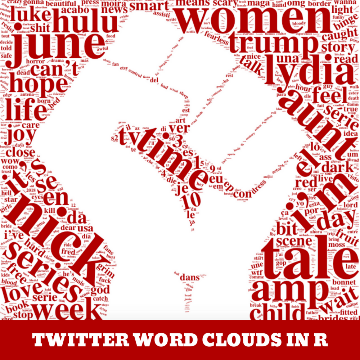

Awesome Twitter Word Clouds in R

Awesome Twitter Word Clouds in R

https://www.littlemissdata.com/blog/wordclouds

Tap into Twitter data and create custom word clouds that will visualize the conversation in an impactful way. Analysis performed with R.