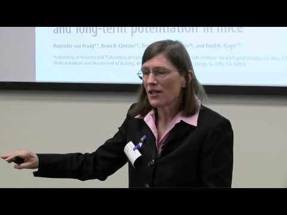

Barbara Oakley: "Learning How to Learn" | Talks at Google - YouTube

Barbara Oakley: "Learning How to Learn" | Talks at Google
https://www.youtube.com/watch?v=vd2dtkMINIw
[Talks at Google](https://www.youtube.com/channel/UCbmNph6atAoGfqLoCL_duAg)
308,707 views views
Published on Feb 22, 2015

|     |
| --- |
| [(L)](https://www.youtube.com/watch?v=vd2dtkMINIw) |

Description

About the Book: Whether you are a student struggling to fulfill a math or science requirement, or you are embarking on a career change that requires a higher level of math competency, A Mind for Numbers offers the tools you need to get a better grasp of that intimidating but inescapable field. Engineering professor Barbara Oakley knows firsthand how it feels to struggle with math. She flunked her way through high school math and science courses, before enlisting in the army immediately after graduation. When she saw how her lack of mathematical and technical savvy severely limited her options—both to rise in the military and to explore other careers—she returned to school with a newfound determination to re-tool her brain to master the very subjects that had given her so much trouble throughout her entire life.

In A Mind for Numbers, Dr. Oakley lets us in on the secrets to effectively learning math and science—secrets that even dedicated and successful students wish they’d known earlier. Contrary to popular belief, math requires creative, as well as analytical, thinking. Most people think that there’s only one way to do a problem, when in actuality, there are often a number of different solutions—you just need the creativity to see them. For example, there are more than three hundred different known proofs of the Pythagorean Theorem. In short, studying a problem in a laser-focused way until you reach a solution is not an effective way to learn math. Rather, it involves taking the time to step away from a problem and allow the more relaxed and creative part of the brain to take over. A Mind for Numbers shows us that we all have what it takes to excel in math, and learning it is not as painful as some might think! About the Author: Barbara Oakley is a professor of engineering at Oakland University in Rochester, Michigan. She has received many awards for her teaching, including the coveted National Science Foundation New Century Scholar Award.