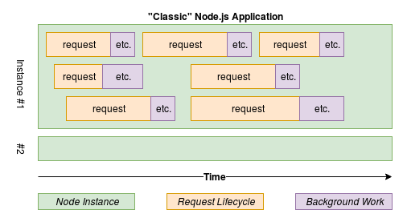
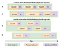
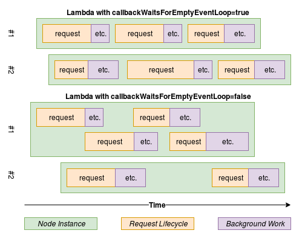
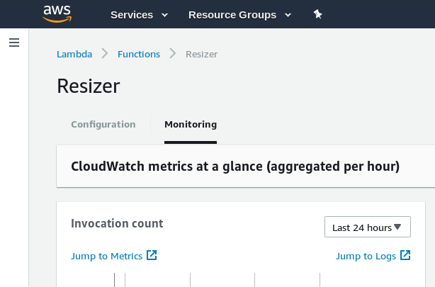

Basic Node.js Lambda Function Concepts – intrinsic – Medium

# Basic Node.js Lambda Function Concepts

*In this three-part-series we’ll look at getting a Node.js application which performs image resizing running on AWS Lambda. We’ll look at ****how Node.js applications work****, then we’ll configure our AWS account and get the AWS CLI utility working. We’ll Create a Lambda Function within AWS and configure an Application Gateway which is required to route HTTP requests to our Lambda Function. All the while we’ll be looking at features of Lambda, both basic and advanced, while also taking into consideration security implications.*

In this second part of our series we’re going to go over a bunch of basic concepts, such as how Node.js itself normally runs, how Node.js runs inside of Lambda, and finally we’ll look at the different methods for invoking Lambda functions and the pros and cons of each. If you’re just joining us, check out the first part, [Creating and Integrating a Node Lambda function with API Gateway](https://medium.com/intrinsic/creating-and-integrating-a-node-lambda-function-with-api-gateway-a0c8325b34f7).

### Introduction to Node.js Applications

Before we dive into the details of running a Node.js application on Lambda, let’s first cover a bit of background on how Node.js applications generally work. Feel free to skip this section if you already consider yourself an expert in this area.

A typical Node.js application is a long-lived application. For example, if you deploy a Node.js application and expect it to function over the course of a month, then that Node.js process will probably run for the entire month. Throughout the lifetime of the Node.js application one can mutate variables and application-state persisted in memory. This is very different from some other programming models. As an example, consider a PHP application. A PHP script will typically execute, serve its purpose, and then exit, all within a short amount of time, such as 100ms.

Another feature that sets Node.js apart is that a typical Node.js application will be making use of a built-in web server and will be serving up responses to HTTP requests. A technology like PHP typically requires the use of a web server, such as Apache or Nginx, to invoke PHP scripts. However with Node.js we’re usually making use of its underlying HTTP module and optionally using a web framework with it, such as Express.js.

*> Of course, Node.js isn’t limited to only serving web traffic. It can be used to build long-running daemon processes, it can be executed as an ephemeral CLI application, it’s even used to power popular desktop IDE software. This makes Node.js a very flexible and powerful programming platform!*

A Node.js application (or, more specifically JavaScript, the language which powers Node.js) is single threaded. This means that the language is only able to process one instruction at a time. However, this doesn’t mean that we’re only able to process a single request at a time. Far from it, in fact! Depending on the workload, Node.js can process thousands of simultaneous requests without breaking a sweat.

Normal Node.js Request Lifecycle

This describes how a “normal” Node.js web server runs. The green boxes in the diagram represent an independent instance of Node.js running. The x-axis represents time, and the y-axis doesn’t really represent anything, it’s just used to prevent the boxes from overlapping. This application receives incoming HTTP requests, does some work, and then replies with a result (represented by the orange boxes). However this application also does some extra work after the request has completed, perhaps some sort of cleanup task. This is represented in purple. As you can see, our Node.js instance is able to process multiple requests simultaneously.

The reason Node.js is able to process many requests in parallel is because most of the time spent serving a request (within a typical Node.js application) takes place outside of JavaScript. Consider when an incoming HTTP request results in a call to a database. Perhaps the request from the Node.js application to the database server takes **10ms**, the query takes **30ms** to execute, and another **10ms** for the response to return to the Node.js process. This means Node.js spent **50ms** waiting for a response to the database query, and during those 50ms it was able to accept other HTTP requests and also make other outbound database queries. In this situation the database is performing most of the CPU intensive work and perhaps Node.js is instead performing less intensive work such as converting the database response to JSON and replying to the incoming request.

When it comes to scaling Node.js applications we will usually do so by running more Node.js processes. We can then have a service listen for requests (e.g. HAProxy, Nginx, Node.js Cluster) and then distribute those requests amongst the listening Node.js processes. For example, if we have two Node.js instances running, we can send request #1 to Instance #1, request #2 to Instance #2, request #3 to Instance #1, etc. This scales pretty easily, however we do have to manage the “scaling” of our applications. For example, during a slow period, perhaps we only need a single Node.js instance running. However, during a busy period, we may need three or four Node.js instances running. Of course, we also have to pay for those running instances in some manner or another. Running too many underutilized Node.js instances means we’re wasting money, and running too few over-utilized instances means our application will become slow and unstable.

Another pain-point of running Node.js applications is that we need to keep them up-to-date and secure. As an example, when new versions of Node.js are released, they sometimes fix security vulnerabilities introduced in previous versions. Deploying a new version of Node.js can be difficult and can come with a small amount of downtime during the upgrade.

This is where the “Serverless” or “Functions” paradigm comes into play. Lambda will automatically scale the number of running application instances for us in order to satisfy the amount of requests coming in. Lambda also worries about the version of Node.js we’re using; in theory they can simply release new patch versions of Node.js and our running Functions will switch over.

Now that we’re familiar with how Node.js applications work in general, let’s look at how they behave a little differently when run as Lambda Functions.

### Lambda Function Basics

Lambda Functions have a Name, which is a string to represent the function throughout AWS. Lambda Functions also have a Handler Name, which is also a string. When working with Node.js applications the Handler Name has two parts. The first part is the name of the JavaScript file in the root of the Lambda Function (without an extension), then a period, then the name of the exported function. So if you have a file named `resizer.js` and an exported method named `downloadAndResize`, then your handler would be `resizer.downloadAndResize`. It's possible to have multiple handlers within the same function and switch between them without needing to do a redeploy (more on this later).

When we configure our Lambda function we will use this Name to tell Lambda how to load our application. Unlike a typical Node.js application we won’t be including our own web server. We also won’t be executing our Node.js script directly. Instead, Lambda will require our JavaScript file and then execute our exported handler function each time the function is invoked.

As an example of this, consider the following code sample. In a sense it resembles the HTTP request handlers we’re used to writing in Node.js. However we do not describe the URL endpoints, describe a method, or really do anything with HTTP at all.

The first thing we do in this code sample is take the `.url` property from the `event` parameter and pass it into the `downloadImage()` function. The `event` parameter will change depending on how your function is invoked. In this case we're assuming it first comes from an HTTP request being sent to an API Gateway. The `.url` property could be extracted from a JSON body posted to the API Gateway.

Once the download has happened we will then pass the result to `resizeImage()`. Once that is complete we will end the request and send a response back to the requestor. However, we still have some more work to do! In this case we're optimistically assuming the following `saveImage()` operation will succeed.

module.exports.downloadAndResize = (event, context, callback) => {
// Request (orange box) starts now
downloadImage(event.url, (err, data) => {
resizeImage(data, (err, result) => {
callback(null, result);
// Request (orange box) ends now
// Etc Background Work (purple box) starts now
saveImage(path, (err) => {
// Etc Background Work (purple box) ends now
});
});
});
};

Note that there are three arguments provided to your handler function. The first one is `event` and will provide information about the originating request. The data you receive will depend on how API Gateway is configured, e.g. if URL parameters should be provided. The next argument is `context` and contains meta information about the request / running Lambda instance. For a list of every property see [The Context Object](https://docs.aws.amazon.com/lambda/latest/dg/nodejs-prog-model-context.html) in the AWS documentation. The final argument is the idiomatic Node.js callback, which is used to send information back to the caller and signal that your Lambda invocation is complete.

Earlier we covered how Node.js applications are different from some other paradigms wherein Node.js is able to respond to many different requests at the same time. One thing that is interesting about Lambda Functions is that a particular Node.js instance will only ever handle a single request at a time! This means that if we do a lot of work outside of our Node.js process, then our Node.js process is going to be mostly idle. It also means that if we were to call blocking “synchronous” functions (i.e. `fs.readFileSync()`), instead of "asynchronous" calls (i.e. `fs.readFile()`), we won't suffer the usual performance penalty we get when serving many simultaneous requests in a single Node.js instance. *However, I don’t recommend using the *`*Sync`* versions of Node.js API methods in your Lambda functions, as that would hurt the portability of your application.*

The default behavior is that Lambda will wait for *all* scheduled work (work queued up in the event loop) to complete before allowing the next request to get called in a particular instance. In the case of our code that means Lambda will wait for the final `saveImage()` callback to fire before allowing another request through. However, it could be that the work we're still performing is fine to run at the same time as the normal request handler. Luckily, we can override this behavior by changing the `context.callbackWaitsForEmptyEventLoop` flag, which has a default value of **true**, to **false**.

The following graphic shows how the behavior changes when setting this flag. You can see that in the first example there are no overlaps in the purple section of the requests, but in the second example there are.

Lambda Node.js Request Lifecycle

### Filesystem Limitations

One of the limitations of running code in Lambda is that an application is only allowed to write to `/tmp`. If you try to write outside of that directory you'll get an `EROFS` error. The kinds of applications which run on Lambda shouldn't ever need to write anywhere else, but this limitation may require a small application change when porting legacy apps to Lambda. There's no guarantee that anything written to `/tmp` will remain for long. The data written here is only available to the current instance, which could get destroyed at any time.

### Cloudwatch Logs

By default, logs written from your Lambda applications (e.g. anything sent to stdout/stderr, like calling `console.log()`) will be sent to Cloudwatch. To view the Cloudwatch logs, navigate to the the screen for your particular Lambda Function. This can be done by clicking the **Services** dropdown at the top of any AWS screen, searching for Lambda, and clicking the name of your Function. Switch from the default Configuration screen to the **Monitoring** screen. Finally, click **Jump to Logs** on one of the graphs.

Navigating to Cloudwatch Logs

Once you’re on the Cloudwatch screen you’ll see a list of entries correlating to the invocations of your function. Since we’re not logging anything yet with our function the output is pretty plain looking and only logs start time, end time, and billing calculation:

START RequestId: 863d8bff-2d64-dead-beef-0f54868eabb6 Version: $LATEST
END RequestId: 863d8bff-2d64-dead-beef-0f54868eabb6
REPORT RequestId: 863d8bff-2d64-dead-beef-0f54868eabb6 Duration: 17.12 ms
Billed Duration: 100 ms Memory Size: 128 MB Max Memory Used: 20 MB

### Methods for Invoking a Lambda Function

There are a few methods we can choose to invoke a Lambda function. Each has their pros and cons.

### Invoke via CLI

The default way to invoke a Function, which is available upon creating a function, is to do so using the command line. This was the very first way we chose to invoke our Function in the previous post. Invoking a function in this manner looks like the following:

$ aws lambda invoke \
--invocation-type RequestResponse \
--function-name ${FUNCTION_NAME} \
--region ${REGION} \
--payload ${DATA}

However, invoking Lambda functions using the command line isn’t too useful. It’s fine for one-off administrative tasks. But if we want to do something more complex, like call it as a web hook or use it as part of a contact form, we’re going to need something more advanced.

The benefits of invoking a function in this manner is that it doesn’t incur any costs (other than the normal billing involved with Lambda). It also doesn’t require any additional configuration on our behalf.

### Invoke via API Gateway (HTTP)

The most popular method for triggering a Lambda function is to make an HTTP request. This was the second way we chose to invoke our function in the previous post. Unfortunately there isn’t an HTTP handler setup for us by default. For that we’re going to need to use a tool like API Gateway. This tool will allow us to setup a URL and a way to map that URL to our function(s).

Of course, API Gateway isn’t free. There’s also a bit of additional setup involved to get it to invoke our Functions. For example, you need to create endpoints, specify their methods, describe the data you’re expecting, etc. The benefit though is that you can now invoke your Function using the familiar HTTP protocol.

There are sort of two approaches for receiving files when using the API Gateway. If a file is small, say only a few MB, you can upload the file via a form upload. This increases filesize overhead of about 1/3 due to Base64 encoding. There’s also a limitation of 10MB. Another approach (which we’ll use in part III of this series) is that when you invoke the Function, instead of providing the file, we instead provide a URL to the file. We then let the Function download the file before processing it, allowing us to bypass the size limitations.

### Invoke via S3

Another popular way to trigger Lambda functions is to hook them into various other parts of the AWS infrastructure. As an example, we can configure Amazon S3 to trigger a function when a file is uploaded to a particular directory in a particular bucket.

Again, this is going to require some additional setup, as well as additional fees to pay for S3. One caveat with invoking Lambda functions via S3 uploads is that you don’t get the immediate feedback if a failure occurs. For example, if you invoke via CLI you can get an error in your terminal if it fails. If you make an HTTP request and a failure happens you can get a failed status code in return. However, with S3, the operations happen in the background. The only way you can get the errors is either by keeping an eye on Cloudwatch or specifically writing code to send you an alert when failure happens.

However, if an operation triggered via S3 fails, it will by default re-attempt to call your Function a few times until it succeeds. Another benefit is a lack of size overhead. For example, if you invoke via CLI or API Gateway, there’s a limitation of ~10MB that the payload can be. When Lambda calls your function it provides a giant JSON string with content Base64 encoded to represent the payload. However, with S3, when your function is invoked you will get information about the files location in S3. You can then stream the contents of that file into your application to process. Unfortunately, this does come with the added complexity of needing to install and configure the AWS SDK in your Node.js application.

In the next and final post in this series we’re going to build out an example Node.js application which performs image resizing. We’ll also correlate the function calls and timing in the code to the colored boxes in the diagrams shown in this post. Finally we’ll look at some more advanced Lambda features as well.

This article was written by me, Thomas Hunter II. I work at a company called [Intrinsic](https://intrinsic.com/) where we specialize in writing software for securing Node.js applications. We currently have a product called **Intrinsic for Lambda** which follows the *Least Privilege* model for securing applications. Our product is very powerful and is easy to implement. If you are looking for a way to secure your Node.js applications, give me a shout at [tom@intrinsic.com](https://medium.com/intrinsic/basic-node-js-lambda-function-concepts-c0d1e00d4528mailto:tom@intrinsic.com).