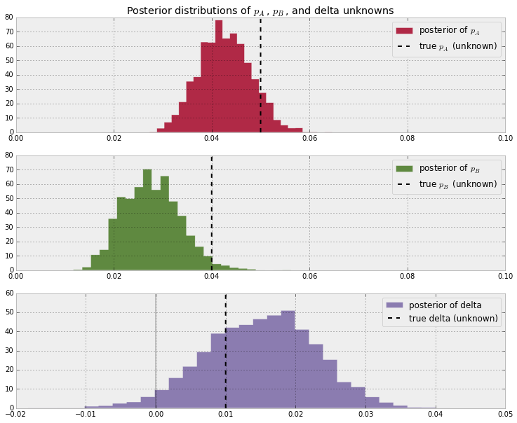
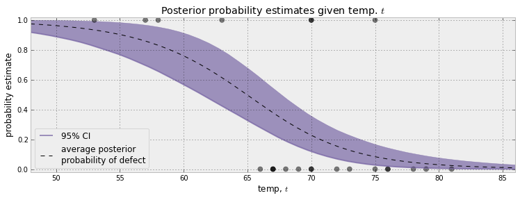
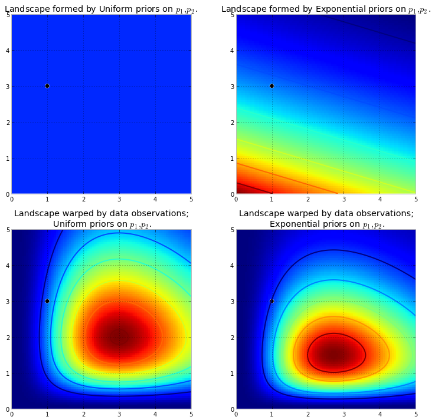
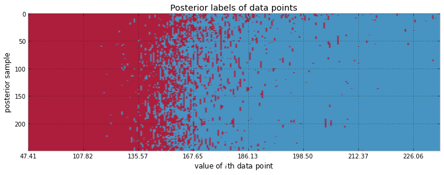
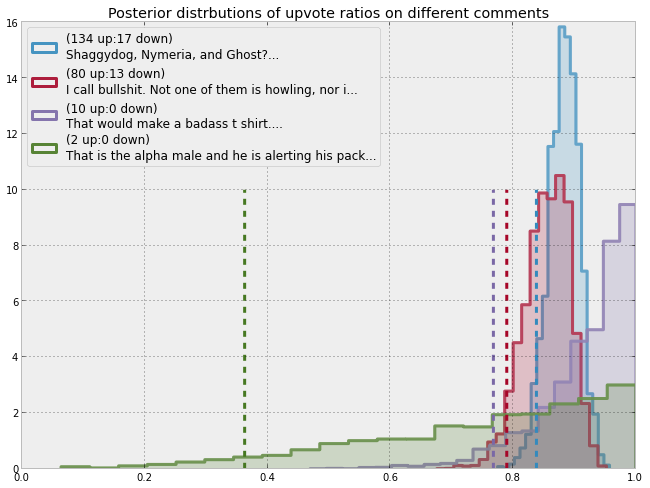
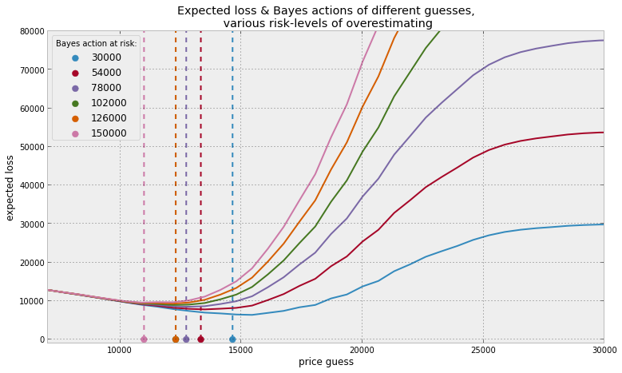
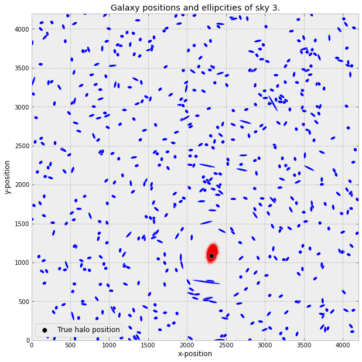
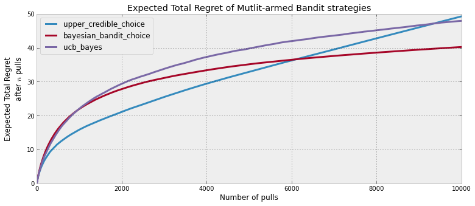
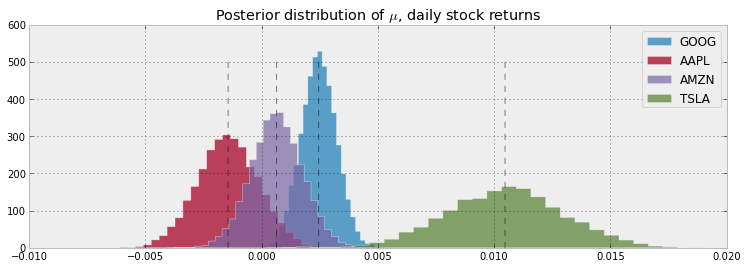

Bayesian Methods for Hackers

## An intro to Bayesian methods and probabilistic programming from a computation/understanding-first, mathematics-second point of view.

1.   [Prologue](https://camdavidsonpilon.github.io/Probabilistic-Programming-and-Bayesian-Methods-for-Hackers/#prologue)

2.   [Contents](https://camdavidsonpilon.github.io/Probabilistic-Programming-and-Bayesian-Methods-for-Hackers/#contents)

3.   [Examples](https://camdavidsonpilon.github.io/Probabilistic-Programming-and-Bayesian-Methods-for-Hackers/#examples)

4.   [Reading and Installation Instructions](https://camdavidsonpilon.github.io/Probabilistic-Programming-and-Bayesian-Methods-for-Hackers/#using-the-book)

5.   [Development](https://camdavidsonpilon.github.io/Probabilistic-Programming-and-Bayesian-Methods-for-Hackers/#development)

## [(L)](https://camdavidsonpilon.github.io/Probabilistic-Programming-and-Bayesian-Methods-for-Hackers/#prologue)Prologue

The Bayesian method is the natural approach to inference, yet it is hidden from readers behind chapters of slow, mathematical analysis. The typical text on Bayesian inference involves two to three chapters on probability theory, then enters what Bayesian inference is. Unfortunately, due to mathematical intractability of most Bayesian models, the reader is only shown simple, artificial examples. This can leave the user with a *so-what* feeling about Bayesian inference. In fact, this was the author's own prior opinion.

After some recent success of Bayesian methods in machine-learning competitions, I decided to investigate the subject again. Even with my mathematical background, it took me three straight-days of reading examples and trying to put the pieces together to understand the methods. There was simply not enough literature bridging theory to practice. The problem with my misunderstanding was the disconnect between Bayesian mathematics and probabilistic programming. That being said, I suffered then so the reader would not have to now. This book attempts to bridge the gap.

If Bayesian inference is the destination, then mathematical analysis is a particular path towards it. On the other hand, computing power is cheap enough that we can afford to take an alternate route via probabilistic programming. The latter path is much more useful, as it denies the necessity of mathematical intervention at each step, that is, we remove often-intractable mathematical analysis as a prerequisite to Bayesian inference. Simply put, this latter computational path proceeds via small intermediate jumps from beginning to end, where as the first path proceeds by enormous leaps, often landing far away from our target. Furthermore, without a strong mathematical background, the analysis required by the first path cannot even take place.

*Bayesian Methods for Hackers* is designed as a introduction to Bayesian inference from a computational/understanding-first, and mathematics-second, point of view. Of course as an introductory book, we can only leave it at that: an introductory book. For the mathematically trained, they may cure the curiosity this text generates with other texts designed with mathematical analysis in mind. For the enthusiast with less mathematical-background, or one who is not interested in the mathematics but simply the practice of Bayesian methods, this text should be sufficient and entertaining.

## [(L)](https://camdavidsonpilon.github.io/Probabilistic-Programming-and-Bayesian-Methods-for-Hackers/#tensorflow)TensorFlow Probability port available!

**Bayesian Methods for Hackers has been ported to TensorFlow Probability**. With collaboration from the TensorFlow Probability team at Google, there is now an updated version of Bayesian Methods for Hackers that uses TensorFlow Probability (TFP).

This is a great way to learn TFP, from the basics of how to generate random variables in TFP, up to full Bayesian modelling using TFP. Furthermore, the chapters are in Google's Colab form, so you can easily run and modify the examples present to experiment easier. Get started [with Chapter 1](https://github.com/CamDavidsonPilon/Probabilistic-Programming-and-Bayesian-Methods-for-Hackers/blob/master/Chapter1_Introduction/Ch1_Introduction_TFP.ipynb)!

## [(L)](https://camdavidsonpilon.github.io/Probabilistic-Programming-and-Bayesian-Methods-for-Hackers/#printed)Printed version now available!

**Bayesian Methods for Hackers is now available in print**. You can pick up your copy at [Amazon](http://www.amazon.com/Bayesian-Methods-Hackers-Probabilistic-Addison-Wesley/dp/0133902838).

Differences between the print version and the online version include:

- Additional Chapter on Bayesian A/B testing

- Updated examples

- Answers to the end of chapter questions

- Additional explaination, and rewritten sections to aid the reader.

## [(L)](https://camdavidsonpilon.github.io/Probabilistic-Programming-and-Bayesian-Methods-for-Hackers/#contents)Contents

(The below chapters are rendered via the *nbviewer* at[nbviewer.ipython.org/](http://nbviewer.ipython.org/), and is read-only and rendered in real-time. Interactive notebooks + examples can be downloaded by cloning!

- [**Prologue:**](http://nbviewer.ipython.org/urls/raw.github.com/CamDavidsonPilon/Probabilistic-Programming-and-Bayesian-Methods-for-Hackers/master/Prologue/Prologue.ipynb) Why we do it.
- [**Chapter 1: Introduction to Bayesian Methods**](http://nbviewer.jupyter.org/github/CamDavidsonPilon/Probabilistic-Programming-and-Bayesian-Methods-for-Hackers/blob/master/Chapter1_Introduction/Ch1_Introduction_PyMC3.ipynb)Introduction to the philosophy and practice of Bayesian methods and answering the question, "What is probabilistic programming?"
- [**Chapter 2: A little more on PyMC**](http://nbviewer.jupyter.org/github/CamDavidsonPilon/Probabilistic-Programming-and-Bayesian-Methods-for-Hackers/blob/master/Chapter2_MorePyMC/Ch2_MorePyMC_PyMC3.ipynb)We explore modeling Bayesian problems using Python's PyMC library through examples. How do we create Bayesian models?
- [**Chapter 3: Opening the Black Box of MCMC**](http://nbviewer.jupyter.org/github/CamDavidsonPilon/Probabilistic-Programming-and-Bayesian-Methods-for-Hackers/blob/master/Chapter3_MCMC/Ch3_IntroMCMC_PyMC3.ipynb)We discuss how MCMC, Markov Chain Monte Carlo, operates and diagnostic tools.
- [**Chapter 4: The Greatest Theorem Never Told**](http://nbviewer.jupyter.org/github/CamDavidsonPilon/Probabilistic-Programming-and-Bayesian-Methods-for-Hackers/blob/master/Chapter4_TheGreatestTheoremNeverTold/Ch4_LawOfLargeNumbers_PyMC3.ipynb)We explore an incredibly useful, and dangerous, theorem: The Law of Large Numbers.
- [**Chapter 5: Would you rather lose an arm or a leg?**](http://nbviewer.jupyter.org/github/CamDavidsonPilon/Probabilistic-Programming-and-Bayesian-Methods-for-Hackers/blob/master/Chapter5_LossFunctions/Ch5_LossFunctions_PyMC3.ipynb)The introduction of loss functions and their (awesome) use in Bayesian methods.
- [**Chapter 6: Getting our *prior*-ities straight**](http://nbviewer.jupyter.org/github/CamDavidsonPilon/Probabilistic-Programming-and-Bayesian-Methods-for-Hackers/blob/master/Chapter6_Priorities/Ch6_Priors_PyMC3.ipynb)Probably the most important chapter. We examine our prior choices and draw on expert opinions craft priors.
- **Chapter X1: Bayesian methods in Machine Learning and Model Validation** We explore how to resolve the overfitting problem plus popular ML methods.
- **Chapter X2: More PyMC Hackery**We explore the gritty details of PyMC.

**More questions about PyMC?**Please post your modeling, convergence, or any other PyMC question on [cross-validated](http://stats.stackexchange.com/), the statistics stack-exchange.

## [(L)](https://camdavidsonpilon.github.io/Probabilistic-Programming-and-Bayesian-Methods-for-Hackers/#examples)Examples from the book

Below are just **some** examples from Bayesian Methods for Hackers.

### Inferring behaviour changes using SMS message rates

Chapter 1

By only visually inspecting a noisy stream of daily SMS message rates, it can be difficult to detect a sudden change in the users's SMS behaviour. In our first probabilistic programming example, we solve the problem by setting up a simple model to detect probable points where the user's behaviour changed, and examine *pre* and *post* behaviour.

 

###  Simpler AB Testing

Chapter 2

AB testing, also called randomized experiments in other literature, is a great framework for determining the difference between competing alternatives, with applications to web designs, drug treatments, advertising, plus much more.

With our new interpretation of probability, a more intuitive method of AB testing is demonstrated. And since we are not dealing with confusing ideas like p-values or Z-scores, we can compute more understandable quantities about our uncertainty.

 

###  Discovering cheating while maintaining privacy

Chapter 2

A very simple algorithm can be used to infer proportions of cheaters, while also maintaining the privacy of the population. For each participant in the study:

1. Have the user privately flip a coin. If heads, answer "Did you cheat?"truthfully.

2. If tails, flip again. If heads, answer "Yes" regardless of the truth; if tails, answer "No".

This way, the suveyor's do not know whether a cheating confession is a result of cheating or a heads on the second coin flip. But how do we cut through this scheme and perform inference on the true proportion of cheaters? 

### Challenger Space Shuttle disaster

Chapter 2

On January 28, 1986, the twenty-fifth flight of the U.S. space shuttle program ended in disaster when one of the rocket boosters of the Shuttle Challenger exploded shortly after lift-off, killing all seven crew members. The presidential commission on the accident concluded that it was caused by the failure of an O-ring in a field joint on the rocket booster, and that this failure was due to a faulty design that made the O-ring unacceptably sensitive to a number of factors including outside temperature. Of the previous 24 flights, data were available on failures of O-rings on 23, (one was lost at sea), and these data were discussed on the evening preceding the Challenger launch, but unfortunately only the data corresponding to the 7 flights on which there was a damage incident were considered important and these were thought to show no obvious trend.

We examine this data in a Bayesian framework and show strong support that a faulty O-ring, caused by low abmient temperatures, was likely the cause of the disaster.

 

###  Understanding Bayesian posteriors and MCMC

Chapter 3

The prior-posterior paradigm is visualized to make understanding the MCMC algorithm more clear. For example, below we show how two different priors can result in two different posteriors. 

### Clustering data

Chapter 3

Given a dataset, sometimes we wish to ask whether there may be more than one hidden source that created it. *A priori*, it is not always clear this is the case. We introduce a simple model to try to pry data apart into two clusters.

 

### Sorting Reddit comments from best to worst

Chapter 4

Consider ratings on online products: how often do you trust an average 5-star rating if there is only 1 reviewer? 2 reviewers? 3 reviewers? We implicitly understand that with such few reviewers that the average rating is not a good reflection of the true value of the product. This has created flaws in how we sort items, and more generally, how we compare items. Many people have realized that sorting online search results by their rating, whether the objects be books, videos, or online comments, return poor results. Often the seemingly top videos or comments have perfect ratings only from a few enthusiastic fans, and truly more quality videos or comments are hidden in later pages with falsely-substandard ratings of around 4.8. How can we correct this? 

###  Solving the *Price is Right's* Showcase

Chapter 5

Bless you if you are ever chosen as a contestant on the Price is Right, for here we will show you how to optimize your final price on the Showcase. We create a Bayesian model of your best guess and your uncertainty in that guess, and push it through the odd Showdown loss function (closest wins, lose if you bid over). 

###  Kaggle's Dark World winning solution

Chapter 5

We implement Tim Saliman's winning solution to the [Observing Dark World's](http://www.kaggle.com/c/DarkWorlds) contest on the data science website Kaggle. 

###  Bayesian Bandits - a solution to the Multi-Armed Bandit problem

Chapter 6

Suppose you are faced with N slot machines (colourfully called multi-armed bandits). Each bandit has an unknown probability of distributing a prize (assume for now the prizes are the same for each bandit, only the probabilities differ). Some bandits are very generous, others not so much. Of course, you don't know what these probabilities are. By only choosing one bandit per round, our task is devise a strategy to maximize our winnings. 

###  Stock Market analysis

Chapter 6

For decades, finance students have been taught using naive statistical methods to pick stocks. This has caused terrible inference, mostly caused by two things: temporal parameters and ignoring uncertainty. The first is harder to solve, the second fits right into a Bayesian framework. 

## [(L)](https://camdavidsonpilon.github.io/Probabilistic-Programming-and-Bayesian-Methods-for-Hackers/#using-the-book)Using the book

The book can be read in three different ways, starting from most recommended to least recommended:

1. The most recommended option is to clone the repository to download the .ipynb files to your local machine. If you have IPython installed, you can view the chapters in your browser *plus* edit and run the code provided (and try some practice questions). This is the preferred option to read this book, though it comes with some dependencies.

    - IPython v0.13 (or greater) is a requirement to view the ipynb files. It can be downloaded [here](http://ipython.org/). IPython notebooks can be run by `(your-virtualenv) ~/path/to/the/book/Chapter1_Introduction $ ipython notebook`
    - For Linux users, you should not have a problem installing NumPy, SciPy, Matplotlib and PyMC. For Windows users, check out [pre-compiled versions](http://www.lfd.uci.edu/~gohlke/pythonlibs/) if you have difficulty.
    - In the styles/ directory are a number of files (.matplotlirc) that used to make things pretty. These are not only designed for the book, but they offer many improvements over the default settings of matplotlib.
    - while technically not required, it may help to run the IPython notebook with `ipython notebook --pylab inline` flag if you encounter io errors.

2. The second, preferred, option is to use the nbviewer.ipython.org site, which display IPython notebooks in the browser ([example](http://nbviewer.ipython.org/urls/raw.github.com/CamDavidsonPilon/Probabilistic-Programming-and-Bayesian-Methods-for-Hackers/master/Chapter1_Introduction/Chapter1_Introduction.ipynb)). The contents are updated synchronously as commits are made to the book. You can use the Contents section above to link to the chapters.

3. **PDF versions are available! Look in the PDF/ directory.** PDFs are the least-prefered method to read the book, as pdf's are static and non-interactive. If PDFs are desired, they can be created dynamically using Chrome's builtin print-to-pdf feature or using the [nbconvert](https://github.com/ipython/nbconvert) utility.

### [(L)](https://camdavidsonpilon.github.io/Probabilistic-Programming-and-Bayesian-Methods-for-Hackers/#installation-and-configuration)Installation and configuration

If you would like to run the IPython notebooks locally, (option 1. above), you'll need to install the following:

1.  IPython 0.13 is a requirement to view the ipynb files. It can be downloaded [here](http://ipython.org/ipython-doc/dev/install/index.html)

2. For Linux users, you should not have a problem installing NumPy, SciPy and PyMC. For Windows users, check out [pre-compiled versions](http://www.lfd.uci.edu/~gohlke/pythonlibs/) if you have difficulty. Also recommended, for data-mining exercises, are [PRAW](https://github.com/praw-dev/praw) and [requests](https://github.com/kennethreitz/requests).

3. In the styles/ directory are a number of files that are customized for the notebook. These are not only designed for the book, but they offer many improvements over the default settings of matplotlib and the IPython notebook. The in notebook style has not been finalized yet.

## [(L)](https://camdavidsonpilon.github.io/Probabilistic-Programming-and-Bayesian-Methods-for-Hackers/#development)Development

This book has an unusual development design. The content is open-sourced, meaning anyone can be an author. Authors submit content or revisions using the GitHub interface.

### What to contribute?

1. The current chapter list is not finalized. If you see something that is missing (MCMC, MAP, Bayesian networks, good prior choices, Potential classes etc.), feel free to start there.

2. Cleaning up Python code and making code more PyMC-esque
3. Giving better explanations
4. Spelling/grammar mistakes
5. Suggestions
6. Contributing to the IPython notebook styles

We would like to thank the Python community for building an amazing architecture. We would like to thank the statistics community for building an amazing architecture.

Similarly, the book is only possible because of the [PyMC](http://github.com/pymc-devs/pymc) library. A big thanks to the core devs of PyMC: Chris Fonnesbeck, Anand Patil, David Huard and John Salvatier.

One final thanks. This book was generated by IPython Notebook, a wonderful tool for developing in Python. We thank the IPython community for developing the Notebook interface. All IPython notebook files are available for download on the GitHub repository.

#### [(L)](https://camdavidsonpilon.github.io/Probabilistic-Programming-and-Bayesian-Methods-for-Hackers/#contact)Contact

Contact the main author, Cam Davidson-Pilon at [cam.davidson.pilon@gmail.com](https://camdavidsonpilon.github.io/Probabilistic-Programming-and-Bayesian-Methods-for-Hackers/#contentsmailto:cam.davidson.pilon@gmail.com) or [@cmrn_dp](https://twitter.com/cmrn_dp)

### Reviews

*These are satirical, but real*

"No, but it looks good" - [John D. Cook](https://twitter.com/JohnDCook/status/359672133695184896)

"I ... read this book ... I like it!" - [Andrew Gelman](http://www.andrewgelman.com/2013/07/21/bayes-related)

"This book is a godsend, and a direct refutation to that 'hmph! you don't know maths, piss off!' school of thought... The publishing model is so unusual. Not only is it open source but it relies on pull requests from anyone in order to progress the book. This is ingenious and heartening" - [excited Reddit user](http://www.reddit.com/r/Python/comments/1alnal/probabilistic_programming_and_bayesian_methods/)