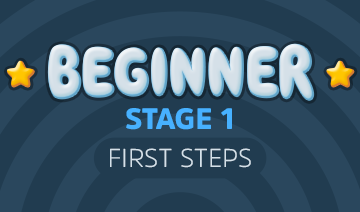

Beginner 1: First Steps

Beginner 1: First Steps

https://www.justinguitar.com/modules/beginner-1-first-steps

Learn three easy chords, A, D and E, very basic strumming and easy songs you can play with just these three chords (even some with just 2 chords!). Your fingers are go...