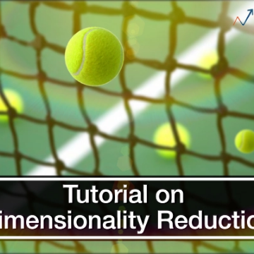

Beginners Guide To Learn Dimension Reduction Techniques

Beginners Guide To Learn Dimension Reduction Techniques

https://www.analyticsvidhya.com/blog/2015/07/dimension-reduction-methods/

This is a guide on dimension reduction or variable reduction techniques. It teaches its uses, benefits & various methods to reduce dimentions.