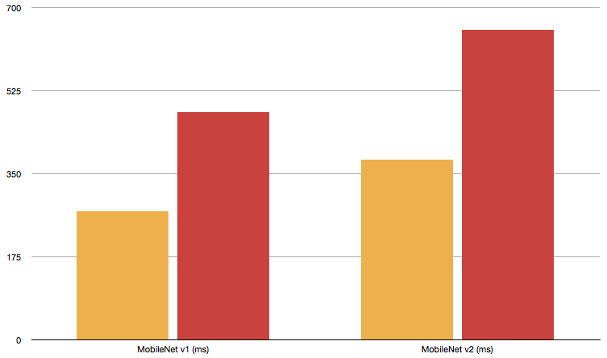
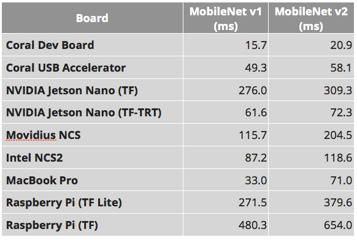
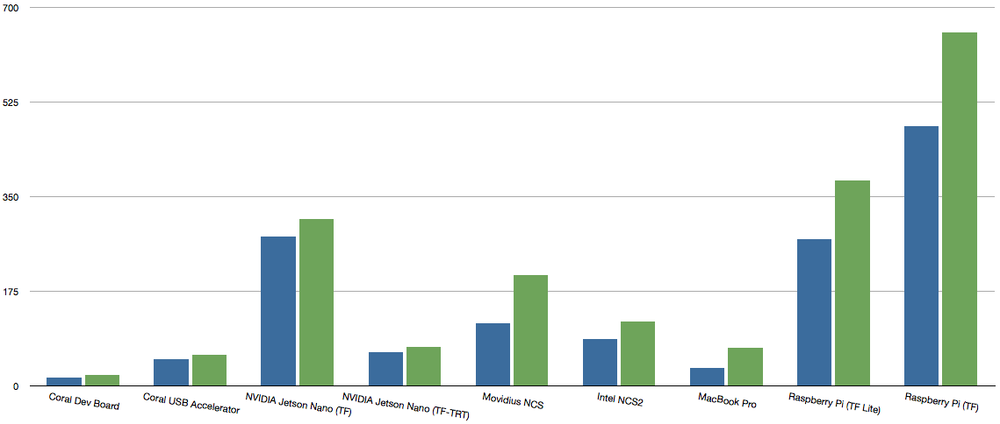
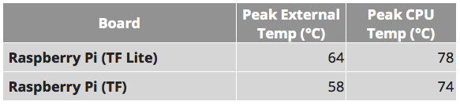
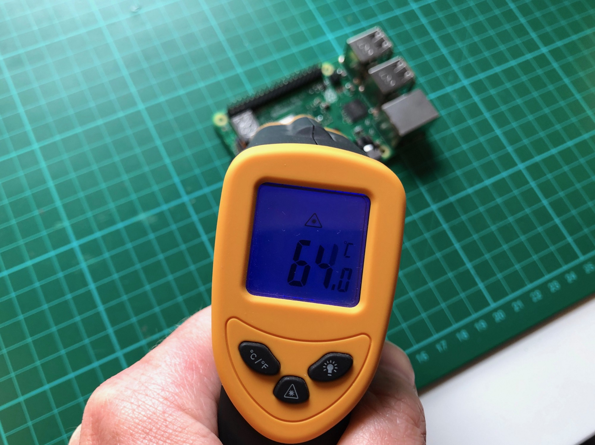
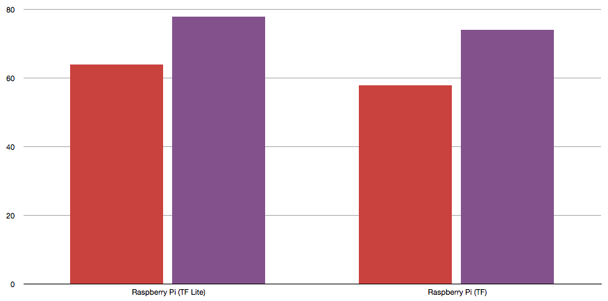
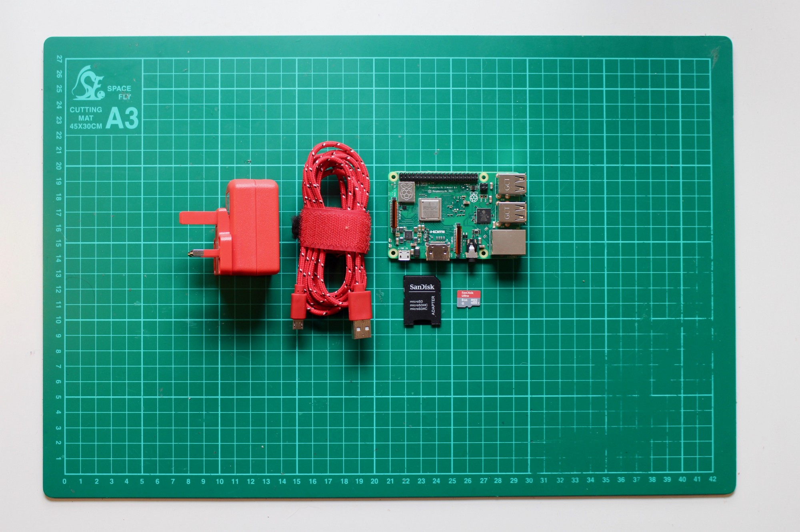

Benchmarking TensorFlow and TensorFlow Lite on the Raspberry Pi

# Benchmarking TensorFlow and TensorFlow Lite on the Raspberry Pi

[Alasdair Allan](https://blog.hackster.io/@aallan)
May 8·9 min read

I recently sat down to [benchmark the new accelerator hardware](https://medium.com/@aallan/benchmarking-edge-computing-ce3f13942245) that is now appearing on the market intended to speed up machine learning inferencing on the edge. But, so I’d have a rough yardstick for comparison, I also ran the same benchmarks on the Raspberry Pi.

However a lot of people complained that I should have used TensorFlow Lite for [those benchmarks](https://medium.com/@aallan/benchmarking-edge-computing-ce3f13942245) rather than TensorFlow. Enough people said it in fact, that I felt I really should see how much faster TensorFlow Lite was on the Raspberry Pi than ‘vanilla’ TensorFlow.

So, here goes…

#### Headline results from benchmarking

Using TensorFlow Lite we see a considerable speed increase when compared with the original results from [our previous benchmarks](https://medium.com/@aallan/benchmarking-edge-computing-ce3f13942245) using full TensorFlow.

We see an approximately ×2 increase in inferencing speed between the original TensorFlow figures and the new results using TensorFlow Lite.

### Part I—Benchmarking

#### A more detailed analysis of the results

Benchmarking was done using both [TensorFlow](https://www.tensorflow.org/) and [TensorFlow Lite](https://www.tensorflow.org/lite) on a [Raspberry Pi 3, Model B+](https://blog.hackster.io/meet-the-new-raspberry-pi-3-model-b-2783103a147) without any accelerator hardware. Inferencing was carried out with the [MobileNet v2 SSD](http://download.tensorflow.org/models/object_detection/ssd_mobilenet_v2_coco_2018_03_29.tar.gz) and [MobileNet v1 0.75 depth SSD](http://download.tensorflow.org/models/object_detection/ssd_mobilenet_v1_0.75_depth_300x300_coco14_sync_2018_07_03.tar.gz) models, both models trained on the [Common Objects in Context](http://cocodataset.org/#home) (COCO) dataset, converted to TensorFlow Lite.

A single 3888×2916 pixel [test image](https://www.dropbox.com/sh/osmt73s6f0uuw5k/AACYOaB1ezJUC2JuWA4wQg4Wa?dl=0&preview=fruit.jpg) was used containing two [recognisable objects](https://gist.github.com/aallan/fbdf008cffd1e08a619ad11a02b74fa8) in the frame, a banana and an apple. The image was resized down to 300×300 pixels before presenting it to the model, and each model was run 10,000 times before an average inferencing time was taken. The first inferencing run, which takes longer due to loading overheads, was discarded.

Benchmarking results in milli-seconds for [MobileNet v1 SSD 0.75 depth model](http://download.tensorflow.org/models/object_detection/ssd_mobilenet_v1_0.75_depth_300x300_coco14_sync_2018_07_03.tar.gz) and the [MobileNet v2 SSD model](http://download.tensorflow.org/models/object_detection/ssd_mobilenet_v2_coco_2018_03_29.tar.gz) both trained using the [Common Objects in Context](http://cocodataset.org/#home) (COCO) dataset with an input size of 300×300.

Comparing our new result with our [previously obtained benchmark figures](https://medium.com/@aallan/benchmarking-edge-computing-ce3f13942245) we see that using TensorFlow Lite for inferencing on an unaccelerated Raspberry Pi brings inferencing times very roughly into line with those seen from the NVIDIA Jetson Nano when using normal TensorFlow models before optimisation using NVIDIA’s [TensorFlow with TensorRT](https://github.com/tensorflow/tensorrt) library.

Inferencing speeds in milli-seconds for MobileNet SSD V1 (blue) and MobileNet SSD V2 (green) across all tested platforms. Lower numbers are good!

This is really rather suggestive that unoptimised ‘vanilla’ TensorFlow models are mostly running on the NVIDIA Jetson Nano’s processor, a 64-bit Quad-core ARM A57, rather than being offloaded to the GPU as you’d expect.

While it’s still extremely early days, TensorFlow Lite has recently [introduced support](https://medium.com/tensorflow/tensorflow-lite-now-faster-with-mobile-gpus-developer-preview-e15797e6dee7) for GPU acceleration for inferencing, and running models using TensorFlow Lite with GPU support should reduce the time needed for inferencing on the Jetson Nano. Taking our new results here on the Raspberry Pi as a yard stick we should expect the gap between the Jetson Nano and Google’s Coral hardware to close significantly at that point.

#### Heating and Cooling

As we observed last time the Raspberry Pi reached a high enough temperature during benchmarking that it suffered from thermal throttling of the CPU. This time we observed external temperatures in excess of those previously seen.

Peak external and peak CPU temperatures during inferencing in °C.

External temperatures were measured using a [laser infrared thermometer](https://amzn.to/2XLoZKm) which has an accuracy of ±2°C for temperatures ≤100°C after a extended test run of 50,000 inferences was completed.

Measuring the external temperature of the Raspberry Pi.

The CPU temperatures were as reported by the operating system using the following command line invocation.

**$ **paste <(cat /sys/class/thermal/thermal_zone*/type) <(cat /sys/class/thermal/thermal_zone*/temp) | column -s $'\t' -t | sed 's/\(.\)..$/.\1°C/'

cpu-thermal 77.3°C

Last time the Raspberry Pi reached a temperature of 74°C during extended testing which meant that it suffered from thermal throttling of the CPU, it came close to the 80°C point where additional incremental throttling would occur. This time we saw increased temperatures, peaking around 78°C.

Peak external (red, left hand bars) and peak CPU (purple, right hand bars) temps during inferencing in °C.

As before I’d recommend that, if you intended to run inferencing for extended periods using the Raspberry Pi, you should add at least a passive [heatsink](https://amzn.to/2GOp9KJ) to avoid throttling the CPU. It’s even possible that [a small fan](https://amzn.to/2W65dby) might also be a good idea. Because let’s face it, CPU [throttling can spoil your day](https://makezine.com/2016/03/02/raspberry-pi-3-not-halt-catch-fire/).

#### Summary

While adding TensorFlow Lite on the [Raspberry Pi](https://amzn.to/2IJHDye) to our benchmarks hasn’t changed the overall result, with the [Coral Dev Board](https://medium.com/@aallan/hands-on-with-the-coral-dev-board-adbcc317b6af) and [USB Accelerator](https://medium.com/@aallan/hands-on-with-the-coral-usb-accelerator-a37fcb323553) have a clear lead, with MobileNet models running between ×3 to ×4 times faster than the direct competitors. It’s really interesting to see that using TensorFlow Lite, and accepting the restrictions that the lightweight framework is going to place on you, increases performance this much.

While I was expecting things to run faster, a factor of ×2 is pretty impressive.

Both here and with our previous benchmarks I felt that approaching things in a relatively direct way, and trying as much as possible to keep the playing field level between platforms level, was the best approach to get a base line for how they all performed with respect to each other.

However there is obviously a great deal you can do with optimisation, both of the model you’re running and how you go about running it, to improve the inferencing speeds I talked about here and in [my original benchmarking piece](https://medium.com/@aallan/benchmarking-edge-computing-ce3f13942245). I’m not unaware of that, and I’ll be interested to see how others can improve on the work I’ve done here.

Yes, you can get these models to run faster. Now show us how to do that.

### Part II—Methodology

#### Installing TensorFlow Lite on the Raspberry Pi

Installing TensorFlow on [the Raspberry Pi](https://amzn.to/2UOSpcV) used to be [a difficult process](https://petewarden.com/2017/08/20/cross-compiling-tensorflow-for-the-raspberry-pi/), however towards the middle of last year everything [became a lot easier](https://medium.com/tensorflow/tensorflow-1-9-officially-supports-the-raspberry-pi-b91669b0aa0). Fortunately, thanks to the community, [installing TensorFlow Lite](https://github.com/PINTO0309/Tensorflow-bin) isn’t that much harder. We aren’t going to have to resort to building it from source.

Everything you need to get started setting up the Raspberry Pi

Go ahead and download the [latest release](https://www.raspberrypi.org/downloads/raspbian/) of Raspbian Lite and [set up your Raspberry Pi](https://medium.com/@aallan/setting-up-a-headless-raspberry-pi-zero-3ded0b83f274). Unless you’re using wired networking, or have a display and keyboard attached to the [Raspberry Pi](https://amzn.to/2UOSpcV), at a minimum you’ll need to put the Raspberry Pi on to your wireless network, and enable SSH.

Once you’ve set up your Raspberry Pi go ahead and power it on, and then open up a Terminal window on your laptop and SSH into the Raspberry Pi.

**% **ssh pi@raspberrypi.local

Fortunately while the [official TensorFlow binary distribution](https://medium.com/tensorflow/tensorflow-1-9-officially-supports-the-raspberry-pi-b91669b0aa0) does not include a build of TensorFlow Lite, there is an [unofficial distribution](https://github.com/PINTO0309/Tensorflow-bin) which does, and that means we don’t have to resort to [building and install from source](https://www.tensorflow.org/install/source_rpi).

Once you’re logged into your Raspberry Pi go ahead and update and install our build tools,

**$ **sudo apt-get update

`**$ **sudo apt-get install build-essential[[NEWLINE]]**$** `sudo apt-get install git

then go ahead and [install TensorFlow Lite](https://github.com/PINTO0309/Tensorflow-bin).

**$** sudo apt-get install libatlas-base-dev

**$ **`sudo apt-get install python3-pip[[NEWLINE]]`**$** git clone https://github.com/PINTO0309/Tensorflow-bin.git

**$** cd Tensorflow-bin
**$** pip3 install tensorflow-1.13.1-cp35-cp35m-linux_armv7l.whl

It’ll take some time to install. So you might want to take a break and get some coffee. Once it has finished installing you can test the installation as follows.

**$ **python3 -c "import tensorflow as tf; tf.enable_eager_execution(); print(tf.reduce_sum(tf.random_normal([1000, 1000])))"

Now TensorFlow has been successfully installed we’ll also need to go ahead and install OpenCV along with all its many dependences,

**$ **sudo apt-get install libwebp6 libwebp-dev
**$ **sudo apt-get install libtiff5 libtiff5-dev
**$** sudo apt-get install libjasper1 libjasper-dev
**$** sudo apt-get install libilmbase12 libilmbase-dev
**$** sudo apt-get install libopenexr22 libopenexr-dev
**$** sudo apt-get install libgstreamer0.10-0 libgstreamer0.10-dev
**$ **sudo apt-get install libgstreamer1.0-0 libgstreamer1.0-dev
**$ **sudo apt-get install libavcodec-dev
**$** sudo apt-get install libavformat57 libavformat-dev
**$ **sudo apt-get install libswscale4 libswscale-dev
**$** sudo apt-get install libqtgui4
**$** sudo apt-get install libqt4-test
**$ **pip3 install opencv-python

as we’ll need OpenCV for our benchmarking script later. For the same reason we need to install the [Pillow](https://pillow.readthedocs.io/en/stable/) fork of the Python Imaging Library (PIL) and the [NumPy](https://www.numpy.org/) library.

**$** pip3 install Pillow
**$** pip3 install numpy
We should now be ready to run our benchmarking scripts.

#### The benchmarking code

Our TensorFlow Lite benchmark script is slightly different than [the version](https://gist.github.com/aallan/064337cf38349c9f1cb8fae23497d6bd) we used when running full TensorFlow on the Raspberry Pi during our [previous benchmark](https://medium.com/@aallan/benchmarking-edge-computing-ce3f13942245) inferencing runs.

|     |     |
| --- | --- |
| 1   | #!/usr/bin/env python3 |
| 2   |     |
| 3   | import tensorflow as tf |
| 4   |     |
| 5   | import sys |
| 6   | import os |
| 7   | import logging as log |
| 8   | import argparse |
| 9   | import subprocess |
| 10  | from timeit import default_timer as timer |
| 11  |     |
| 12  | import cv2 |
| 13  | import numpy as np |
| 14  |     |
| 15  | from  PIL  import Image |
| 16  | from  PIL  import ImageFont, ImageDraw |
| 17  |     |
| 18  | # Function to draw a rectangle with width > 1 |
| 19  | def  draw_rectangle(draw, coordinates, color, width=1): |
| 20  |  for i in  range(width): |
| 21  | rect_start = (coordinates[0] - i, coordinates[1] - i) |
| 22  | rect_end = (coordinates[2] + i, coordinates[3] + i) |
| 23  | draw.rectangle((rect_start, rect_end), outline  = color, fill  = color) |
| 24  |     |
| 25  | # Function to read labels from text files. |
| 26  | def  ReadLabelFile(file_path): |
| 27  |  with  open(file_path, 'r') as f: |
| 28  | lines = f.readlines() |
| 29  | ret = {} |
| 30  |  for line in lines: |
| 31  | pair = line.strip().split(maxsplit=1) |
| 32  | ret[int(pair[0])] = pair[1].strip() |
| 33  |  return ret |
| 34  |     |
| 35  | def  inference_tf(runs, image, model, output, label=None): |
| 36  |  if label: |
| 37  | labels = ReadLabelFile(label) |
| 38  |  else: |
| 39  | labels =  None |
| 40  |     |
| 41  |  # Load TFLite model and allocate tensors. |
| 42  | interpreter = tf.lite.Interpreter(model_path=model) |
| 43  | interpreter.allocate_tensors() |
| 44  |     |
| 45  |  # Get input and output tensors. |
| 46  | input_details = interpreter.get_input_details() |
| 47  | output_details = interpreter.get_output_details() |
| 48  | height = input_details[0]['shape'][1] |
| 49  | width = input_details[0]['shape'][2] |
| 50  | floating_model =  False |
| 51  |  if input_details[0]['dtype'] == np.float32: |
| 52  | floating_model =  True |
| 53  |     |
| 54  | img = Image.open(image) |
| 55  | draw = ImageDraw.Draw(img, 'RGBA') |
| 56  | helvetica=ImageFont.truetype("./Helvetica.ttf", size=72) |
| 57  |     |
| 58  | picture = cv2.imread(image) |
| 59  | initial_h, initial_w, channels = picture.shape |
| 60  | frame = cv2.resize(picture, (width, height)) |
| 61  |     |
| 62  |  # add N dim |
| 63  | input_data = np.expand_dims(frame, axis=0) |
| 64  |     |
| 65  |  if floating_model: |
| 66  | input_data = (np.float32(input_data) -  127.5) /  127.5 |
| 67  |     |
| 68  | interpreter.set_num_threads(4) |
| 69  | interpreter.set_tensor(input_details[0]['index'], input_data) |
| 70  |     |
| 71  |  # Start synchronous inference and get inference result |
| 72  |  # Run inference. |
| 73  |  print("Running inferencing for ", runs, " times.") |
| 74  |     |
| 75  |  if runs ==  1: |
| 76  | start = timer() |
| 77  | interpreter.invoke() |
| 78  | end = timer() |
| 79  |  print('Elapsed time is ', ((end - start)/runs)*1000, 'ms' ) |
| 80  |  else: |
| 81  | start = timer() |
| 82  |  print('Initial run, discarding.') |
| 83  | interpreter.invoke() |
| 84  | end = timer() |
| 85  |  print('First run time is ', (end - start)*1000, 'ms') |
| 86  | start = timer() |
| 87  |  for i in  range(runs): |
| 88  | interpreter.invoke() |
| 89  | end = timer() |
| 90  |  print('Elapsed time is ', ((end - start)/runs)*1000, 'ms' ) |
| 91  |     |
| 92  | detected_boxes = interpreter.get_tensor(output_details[0]['index']) |
| 93  | detected_classes = interpreter.get_tensor(output_details[1]['index']) |
| 94  | detected_scores = interpreter.get_tensor(output_details[2]['index']) |
| 95  | num_boxes = interpreter.get_tensor(output_details[3]['index']) |
| 96  |     |
| 97  |  for i in  range(int(num_boxes)): |
| 98  | top, left, bottom, right = detected_boxes[0][i] |
| 99  | classId =  int(detected_classes[0][i]) |
| 100 | score = detected_scores[0][i] |
| 101 |  if score >  0.5: |
| 102 | xmin = left * initial_w |
| 103 | ymin = bottom * initial_h |
| 104 | xmax = right * initial_w |
| 105 | ymax = top * initial_h |
| 106 |  if labels: |
| 107 |  print(labels[classId], 'score = ', score) |
| 108 |  else: |
| 109 |  print ('score = ', score) |
| 110 | box = [xmin, ymin, xmax, ymax] |
| 111 | draw_rectangle(draw, box, (0,128,128,20), width=5) |
| 112 |  if labels: |
| 113 | draw.text((box[0] +  20, box[1] +  20), labels[classId], fill=(255,255,255,20), font=helvetica) |
| 114 | img.save(output) |
| 115 |  print ('Saved to ', output) |
| 116 |     |
| 117 | def  main(): |
| 118 | parser = argparse.ArgumentParser() |
| 119 | parser.add_argument('--model', help='Path of the detection model.', required=True) |
| 120 | parser.add_argument('--label', help='Path of the labels file.') |
| 121 | parser.add_argument('--input', help='File path of the input image.', required=True) |
| 122 | parser.add_argument('--output', help='File path of the output image.') |
| 123 | parser.add_argument('--runs', help='Number of times to run the inference', type=int, default=1) |
| 124 | args = parser.parse_args() |
| 125 |     |
| 126 |  if ( args.output): |
| 127 | output_file = args.output |
| 128 |  else: |
| 129 | output_file =  'out.jpg' |
| 130 |     |
| 131 |  if ( args.label ): |
| 132 | label_file = args.label |
| 133 |  else: |
| 134 | label_file =  None |
| 135 |     |
| 136 | result = inference_tf( args.runs, args.input, args.model, output_file, label_file) |
| 137 |     |
| 138 | if  __name__  ==  '__main__': |
| 139 | main() |

 [view raw](https://gist.github.com/aallan/403f49cedaaebbb8343ebc9c4347d7af/raw/a247b6144e693e9be61ea1841ee6b0c9f705a594/benchmark_tf_lite.py)  [benchmark_tf_lite.py](https://gist.github.com/aallan/403f49cedaaebbb8343ebc9c4347d7af#file-benchmark_tf_lite-py) hosted with ❤ by [GitHub](https://github.com/)

The script is written to take pre-converted `.tflite` files.

#### Converting models to TensorFlow Lite format

As [before](https://medium.com/@aallan/benchmarking-edge-computing-ce3f13942245) the benchmark run was with the [MobileNet v2 SSD](http://download.tensorflow.org/models/object_detection/ssd_mobilenet_v2_coco_2018_03_29.tar.gz) and [MobileNet v1 SSD](http://download.tensorflow.org/models/object_detection/ssd_mobilenet_v1_0.75_depth_300x300_coco14_sync_2018_07_03.tar.gz) models, both models were trained on the [Common Objects in Context](http://cocodataset.org/#home) (COCO) dataset. However before we can use these models both of them need to be converted to TensorFlow Lite format.

Let’s start out by grabbing the [quantised version](http://download.tensorflow.org/models/object_detection/ssd_mobilenet_v1_quantized_300x300_coco14_sync_2018_07_18.tar.gz) of our MobileNet SSD V1 model from the [Coral Model Zoo](https://coral.withgoogle.com/models/) along with the [associated labels file](https://dl.google.com/coral/canned_models/coco_labels.txt).

If you don’t already have TensorFlow installed on your laptop you should [go do that now](https://www.tensorflow.org/install/source), then download the model and uncompress.

**$** cd ~

**$** wget http://download.tensorflow.org/models/object_detection/ssd_mobilenet_v1_quantized_300x300_coco14_sync_2018_07_18.tar.gz

**$** tar -zxvf [ssd_mobilenet_v1_quantized_300x300_coco14_sync_2018_07_18.tar.gz](http://download.tensorflow.org/models/object_detection/ssd_mobilenet_v1_quantized_300x300_coco14_sync_2018_07_18.tar.gz)

To convert the model from TensorFlow to TensorFlow Lite you’ll need to know what the input and output nodes of the model are called. The easiest way to figure this out is to use the use the `[summarize_graph](https://github.com/tensorflow/tensorflow/blob/master/tensorflow/tools/graph_transforms/README.md#inspecting-graphs)` tool to inspect the model and provide guesses about likely input and output nodes. Unfortunately if you’ve previously [installed TensorFlow](https://www.tensorflow.org/install/pip) using `pip` then this tool isn’t going to be available, you’ll have to go back and [install from it source](https://www.tensorflow.org/install/source) to have access to the C++ tools.

> ⚠️**> Warning **> If you have LittleSnitch running you may have to > [> temporarily turn the network monitor off](https://aminsblog.wordpress.com/2012/05/12/mac-os-x-host-is-down-with-curl-python-pipetc/)>  if you get ‘Host is down’ errors during installation.

Then, from the TensorFlow source directory, you can go ahead and build the `[summarize_graph](https://github.com/tensorflow/tensorflow/blob/master/tensorflow/tools/graph_transforms/README.md#inspecting-graphs)` tool using `[bazel](https://bazel.build/)`,

**$** bazel build tensorflow/tools/graph_transforms:summarize_graph

and run it on the quantised version of our [MobileNet v1 SSD model](http://download.tensorflow.org/models/object_detection/ssd_mobilenet_v1_quantized_300x300_coco14_sync_2018_07_18.tar.gz).

**$** bazel-bin/tensorflow/tools/graph_transforms/summarize_graph --in_graph=/Users/aa/Downloads/ssd_mobilenet_v1_0.75_depth_quantized_300x300_coco14_sync_2018_07_18/tflite_graph.pb

After running the `[summarize_graph](https://github.com/tensorflow/tensorflow/blob/master/tensorflow/tools/graph_transforms/README.md#inspecting-graphs)` tool you should see something like this,

Found 1 possible inputs: (name=normalized_input_image_tensor, type=float(1), shape=[1,300,300,3])

No variables spotted.

Found 1 possible outputs: (name=TFLite_Detection_PostProcess, op=TFLite_Detection_PostProcess)

Found 4137705 (4.14M) const parameters, 0 (0) variable parameters, and 0 control_edges

Op types used: 451 Const, 389 Identity, 105 Mul, 94 FakeQuantWithMinMaxVars, 70 Add, 35 Sub, 35 Relu6, 35 Rsqrt, 34 Conv2D, 25 Reshape, 13 DepthwiseConv2dNative, 12 BiasAdd, 2 ConcatV2, 1 RealDiv, 1 Sigmoid, 1 Squeeze, 1 Placeholder, 1 TFLite_Detection_PostProcess

From here we can use the [TensorFlow Lite Optimizing Converter](https://github.com/tensorflow/tensorflow/tree/master/tensorflow/lite/toco) (TOCO) to [convert](https://github.com/tensorflow/models/blob/master/research/object_detection/g3doc/running_on_mobile_tensorflowlite.md) the quantised frozen graph to the TensorFlow Lite flat buffer format.

**$** bazel run tensorflow/lite/toco:toco -- --input_file=/Users/aa/Downloads/ssd_mobilenet_v1_0.75_depth_quantized_300x300_coco14_sync_2018_07_18/tflite_graph.pb --output_file=/Users/aa/Downloads/ssd_mobilenet_v1_0.75_depth_quantized_300x300_coco14_sync_2018_07_18/tflite_graph.tflite --input_shapes=1,300,300,3 --input_arrays=normalized_input_image_tensor --output_arrays='TFLite_Detection_PostProcess','TFLite_Detection_PostProcess:1','TFLite_Detection_PostProcess:2','TFLite_Detection_PostProcess:3' --inference_type=QUANTIZED_UINT8 --mean_values=128 --std_values=128 --change_concat_input_ranges=false --allow_custom_ops

This command takes the input tensor `normalized_input_image_tensor` after resizing each camera image frame to 300×300 pixels. The outputs of the quantised model represent four arrays: `detection_boxes`, `detection_classes`, `detection_scores`, and `num_detections`.

You can follow a similar process for the [quantised version](http://download.tensorflow.org/models/object_detection/ssd_mobilenet_v2_quantized_300x300_coco_2019_01_03.tar.gz) of the MobileNet SSD V2 model from the [Coral Model Zoo](https://coral.withgoogle.com/models/), an invoke the same `toco` command line to convert it to a TensorFlow Lite model.

#### In closing

As I really tried to make clear in my [previous article](https://medium.com/@aallan/benchmarking-edge-computing-ce3f13942245) putting these platforms on an even footing and directly comparing them is actually not a trivial task. Hopefully this goes some way to proving that.

#### Links to getting started guides

If you’re interested in getting started with any of the accelerator hardware I used during my [first benchmark](https://medium.com/@aallan/benchmarking-edge-computing-ce3f13942245) I’ve put together getting started guides for the Google, Intel, and NVIDIA hardware I used there.

[**Benchmarking Edge Computing** *Comparing Google, Intel, and NVIDIA accelerator hardware*medium.com](https://medium.com/@aallan/benchmarking-edge-computing-ce3f13942245)[(L)](https://medium.com/@aallan/benchmarking-edge-computing-ce3f13942245)

[**Hands on with the Coral Dev Board** *Getting started with Google’s new Edge TPU hardware*medium.com](https://medium.com/@aallan/hands-on-with-the-coral-dev-board-adbcc317b6af)[(L)](https://medium.com/@aallan/hands-on-with-the-coral-dev-board-adbcc317b6af)

[**How to use a Raspberry Pi to flash new firmware onto the Coral Dev Board** *Getting started with Google’s new Edge TPU hardware*medium.com](https://medium.com/@aallan/how-to-use-a-raspberry-pi-to-flash-new-firmware-onto-the-coral-dev-board-503aacf635b9)[(L)](https://medium.com/@aallan/how-to-use-a-raspberry-pi-to-flash-new-firmware-onto-the-coral-dev-board-503aacf635b9)

[**Hands on with the Coral USB Accelerator** *Getting started with Google’s new Edge TPU hardware*medium.com](https://medium.com/@aallan/hands-on-with-the-coral-usb-accelerator-a37fcb323553)[(L)](https://medium.com/@aallan/hands-on-with-the-coral-usb-accelerator-a37fcb323553)

[**Getting Started with the Intel Neural Compute Stick 2 and the Raspberry Pi** *Getting started with Intel’s Movidius hardware*blog.hackster.io](https://blog.hackster.io/getting-started-with-the-intel-neural-compute-stick-2-and-the-raspberry-pi-6904ccfe963)[(L)](https://blog.hackster.io/getting-started-with-the-intel-neural-compute-stick-2-and-the-raspberry-pi-6904ccfe963)

[**Getting Started with the NVIDIA Jetson Nano Developer Kit** *Getting started with NVIDIA’s GPU-based hardware*blog.hackster.io](https://blog.hackster.io/getting-started-with-the-nvidia-jetson-nano-developer-kit-43aa7c298797)[(L)](https://blog.hackster.io/getting-started-with-the-nvidia-jetson-nano-developer-kit-43aa7c298797)