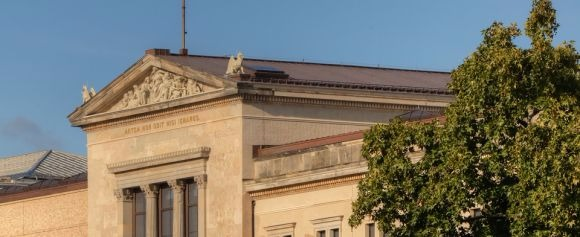
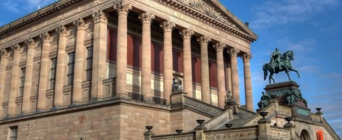
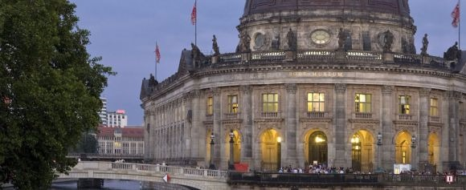
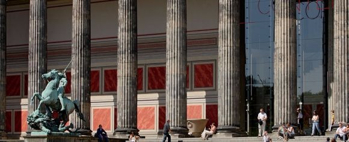
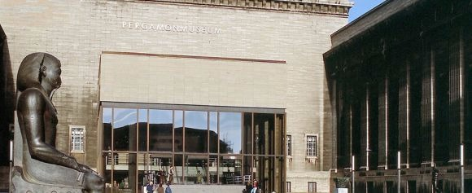

Berlin - Museum Island - visitBerlin.de EN

## Museum Island

## The world heritage of culture

   
    – © Wolfgang Scholvien

   
    Museumsinsel – © Scholvien

   
    Museumsinsel Bodemuseum – © BerlinPartnerGmbH/Scholvien

   
    – © Wolfgang Scholvien

   
    – © SMB, F. Friedrich

   
    – © Wolfgang Scholvien

   
    Museumsinsel – © Scholvien

[prev](http://www.visitberlin.de/en/spot/museum-island)[next](http://www.visitberlin.de/en/spot/museum-island)

Berlin’s Museum Island is a magnificent work of art in its own right, an **extraordinary ensemble of five world-renowned museums on an island in River Spree** right in the heart of Berlin’s city centre. The many highlights include the **bust of Nefertiti** and the **Pergamon Altar**.

### UNESCO World Heritage Site

The Museum Island was a [UNESCO World Heritage](http://www.visitberlin.de/en/see/sightseeing/unesco-world-heritage?tid=5001) Site for its unique ensemble of buildings and cultural artefacts. The opening of the Altes Museum in 1830 made historically significant collections and art accessible to the general public for the first time. Over the next century, four other museums were added to the island, leading to its being dubbed “Museum Island” from the late 1870s. The roots of the ensemble date back to the Enlightenment and its educational ideals and the buildings reflect the evolution of modern museum design over more than a century.

### The Five Museums on Berlin’s Museum Island

- **Pergamon Museum**

The [Pergamon Museum](http://www.visitberlin.de/en/spot/pergamonmuseum) was designed by Alfred Messel with three wings and welcomes about one million visitors a year, making it the most visited museum in Berlin. As part of the Master Plan for Museum Island, the Pergamon Museum is being gradually restored and a fourth wing will be added by 2025. As a result, the hall containing the massive Pergamon Altar will be closed until 2019. The Ishtar Gate, the Processional Way, the Market Gate of Miletus, and the Museum of Islamic Art are still open.

- **Bode Museum**

The [Bode Museum](http://www.visitberlin.de/en/spot/bode-museum), built between 1887 and 1904 to plans by court architect Ernst Eberhard von Ihne, was recently refurbished. It houses an extensive collection of sculptures, treasures of the Museum of Byzantine Art, and the Numismatic Collection (coins). In summer, the opposite shore on the Spree is a popular meeting place for Berliners and visitors alike for the breath-taking views it offers of the northern tip of Museum Island.

- **Neues Museum**

Friedrich August Stüler started building the [Neues Museum](http://www.visitberlin.de/en/spot/neues-museum-new-museum) in 1841. He used steam power and industrially produced beams to create an architectural sensation. The museum was severely damaged during the war and remained in ruins until 1999. The subsequent reconstruction and renovation was led by renowned architect David Chipperfield and lasted ten years. Since its reopening in 2009, the museum is home to selected objects from the Egyptian Museum, the Papyrus Collection, the Museum of Prehistory and Early History, and the Classical Antiquities Collection. The star attraction at the Neues Museum remains the bust of Nefertiti.

- **Alte Nationalgalerie**

The [Alte Nationalgalerie](http://www.visitberlin.de/en/spot/alte-nationalgalerie) stands like a temple with its staircase. Indeed, architect Friedrich August Stüler modelled it on the Acropolis of Athens. Built between 1867 and 1876, the building now houses art from the nineteenth century (plus a decade or two) with works in the Classicist, Romantic, Biedermeier, Impressionist and early Modern styles.

- **Altes Museum**

Karl Friedrich Schinkel designed this 1830 classicist structure the [Altes Museum](http://www.visitberlin.de/en/spot/altes-museum) with rotunda, dome and portico as the first public museum in Prussia. After extensive renovations, the building now houses the city’s main collection of ancient art and sculptures and a gold treasury.

Visiting the museums on Museum Island can be seen as an archaeological journey of discovery, presenting the cultures of Europe and the Near East from antiquity to the recent past.

### Information for school groups

Free admission for children and teenagers up to the age of 18 and for pupils on school tours. School tours for students in 11th year and higher must be preregistered.

About this topic

Find further information here.

  [www.smb.museum/en](http://www.smb.museum/en/home.html)