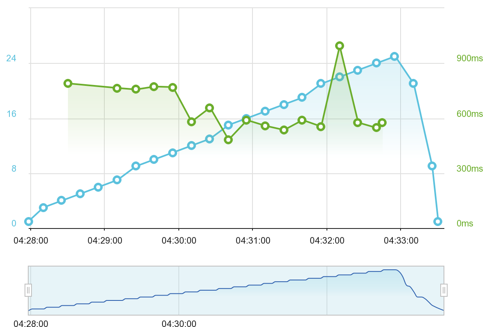
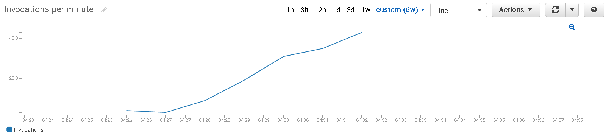
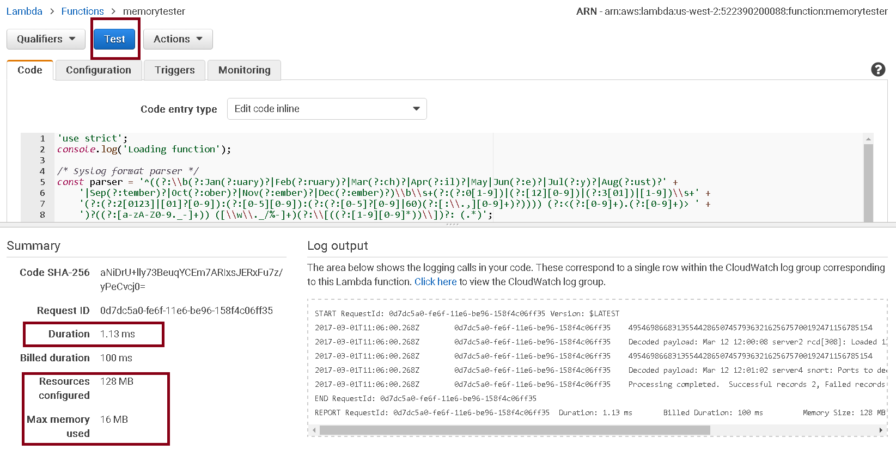
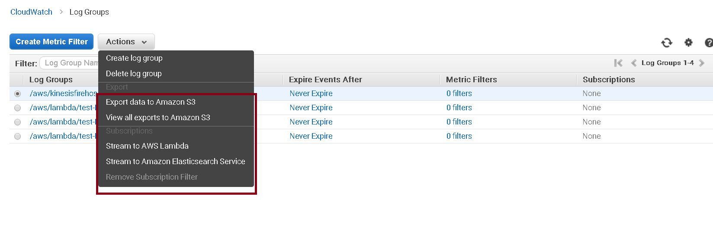

Best practices – AWS Lambda function

In this post we are going to go through the best practices while building an AWS Lambda function. In order to go through this blog you should know [what is it](http://docs.aws.amazon.com/lambda/latest/dg/welcome.html) and you should ideally have built at least a simple function around it so you have your bearings right, you can checkout [this blog post](https://cloudncode.blog/2017/01/24/getting-started-with-writing-and-debugging-aws-lambda-function-with-visual-studio-code/) of mine where I take you through step by step in building your first AWS Lambda function.

# Understanding how AWS Lambda scales

AWS Lambda service is simply, infrastructure which gets allocated to your function on demand as per need. When the need increases new infrastructure is automatically created internally which executes your function. The size of the *unit of infrastructure* is defined by you when you create the function, AWS allows us to select memory for the function and CPU allocation is directly proportional to the memory that you chose, what this means is that if you choose 128MB of memory you get *x* CPU while choosing 256MB gives you *2x* of the same.

> “
> Lambda scales on the basis of *> unit of work*> , while unit of work
> varies on the Lambda source type. Each unit of work is executed on a
> dedicated infrastructure while the said infrastructure is open for
> re-use for subsequent calls but not while the current call is

> executing, while you pay for only the duration of execution of individual requests proportional to the memory allocation of the function.

There are two types of Lambda function invocation type and the unit of work depends upon the said types:

1. **Streaming source types**AWS Lambda [developer guide](http://docs.aws.amazon.com/lambda/latest/dg/lambda-dg.pdf) explains this part, perfectly as:“*If you create a Lambda function that processes events from stream-based services (Amazon Kinesis Streams or DynamoDB streams), the number of shards per stream is the unit of concurrency. If your stream has 100 active shards, there will be 100 Lambda functions running concurrently. Then, each Lambda function processes events on a shard in the order that they arrive.*”

2. **Synchronous source type**Each request (or invocation) gets a dedicated infra to use at a time, i.e. at any given point of time your Lambda function will get a single request, having said that however, after a request is complete Lambda does reuse the containers for performance reasons to avoid overheads of repeatedly initializing code and re-establishing database connections*.

**AWS does not itself maintain such connections open, this is upto the code that is written.*

AWS Lambda publishes the formula for how many concurrent executions to expect from a Lambda function:

	Concurrent Invocations = events (or requests) per second * function duration (in secs)

**[source of the above formula](http://docs.aws.amazon.com/lambda/latest/dg/concurrent-executions.html)*

> “
> Concurrent executions are the number of Lambda functions running side
> by side catering to different requests / streams of data.

Consider this graph from my earlier post around Lambda’s performance with hosting .NET Web API:

Compare this with the number of invocations that happened during this period:

Gauge the graphs, those are meant to make us understand the nature of parallel executions in AWS Lambda.

Clearly in order to save money and decrease the latency of our Lambda functions we must decrease the running time of Lambda functions, the strategy to do that is two fold:

1. Choose the right size of the Lambda function, not necessarily the smallest.

2. Follow best practices in coding and leveraging Lambda’s *unit of infrastructure* lifecycle.

> “
> To reiterate, *> unit of infrastructure*>  in AWS Lambda is the compute
> resources set aside for each unit of work. The size of this unit of
> infrastructure is determined by user configuration determined by
> chosen memory size which has a proportional CPU attached to it. The
> infrastructure is used for *> one*>  unit of work at a time and is
*> generally*>  reused to serve subsequent requests.

# Lambda configuration best practices

## Choosing the right timeout

While creating your Lambda function you can choose two things, memory and timeout. Memory is the next topic, timeout is what is sounds like, AWS will terminate executing your Lambda function in case it runs for greater than the defined value for the same.

This has a subtle value, consider that you created a Lambda function which puts stuff into a database, let’s say Elasticsearch as an example. What happens if your ES cluster is hung for a few minutes (large index migration, faults etc)? Your Lambda function will try to connect to that until that connection times out, if not configured right, this will lead to your function taking over a minute for every log that needs to go into ES rather than the few milliseconds it used to take before, increasing your costs by about 1min / 200ms (bloated regular time to put stuff into ES) = 300 times!

Make the timeout to something acceptable like 4-5 seconds in the above case.

## Choosing the ‘right’ size of the Lambda function

You can test how much memory your Lambda code is using up by running a `Test` from the AWS Console*, see screenshot below:

** You can configure the test event to customize the input that your Lambda function receives by clicking on `Actions` in the same screen and then `Configure test event`*

If you looked at the screenshot closely, Lambda helpfully gives the `Max memory used` by your function in the test which you can use to adjust the memory allocation of the same.

Choosing the right memory size can be tricky, let’s consider two extreme schools of thought first:

### I will choose the minimum amount of memory that my function needs in any given execution to save maximum cost

Remember that CPU is proportional to the memory, lowering the memory by half cuts the CPU by half. Your code might finish a lot faster with more memory than with less mitigating the effects of adding the memory (cost-wise) while decreasing the latency.

### I will choose to give the maximum allowed memory to my Lambda function so that it executes the fastest

There is a limit beyond which memory, CPU will be useless, if you have the money, this is the safest option albeit a wasteful one.

# Coding best practices

## Low startup time

Since infrastructure is allocated dynamically in Lambda and the unit of infrastructure is small to account only for one request at a time, its best to keep the startup time of the function to be lowest in order to avoid large fluctuations in latencies when new unit of infrastructures are created and to avoid costs of that startup itself.

Just to sear the new thought here, let’s consider an example. Typical methodology of increasing performance in the traditional server/VM model is to get all the intensive work done at startup e.g. reflection based assembly scanning, database model formations (think ORM’s), loading up frequently used master data from database etc. You need to rethink of all of these.

My opinion, when going serverless, I wouldn’t think of using RDBMS’s (although you can) and instead use databases like Elasticsearch, DynamoDB, Mongo etc. I wouldn’t use an expensive ORM (startup–latency-wise) to connect to something which cannot horizontally scale. Having said this, this is my opinion and the shoe may not fit all.

## Stateless functions

From the definition of unit of infrastructure we can determine that the lifetime of the infra is not under our control, hence, in order for the code to be functionally correct, it needs to be stateless.

Stateless here means that the function should not depend upon state stored in memory or disk or anything local to the infrastructure itself. AWS gives a plethora of services to ensure you won’t need to place much effort in getting this ready.

Examples:

if you need caching, use [ElastiCache](https://aws.amazon.com/elasticache/) (I recommend the [Redis](https://redis.io/) engine).

Need fast querying without keeping stuff in memory? Use Elasticsearch, I wrote an article on [getting started with Elasticsearch](https://cloudncode.blog/2017/01/16/how-to-set-up-elastic-search-kibana-on-aws/) in case you are interested.

Need to do logging without effecting latency of the function and without worrying about the lifetime of the infrastructure? See the logging heading below in the article :-).

## Performance considerations

Although the unit of infrastructure is allocated dynamically which forces stateless programming, we can still use the fact that infra is in fact re-used for subsequent requests. The latter means that you can:

1. Re-use external (cache server, database etc) connections across function calls (remember that you don’t have to worry about concurrency here).

2. Utilize the functions local storage which is 500MB in size in the /tmp directory. Code in such a way that if you don’t find it, you can always go to a central store to re-populate it. Don’t keep stuff which needs to be shipped out, remember that the storage is volatile and can be wiped out at any time after a function call ends… keep read-only data.

3. Keep stuff in memory, keep this small, remember functions have very limited memory a lot of it would be required to execute your code efficiently.

## Logging

In a scenario where infrastructure can be taken away from us at any time leaving any background thread which was still running, destroyed, it would render standard asynchronous logging useless, not to mention logging to files. Making synchronous calls to logging would be horrendous to latency (and hence, also cost) no matter how fast the receiving end of that log line and would be severely dependent on the number of log lines that you have (shudder).

Fortunately, AWS recognized the above problem and as part of the programming model in Lambda as long as you write your log lines in the console which is `console.log` in node and `Console.Writeline` in c# core, which would be synchronous and would take negligible time, AWS takes care of shipping those logs out to Cloudwatch for you… asynchronously while giving a gurantee of getting those logs there even if the said Lambda infrastructure is destroyed. How they do it is of course immaterial as long as they do it and we don’t suffer latency issues.

### Cloudwatch is good and all, but I like my xyz log storage

The above statement is true for me as well, I like Elasticsearch better. Eventually as the system matures I would like my logging to be happening somewhere other than Cloudwatch, you can use Cloudwatch streams to achieve this to put it wherever you want using another Lambda function. AWS gives a pre-cooked recipe to put stuff in Elasticsearch. See the screenshot below for where these options are:

You can find a detailed guide to exporting stuff in [AWS documentation here](http://docs.aws.amazon.com/AmazonCloudWatch/latest/logs/CWL_ES_Stream.html), to get started in setting up an Elasticsearch cluster, go to [my article here](https://cloudncode.blog/2017/01/16/how-to-set-up-elastic-search-kibana-on-aws/).

The pricing for this streaming can be found on the [AWS pricing page](https://aws.amazon.com/cloudwatch/pricing/) for Cloudwatch.

Here is an example for your convenience:

1.00 per million custom events generated + Lambda cost (lower function timeout to prevent surprises) + ES cost – logstash cost – maintenance

By the way, in case you missed it, AWS recently launched a nuget package to support deploying existing (or new) .Net core Web API projects directly into Lambda, I tested it and the [performance it gave was pretty impressive](https://cloudncode.blog/2017/02/13/net-core-web-api-lambda-performance/) especially considering the package was still in preview mode at the time of writing this article.

**If you liked this article, you can choose to follow this blog/subscribe to email alerts (top of sidebar or below comments in mobile) so that you know when any future posts come about.**

Advertisements

ADVERTISING

### Share this:

- [LinkedIn94](https://cloudncode.blog/2017/03/02/best-practices-aws-lambda-function/?share=linkedin&nb=1)
- [Reddit](https://cloudncode.blog/2017/03/02/best-practices-aws-lambda-function/?share=reddit&nb=1)
- [Tumblr](https://cloudncode.blog/2017/03/02/best-practices-aws-lambda-function/?share=tumblr&nb=1)
- [Twitter](https://cloudncode.blog/2017/03/02/best-practices-aws-lambda-function/?share=twitter&nb=1)
- [Pocket](https://cloudncode.blog/2017/03/02/best-practices-aws-lambda-function/?share=pocket&nb=1)
- [Facebook149](https://cloudncode.blog/2017/03/02/best-practices-aws-lambda-function/?share=facebook&nb=1)
- [Google](https://cloudncode.blog/2017/03/02/best-practices-aws-lambda-function/?share=google-plus-1&nb=1)
- [Pinterest](https://cloudncode.blog/2017/03/02/best-practices-aws-lambda-function/?share=pinterest&nb=1)
- [Email](https://cloudncode.blog/2017/03/02/best-practices-aws-lambda-function/?share=email&nb=1)

-
[Like](https://widgets.wp.com/likes/#)

- 
- 
- 

[3 bloggers](https://widgets.wp.com/likes/#) like this.