Best things to do in Finland | CN Traveller

     

Film4 Summer Screen at Somerset House, London

 [Style & Culture](https://www.cntraveller.com/topic/style-culture)

# The coolest cultural events in London in 2020

London’s cultural calendar is looking more packed than ever in 2020

   *By*  [Tristan Parker](https://www.cntraveller.com/profile/tristan-parker)

- 

- 

- [![](data:image/svg+xml,%3csvg id='share-pinterest' xmlns='http://www.w3.org/2000/svg' viewBox='0 0 16 16' data-evernote-id='1627' class='js-evernote-checked'%3e%3ctitle data-evernote-id='1628' class='js-evernote-checked'%3eshare-pinterest%3c/title%3e%3cpath d='M8%2c0A8%2c8%2c0%2c0%2c0%2c0%2c8a7.94%2c7.94%2c0%2c0%2c0%2c4.8%2c7.3%2c10.87%2c10.87%2c0%2c0%2c1%2c.1-1.8c0.2-.6%2c1-4.4%2c1-4.4a3.54%2c3.54%2c0%2c0%2c1-.2-1.2A1.87%2c1.87%2c0%2c0%2c1%2c7.2%2c5.8%2c1%2c1%2c0%2c0%2c1%2c8.3%2c7a22.74%2c22.74%2c0%2c0%2c1-.7%2c2.8%2c1.22%2c1.22%2c0%2c0%2c0%2c1.3%2c1.5c1.5%2c0%2c2.5-1.9%2c2.5-4.3A3%2c3%2c0%2c0%2c0%2c8.1%2c3.9%2c3.76%2c3.76%2c0%2c0%2c0%2c4.2%2c7.7a2.54%2c2.54%2c0%2c0%2c0%2c.5%2c1.6c0.1%2c0.2.2%2c0.2%2c0.1%2c0.4a1.42%2c1.42%2c0%2c0%2c1-.2.6c-0.1.2-.2%2c0.3-0.4%2c0.2A3.17%2c3.17%2c0%2c0%2c1%2c2.6%2c7.4c0-2.3%2c1.9-5%2c5.7-5A4.78%2c4.78%2c0%2c0%2c1%2c13.4%2c7c0%2c3.1-1.7%2c5.5-4.3%2c5.5a2.44%2c2.44%2c0%2c0%2c1-2-1s-0.5%2c1.8-.6%2c2.2a8.86%2c8.86%2c0%2c0%2c1-.8%2c1.7A4%2c4%2c0%2c0%2c0%2c8%2c16%2c8%2c8%2c0%2c0%2c0%2c8%2c0Z' data-evernote-id='1629' class='js-evernote-checked'%3e%3c/path%3e%3c/svg%3e)](https://www.pinterest.com/pin/create/button/?url=https://www.cntraveller.com/article/events-in-london-2020&description=The%20coolest%20cultural%20events%20in%20London%20in%202020&media=https://tr-images.condecdn.net/image/NYGbojmK274/crop/2040/f/somerset-house-london-03-conde-nast-traveller-22may18-pr.jpg)

- 

There’s a dizzying amount of events in London on offer for 2020, so whether you’re keen to soak up cutting-edge art at the best galleries, explore beautiful hidden spaces around the city, hit some of the UK’s top music festivals, kick back and take in a film or any number of other events, the capital has a huge amount to offer to kick off the new decade

Here are the year’s highlight events in London so far. We’ll be updating this page regularly, so keep checking back to stay in the loop with all the latest unmissable events, exhibitions and festivals across London as they’re announced. For events happening right now, see our guide to the best [things to do in London this weekend](https://www.cntraveller.com/gallery/things-to-do-in-london-this-weekend).

## JANUARY

### London International Mime Festival

This annual celebration of visual performance is always a huge treat and still feels like it hasn’t been discovered by the masses. The experimental programme is packed full of physical theatre, puppetry, object theatre, circus and other highly entertaining feats. Dip in and take a chance – you’re bound to be impressed.

*Various venues. 8 January–-2 February. Events individually priced. [mimelondon.com](https://mimelondon.com/)*

 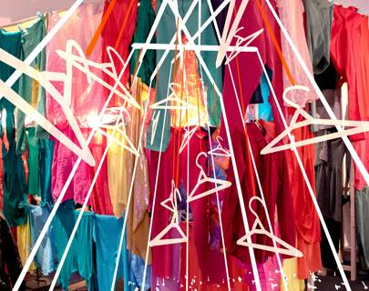

Through the Wardrobe

Credit: Through the Wardrobe

### Alternate Realities

A digital art showcase featuring works from Yorkshire’s cutting-edge Sheffield Doc/Fest event. Immersive installations invite viewers to consider themes of identity through a virtual mirror and step into a wardrobe to explore ideas around gender expression. Two film screenings accompany the installations.

*Barbican. 13-19 January. Installations: free; films: £12. [barbican.org.uk](https://www.barbican.org.uk/whats-on/2020/series/alternate-realities)*

### Lightopia Festival

Recapture that warm [Christmas](https://www.cntraveller.com/topic/christmas) glow at this family-friendly festival of light and lanterns, held in the grounds of beautiful Chiswick House. Wander through a mile-long interactive lantern trail and gaze at installations, 3D mapping projections, acrobatic shows and craft stalls. There’s also plenty of food and drink on offer, plus live music.

*Chiswick House. 22 January–1 March. From £20. [lightopiafestival.com](https://www.lightopiafestival.com/)*

 

London Art Fair

Credit: Kate Groobey, Wow, 2019. Acrylic on canvas. Courtesy of Sim Smith

### London Art Fair

This extensive showcase of contemporary pieces from around the world is a fine place to buy if you’re in the market for eye-catching modern art. On display will be works from more than 100 galleries from around the world, and the event also hosts artist talks, film screenings, tours and special exhibitions.

*Business Design Centre, Islington. 22-26 January. From £11. [londonartfair.co.uk](https://www.lightopiafestival.com/)*

### London Remixed Festival

The party-starting minds behind [Glastonbury](https://www.cntraveller.com/location/glastonbury)’s wild Shangri-La area have concocted this colourful celebration of global music. Expect everything from Afrobeat to Latin to tropical bass to Balkan beats, performed by live bands and spun by DJs, all with a carnival-style atmosphere.

*Rich Mix. 31 January–1 February. From £11.19. [londonremixedfestival.com](http://londonremixedfestival.com/)*

 

Masculinities: Liberation through Photography

Credit: Catherine Opie Rusty, 2008 © Catherine Opie, Courtesy Regen Projects, Los Angeles and Thomas Dane Gallery, London

## FEBRUARY

### Musik

Frances Barber stars as pop goddess Billie Trix in this sequel to the Pet Shop Boys’ 2001 West End musical Closer to Heaven. The one-woman show has been developed by the band and acclaimed playwright Jonathan Harvey, and includes six Pet Shop Boys songs performed by Barber.

*Leicester Square Theatre. 5 Febraury–1 March. From £22.50. [leicestersquaretheatre.ticketsolve.com](https://leicestersquaretheatre.ticketsolve.com/shows)*

### Parallax ‘Art’ Fair

Browse more than 7,000 works from some 300 artists at this free art and craft fair that aims to be open to all and isn’t aimed solely at knowledgeable collectors. Accompanying the paintings, sculpture, jewellery, textiles and more will be live jazz, a bookstore and a massage area.

*Kensington Town Hall. 15-16 February. Free. [parallaxaf.co](http://parallaxaf.co/)

*

### Masculinities: Liberation Through Photography

This major new exhibition looks at ideas of masculinity across the decades through film and photography from over 50 global artists, including Laurie Anderson, Sunil Gupta and Rotimi Fani-Kayode.

*Barbican. 20 Febraury–17 May. From £15. [barbican.org.uk](https://www.barbican.org.uk/whats-on/2020/event/masculinities-liberation-through-photography)*

 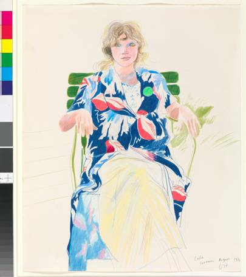

David Hockeny

Credit: David Hockney Celia, Carennac, August 1971, coloured pencil on paper 17 x 14" © David Hockney Photo Credit: Richard Schmidt Collection The David Hockney Foundation; David Hockney

### David Hockney: Drawing from Life

Hockney’s artworks are no strangers to the big London galleries, but that doesn’t make his exhibitions any less pertinent or engaging. This one is also a little different, as it’s the first major exhibition focusing on Hockney’s drawings in more than 20 years, and will include around 150 works from collections around the world.

*National Portrait Gallery. 27 Febraury–28 June. From £17. [npg.org.uk](https://www.npg.org.uk/)*

 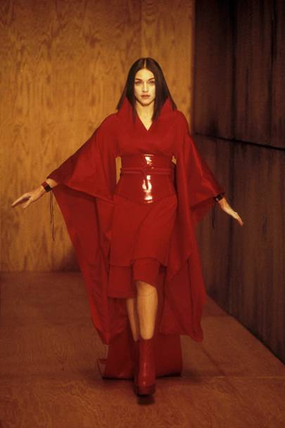

Credit: Madonna, Nothing Really Matters video, 1999. Photo by Frank MicelottaImageDirect, Image Courtesy of Getty Images

### Kimono: Kyoto to Catwalk

Explore the cultural and societal impact of the kimono, both in [Japan](https://www.cntraveller.com/location/japan) and beyond, at this exhibition that traces the garment’s history and story, from the 1660s to the present day. Highlights include representations in Japanese art and incredible examples from across the ages.

*V&A. 29 Febraury–21 June. From £16. [vam.ac.uk](https://www.vam.ac.uk/exhibitions/kimono-kyoto-to-catwalk)*

## MARCH

### WOW – Women of the World festival

Southbank Centre’s annual exploration of gender equality around the globe offers a diverse range of events, including talks and readings, workshops, performances, ‘speed mentoring’ and the WOW Market. 2020 is WOW’s 10th year, so there’ll also be some special anniversary celebrations.

*Southbank Centre. 6-8 March. From £5. [southbankcentre.co.uk](http://southbankcentre.co.uk/whats-on/festivals-series/women-of-the-world)*

 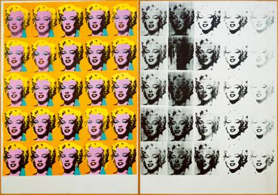

Credit: Andy Warhol (1928 – 1987) Marilyn Diptych 1962 Tate © 2019 The Andy Warhol Foundation for the Visual Arts, Inc / Artists Right Society (ARS), New York and DACS, London

### Andy Warhol

This major retrospective of the iconic artist mixes famous works, such as Campbell’s Soup Cans and Marilyn Diptych, with lesser-known pieces from the 1970s, demonstrating Warhol’s fondness for using different formats.

*Tate Modern. 12 March–6 September. £22. [tate.org.uk](https://www.tate.org.uk/whats-on/tate-modern/exhibition/andy-warhol)*

 

Cecil Beaton

Credit: Baba Beaton as 'Heloise' in 'Great Lovers Pageant' by Cecil Beaton, 1927. National Portrait Gallery, London

### Cecil Beaton’s Bright Young Things

Take a peek into the wild world of 1920s and 1930s high society parties through the fascinating portraits of acclaimed photographer Cecil Beaton, who captured the glamorous side of British bohemia like no one else.

*National Portrait Gallery. 12 March–7 June. From £17. [npg.org.uk](https://www.npg.org.uk/whatson/exhibitions/2019/cecil-beatons-bright-young-things/)*

### London Games Festival

It’s not just dedicated gamers who will enjoy this extensive festival. Hundreds of games – from old classics to new releases – will be available to play at venues around London, alongside talks, opportunities for games developers and all kinds of interactive fun.

*Various venues across London. 26 March – 6 April. Ticket prices £TBA. [games.london](https://www.npg.org.uk/whatson/exhibitions/2019/cecil-beatons-bright-young-things/)*

 

London Coffee Festival

## APRIL

### London Coffee Festival

Prepare for a serious caffeine buzz at this universe of all things [coffee shop](https://www.cntraveller.com/gallery/best-coffee-in-london)-related, with barista competitions, workshops, coffee cocktails, live music, tastings and numerous delicious treats to accompany all that java.

*Old Truman Brewery. 2-5 April. £TBC. [londoncoffeefestival.com](https://www.londoncoffeefestival.com/)*

### Bags: Inside Out

If you’re of the opinion that it’s never ‘just a bag’, this is the exhibition for you. The V&A has put together a collection of more than 300 items charting how the once-humble bag has evolved into a status symbol and style accessory, with examples from names such as Louis Vuitton and Birkin.

*V&A. 25 April–3 January 2021. £TBC. [vam.ac.uk](http://vam.ac.uk/exhibitions/bags)*

 

Affordable art fair

Credit: I Only Want Everything by Marcelina Amelia

### Affordable Art Fair

View thousands of artworks from cutting-edge galleries around the globe, covering sculpture, ceramics, painting and more. As the name suggests, the aim is for pieces to be kept at sensible prices. There’ll also be workshops, talks and special events.

*Lower Fairground Site, Hampstead. 30 April–3 May. From £11. [affordableartfair.com](https://affordableartfair.com/fairs/london-hampstead)*

 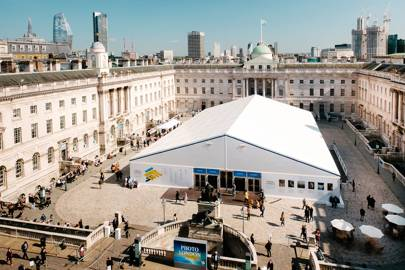

Photo London

Credit: Graham Carlow

## MAY

### Photo London

This extensive photography fair brings together top global galleries, emerging talents and established photographers. A wide selection of work will be available to buy alongside compelling exhibitions and special events.

*Somerset House. 14-17 May. From £19. [photolondon.org](https://photolondon.org/)*

 

Royal Hospital Chelsea gardens at the RHS

Credit: Getty Images

### RHS Chelsea Flower Show

Who knew gardens could be so glamorous? The brains behind probably the world’s most famous flower show certainly do, as the event returns to showcase incredible displays and picture-perfect landscapes and gardens. There’ll also be boutique shopping and lots of very fine food and drink.

*Royal Hospital Chelsea. 19-23 May. From £39.75. [rhs.org.uk](https://www.rhs.org.uk/shows-events/rhs-chelsea-flower-show)*

 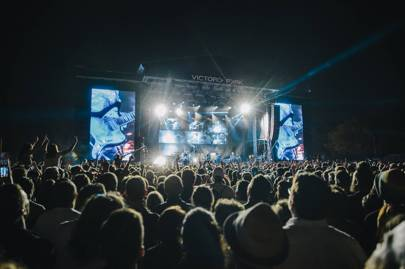

Credit: Derek Bremner

### All Points East

One of London’s biggest festivals, APE takes place over two weeks and brings in truly impressive line-ups. The Chemical Brothers, Bon Iver and Christine and the Queens are previous headliners, and there will be an array of enticing alternative artists, plus separate free-entry days offering film screenings, food fairs, workshops and theatre.

*Victoria Park. Friday 22 – Sunday 31 June 2020. Tickets: from £65 plus booking fee for single-day ticket. Multi-day tickets £TBA [allpointseastfestival.com](http://allpointseastfestival.com/)*

### Gala

This small-ish but perfectly formed and friendly festival takes place in lovely [Peckham](https://www.cntraveller.com/gallery/peckham-neighbourhood-guide) Rye Park, where you’ll hear established and upcoming DJs soundtracking the fun with house, disco and funk alongside some great street-food stalls.

*Peckham Rye Park. 23-24 May. From £40 (day ticket) and £80 (weekend ticket). [thisisgala.co.uk](https://thisisgala.co.uk/)*

### We Are FSTVL

An aerodrome is an undeniably great place for a party, especially when it’s this powerhouse of a dance-music festival, with world-class DJs (the line-up so far includes Armand Van Helden, Carl Cox and Loco Dice) spinning deep house, drum ’n’ bass and techno.

*Damyn’s Hall Aerodrome, Upminster. 23-24 May. From £47 (day ticket) and £94 (weekend ticket). [wearefstvl.com](https://www.wearefstvl.com/)*

## JUNE

### Junction 2

Hear tons of on-point DJs blast out energetic house and techno sets at this emerging two-day festival. The line-up includes some great names, such as Jon Hopkins, Four Tet, Amelie Lens and Adam Beyer.

*Boston Manor Park, London. 5-6 June. From £35 (day ticket) and £79.50 (weekend ticket). [junction2.london](http://junction2.london/index.php)*

### Mighty Hoopla

This inclusivity-driven party celebrates pop music and pop culture in suitably fabulous style. Expect a musical trip down memory lane with big-name artists (Chaka Khan and All Saints performed in 2019), plus games, activities and lots of glitter.

*Brockwell Park. 6 June. From £45. [mightyhoopla.com](https://www.mightyhoopla.com/)*

 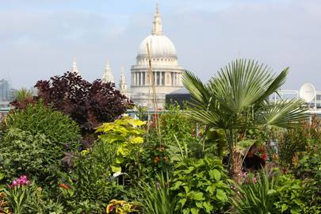

Open garden

### Open Garden Squares Weekend

Stroll through some of [London’s finest hidden gardens](https://www.cntraveller.com/gallery/secret-gardens-in-london) at this annual celebration of the city’s green spaces. Many of the places on show are normally closed to the public, so it’s a rare opportunity to discover everything from stunning roof gardens to community allotments and inner-city havens of tranquillity.

*Across London. 6-7 June. From £13. [opensquares.org](http://opensquares.org/winter/home/index.php)*

### Cross the Tracks

Soul, jazz and funk are the main musical ingredients at this one-day festival in south London’s leafy Brockwell Park. There’s also a big foodie element thanks to numerous street-food traders and craft breweries, plus workshops, a record and art fair, a wellness area and markets.

*Brockwell Park. 7 June. From £25. [xthetracks.com](https://www.xthetracks.com/)*

### Meltdown

The ever-wonderful Grace Jones takes control of the Southbank Centre’s music, arts and cultural extravaganza, which is curated by a different artist each year. The musicians that Jones has selected will be announced nearer the event, but expect big, bold and brilliant things.

*Southbank Centre. 12-21 June. £TBC. [southbankcentre.co.uk](https://southbankcentre.co.uk/whats-on/festivals-series/meltdown)*

 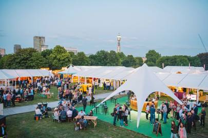

Taste of london

Credit: Andy Hughes

### Taste of London

The foodie paradise returns for its summer instalment in the glorious surroundings of Regent’s Park. As always, there’ll be a huge selection of food stalls from the [best restaurants in London](https://www.cntraveller.com/gallery/best-restaurants-london), plus cooking demos, pop ups from [London's best bars](https://www.cntraveller.com/gallery/best-bars-london), tastings and shopping opportunities.

*Regent’s Park. 17-21 June. £TBC. [london.tastefestivals.com](https://london.tastefestivals.com/)*

### Greenwich + Docklands International Festival

See hundreds of performers take to the streets of south-east London in this lively free arts festival. Prepare for installations, acrobatics, dance, circus and live music, plus family-friendly activities and food stalls.

*Various venues. 19 June–4 July. Free. [festival.org/gdif](https://festival.org/gdif/)

*

### Alice: Curiouser and Curiouser

This experiential exhibition dives deep into the much-loved fantastical tale of *Alice’s Adventures in Wonderland* across the ages, from its origins as Lewis Carroll’s story to the many imaginative global adaptations. It'll be an ‘immersive and theatrical’ show, featuring costumes, illustrations, film and photography that looks at how everyone from Salvador Dalí to The Beatles to Little Simz have been influenced by Alice's journey.

*V&A. 27 June – 10 January 2021. £20. Free for children under 12. [vam.ac.uk](https://www.vam.ac.uk/exhibitions/alice-in-wonderland)*

 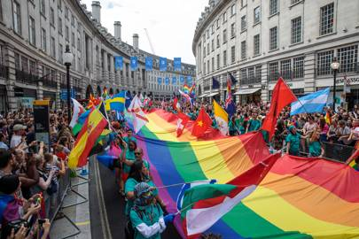

Pride

Credit: Getty Images

### Pride

London’s celebration of LGBT+ communities is one of the biggest and best in the world. The showstopping parade through central London takes place on 27 June, with numerous other events occurring in the lead-up to the big day and afterwards.

*Around London. 27 June (parade), plus other events. Free. [prideinlondon.org](https://prideinlondon.org/)*

 

Credit: Britain and Photography: 1945-79 (30 Jun – 27 Sep 2020, Tate Britain) Image: John Gay A young man at Speaker’s Corner in Hyde Park, London 1960–1962 © Historic England, AA054025

### Britain and Photography: 1945-79

An insightful and moving exhibition exploring the evolution of post-war Britain through documentary photography, including work from highly influential 20th-century photographers and lesser-known names.

*Tate Britain. 30 June–27 September. £TBC. [tate.org.uk](http://tate.org.uk/whats-on/tate-britain/exhibition/britain-and-photography-1945-1979)*

 

Wireless

## JULY

### Wireless

Returning to Finsbury Park, Wireless will once again be showcasing huge names from the worlds of hip-hop, R&B, grime, garage and beyond. Expect some heavyweight American talents alongside the very best of British.

*Finsbury Park. 3-5 July. £70 (day ticket), £137.50 (two days), £190 (three days). [wirelessfestival.co.uk](http://wirelessfestival.co.uk/)*

### British Summer Time

This party in the park – Hyde Park, in fact – is always one of London’s summer music festival highlights and 2020 should continue that trend thanks to a string of huge names announced to play. Little Mix, Pearl Jam, Pixies and Taylor Swift will all be making appearances over two consecutive weekends, plus there’ll be free film screenings, street food markets and other events during the week between.

*Hyde Park. Friday 3 – Sunday 12 July 2020. Tickets from £65 [bst-hydepark.com](https://www.bst-hydepark.com/)*

 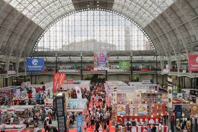

Hyper Japan

### Hyper Japan

Celebrate all things Japanese at this vast expo-festival crossover. The draw for many is the selection of markets selling pretty much anything Japan-related you can possibly imagine, but there will also be food and drink stalls (including plenty of sake and sushi), live music and cosplay areas.

*Olympia. 10-12 July. £TBC. [hyperjapan.co.uk](https://hyperjapan.co.uk/2020/)*

## AUGUST

### 51st State Festival

This one-day party homes in on classic house music from across the decades. The organisers always bring in legendary American DJs who were instrumental in shaping the modern-day sound of the scene.

*Trent Park, Enfield. 1 August. From £32.50. [51ststatefestival.com](https://www.51ststatefestival.com/)*

 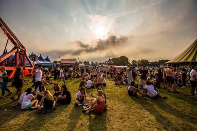

South West Four festival on Clapham Common

Credit: Graham Joy Photography

### South West Four

Clapham’s annual bank holiday festival has become an essential date for lovers of electronic music. World-class DJs rub shoulders with up-and-coming names, playing to party-centric crowds.

*Clapham Common. 29-30 August. £TBC. [southwestfour.com](https://www.southwestfour.com/)*

 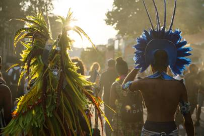

Notting Hill Carnival

Credit: Getty Images

### Notting Hill Carnival

The gargantuan west London street party has become as much a part of London culture as Big Ben and Beefeaters. As ever, there will be sound systems blasting out reggae, dub, dancehall and other upbeat sounds, floats, incredible costumes, dancers, Caribbean food and drink, and the traditional ‘family day’ for carnival kids.

*West London. 30-31 August. Free. [nhcarnival.org](https://nhcarnival.org/)*

 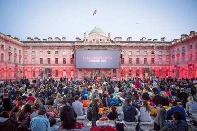

Film4 Summer Screen at Somerset House, London

### Film4 Summer Screen at Somerset House

Witness Somerset House’s beautiful courtyard transformed into an outdoor cinema during the summer, as this popular festival returns. Each year there’s a new theme that loosely steers which films are shown, but the programme is always packed with enough cult classics to please everyone.

*Somerset House. Dates and ticket prices TBC. [somersethouse.org.uk](https://www.somersethouse.org.uk/)*

 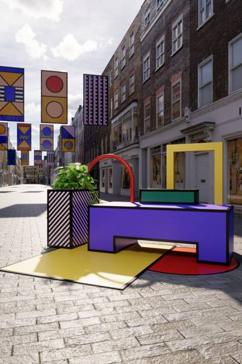

London design festival

## SEPTEMBER

### London Design Festival

This celebration of London’s design credentials sees eye-catching art installations, elaborate architectural projects and special events in designated ‘design districts’ spread across the city.

*Various venues. 12-20 September. Free and ticketed events. [londondesignfestival.com](https://londondesignfestival.com/)*

 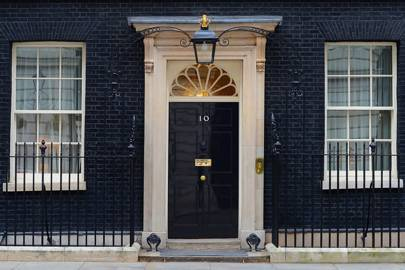

Open House

### Open House

Styled as ‘the world’s largest architectural festival’, Open House allows visitors to explore more than 800 buildings around the city, from private houses to hidden historic gems, including landmark London venues that don’t normally offer public access.

*Venues across London. 19-20 September. Free. [openhouselondon.org.uk](https://openhouselondon.org.uk/)*

 

Dubuffet

Credit: Jean Dubuffet, Paysage aux argus (Landscape with Argus), 1955 Collection Fondation Dubuffet. © Fondation Dubuffet, Paris / DACS, London, 2019. Image courtesy of Fondation Dubuffet, Paris

### Jean Dubuffet

This is the first UK exhibition in 50 years to focus solely on the influential French painter and sculptor. The show will chart the Art Brut creator’s most experimental phases, through works taken from collections around the globe.

*Barbican. 30 September–17 January 2021. £TBC. [barbican.org.uk](https://www.barbican.org.uk/whats-on/2020/event/jean-dubuffet)*

### Totally Thames

Celebrate London’s mighty river at this annual festival. There’s a packed programme of creative events, including live music, boat trips, guided walks, film screenings, art exhibitions and regattas.

*Various venues. Dates TBC. Free and ticketed events. totallythames.org
*

 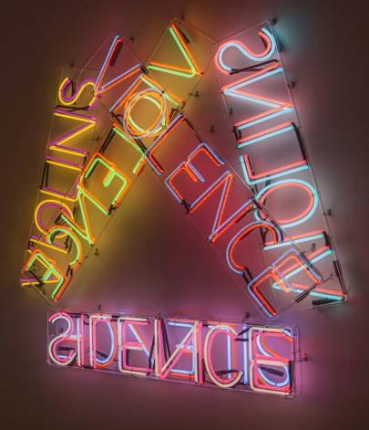

Credit: Bruce Nauman (6 Oct 2020 – 17 Jan 2021, Tate Modern) Image: Bruce Nauman VIOLINS VIOLENCE SILENCE 1981–2 ARTIST ROOMS Tate and National Galleries of Scotland © ARS, NY and DACS, London 2019

## OCTOBER

### Bruce Nauman

This retrospective explores the innovative American artist’s love of experimenting with different mediums, including neon, sculpture, video and light art. Some of Nauman’s best-known works will be on show, including the self-explanatory Double Steel Cage Piece and the haunting video installation Anthro/Socio (Rinde Spinning)

*Tate Modern. 6 October–17 January 2021. £TBC. [tate.org.uk](https://www.tate.org.uk/whats-on/tate-modern/exhibition/bruce-nauman)*

### BFI London Film Festival (LFF)

Take your pick from hundreds of film screenings at this buzzy festival, from glitzy new blockbusters to edgy underground art flicks, documentaries and short films. Running alongside will be a programme of talks with directors and actors, after parties, awards and more.

*Venues across London. 7-18 October. Free screenings, plus ticketed events from £10. [whatson.bfi.org.uk](https://whatson.bfi.org.uk/Online/default.asp)*

 

Frieze

Credit: Mark Blower 2017

### Frieze London

More than 1,000 established and emerging artists contribute work to this unmissable date on the London art calendar. Around 160 galleries from across the globe will be in attendance, and there will also be live performances, film screenings and discussions throughout.

*Regent’s Park. 8-11 October. £TBC. [frieze.com](http://frieze.com/fairs/frieze-london)*

## NOVEMBER

### EFG London Jazz Festival

Even if you think you’re not a jazz fan, LJF may well have something to impress you thanks to a huge and wide-ranging programme of music that also touches on anything from soul to Afrobeat, alongside all manner of contemporary and traditional jazz sounds.

*Various London venues. 13 – 22 November 2020. £TBA. [efglondonjazzfestival.org.uk](https://efglondonjazzfestival.org.uk/)

*
Check back for updates.
**Like this? Now read:**

[**The best exhibitions in London**](https://www.cntraveller.com/gallery/exhibitions-in-london)

Continue Reading [10 exhibitions to look forward to in 2020](https://www.cntraveller.com/gallery/exhibitions-in-london)

     

Style & Culture

###   10 exhibitions to look forward to in 2020

**[The best neighbourhoods in London](https://www.cntraveller.com/article/best-neighbourhoods-in-london)**

Continue Reading [The best neighbourhoods in London](https://www.cntraveller.com/article/best-neighbourhoods-in-london)

     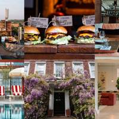

Destinations

###   The best neighbourhoods in London

**[The best brunch in London](https://www.cntraveller.com/gallery/best-brunch-london)**

Continue Reading [The best brunch in London](https://www.cntraveller.com/gallery/best-brunch-london)

     

Eating & Drinking

###   The best brunch in London

- [Style & Culture](https://www.cntraveller.com/topic/style-culture)

- [London](https://www.cntraveller.com/location/london)

- [London Weekend](https://www.cntraveller.com/topic/london-weekend)

- [UK](https://www.cntraveller.com/location/uk)

- [Events](https://www.cntraveller.com/topic/events)

#### Share this article

- 

- 

- [![](data:image/svg+xml,%3csvg id='share-pinterest' xmlns='http://www.w3.org/2000/svg' viewBox='0 0 16 16' data-evernote-id='2386' class='js-evernote-checked'%3e%3ctitle data-evernote-id='2387' class='js-evernote-checked'%3eshare-pinterest%3c/title%3e%3cpath d='M8%2c0A8%2c8%2c0%2c0%2c0%2c0%2c8a7.94%2c7.94%2c0%2c0%2c0%2c4.8%2c7.3%2c10.87%2c10.87%2c0%2c0%2c1%2c.1-1.8c0.2-.6%2c1-4.4%2c1-4.4a3.54%2c3.54%2c0%2c0%2c1-.2-1.2A1.87%2c1.87%2c0%2c0%2c1%2c7.2%2c5.8%2c1%2c1%2c0%2c0%2c1%2c8.3%2c7a22.74%2c22.74%2c0%2c0%2c1-.7%2c2.8%2c1.22%2c1.22%2c0%2c0%2c0%2c1.3%2c1.5c1.5%2c0%2c2.5-1.9%2c2.5-4.3A3%2c3%2c0%2c0%2c0%2c8.1%2c3.9%2c3.76%2c3.76%2c0%2c0%2c0%2c4.2%2c7.7a2.54%2c2.54%2c0%2c0%2c0%2c.5%2c1.6c0.1%2c0.2.2%2c0.2%2c0.1%2c0.4a1.42%2c1.42%2c0%2c0%2c1-.2.6c-0.1.2-.2%2c0.3-0.4%2c0.2A3.17%2c3.17%2c0%2c0%2c1%2c2.6%2c7.4c0-2.3%2c1.9-5%2c5.7-5A4.78%2c4.78%2c0%2c0%2c1%2c13.4%2c7c0%2c3.1-1.7%2c5.5-4.3%2c5.5a2.44%2c2.44%2c0%2c0%2c1-2-1s-0.5%2c1.8-.6%2c2.2a8.86%2c8.86%2c0%2c0%2c1-.8%2c1.7A4%2c4%2c0%2c0%2c0%2c8%2c16%2c8%2c8%2c0%2c0%2c0%2c8%2c0Z' data-evernote-id='2388' class='js-evernote-checked'%3e%3c/path%3e%3c/svg%3e)](https://www.pinterest.com/pin/create/button/?url=https://www.cntraveller.com/article/events-in-london-2020&description=The%20coolest%20cultural%20events%20in%20London%20in%202020&media=https://tr-images.condecdn.net/image/NYGbojmK274/crop/2040/f/somerset-house-london-03-conde-nast-traveller-22may18-pr.jpg)

- 