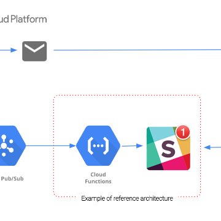

Better cost control with Google Cloud Billing programmatic notifications

Better cost control with Google Cloud Billing programmatic notifications

https://cloudplatform.googleblog.com/2018/05/Better-cost-control-with-Google-Cloud-Billing-programmatic-notifications.html

By Matt Leonard, Product Manager, Google Cloud Platform By running your workloads on Google Cloud Platform (GCP) you have access to the t...