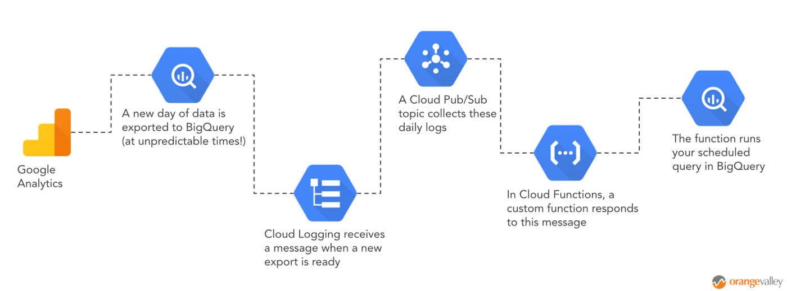
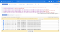
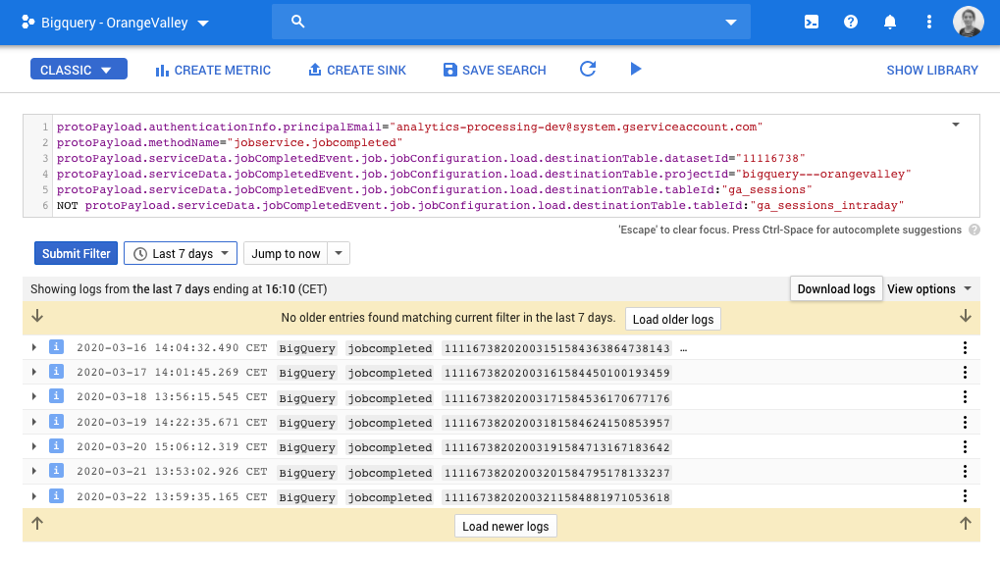
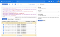
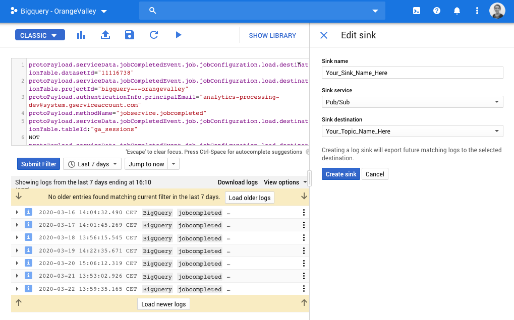
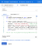
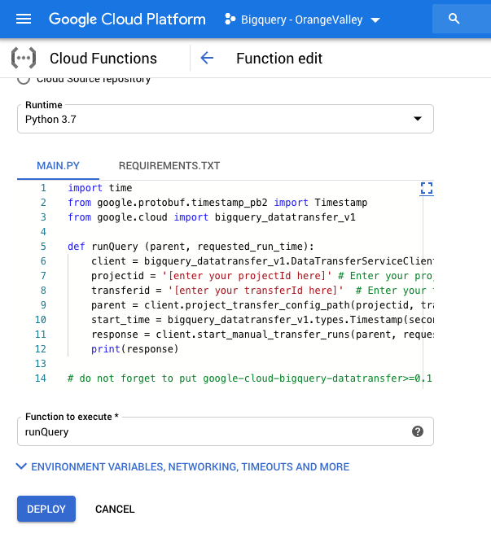

BigQuery + Cloud Functions: how to run your queries as soon as a new Google Analytics table is available

# BigQuery + Cloud Functions: how to run your queries as soon as a new Google Analytics table is available

## A step-by-step guide on how to make sure your tables, dashboards and data transfers are always up-to-date

[Marieke Pots](https://towardsdatascience.com/@marieke91?source=post_page-----17fbb62f8aaa----------------------)

[Mar 27](https://towardsdatascience.com/bigquery-cloud-functions-how-to-run-your-queries-as-soon-as-a-new-google-analytics-table-is-17fbb62f8aaa?source=post_page-----17fbb62f8aaa----------------------) · 5 min read

* * *

*...*

If you have your Google Analytics view linked to BigQuery, you are probably enjoying the advantages it brings. There is no sampling in your data, you can bring in third-party data, you have more control over your data and much more.

But, there was one thing bothering me. And maybe it is bothering you too. The exact time of the daily export from Google Analytics to the BigQuery table(ga_sessions_YYYYMMDD) can be somewhat unpredictable. This makes it is impossible to run scheduled queries on this dataset without taking a small risk.

- *You might set your scheduled queries too early. *If, for some reason, the Google Analytics export is delayed, you might miss a day of data. You will have to manually correct this every time this happens. Or you might consider using the intraday table. But this might not be as ideal either, since Google states: “Data for the current day is not final until the daily import is complete. You may notice differences between intraday and daily data” (see the documentation [here](https://support.google.com/analytics/answer/3437719?hl=en&ref_topic=3416089)).
- *You might set your scheduled queries too late.* You might be safe if the exports are delayed in this case. But, your underlying tables for your dashboards and/or possible transfers to other data systems may not be as up to date as they need to be for your decision makers.

Of course, in these uncertain times of Corona, you might call this a first-world-problem. But because it is a problem that I can help fix, I will take you through a step by step guide on how to run your scheduled queries in the exact minute that a new daily export from Google Analytics is ready. The result is a much more fail-proof set-up in which your tables and dashboards are always as up-to-date as they can possibly be.

The steps that we will be taking are:

1. Create a filter in Cloud Logging that isolates the daily log that confirms that a new Google Analytics table is ready.

2. Set up a Cloud Pub/Sub topic that collect these daily logs.

3. Deploy a Cloud Function that runs your scheduled query in BigQuery as soon as the Pub/Sub topic is being updated with a new log.

* * *

*...*

# Step 1. Cloud Logging

- OK. The first thing to do is to open [Cloud Logging](https://console.cloud.google.com/logs).
- Choose ‘Convert to advanced filter’, by clicking on the little dropdown arrow on the right side of the search field. At least, that’s where it was at the time of this writing .
- You can copy/paste the code below to create a filter that will isolate the logs that confirm that a new Google Analytics table (ga_sessions_YYYYMMDD) has been created. Do not forget to fill in your own dataset ID and project ID in the first two lines.

protoPayload.serviceData.jobCompletedEvent.job.jobConfiguration.load.destinationTable.datasetId="[REPLACE_WITH_YOUR_DATASET_ID]"protoPayload.serviceData.jobCompletedEvent.job.jobConfiguration.load.destinationTable.projectId="REPLACE_WITH_YOUR_PROJECT_ID"protoPayload.authenticationInfo.principalEmail="[analytics-processing-dev@system.gserviceaccount.com](https://towardsdatascience.com/bigquery-cloud-functions-how-to-run-your-queries-as-soon-as-a-new-google-analytics-table-is-17fbb62f8aaamailto:analytics-processing-dev@system.gserviceaccount.com)"protoPayload.methodName="jobservice.jobcompleted"protoPayload.serviceData.jobCompletedEvent.job.jobConfiguration.load.destinationTable.tableId:"ga_sessions"NOT protoPayload.serviceData.jobCompletedEvent.job.jobConfiguration.load.destinationTable.tableId:"ga_sessions_intraday"

- If you adjust the timeframe to the last 7 days, you should now see one message for each day. In the screenshot below, you see the unpredictability of the exact time of the export. In this example, sometimes the table was ready before 2pm and sometimes it’s after 3pm. If your screen looks like this, you are ready to go to the next step!

Screenshot made in Google Logging

* * *

*...*

# Step 2. Cloud Pub/Sub

Pub/Sub stands for Publish–Subscribe and can be considered as a messaging system between systems. In this case, we want to create a new Pub/Sub topic that collects the logs that we isolated in the previous step. This way, a message will be collected every time a new Google Analyicts table is available.

- Click on “Create Sink” in the screenshot above.
- You can be as creative as you want to be when entering a sink name.
- Choose “Pub/Sub” as Sink service.
- Choose to create a new Cloud Pub/Sub Topic and give it a name that you can remember in the next step.
- Click ‘Create Sink’ and you are ready for the next step.

Screenshot in Google Logging: creating a pub/sub sink and topic

* * *

*...*

# Step 3. Cloud Functions

In this last step we will create a Cloud Function (written in Python) that runs every time the Pub/Sub topic is triggered. The function then sends a request to the [BigQuery DataTransfer API](https://cloud.google.com/bigquery-transfer/docs/reference/datatransfer/rest) to start a manual transfer run on one of your scheduled (on demand) SQL queries.

- Open up [Cloud Functions](https://console.cloud.google.com/functions)
- Choose to create a new function.
- Choose “Cloud Pub/Sub” as trigger and select the Pub/Sub topic that you created in the previous step.
- Choose “Python 3.7” (or perhaps higher if you read this in the future ) as runtime.

Screenshot of how to set up the Google Cloud Function

- Copy/paste the code below, and put this in the “Main.py” file.

|     |     |
| --- | --- |
| 1   | import  time |
| 2   | from  google.protobuf.timestamp_pb2  import  Timestamp |
| 3   | from  google.cloud  import  bigquery_datatransfer_v1 |
| 4   |     |
| 5   | def  runQuery (parent, requested_run_time): |
| 6   |  client  =  bigquery_datatransfer_v1.DataTransferServiceClient() |
| 7   |  projectid  =  '[enter your projectId here]'  # Enter your projectID here |
| 8   |  transferid  =  '[enter your transferId here]'  # Enter your transferId here |
| 9   |  parent  =  client.project_transfer_config_path(projectid, transferid) |
| 10  |  start_time  =  bigquery_datatransfer_v1.types.Timestamp(seconds=int(time.time() +  10)) |
| 11  |  response  =  client.start_manual_transfer_runs(parent, requested_run_time=start_time) |
| 12  |  print(response) |
| 13  |     |
| 14  | # do not forget to put google-cloud-bigquery-datatransfer>=0.1 in the requirements.txt |

 [view raw](https://gist.github.com/marieke91/1ea713caf6a5213585c8697a41ee3095/raw/a6043c4b907fd8b43372ebdbac454cd3b9185120/cloudfunction_datatransfer.py)  [cloudfunction_datatransfer.py](https://gist.github.com/marieke91/1ea713caf6a5213585c8697a41ee3095#file-cloudfunction_datatransfer-py) hosted with ❤ by [GitHub](https://github.com/)

- Replace the project ID and the transfer ID with the details of the scheduled query that you want to run.
- You can find these IDs in the configuration tab of your [scheduled query](https://console.cloud.google.com/bigquery/scheduled-queries) The resource name shows a URL in which you will find both IDs: “*projects/[THIS_IS_YOUR_PROJECT_ID)/locations/us/transferConfigs/[THIS IS YOUR TRANSFER_ID]*”.
- In this case, I’m assuming that you have already created the scheduled query that you want to run. If you have not, this is the time to [create your scheduled query](https://cloud.google.com/bigquery/docs/scheduling-queries) in BigQuery. It’s best to have the queries set to run ‘on demand’, otherwise it might run too often.
- Add the little piece of code below in ‘Requirements.txt’, so that it has all the packages it needs to run the Python Code.

google-cloud-bigquery-datatransfer>=0.1

- Set “runQuery” as the function to execute.
- Click on deploy!

# And now: enjoy the automation

If you have correctly set up everything, your scheduled query will now start to run as soon as a new daily table has been exported to BigQuery! This means that you can sit back, relax and enjoy that your Google Analytics data is always as fresh as it can be.

*If you have any tips, comments or questions, do not hesitate to ask me in the comments below.*