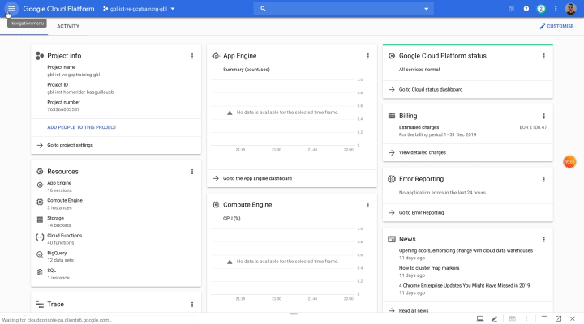
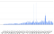
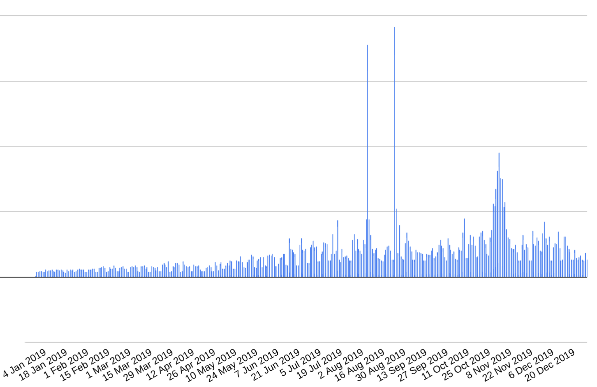

BigQuery: Set up limits and custom quotas through API

# BigQuery: Set up limits and custom quotas through API

[guillaume blaquiere](https://medium.com/@guillaume.blaquiere?source=post_page-----629f77438b7e----------------------)

[Jan 6](https://medium.com/google-cloud/bigquery-set-up-limits-and-custom-quotas-through-api-629f77438b7e?source=post_page-----629f77438b7e----------------------) · 4 min read

BigQuery is the **petabytes scale data warehouse** on Google Cloud Platform. You can load a lot of data freely and easily, the storage cost is very affordable with an automatic switch to cold storage after 90 days.

When you use the **on-demand pricing, the cost is based on the volume of data that the query scans**  [(about $5 per TB for the cheaper location)](https://cloud.google.com/bigquery/pricing#on_demand_pricing) in your queries. And when **you have terabytes or petabytes, it can become expensive**!

# Cost optimizations

For optimizing the data organisation and reduce the volume of data that you scan, **you can clusterize and/or **[**partition your data on any fields**](https://medium.com/google-cloud/partition-on-any-field-with-bigquery-840f8aa1aaab?source=---------2------------------). You can also [**require the partition filter**](https://cloud.google.com/bigquery/docs/managing-partitioned-tables#require-filter) in the `where` clause of the queries. The objective is to force the requester to ask himself about the data scanned for optimizing the queries.

However, **nothing forces the requester to use the partitioned field smartly** or to **prevent a badly use of it**. Thereby, requiring the partition field in each request can be useless and the whole data can still be scanned.

# Custom quotas on volume of data scanned

To prevent the scanning of large volumes of data due to the lacks of partitioning or bad usages of partitions, Google allows to **set **[**custom quotas on volume of data**  **scanned** per user or per project. The quotas are reset to 0 every days at midnight, pacific time.](https://cloud.google.com/bigquery/docs/custom-quotas)

It’s easy to set a quota

- Go to [quotas page](https://console.cloud.google.com/iam-admin/quotas)
- Select only BigQuery service
- Look for `Query usage per day per user` or `Query usage per day` and select it *(click on line)*
- Click on `Edit Quotas`
- Set the limit on the right side, validate and `Submit`

Set a custom quota with console
> Perfect per console, but how to do it at scale?

# Automate the quota limits

My company is global (50+ countries), thousands of GCP projects (3k+) and BigQuery tables (100k+), hundreds of subsidiaries, and lot of different internal and external IT teams and data scientists. With my colleagues at headquarters, we do a lot for** training, helping and assisting users for preventing mistakes and unexpected cost**. But it’s not enough.

BigQuery cost in 2019

Thereby, we decided to set a limit on all DEV and TEST projects, for production, it’s only when requested by the teams in charge of the project. For this, **we wanted to use the **[**service management API**](https://cloud.google.com/service-infrastructure/docs/service-management/reference/rest/)**  **and we tried all the documented endpoints… **It’s impossible to update quotas via API!!**

> How to update thousands of project? and how to apply this automatically on new ones?

# Undocumented API usage

Stuck in a dead end, I tried to understand **how the API worked in the console** thanks to the developer mode of Chrome and **I found a workaround.**

***Important note****: The following explanation is not documented by Google and can change or be blocked at any time, without warning. ****Use with caution.***

## The API principle

To invoke this API, use this URL. *Replace the *`*PROJECT_ID*`* with your own project ID.*

https://servicemanagement.googleapis.com/v1/services/[bigquery-json.googleapis.com/projectSettings/PROJECT_ID?updateMask=quotaSettings.consumerOverrides%5B%22QueryUsagePerDay%22%5D](http://bigquery-json.googleapis.com/projectSettings/gbl-imt-homerider-basguillaueb?updateMask=quotaSettings.consumerOverrides%5B%22QueryUsagePerDay%22%5D&alt=json)

*Replace the value *`*QueryUsagePerDay*`* with *`*QueryUsagePerUserPerDay*`* if you want to set the limit per user and not per project*

**The API is secured**, you have to present an HTTP Bearer access token with your request. The call **uses the HTTP verb **`**PATCH**` and you have to present `**application/json**`** content-type body**.

The limit is in MB. Here the body sets the limit to 150Tb per day on the project. *Replace the *`*PROJECT_ID*`* with your own project ID.*

{
"quotaSettings":
{
"adminOverrides":{},
"consumerOverrides":
{
"QueryUsagePerDay":
{
"limit":"151380224"
}
},
"force":true
},
"consumerProjectId":"PROJECT_ID",

"serviceName":"[bigquery-json.googleapis.com](http://bigquery-json.googleapis.com/)"

}

*Replace the value *`*QueryUsagePerDay*`* with *`*QueryUsagePerUserPerDay*`* if you want to set the limit per user and not per project*

## Put it all together

For experimenting this API, make a call with `curl`. Create a file with `data` as name and the previous body as content. Then, run this command (for example on Cloud Shell). *Replace the *`*PROJECT_ID*`* with your own project ID.*

curl -d @data \
-H "content-type: application/json" \
-H "Authorization: Bearer $(gcloud auth print-access-token)" \
-X PATCH \

"https://servicemanagement.googleapis.com/v1/services/[bigquery-json.googleapis.com/projectSettings/PROJECT_ID?updateMask=quotaSettings.consumerOverrides%5B%22QueryUsagePerDay%22%5D](http://bigquery-json.googleapis.com/projectSettings/gbl-imt-homerider-basguillaueb?updateMask=quotaSettings.consumerOverrides%5B%22QueryUsagePerDay%22%5D&alt=json)"

The answer is the ID of the operation
{
"name": "operations/tmo-quf.9d6e6e04-28fd-4147-8fee-dea59764b5d0"
}
Check the console