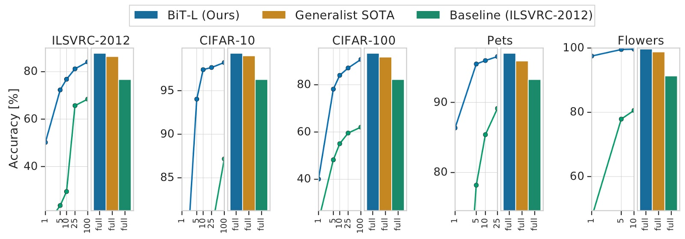
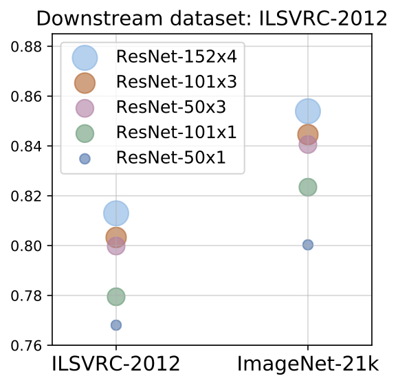
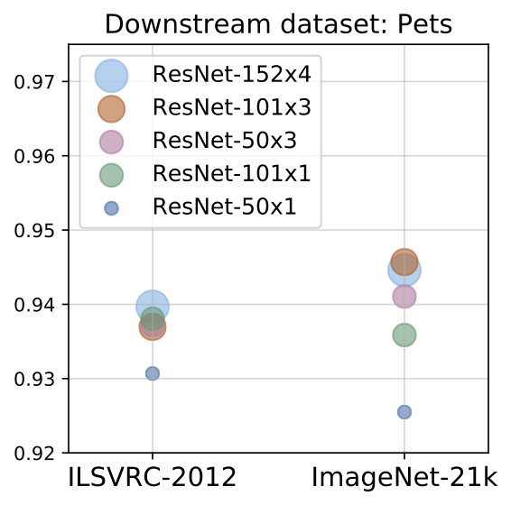
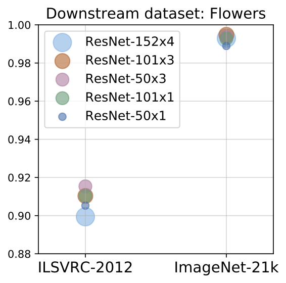
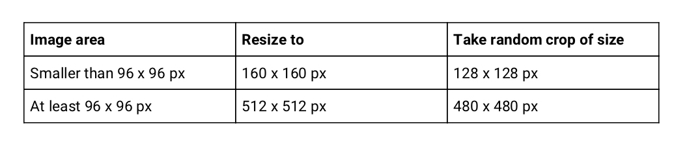
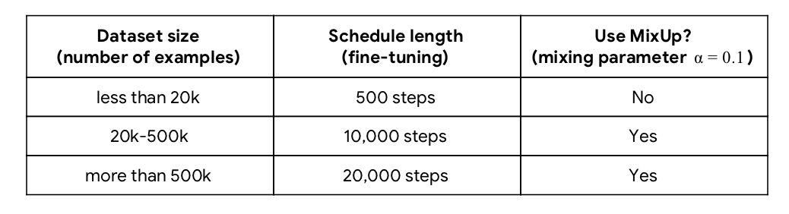
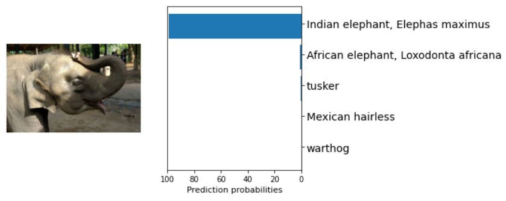
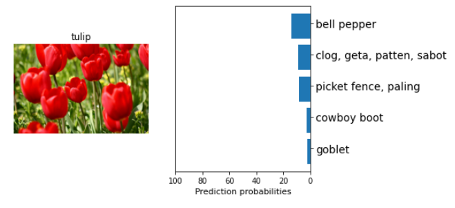
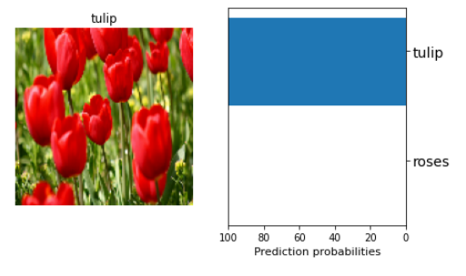

BigTransfer (BiT): State-of-the-art transfer learning for computer vision — The TensorFlow Blog

[TensorFlow Core](https://blog.tensorflow.org/search?label=TensorFlow+Core&max-results=20)**·**[TensorFlow Hub](https://blog.tensorflow.org/search?label=TensorFlow+Hub&max-results=20)

BigTransfer (BiT): State-of-the-art transfer learning for computer vision
May 20, 2020

[' data-evernote-id='499' class='js-evernote-checked'%3e %3crect height='36' width='36' data-evernote-id='500' class='js-evernote-checked'%3e%3c/rect%3e %3cpath d='M14.076%2c27.2827953 C22.566%2c27.2827953 27.21%2c20.2477953 27.21%2c14.1477953 C27.21%2c13.9477953 27.21%2c13.7487953 27.197%2c13.5507953 C28.1%2c12.8977953 28.88%2c12.0887953 29.5%2c11.1617953 C28.657%2c11.5347953 27.764%2c11.7797953 26.848%2c11.8877953 C27.812%2c11.3107953 28.533%2c10.4037953 28.878%2c9.33479527 C27.972%2c9.87179527 26.98%2c10.2507953 25.947%2c10.4547953 C24.198%2c8.59579527 21.274%2c8.50679527 19.415%2c10.2547953 C18.217%2c11.3817953 17.708%2c13.0617953 18.08%2c14.6647953 C14.368%2c14.4787953 10.91%2c12.7257953 8.566%2c9.84279527 C7.341%2c11.9507953 7.967%2c14.6497953 9.995%2c16.0047953 C9.261%2c15.9827953 8.542%2c15.7837953 7.9%2c15.4267953 L7.9%2c15.4847953 C7.9%2c17.6827953 9.449%2c19.5747953 11.603%2c20.0107953 C10.924%2c20.1957953 10.211%2c20.2227953 9.519%2c20.0897953 C10.124%2c21.9707953 11.856%2c23.2587953 13.832%2c23.2957953 C12.197%2c24.5797953 10.178%2c25.2777953 8.098%2c25.2747953 C7.731%2c25.2747953 7.364%2c25.2527953 7%2c25.2087953 C9.111%2c26.5627953 11.567%2c27.2817953 14.076%2c27.2787953' fill='%23545454' data-evernote-id='501' class='js-evernote-checked'%3e%3c/path%3e %3c/g%3e %3c/svg%3e)](https://twitter.com/intent/tweet?text=%22BigTransfer%20(BiT):%20State-of-the-art%20transfer%20learning%20for%20computer%20vision%22%20from%20the%20TensorFlow%20Blog%0A%0Ahttps://blog.tensorflow.org/2020/05/bigtransfer-bit-state-of-art-transfer-learning-computer-vision.html)

Posted by [Jessica Yung](http://www.jessicayung.com/) and [Joan Puigcerver](http://www.jpuigcerver.net/)

In this article, we'll walk you through using BigTransfer (BiT), a set of pre-trained image models that can be transferred to obtain excellent performance on new datasets, even with only a few examples per class.

ImageNet-pretrained [ResNet50s](https://arxiv.org/abs/1512.03385) are a current industry standard for extracting representations of images. With our [BigTransfer (BiT) paper](https://arxiv.org/abs/1912.11370), we share models that perform significantly better across many tasks, and transfer well even when using only a few images per dataset.

You can find BiT models pre-trained on [ImageNet](http://image-net.org/challenges/LSVRC/2012/index) and [ImageNet-21k](http://www.image-net.org/about-stats) in [TFHub](https://tfhub.dev/google/collections/bit/1) as TensorFlow2 SavedModels that you can use easily as Keras Layers. There are a variety of sizes ranging from a standard ResNet50 to a ResNet152x4 (152 layers deep, 4x wider than a typical ResNet50) for users with larger computational and memory budgets but higher accuracy requirements.

|     |
| --- |
|  |
| Figure 1: The x-axis shows the number of images used per class, ranging from 1 to the full dataset. On the plots on the left, the curve in blue above is our BiT-L model, whereas the curve below is a ResNet-50 pre-trained on ImageNet (ILSVRC-2012). |

In this tutorial, we show how to load one of our BiT models and either (1) use it out-of-the-box or (2) fine-tune it to your target task for higher accuracy. Specifically, we demonstrate using a ResNet50 trained on ImageNet-21k.

### What is Big Transfer (BiT)?

Before we get into the details of how to use the models, how did we train models that transfer well to many tasks?

#### Upstream training

The essence is in the name - we effectively train large architectures on large datasets. Before our paper, few papers had seen significant benefits from training on larger public datasets such as ImageNet-21k (14M images, 10x larger than the commonly-used ImageNet). The components we distilled for training models that transfer well are:

**Big datasets**
The best performance across our models increases as the dataset size increases.

**Big architectures**

We show that in order to make the most out of big datasets, one needs large enough architectures. For example, training a ResNet50 on JFT (which has 300M images) does not always improve performance relative to training the ResNet50 on ImageNet-21k (14.8M images), but we consistently see improvements when training larger models like a ResNet152x4 on JFT as opposed to ImageNet-21k (Figure 2 below).

 

 

 

|     |
| --- |
|     |
| Figure 2: The effect of larger upstream datasets (x-axis) and model size (bubble size/colour) on performance on downstream tasks. Using larger datasets or larger models alone may hurt performance - both need to be increased in tandem. |

**Long pre-training time**

We also show that it’s important to train for long enough when pre-training on larger datasets. It’s standard to train on ImageNet for 90 epochs, but if we train on a larger dataset such as ImageNet-21k for the same number of steps (and then fine-tune on ImageNet), the performance is worse than if we’d trained on ImageNet directly.

**GroupNorm and Weight Standardisation**

Finally, we use GroupNorm combined with Weight Standardisation instead of BatchNorm. Since our models are large, we can only fit a few images on each accelerator (e.g. GPU or TPU chip). However, BatchNorm performs worse when the number of images on each accelerator is too low. GroupNorm does not have this problem, but does not scale well to large overall batch sizes. But when we combine GroupNom with Weight Standardisation, we see that GroupNorm scales well to large batch sizes, even outperforming BatchNorm.

#### Downstream fine-tuning

Moreover, downstream fine-tuning is cheap in terms of data efficiency and compute - our models attain good performance with only a few examples per class on natural images. We also designed a hyperparameter configuration which we call ‘BiT-HyperRule’ that performs fairly well on many tasks without the need to do an expensive hyperparameter sweep.

**BiT-HyperRule: our hyperparameter heuristic**

As alluded to above, this is ***not a hyperparameter sweep*** - given a dataset, it specifies one set of hyperparameters that we’ve seen produce good results. You can often obtain better results by running a more expensive hyperparameter sweep, but BiT-HyperRule is an effective way of getting good initial results on your dataset.

In BiT-HyperRule, we use SGD with an initial learning rate of 0.003, momentum 0.9, and batch size 512. During fine-tuning, we decay the learning rate by a factor of 10 at 30%, 60% and 90% of the training steps.

As data preprocessing, we resize the image, take a random crop, and then do a random horizontal flip (details in Table 1). We do random crops and horizontal flips for all tasks except those where such actions destroy label semantics. For example, we don’t apply random crops to counting tasks, or random horizontal flips to tasks where we’re meant to predict the orientation of an object (Figure 3).

|     |
| --- |
|  |
| Table 1: Downstream resizing and random cropping details. If images are larger, we resize them to a larger fixed size to benefit from fine-tuning on higher resolution. |

|     |
| --- |
|  |
| Figure 3: [CLEVR](https://cs.stanford.edu/people/jcjohns/clevr/) count example: Here the task is to count the number of small cylinders or red objects in the image. We would not apply a random crop since that may crop out objects we would like to count, but we apply a random horizontal flip since that doesn’t change the number of objects we care about in the image (and thus does not change the label). Image attribution: [CLEVR count example by Johnson et. al.](https://cs.stanford.edu/people/jcjohns/clevr/)) |

We determine the schedule length and whether or not to use [MixUp](https://arxiv.org/abs/1710.09412) (Zhang et. al., 2018, illustrated in Figure 4) according to the dataset size (Table 2).

|     |
| --- |
|  |
| Figure 4: MixUp takes pairs of examples and linearly combines the images and labels. These images are taken from the dataset tf_flowers. |

|     |
| --- |
|  |
| Table 2: Details on downstream schedule length and when we use MixUp. |

We determined these hyperparameter heuristics based on empirical results. We explain our method and describe our results in more detail in our [paper](https://arxiv.org/abs/1912.11370) and in our Google AI blog post.

### Tutorial

Now let’s actually fine-tune one of these models! You can follow along by running the code in [this colab](https://colab.research.google.com/github/google-research/big_transfer/blob/master/colabs/big_transfer_tf2.ipynb).

**1) Load the pre-trained BiT model**

You can download one of our BiT models pre-trained on ImageNet-21k from [TensorFlow Hub](https://tfhub.dev/google/collections/bit/1). The models are saved as [SavedModels](https://www.tensorflow.org/hub/tf2_saved_model). Loading them is very simple:

	import tensorflow_hub as hub
	# Load model from TFHub into KerasLayer
	model_url = "https://tfhub.dev/google/bit/m-r50x1/1"
	module = hub.KerasLayer(model_url)

**2) Use BiT out-of-the-box**

If you don’t yet have labels for your images (or just want to have some fun), you may be interested in using the model out-of-the-box, i.e. without fine-tuning it. For this, we will use a model fine-tuned on ImageNet so it has the interpretable [ImageNet label space of 1k classes](https://gist.github.com/yrevar/942d3a0ac09ec9e5eb3a). Many common objects are not covered, but it gives a reasonable idea of what is in the image.

	# use model
	logits = imagenet_module(image)

Note that BiT models **take inputs with values between 0 and 1**.

In the [colab](https://colab.research.google.com/github/google-research/big_transfer/blob/master/colabs/big_transfer_tf2.ipynb), you can load an image from an URL and see what the model predicts:

`> show_preds(preds, image[0])`

|     |
| --- |
|  |
| Image [from PikRepo](https://www.pikrepo.com/fvnqw/close-up-photo-of-gray-elephant) |

Here the pre-trained model on ImageNet correctly classifies the photo as an elephant.It is also more likely to be an Indian as opposed to an African elephant because of the size of its ears. In the colab, we also predict on an image from the dataset we're going to fine-tune on, [TF flowers](https://www.tensorflow.org/datasets/catalog/tf_flowers), which has also been used in [other tutorials](https://www.tensorflow.org/tutorials/load_data/images). Note that the correct label ‘tulip’ is not a class in ImageNet and so the model cannot predict that at the moment - let’s see what it tries to do instead:

The model predicts a reasonably similar-looking class, 'bell pepper'.

**3) Fine-tune BiT on your task**

Now, we are going to fine-tune the BiT model so it performs better on a specific dataset. Here we are going to use Keras for simplicity, and we are going to fine-tune the model on a dataset of flowers (tf_flowers). We will use the model we loaded at the start (i.e. the one pre-trained on ImageNet-21k) so that it is less biased towards a narrow subset of classes.

There are two steps:
1. Create a new model with a new final layer (called the ‘head’)

2. Fine-tune this model using BiT-HyperRule, our hyperparameter heuristic. We described this in detail earlier in the ‘Downstream fine-tuning’ section of the post.

To create the new model, we:

1. Cut off the BiT model’s original head. This leaves us with the “pre-logits” output.

    - We do not have to do this if we use the ‘feature extraction’ models, since for those models the head has already been cut off.

2. Add a new head with the number of outputs equal to the number of classes of our new task. Note that it is important that we initialise the head to all zeroes.

	class MyBiTModel(tf.keras.Model):
	  """BiT with a new head."""

	  def __init__(self, num_classes, module):
	    super().__init__()

	    self.num_classes = num_classes
	    self.head = tf.keras.layers.Dense(num_classes, kernel_initializer='zeros')
	    self.bit_model = module

	  def call(self, images):
	    # No need to cut head off since we are using feature extractor model
	    bit_embedding = self.bit_model(images)
	    return self.head(bit_embedding)

	model = MyBiTModel(num_classes=5, module=module)

When we fine-tune the model, we use BiT-HyperRule, our heuristic for choosing hyperparameters for downstream fine-tuning which we described earlier. We also code our heuristic in full in the [colab](https://colab.research.google.com/github/google-research/big_transfer/blob/master/colabs/big_transfer_tf2.ipynb).

	# Define optimiser and loss

	# Decay learning rate by factor of 10 at SCHEDULE_BOUNDARIES.
	lr = 0.003
	SCHEDULE_BOUNDARIES = [200, 300, 400, 500]
	lr_schedule = tf.keras.optimizers.schedules.PiecewiseConstantDecay(boundaries=SCHEDULE_BOUNDARIES,
	                                                                  values=[lr, lr*0.1, lr*0.001, lr*0.0001])
	optimizer = tf.keras.optimizers.SGD(learning_rate=lr_schedule, momentum=0.9)

To fine-tune the model, we use the simple Keras `model.fit` API:

	loss_fn = tf.keras.losses.SparseCategoricalCrossentropy(from_logits=True)
	model.compile(optimizer=optimizer,
	             loss=loss_fn,
	             metrics=['accuracy'])

	# Fine-tune model
	model.fit(
	   pipeline_train,
	   batch_size=512,
	   steps_per_epoch=10,
	   epochs=50,
	   validation_data=pipeline_test)

We see that our model attains 95% validation accuracy within 20 steps, and attains over 98% validation accuracy after fine-tuning using BiT-HyperRule.

**4) Save the fine-tuned model for later use**

It is easy to save your model to use later on. You can then load your saved model in exactly the same way as we loaded the BiT models at the start.

	# Save fine-tuned model as SavedModel
	export_module_dir = '/tmp/my_saved_bit_model/'
	tf.saved_model.save(model, export_module_dir)

	# Load saved model
	saved_module = hub.KerasLayer(export_module_dir, trainable=True)

Voila - we now have a model that predicts tulips as tulips and not bell peppers.

### Summary

In this post, you learned about the key components you can use to train models that can transfer well to many different tasks. You also learned how to load one of our BiT models, fine-tune it on your target task and save the resulting model. Hope this helped and happy fine-tuning!

**Acknowledgements**

This blog post is based on work by Alexander Kolesnikov, Lucas Beyer, Xiaohua Zhai, Joan Puigcerver, Jessica Yung, Sylvain Gelly and Neil Houlsby. We thank many members of Brain Research Zurich and the TensorFlow team for their feedback, especially Luiz Gustavo Martins, André Susano Pinto, Marcin Michalski, Josh Gordon, Martin Wicke, Daniel Keysers, Amélie Royer, Basil Mustafa, and Mario Lučić.

**Additional links**

- [Tutorial Colab](https://colab.research.google.com/github/google-research/big_transfer/blob/master/colabs/big_transfer_tf2.ipynb)
- [Models on TensorFlow Hub](https://tfhub.dev/google/collections/bit/1)
- [GitHub repository](https://github.com/google-research/big_transfer)
- [BigTransfer (BiT) paper](https://arxiv.org/abs/1912.11370)

[TensorFlow Core](https://blog.tensorflow.org/search?label=TensorFlow+Core&max-results=20)[TensorFlow Hub](https://blog.tensorflow.org/search?label=TensorFlow+Hub&max-results=20)

Next post

[(L)](https://blog.tensorflow.org/2020/05/how-hugging-face-achieved-2x-performance-boost-question-answering.html)

Community**·**TensorFlow.js

How Hugging Face achieved a 2x performance boost for Question Answering with DistilBERT in Node.js

May 18, 2020 — A guest post by Hugging Face: Pierric Cistac, Software Engineer; Victor Sanh, Scientist; Anthony Moi, Technical Lead.

Hugging Face is an AI startup with the goal of contributing to Natural Language Processing (NLP) by developing tools to improve collaboration in the community, and by being an active part of research efforts.

Because NLP is a difficult field, we believe that solving it is only …