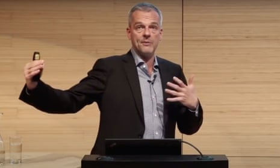
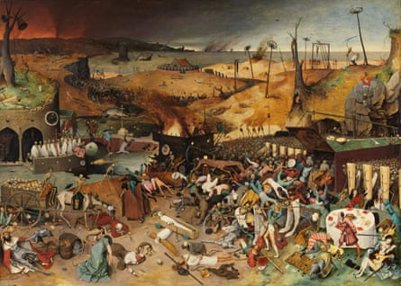
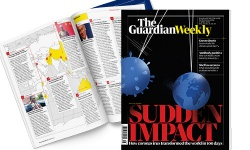

Black Death historian: 'A coronavirus depression could be the great leveller' | World news | The Guardian

[Skip to main content](https://www.theguardian.com/world/commentisfree/2020/apr/30/walter-scheidel-a-shock-to-the-established-order-can-deliver-change#maincontent)

Advertisement

[The Guardian - Back to home![](data:image/svg+xml,%3csvg xmlns='http://www.w3.org/2000/svg' viewBox='0 0 297 95' class='inline-the-guardian-logo__svg inline-logo__svg js-evernote-checked' data-evernote-id='753'%3e %3cpath fill='%23121212' d='M66.8 50.7l5-2.6V8.4H68l-9.3 12.4h-1L58.2 7h40.5l.6 13.8h-1.1L89 8.4h-3.9V48l5 2.7V52H66.9v-1.3zm37-1.8V5L100 3.5v-.9L114.2.1h1.5v20.8l.3-.4a19 19 0 0 1 12.2-4.5c6.2 0 9 3.5 9 10v23l3.3 1.7V52H122v-1.3l3.4-1.8V26c0-3.6-1.6-5-4.6-5a7.8 7.8 0 0 0-4.9 1.6V49l3.3 1.8V52h-18.5v-1.2zm48.4-13.4c.4 7.2 3.6 12.8 11.4 12.8 3.7 0 6.3-1.7 8.8-3v1.5a17.4 17.4 0 0 1-13.6 6.2c-12 0-18-6.6-18-18.1 0-11.3 6.6-18.3 17.4-18.3 10.2 0 15.5 5 15.5 18.4v.4zm-.2-1.7l10.5-.7c0-9-1.5-15-4.6-15-3.3 0-5.9 7-5.9 15.6M0 69.6c0-19.1 12.7-26 26.8-26 6 0 11.6 1 14.8 2.3l.3 13.4h-1.4l-8.3-13a12.2 12.2 0 0 0-5.2-.8c-7.5 0-11.3 8.7-11.2 22.9.1 17 3 24.7 10 24.7a10.7 10.7 0 0 0 4.1-.7V74.2l-4.5-2.6V70h22v1.7l-4.5 2.5v18A49.2 49.2 0 0 1 26.2 95C10.2 95 0 87.5 0 69.6m47.1-9v-1L62 57l1.6.1v29c0 3.6 1.7 4.6 4.5 4.6a6 6 0 0 0 4.8-2.2v-26l-4-1.8v-1.2L83.6 57l1.4.2v33.3l4 1.6v1.1L74.4 95l-1.4-.1v-4.4h-.4A16.4 16.4 0 0 1 61.5 95C54.4 95 51 90.8 51 84.5v-22zm94.5-3.7l1.2.1v10.8h.4c1.6-7.9 5-10.8 9.3-10.8a4.7 4.7 0 0 1 1.8.3v11a12.6 12.6 0 0 0-3-.3 18.6 18.6 0 0 0-8 1.6v21.2l3.4 1.9V94h-19.3v-1.3l3.5-1.9v-29l-4-1.2v-1zm37.1.9V46.5l-4-1.5v-.9l15-2.7 1.3.2v48.8l4.2 1.5V93l-14.8 2-1.1-.1v-4h-.4a13.1 13.1 0 0 1-9.8 4.1c-8 0-13.9-6.1-13.9-18.7 0-13.2 6.9-19.7 17.2-19.7a14.7 14.7 0 0 1 6.3 1.2m0 31.2V60a5.5 5.5 0 0 0-4-1.3c-4 .1-6.5 6.2-6.5 16.9 0 9.6 1.8 15 7 14.8a5.2 5.2 0 0 0 3.5-1.3M211.5 57h1.3v34l3.4 1.8V94H197v-1.3l3.4-1.9V62.4l-4-1.7v-1.1zm1.4-9.2a6.4 6.4 0 0 1-6.6 6.3 6.3 6.3 0 1 1 0-12.6 6.5 6.5 0 0 1 6.6 6.3m46.3 43.1V62l-4-1.4v-1.4l14.7-2.8 1.5.2v4.3h.4a19.4 19.4 0 0 1 12.5-4.7c6.4 0 9.3 3 9.3 9.8v24.8l3.4 1.9V94h-19.2v-1.3l3.5-1.9v-24c0-3.8-1.6-5.3-4.7-5.3a8 8 0 0 0-5 1.7v27.6l3.3 1.9V94h-19.1v-1.3zm-21.3-18V68c0-7.3-1.5-9.6-6-9.6a11.8 11.8 0 0 0-1.6 0l-8 11h-1.1v-10a43.3 43.3 0 0 1 13.5-2.4c9.8 0 15.5 2.7 15.5 11v23.5l3.5 1v.9a15 15 0 0 1-7.2 1.6c-4.9 0-7.2-1.6-8.3-4.2h-.3c-2 2.8-5 4.3-9.6 4.3-5.8 0-9.8-3.6-9.8-9.9 0-6 3.8-9.4 11.5-10.8zm0 16.2V74.5l-2.4.2c-3.9.3-5.2 2.7-5.2 8.2 0 5.9 1.9 7.4 4.6 7.4a3.6 3.6 0 0 0 3-1.3M109.7 72.7V68c0-7.3-1.6-9.7-6.1-9.7a11.8 11.8 0 0 0-1.5.2L94 69.2h-1v-10a43.3 43.3 0 0 1 13.4-2.3c9.8 0 15.5 2.7 15.5 11v23.5l3.5 1v.9a15 15 0 0 1-7.2 1.6c-4.9 0-7.2-1.6-8.3-4.2h-.3c-2 2.8-5 4.3-9.5 4.3-5.9 0-9.8-3.6-9.8-9.9 0-6 3.7-9.4 11.4-10.8zm0 16.3V74.5l-2.5.2c-3.8.3-5.2 2.7-5.2 8.2 0 5.9 2 7.4 4.6 7.4a3.6 3.6 0 0 0 3-1.3' data-evernote-id='2299' class='js-evernote-checked'%3e%3c/path%3e %3c/svg%3e)](https://www.theguardian.com/uk)

Support The Guardian
Available for everyone, funded by readers

[Contribute](https://support.theguardian.com/uk/contribute?INTCMP=header_support_contribute&acquisitionData=%7B%22componentType%22%3A%22ACQUISITIONS_HEADER%22%2C%22componentId%22%3A%22header_support_contribute%22%2C%22source%22%3A%22GUARDIAN_WEB%22%2C%22referrerPageviewId%22%3A%22ka13kir3ivbdga9s898y%22%2C%22referrerUrl%22%3A%22https%3A%2F%2Fwww.theguardian.com%2Fworld%2Fcommentisfree%2F2020%2Fapr%2F30%2Fwalter-scheidel-a-shock-to-the-established-order-can-deliver-change%22%7D)[Subscribe](https://support.theguardian.com/uk/subscribe?INTCMP=header_support_subscribe&acquisitionData=%7B%22componentType%22%3A%22ACQUISITIONS_HEADER%22%2C%22componentId%22%3A%22header_support_subscribe%22%2C%22source%22%3A%22GUARDIAN_WEB%22%2C%22referrerPageviewId%22%3A%22ka13kir3ivbdga9s898y%22%2C%22referrerUrl%22%3A%22https%3A%2F%2Fwww.theguardian.com%2Fworld%2Fcommentisfree%2F2020%2Fapr%2F30%2Fwalter-scheidel-a-shock-to-the-established-order-can-deliver-change%22%7D)

[Search jobs](https://jobs.theguardian.com/?INTCMP=jobs_uk_web_newheader)[Dating](https://soulmates.theguardian.com/?INTCMP=soulmates_uk_web_newheader)

[![](data:image/svg+xml,%3csvg xmlns='http://www.w3.org/2000/svg' viewBox='0 0 14 14' class='top-bar__item__icon__svg inline-profile__svg inline-icon__svg js-evernote-checked' data-evernote-id='757'%3e %3cpath d='M7 0C3.1 0 0 3.1 0 7c0 2 .9 3.9 2.4 5.2C3.6 13.4 5.3 14 7 14s3.4-.6 4.7-1.8C13.2 10.9 14 9 14 7c0-3.9-3.1-7-7-7zm0 1.8c1.3 0 2.1.8 2.1 2.1S8 6.3 7 6.3c-.8 0-2-1.1-2-2.4 0-1.4.7-2.1 2-2.1zm0 11.6c-1.7 0-3.3-.7-4.5-1.8l.8-3.2.5-.5c1-.4 2.1-.5 3.1-.5 1.1 0 2.1.2 3.1.5l.5.5.9 3.2c-1.1 1.2-2.7 1.8-4.4 1.8z'%3e%3c/path%3e %3cpath d='M9.6 4.2c.1-.1.1-.1 0 0zm.1 0s0-.1 0 0c0-.1 0-.1 0 0 0-.1 0-.1 0 0 0-.1 0-.1 0 0zm0 0c0-.1 0-.1 0 0 0-.1 0-.1 0 0 0-.1 0-.1 0 0 0-.1 0 0 0 0zm.1 0c0-.1 0-.1 0 0 0-.1 0-.1 0 0 0-.1 0-.1 0 0 0-.1 0-.1 0 0 0-.1 0-.1 0 0 0-.1 0-.1 0 0 0-.1 0-.1 0 0zm0 0zm.1-.1c0 .1 0 .1 0 0 0 .1 0 .1 0 0 0 .1 0 .1 0 0 0 .1 0 .1 0 0 0 0 0 .1 0 0 0 .1 0 .1 0 0zm0 0c0 .1 0 .1 0 0 0 .1 0 0 0 0zm0 0c.1 0 .1 0 0 0 .1 0 .1 0 0 0 .1 0 .1 0 0 0 .1 0 0 0 0 0 .1 0 .1 0 0 0 .1 0 .1 0 0 0 .1 0 0 0 0 0s.1 0 0 0c.1 0 .1 0 0 0 .1 0 .1 0 0 0 .1 0 .1 0 0 0 .1 0 .1 0 0 0 .1 0 .1 0 0 0zm.1 0zm.1 0c-.1 0-.1 0 0 0zm0 0zm0 0zm.1 0s-.1 0 0 0c-.1 0-.1 0 0 0-.1 0-.1 0 0 0-.1 0-.1 0 0 0-.1 0-.1 0 0 0zm-.1 0c.1 0 .1 0 0 0 .1 0 .1 0 0 0zm.2 0c-.1 0-.1 0 0 0-.1 0-.1 0 0 0-.1 0-.1 0 0 0-.1 0-.1 0 0 0-.1 0-.1 0 0 0-.1-.1-.1-.1 0 0-.1-.1-.1-.1 0 0-.1-.1-.1-.1 0 0-.1-.1-.1 0 0 0-.1-.1-.1-.1 0 0-.1-.1-.1-.1 0 0-.1-.1-.1-.1 0 0-.1-.1-.1-.1 0 0-.1 0-.1 0 0 0-.1 0-.1 0 0 0-.1 0-.1 0 0 0-.1 0-.1 0 0 0zm0 0s0-.1 0 0c0-.1 0-.1 0 0 0-.1 0-.1 0 0 0-.1 0-.1 0 0 0-.1 0-.1 0 0 0-.1 0-.1 0 0 0-.1 0-.1 0 0zm0 0c0-.1 0-.1 0 0 0-.1 0-.1 0 0 0-.1 0-.1 0 0 0-.1 0-.1 0 0zm.1 0c-.1-.1-.1-.1 0 0-.1-.1-.1-.1 0 0-.1-.1-.1-.1 0 0-.1-.1-.1-.1 0 0zm0 0c0-.1 0-.1 0 0 0-.1 0-.1 0 0 0-.1 0-.1 0 0 0-.1 0 0 0 0 0-.1 0-.1 0 0 0-.1 0-.1 0 0 0-.1 0-.1 0 0 0-.1 0-.1 0 0 0-.1 0-.1 0 0 0-.1 0-.1 0 0 0-.1 0 0 0 0zm0-.1z'%3e%3c/path%3e %3c/svg%3e)Sign in](https://profile.theguardian.com/signin?INTCMP=DOTCOM_NEWHEADER_SIGNIN)

[Search](https://www.google.co.uk/advanced_search?q=site:www.theguardian.com)

- [News](https://www.theguardian.com/uk)
- [Opinion](https://www.theguardian.com/uk/commentisfree)
- [Sport](https://www.theguardian.com/uk/sport)
- [Culture](https://www.theguardian.com/uk/culture)
- [Lifestyle](https://www.theguardian.com/uk/lifeandstyle)
- [World](https://www.theguardian.com/world)
- [Europe](https://www.theguardian.com/world/europe-news)
- [US](https://www.theguardian.com/us-news)
- [Americas](https://www.theguardian.com/world/americas)
- [Asia](https://www.theguardian.com/world/asia)
- [Australia](https://www.theguardian.com/australia-news)
- [Middle East](https://www.theguardian.com/world/middleeast)
- [Africa](https://www.theguardian.com/world/africa)
- [Inequality](https://www.theguardian.com/inequality)
- [Global development](https://www.theguardian.com/global-development)

[This is Europe](https://www.theguardian.com/world/series/this-is-europe)
[Coronavirus outbreak](https://www.theguardian.com/world/coronavirus-outbreak)
Interview

# Black Death historian: 'A coronavirus depression could be the great leveller'

*[Kyrill Hartog*](https://www.theguardian.com/profile/kyrill-hartog)

Walter Scheidel explains how the fallout from coronavirus could be the catalyst for a more equal world

Thu 30 Apr 2020 11.56 BSTLast modified on Mon 4 May 2020 10.14 BST

- 
- 
- 

Shares

587

[ ###   Comments   125](https://www.theguardian.com/world/commentisfree/2020/apr/30/walter-scheidel-a-shock-to-the-established-order-can-deliver-change#comments)

Walter Scheidel: ‘What I’m very sceptical about is the idea that ideology, or rhetoric, or just political agitation by itself can change things.’ Photograph: youtube

If the affliction of coronavirus has shamed us into anything, it is a vivid appreciation of just how cruelly topsy-turvy our world is. Low-paid healthcare workers, bin collectors, bus drivers and supermarket shelf stackers, not hedge fund managers or venture capitalists, have kept us from falling apart. It has taken actual disaster to expose the deep-seated social injustices and[inequalities](https://www.theguardian.com/news/2019/sep/09/inequality-is-it-rising-and-can-we-reverse-it) that we knew, but seemed to have forgotten, are hardwired into our economy. So could the global convulsion caused by the pandemic put us on the path to greater equality?

The Austrian economic historian Walter Scheidel argues that throughout history, from the stone age onwards, pandemic is one of the only four events capable of bringing about greater equality. War, state collapse and revolution are the other three.

In his book [The Great Level](https://press.princeton.edu/books/paperback/9780691183251/the-great-leveler)[er](https://press.princeton.edu/books/paperback/9780691183251/the-great-leveler) he showed how the Black Death in the 1300s led to the wipeout of a third of Europe’s population and massively reduced inequality by raising the price of labour. More recently, in the 20th century, two catastrophic world wars and the Communist revolution led to a long era of reduced inequality lasting until the early 1980s and giving rise to the modern welfare state, labour unions and progressive taxation.

So could the pandemic of our era, [already considered](https://news.un.org/en/story/2020/03/1060702) the [greatest global crisis](https://www.businessinsider.fr/us/coronavirus-biggest-global-threat-since-wwii-un-chief-2020-4) since the second world war, turn out to be a great societal leveller?

Scheidel’s short answer is that the longer the pandemic wreaks havoc on the global economy, the greater the potential for radical equalising change. “It depends on how severe the crisis is going to be, how long it’s going to last and how much it’s ultimately going to interrupt supply chains.”

The pandemic has already exposed the limits of the market and highlighted the importance of effective state intervention and strong public healthcare provision. In the future this may well create a tolerance for higher and more progressive taxation. Governments have had to intervene to prop up businesses and jobs in ways that only months ago would have seemed unimaginable. The viability of a universal basic income — a dream for egalitarians worldwide — is once again part of the mainstream debate in many countries.

[  Facebook](https://www.facebook.com/dialog/share?app_id=180444840287&href=https%3A%2F%2Fwww.theguardian.com%2Fworld%2Fcommentisfree%2F2020%2Fapr%2F30%2Fwalter-scheidel-a-shock-to-the-established-order-can-deliver-change%3FCMP%3Dshare_btn_fb%26page%3Dwith%3Aimg-2%23img-2&picture=https%3A%2F%2Fmedia.guim.co.uk%2Fe58a0521d46896c34820f75ea3caff8c2337f66d%2F0_0_2126_1517%2F2126.jpg)[  Twitter](https://twitter.com/intent/tweet?text=Black%20Death%20historian%3A%20%27A%20coronavirus%20depression%20could%20be%20the%20great%20leveller%27&url=https%3A%2F%2Fwww.theguardian.com%2Fworld%2Fcommentisfree%2F2020%2Fapr%2F30%2Fwalter-scheidel-a-shock-to-the-established-order-can-deliver-change%3FCMP%3Dshare_btn_tw%26page%3Dwith%3Aimg-2%23img-2)[  Pinterest](http://www.pinterest.com/pin/create/button/?description=Black%20Death%20historian%3A%20%27A%20coronavirus%20depression%20could%20be%20the%20great%20leveller%27&url=https%3A%2F%2Fwww.theguardian.com%2Fworld%2Fcommentisfree%2F2020%2Fapr%2F30%2Fwalter-scheidel-a-shock-to-the-established-order-can-deliver-change%3Fpage%3Dwith%3Aimg-2%23img-2&media=https%3A%2F%2Fmedia.guim.co.uk%2Fe58a0521d46896c34820f75ea3caff8c2337f66d%2F0_0_2126_1517%2F2126.jpg)

   Pieter Bruegel the Elder’s The Triumph of Death: ‘The Black Death led to the wipeout of a third of Europe’s population.’ Photograph: Baztan Lacasa Jose/Museo Nacional del Prado

The response at EU level also shows a willingness for strong public intervention and an end to the fiscal restraint approach of the last decade — at least, temporarily.

As people start to believe in government intervention again, the post-corona political landscape may well provide fertile soil for reversing a situation where, since 1980, the [richest 1% in the UK](https://www.theguardian.com/inequality/2019/may/14/britain-risks-heading-to-us-levels-of-inequality-warns-top-economist) have tripled their share of household income and the wealth of the [European top 1%](https://wid.world/document/bcg2019-full-paper/) grew twice as fast as the bottom 50%.

##   [This is Europe: stay close with the Guardian’s email updates]()

   

Read more

 [(L)](https://www.theguardian.com/commentisfree/2018/mar/22/this-is-europe-sign-up-guardian-email-updates)

But Scheidel cautions that, while disasters are not uncommon, tectonic shifts are historical anomalies. In other words, it may take a disaster to usher in more equality, but not every disaster does.

“We had very special circumstances for a generation after the second world war, when all the factors were present in the right way — strong growth, low inequality, a strong middle class, expansion of the welfare state, all these things simultaneously. That may be very difficult to replicate,” says Scheidel.

Advertisement

Nobody would want mass death on the scale of the bubonic plague in the 14th century to be the instrument by which we achieve social change. And fortunately mortality rates from coronavirus will be nothing equivalent to those levels. “Every year, 60 million people die of natural causes worldwide. The death toll from corona is probably going to be less, even in the worst case scenario.”

Coronavirus’s transformative potential, Scheidel explains, consists in adding a shock to an already powerful groundswell of anger.

“What I’m very sceptical about is the idea that ideology, or rhetoric, or just political agitation by itself can change things. What you need is essentially a combination of a certain kind of ideas being out there, and then a shock to the established order that allows those ideas to become mainstream.”

Lockdown culture has divided the haves from the have nots in the most tangible ways: while middle- and upper-class urbanites could flee to holiday homes, the lowest paid have been confined to cramped flats or forced to run the gauntlet of public transport to get to their key worker jobs.

And, while white-collar workers complain about the complications of remote working, for a sizeable chunk of the world’s labour force self-isolation means [going hungry](https://www.arabnews.com/node/1650216/world).

Similarly, as Scheidel points out, the damage done by the closure of schools has been felt unevenly. “We have a billion children around the world who are not going to school … and some are able to be schooled online because the households have proper internet connections and others don’t. That’s a very fundamental inequality. There are a number of these inequalities that have always existed, but we’re becoming very painfully aware of them.”

Advertisement

Will all this awareness spill over into demands for political transformation? “It doesn’t take all that much,” says Scheidel. “All we really need is a certain increase in the percentage of people who support certain policies for those policies to become mainstream. There is now a greater potential for a sufficiently large number of people to say, ‘maybe we should be doing something about this’.”

But there’s an important caveat; much of the coronavirus’s levelling potential will depend on our willingness to suffer significant economic losses in the short and medium term.

> The less equal countries face darker choices between carrying on as before and experiencing real change

Since the “end of history” in the 1980s ushered in 40 years of neoliberal deregulation, inequality has generally been seen as an acceptable or even necessary price to pay for prosperity. That changed after the 2008 financial crash ignited the Occupy movement, lifting the veil on the existence of the 1%. Suddenly, inequality went from being a subject studied by a handful of economists to one of the [defining issues](https://www.theguardian.com/business/2019/jan/21/world-26-richest-people-own-as-much-as-poorest-50-per-cent-oxfam-report) of the last decade.

Still, the 2008 crash [wasn’t the leveller](https://www.socialeurope.eu/eu-income-inequality-great-recession)many had hoped it would be. In fact, it [produced the largest spike in wealth inequality](https://hbr.org/2018/09/research-how-the-financial-crisis-drastically-increased-wealth-inequality-in-the-u-s) in postwar history by devastating the one thing low-income people in most western economies depend on most for their wealth: home ownership.

On the same day that coronavirus caused the [worst point drop](https://www.cnbc.com/2020/02/27/stock-market-today-live.html) in the history of the Dow Jones, the economist Branko Milanović optimistically [tweeted](https://twitter.com/brankomilan/status/1232850693926637570?lang=en): “My friend @WalterScheidel must feel vindicated. Coronavirus has already shaved off about 1/2 a Gini point of US wealth inequality. And this seems to be only a beginning.”

Milanović was referring to the Gini coefficient, a commonly used measure of inequality that measures income or wealth distribution among a population.

Scheidel sees the newly collapsed assets of billionaires rebounding over the next few years as they did after the 2008 financial crash. “It took a few years, and then the top 1% were back to where they were before the financial crisis. That’s likely to happen again with all the measures taken to shore up corporations and preserve the financial sector.”

Meanwhile, mass unemployment and the loss of income or healthcare will hit the poor hardest, pushing many people into debt, further widening the gap between rich and poor.

But could the coronavirus crash do what the 2008 crash didn’t? Not if there’s a swift recovery but, says Scheidel: “If we’re entering a more long-term depression as a result of Covid-19, I think all kinds of more radical policies will be on the table for the first time in a very long time.”

Advertisement

Much, he thinks, depends on the early discovery of a vaccine. “Then you could say science will save the status quo, because it makes it possible for us to return to business as usual quite swiftly.

But now assume that science fails to do that because the virus is more complicated and can’t be fixed in the short term, then you’ll have a more severe protracted crisis, with greater potential for transformative change.”

That may translate to stronger state intervention, better protections for workers in domestic industries, limits to outsourcing, higher taxation and more robust healthcare systems — if only because it will be impossible to justify the shortages of face masks and other essential equipment that have already cost countless lives.

It will also be difficult to resist the temptation to go back to business as usual. “There will be a strong push to go back to growth to finance the huge deficits that governments have been racking up, so, if anything, growth will be more important than before,” says Scheidel. “At the same time, if the effects of the pandemic polarise societies even more, there will also be stronger agitation for more progressive or distributive policies. It will be very difficult to reconcile those two motivations.”

The real clash of interests, he predicts, will be between those determined to go back to the status quo even at the price of making existing inequality worse and those who want a reset.

“I don’t see enough engagement with the fact that this is going to be a real struggle between countervailing forces that push in different directions. The big question is which one will have the upper hand, in which place, and for how long.”

The most unequal democracies like the US and the UK, where inequality of income is estimated to be among the highest in [Europe](https://www.theguardian.com/world/europe-news), could experience the biggest shifts. “The less equal countries face darker choices between carrying on as before and experiencing real change,” says Scheidel. “So, somewhat paradoxically, the potential for actual change is biggest in the less equal countries.”

By contrast, “If you are in China, the shock will not lead to more equalising policies. It will lead to a tightening of control and more business as usual.”

Time will tell if Scheidel can feel the vindication of Milanović’s forecast. As the pandemic devastates the world economy, hitting the poor hardest of all, short-term solutions aimed at restoring “normality” are likely to outweigh lofty visions for a more equal society.

And if he is right that the recipe for equality is prolonged suffering, things may have to get a lot worse before they can get better. For many, it won’t be worth the wait.

• Kyrill Hartog is a journalist and the editor-in-chief of [Are We Europe](https://www.areweeurope.com/) magazine

Topics

- [Coronavirus outbreak/](https://www.theguardian.com/world/coronavirus-outbreak)
- [This is Europe/](https://www.theguardian.com/world/series/this-is-europe)
- [Income inequality/](https://www.theguardian.com/inequality/income-inequality)
- [Inequality/](https://www.theguardian.com/inequality)
- [Europe/](https://www.theguardian.com/world/europe-news)
- [Infectious diseases/](https://www.theguardian.com/science/infectiousdiseases)
- [interviews/](https://www.theguardian.com/tone/interview)
- 
- 
- 
- [Share on LinkedIn](http://www.linkedin.com/shareArticle?mini=true&title=Black%20Death%20historian%3A%20%27A%20coronavirus%20depression%20could%20be%20the%20great%20leveller%27&url=https%3A%2F%2Fwww.theguardian.com%2Fworld%2Fcommentisfree%2F2020%2Fapr%2F30%2Fwalter-scheidel-a-shock-to-the-established-order-can-deliver-change)
- [Share on Pinterest](http://www.pinterest.com/pin/find/?url=https%3A%2F%2Fwww.theguardian.com%2Fworld%2Fcommentisfree%2F2020%2Fapr%2F30%2Fwalter-scheidel-a-shock-to-the-established-order-can-deliver-change)
- [Reuse this content](https://syndication.theguardian.com/automation/?url=https%3A%2F%2Fwww.theguardian.com%2Fworld%2Fcommentisfree%2F2020%2Fapr%2F30%2Fwalter-scheidel-a-shock-to-the-established-order-can-deliver-change&type=blog&internalpagecode=7317953)

Advertisement

##  Read The

Guardian without
interruption on all
your devices

 [Subscribe now](https://support.theguardian.com/uk/subscribe/digital?acquisitionData=%7B%22componentType%22%3A%22ACQUISITIONS_OTHER%22%2C%22source%22%3A%22GUARDIAN_WEB%22%2C%22campaignCode%22%3A%22shady_pie_open_2019%22%2C%22componentId%22%3A%22shady_pie_open_2019%22%7D&INTCMP=shady_pie_open_2019)  

### most viewed

- [          ####   Live UK coronavirus live: No 10 clarifies 'stay alert' slogan as all devolved nations reject it](https://www.theguardian.com/uk-news/live/2020/may/10/uk-coronavirus-live-boris-johnson-to-announce-covid-19-alert-system)

- [          ####   Live Coronavirus live news: Germany sees infections rise again after easing lockdown](https://www.theguardian.com/world/live/2020/may/10/coronavirus-live-news-obama-trumps-covid-19--chaotic-as-global-cases-pass-4-million-mexico-russia-germany-south-korea-deaths-)

- [          ####  UK's new 'stay alert' advice still means stay at home, says No 10](https://www.theguardian.com/world/2020/may/10/nicola-sturgeon-leads-criticism-of-uks-new-stay-alert-coronavirus-lockdown-advice)

- [          ####  Greeks marvel at Britain's Covid chaos as their lockdown lifts after 150 deaths](https://www.theguardian.com/world/2020/may/10/greeks-marvel-at-britains-covid-chaos-as-their-lockdown-lifts-after-150-deaths)

- [          ####  The real Lord of the Flies: what happened when six boys were shipwrecked for 15 months](https://www.theguardian.com/books/2020/may/09/the-real-lord-of-the-flies-what-happened-when-six-boys-were-shipwrecked-for-15-months)

#   [![](data:image/svg+xml,%3csvg xmlns='http://www.w3.org/2000/svg' aria-hidden='true' class='icon icon--guardian-subscriptions-logo js-evernote-checked' x='0px' y='0px' width='129.9px' height='48.4px' viewBox='0 0 129.9 48.4' style='fill:%23ffffff' data-evernote-id='15'%3e%3cg%3e %3cpath d='M19.2%2c14.7l1.5-0.8V2.4h-1.1L16.8%2c6h-0.3l0.2-4h11.7l0.2%2c4h-0.3l-2.7-3.6h-1.1v11.5l1.5%2c0.8v0.4h-6.8V14.7z' data-evernote-id='16' class='js-evernote-checked'%3e%3c/path%3e %3cpath d='M29.7%2c14.2V1.4L28.6%2c1V0.7L32.7%2c0h0.4v6l0.1-0.1c0.9-0.8%2c2.2-1.3%2c3.5-1.3c1.8%2c0%2c2.6%2c1%2c2.6%2c2.9v6.7l1%2c0.5l0%2c0.4H35v-0.4 l1-0.5V7.5c0-1-0.5-1.5-1.3-1.5c-0.6%2c0-1.1%2c0.2-1.4%2c0.5v7.7l0.9%2c0.5v0.4h-5.4v-0.4L29.7%2c14.2z' data-evernote-id='17' class='js-evernote-checked'%3e%3c/path%3e %3cpath d='M43.3%2c10.3c0.1%2c2.1%2c1.1%2c3.7%2c3.3%2c3.7c1.1%2c0%2c1.9-0.5%2c2.6-0.9v0.4c-0.6%2c0.8-2%2c1.8-4%2c1.8c-3.5%2c0-5.3-1.9-5.3-5.3 c0-3.3%2c1.9-5.3%2c5.1-5.3c3%2c0%2c4.5%2c1.5%2c4.5%2c5.4v0.1H43.3z M43.2%2c9.8l3.1-0.2c0-2.6-0.4-4.4-1.3-4.4C44%2c5.3%2c43.2%2c7.3%2c43.2%2c9.8z' data-evernote-id='18' class='js-evernote-checked'%3e%3c/path%3e %3cpath d='M0%2c20.2c0-5.6%2c3.7-7.5%2c7.8-7.5c1.7%2c0%2c3.4%2c0.3%2c4.3%2c0.7l0.1%2c3.9h-0.4l-2.4-3.8c-0.4-0.2-0.8-0.2-1.5-0.2 c-2.2%2c0-3.3%2c2.5-3.3%2c6.6c0%2c4.9%2c0.9%2c7.2%2c2.9%2c7.2C8%2c27%2c8.4%2c27%2c8.7%2c26.8v-5.3l-1.3-0.8v-0.4h6.4v0.5l-1.3%2c0.7v5.2 c-1.1%2c0.4-2.9%2c0.8-4.8%2c0.8C3%2c27.6%2c0%2c25.4%2c0%2c20.2z' data-evernote-id='19' class='js-evernote-checked'%3e%3c/path%3e %3cpath d='M13.2%2c17.6v-0.3l4.3-0.8l0.5%2c0V25c0%2c1%2c0.5%2c1.3%2c1.3%2c1.3c0.5%2c0%2c1-0.2%2c1.4-0.7v-7.6l-1.2-0.5v-0.3l4.3-0.8l0.4%2c0v9.7 l1.2%2c0.5v0.3l-4.2%2c0.5l-0.4%2c0v-1.3h-0.1c-0.8%2c0.7-1.9%2c1.4-3.2%2c1.4c-2.1%2c0-3-1.2-3-3.1v-6.4L13.2%2c17.6z' data-evernote-id='20' class='js-evernote-checked'%3e%3c/path%3e %3cpath d='M40.1%2c16.5l0.4%2c0l0%2c3.1h0.1c0.5-2.3%2c1.5-3.2%2c2.7-3.2c0.2%2c0%2c0.4%2c0%2c0.5%2c0.1v3.2c-0.2-0.1-0.5-0.1-0.9-0.1 c-1%2c0-1.7%2c0.2-2.3%2c0.5l0%2c6.2l1%2c0.5l0%2c0.4H36v-0.4l1-0.5V18l-1.2-0.4v-0.3L40.1%2c16.5z' data-evernote-id='21' class='js-evernote-checked'%3e%3c/path%3e %3cpath d='M50.9%2c16.8v-3.3l-1.2-0.4v-0.3L54%2c12l0.4%2c0.1v14.2l1.2%2c0.4v0.4l-4.3%2c0.6l-0.3%2c0v-1.2h-0.1c-0.6%2c0.6-1.5%2c1.2-2.8%2c1.2 c-2.3%2c0-4-1.8-4-5.4c0-3.8%2c2-5.7%2c5-5.7C49.9%2c16.5%2c50.5%2c16.6%2c50.9%2c16.8z M50.8%2c25.9v-8.5c-0.3-0.2-0.5-0.4-1.2-0.4 c-1.2%2c0-1.9%2c1.8-1.9%2c4.9c0%2c2.8%2c0.5%2c4.4%2c2.1%2c4.3C50.3%2c26.2%2c50.6%2c26.1%2c50.8%2c25.9z' data-evernote-id='22' class='js-evernote-checked'%3e%3c/path%3e %3cpath d='M60.3%2c16.5l0.4%2c0v9.8l1%2c0.5l0%2c0.4h-5.6v-0.4l1-0.5v-8.3l-1.2-0.5v-0.3L60.3%2c16.5z M60.7%2c13.9c0%2c1-0.9%2c1.8-1.9%2c1.8 c-1.1%2c0-1.9-0.8-1.9-1.8c0-1%2c0.8-1.8%2c1.9-1.8C59.8%2c12%2c60.7%2c12.8%2c60.7%2c13.9z' data-evernote-id='23' class='js-evernote-checked'%3e%3c/path%3e %3cpath d='M73.2%2c26.4V18L72%2c17.6v-0.4l4.3-0.8l0.4%2c0v1.3h0.1c0.9-0.8%2c2.3-1.4%2c3.6-1.4c1.9%2c0%2c2.7%2c0.9%2c2.7%2c2.8v7.2l1%2c0.6l0%2c0.4h-5.6 v-0.4l1-0.5v-7c0-1.1-0.5-1.5-1.4-1.5c-0.6%2c0-1%2c0.1-1.5%2c0.5v8.1l1%2c0.5v0.4h-5.6v-0.4L73.2%2c26.4z' data-evernote-id='24' class='js-evernote-checked'%3e%3c/path%3e %3cpath d='M67.1%2c21.1v-1.4c0-2.1-0.5-2.8-1.8-2.8c-0.2%2c0-0.3%2c0-0.4%2c0l-2.3%2c3.2h-0.3v-2.9c1-0.3%2c2.3-0.7%2c3.9-0.7 c2.8%2c0%2c4.5%2c0.8%2c4.5%2c3.2v6.9l1%2c0.3v0.3c-0.4%2c0.3-1.2%2c0.5-2.1%2c0.5c-1.4%2c0-2.1-0.5-2.4-1.2h-0.1c-0.6%2c0.8-1.4%2c1.3-2.8%2c1.3 c-1.7%2c0-2.8-1.1-2.8-2.9c0-1.8%2c1.1-2.7%2c3.3-3.2L67.1%2c21.1z M67.1%2c25.9v-4.2l-0.7%2c0.1c-1.1%2c0.1-1.5%2c0.8-1.5%2c2.4 c0%2c1.7%2c0.6%2c2.2%2c1.3%2c2.2C66.7%2c26.2%2c66.9%2c26.1%2c67.1%2c25.9z' data-evernote-id='25' class='js-evernote-checked'%3e%3c/path%3e %3cpath d='M31%2c21.1v-1.4c0-2.1-0.5-2.8-1.8-2.8c-0.2%2c0-0.3%2c0-0.4%2c0l-2.3%2c3.2h-0.3v-2.9c1-0.3%2c2.3-0.7%2c3.9-0.7 c2.8%2c0%2c4.5%2c0.8%2c4.5%2c3.2v6.9l1%2c0.3v0.3c-0.4%2c0.3-1.2%2c0.5-2.1%2c0.5c-1.4%2c0-2.1-0.5-2.4-1.2H31c-0.6%2c0.8-1.4%2c1.3-2.8%2c1.3 c-1.7%2c0-2.8-1.1-2.8-2.9c0-1.8%2c1.1-2.7%2c3.3-3.2L31%2c21.1z M31%2c25.9v-4.2l-0.7%2c0.1c-1.1%2c0.1-1.5%2c0.8-1.5%2c2.4 c0%2c1.7%2c0.6%2c2.2%2c1.3%2c2.2C30.6%2c26.2%2c30.8%2c26.1%2c31%2c25.9z' data-evernote-id='26' class='js-evernote-checked'%3e%3c/path%3e%3c/g%3e%3cg%3e %3cg%3e %3cpath d='M15.5%2c43.7l-0.2-3.9h0.3l3.1%2c4.1c0.4%2c0.1%2c0.7%2c0.2%2c1%2c0.2c1.8%2c0%2c2.6-0.8%2c2.6-2.3c0-1.4-0.8-2.2-2.8-2.9l-0.8-0.3 c-2.2-0.9-3.4-2.1-3.4-4.4c0-2.5%2c1.5-4.4%2c5.2-4.4c1.8%2c0%2c2.9%2c0.3%2c3.8%2c0.6l0.2%2c3.6h-0.3l-2.9-3.7c-0.3-0.1-0.5-0.2-0.9-0.2 c-1.6%2c0-2.4%2c0.9-2.4%2c2.2c0%2c1.2%2c0.7%2c1.9%2c2.5%2c2.6l0.8%2c0.3c2.5%2c0.9%2c4%2c1.8%2c4%2c4.5c0%2c3-2.1%2c4.7-5.7%2c4.7C18.2%2c44.5%2c16.5%2c44.2%2c15.5%2c43.7z' data-evernote-id='27' class='js-evernote-checked'%3e%3c/path%3e %3cpath d='M25.2%2c34.2v-0.3l4.3-0.6l0.5%2c0v8.1c0%2c1.2%2c0.5%2c1.5%2c1.4%2c1.5c0.5%2c0%2c0.9-0.1%2c1.3-0.3v-7.9l-1.2-0.5v-0.3l4.3-0.6l0.4%2c0V43 l1.2%2c0.5v0.3l-4.3%2c0.7l-0.4%2c0V43h-0.1c-0.8%2c0.8-1.9%2c1.5-3.2%2c1.5c-2.1%2c0-3-1.2-3-3.1v-6.7L25.2%2c34.2z' data-evernote-id='28' class='js-evernote-checked'%3e%3c/path%3e %3cpath d='M48.8%2c38.5c0%2c4.2-2.4%2c6-5.9%2c6c-1.9%2c0-3.6-0.4-4.6-0.9V30.1l-1.2-0.5v-0.3l4.3-0.6l0.4%2c0.1v5.8H42c0.6-0.6%2c1.6-1.4%2c3.1-1.4 C47.1%2c33.2%2c48.8%2c34.6%2c48.8%2c38.5z M45%2c38.9c0-3.2-0.7-4.2-1.9-4.2c-0.4%2c0-0.8%2c0.1-1.1%2c0.2v8.8c0.3%2c0.3%2c0.7%2c0.4%2c1.1%2c0.4 C44.3%2c44.1%2c45%2c42.8%2c45%2c38.9z' data-evernote-id='29' class='js-evernote-checked'%3e%3c/path%3e %3cpath d='M57.5%2c40.9c0%2c2.2-1.6%2c3.5-4.5%2c3.5c-1.3%2c0-2.7-0.2-3.7-0.5l-0.1-3.2h0.3l2.8%2c3.3c0.2%2c0.1%2c0.4%2c0.1%2c0.6%2c0.1 c1.2%2c0%2c1.8-0.6%2c1.8-1.6c0-0.9-0.5-1.2-1.7-1.8l-0.7-0.3c-2-0.9-3.1-1.9-3.1-3.7c0-2.2%2c1.5-3.5%2c4.2-3.5c1.1%2c0%2c2.3%2c0.1%2c3.2%2c0.4 l0.1%2c3h-0.3l-2.2-2.9c-0.2-0.1-0.5-0.1-0.7-0.1c-1.1%2c0-1.5%2c0.6-1.5%2c1.5c0%2c1%2c0.5%2c1.3%2c1.8%2c1.9l0.6%2c0.3C56.4%2c38.1%2c57.5%2c39%2c57.5%2c40.9z ' data-evernote-id='30' class='js-evernote-checked'%3e%3c/path%3e %3cpath d='M57.8%2c38.8c0-3.4%2c2.2-5.6%2c5.7-5.6c1.4%2c0%2c2.7%2c0.1%2c3.4%2c0.4l0.1%2c3.6h-0.3l-2.7-3.6c-0.1%2c0-0.1%2c0-0.2%2c0 c-1.5%2c0-2.4%2c1.6-2.4%2c4.5c0%2c3.1%2c1%2c4.6%2c3.5%2c4.6c0.9%2c0%2c1.6-0.2%2c2.2-0.4v0.3c-0.7%2c1-2%2c1.8-4%2c1.8C59.6%2c44.5%2c57.8%2c42.2%2c57.8%2c38.8z' data-evernote-id='31' class='js-evernote-checked'%3e%3c/path%3e %3cpath d='M71.9%2c33.3l0.4%2c0v3.1h0.1c0.6-2.3%2c1.5-3.2%2c2.7-3.2c0.2%2c0%2c0.4%2c0%2c0.5%2c0.1v3.2c-0.2-0.1-0.6-0.1-0.9-0.1 c-1%2c0-1.7%2c0.1-2.4%2c0.4v6.8l1.5%2c0.3v0.3h-6.2v-0.3l1.1-0.3v-8.9l-1.2-0.5v-0.3L71.9%2c33.3z' data-evernote-id='32' class='js-evernote-checked'%3e%3c/path%3e %3cpath d='M80.3%2c33.3l0.5%2c0v10.3l1.1%2c0.3v0.3H76v-0.3l1.1-0.3v-8.9l-1.2-0.5v-0.3L80.3%2c33.3z M80.8%2c30.7c0%2c1-0.9%2c1.8-1.9%2c1.8 c-1.1%2c0-1.9-0.8-1.9-1.8c0-1%2c0.8-1.8%2c1.9-1.8C79.9%2c28.9%2c80.8%2c29.7%2c80.8%2c30.7z' data-evernote-id='33' class='js-evernote-checked'%3e%3c/path%3e %3cpath d='M88.1%2c44.5c-0.8%2c0-1.5-0.1-1.8-0.2v3.6l1.3%2c0.3v0.3h-6v-0.3l1.1-0.3V34.7l-1.2-0.5v-0.3l4.4-0.6l0.4%2c0v1.2h0.1 c0.6-0.6%2c1.6-1.3%2c3-1.3c2.1%2c0%2c3.7%2c1.4%2c3.7%2c5.3C93.1%2c42.7%2c90.8%2c44.5%2c88.1%2c44.5z M87.4%2c34.7c-0.5%2c0-0.9%2c0.1-1.1%2c0.2v8.7 c0.3%2c0.2%2c0.6%2c0.4%2c1.1%2c0.4c1.2%2c0%2c2-1.3%2c2-5C89.4%2c35.6%2c88.7%2c34.7%2c87.4%2c34.7z' data-evernote-id='34' class='js-evernote-checked'%3e%3c/path%3e %3cpath d='M92.8%2c34.2v-0.4l1.5-0.4v-1.9L98%2c31v2.5h2.4v0.7H98v7.1c0%2c1.1%2c0.3%2c1.5%2c1.5%2c1.5c0.4%2c0%2c0.8%2c0%2c1-0.1v0.3 c-0.6%2c0.7-1.7%2c1.3-3%2c1.3c-2.1%2c0-3.1-0.9-3.1-3.3v-7H92.8z' data-evernote-id='35' class='js-evernote-checked'%3e%3c/path%3e %3cpath d='M105.4%2c33.3l0.5%2c0v10.3l1.1%2c0.3v0.3h-5.9v-0.3l1.1-0.3v-8.9l-1.2-0.5v-0.3L105.4%2c33.3z M105.9%2c30.7c0%2c1-0.9%2c1.8-1.9%2c1.8 c-1.1%2c0-1.9-0.8-1.9-1.8c0-1%2c0.8-1.8%2c1.9-1.8C105%2c28.9%2c105.9%2c29.7%2c105.9%2c30.7z' data-evernote-id='36' class='js-evernote-checked'%3e%3c/path%3e %3cpath d='M106.7%2c38.8c0-3.5%2c2.2-5.6%2c5.5-5.6c3.3%2c0%2c5.6%2c2.1%2c5.6%2c5.6c0%2c3.5-2.2%2c5.7-5.6%2c5.7C109%2c44.5%2c106.7%2c42.3%2c106.7%2c38.8z M110.6%2c38.8c0%2c4.2%2c0.6%2c5.3%2c1.7%2c5.3c1.1%2c0%2c1.6-1.1%2c1.6-5.4c0-4.2-0.5-5.2-1.7-5.2C111.2%2c33.6%2c110.6%2c34.6%2c110.6%2c38.8z' data-evernote-id='37' class='js-evernote-checked'%3e%3c/path%3e %3cpath d='M118.7%2c43.6v-8.9l-1.2-0.5v-0.3l4.3-0.6l0.4%2c0v1.4h0.1c0.9-0.9%2c2.3-1.5%2c3.7-1.5c1.9%2c0%2c2.7%2c0.9%2c2.7%2c2.8v7.5l1.1%2c0.3v0.3 h-5.7v-0.3l1-0.3v-7.4c0-1.1-0.5-1.5-1.4-1.5c-0.6%2c0-1%2c0.1-1.4%2c0.4v8.5l1%2c0.3v0.3h-5.7v-0.3L118.7%2c43.6z' data-evernote-id='38' class='js-evernote-checked'%3e%3c/path%3e %3c/g%3e%3c/g%3e%3c/svg%3e)](https://adclick.g.doubleclick.net/pcs/click?xai=AKAOjst--2auT1LJ9zJUpBM34kvEy-H1mNLqK1Y7B87Gfh3T4wDc3TSjNKqGnBwKzKPdw5xyOZUqlMNaUu7F6P7zfLY1N9GtcSwZCry68NRsLBUgG4e8XV2pRdxurOvLd-HDOBnEqYou_L0NkUHqiawURGbYvFfOYBZtTW6GJ2yaR_3Msibk7vLTu9I_bqYzG9Q81p6eT5fX2i5Z8r9M0KYJvwDRaJ0uVRtSP-rFKlIdVXhjJR30xn9rru2jFDEj293g6z3mwRrmNAUsZrlpt-Z2mQI0y0zDTBrkrQPrEw&sig=Cg0ArKJSzGmPquROjOzBEAE&urlfix=1&adurl=https://subscribe.theguardian.com/uk?INTCMP=gdnwb_copts_merchhgh_subscribe_OBtest_component_home&acquisitionData=%7B%22source%22%3A%22GUARDIAN_WEB%22%2C%22componentType%22%3A%22ACQUISITIONS_MERCHANDISING%22%7D)

 [See options](https://adclick.g.doubleclick.net/pcs/click?xai=AKAOjst--2auT1LJ9zJUpBM34kvEy-H1mNLqK1Y7B87Gfh3T4wDc3TSjNKqGnBwKzKPdw5xyOZUqlMNaUu7F6P7zfLY1N9GtcSwZCry68NRsLBUgG4e8XV2pRdxurOvLd-HDOBnEqYou_L0NkUHqiawURGbYvFfOYBZtTW6GJ2yaR_3Msibk7vLTu9I_bqYzG9Q81p6eT5fX2i5Z8r9M0KYJvwDRaJ0uVRtSP-rFKlIdVXhjJR30xn9rru2jFDEj293g6z3mwRrmNAUsZrlpt-Z2mQI0y0zDTBrkrQPrEw&sig=Cg0ArKJSzGmPquROjOzBEAE&urlfix=1&adurl=https://subscribe.theguardian.com/uk?INTCMP=gdnwb_copts_merchhgh_subscribe_OBtest_component_home&acquisitionData=%7B%22source%22%3A%22GUARDIAN_WEB%22%2C%22componentType%22%3A%22ACQUISITIONS_MERCHANDISING%22%7D)

 [    ## **Digital subscription**    The Guardian’s complete digital subscription is built to fit with any routine. Two innovative apps, plus ad-free reading on theguardian.com, will give you an enhanced experience of our reporting across all your devices with a 14 day free trial.    Subscribe now ](https://adclick.g.doubleclick.net/pcs/click?xai=AKAOjst--2auT1LJ9zJUpBM34kvEy-H1mNLqK1Y7B87Gfh3T4wDc3TSjNKqGnBwKzKPdw5xyOZUqlMNaUu7F6P7zfLY1N9GtcSwZCry68NRsLBUgG4e8XV2pRdxurOvLd-HDOBnEqYou_L0NkUHqiawURGbYvFfOYBZtTW6GJ2yaR_3Msibk7vLTu9I_bqYzG9Q81p6eT5fX2i5Z8r9M0KYJvwDRaJ0uVRtSP-rFKlIdVXhjJR30xn9rru2jFDEj293g6z3mwRrmNAUsZrlpt-Z2mQI0y0zDTBrkrQPrEw&sig=Cg0ArKJSzGmPquROjOzBEAE&urlfix=1&adurl=https://support.theguardian.com/uk/subscribe/digital?INTCMP=gdnwb_copts_merchhgh_subscribe_OBtest_component_slot1_DS&acquisitionData=%7B%22source%22%3A%22GUARDIAN_WEB%22%2C%22componentType%22%3A%22ACQUISITIONS_MERCHANDISING%22%7D#subscribe)  [    ## **Print subscription**    Select the package you want - everyday, six day, weekend or The Observer - and save on the cover price.    Subscribe now ](https://adclick.g.doubleclick.net/pcs/click?xai=AKAOjst--2auT1LJ9zJUpBM34kvEy-H1mNLqK1Y7B87Gfh3T4wDc3TSjNKqGnBwKzKPdw5xyOZUqlMNaUu7F6P7zfLY1N9GtcSwZCry68NRsLBUgG4e8XV2pRdxurOvLd-HDOBnEqYou_L0NkUHqiawURGbYvFfOYBZtTW6GJ2yaR_3Msibk7vLTu9I_bqYzG9Q81p6eT5fX2i5Z8r9M0KYJvwDRaJ0uVRtSP-rFKlIdVXhjJR30xn9rru2jFDEj293g6z3mwRrmNAUsZrlpt-Z2mQI0y0zDTBrkrQPrEw&sig=Cg0ArKJSzGmPquROjOzBEAE&urlfix=1&adurl=https://support.theguardian.com/uk/subscribe/paper?INTCMP=gdnwb_copts_merchhgh_subscribe_OBtest_component_slot2_print&acquisitionData=%7B%22source%22%3A%22GUARDIAN_WEB%22%2C%22componentType%22%3A%22ACQUISITIONS_MERCHANDISING%22%7D)  [    ## **Guardian Weekly**    Get a global perspective on the issues that matter. Subscribe to The Guardian’s essential new magazine.  **6 issues for £6**    Subscribe now ](https://adclick.g.doubleclick.net/pcs/click?xai=AKAOjst--2auT1LJ9zJUpBM34kvEy-H1mNLqK1Y7B87Gfh3T4wDc3TSjNKqGnBwKzKPdw5xyOZUqlMNaUu7F6P7zfLY1N9GtcSwZCry68NRsLBUgG4e8XV2pRdxurOvLd-HDOBnEqYou_L0NkUHqiawURGbYvFfOYBZtTW6GJ2yaR_3Msibk7vLTu9I_bqYzG9Q81p6eT5fX2i5Z8r9M0KYJvwDRaJ0uVRtSP-rFKlIdVXhjJR30xn9rru2jFDEj293g6z3mwRrmNAUsZrlpt-Z2mQI0y0zDTBrkrQPrEw&sig=Cg0ArKJSzGmPquROjOzBEAE&urlfix=1&adurl=https://support.theguardian.com/subscribe/weekly?INTCMP=gdnwb_copts_merchhgh_subscribe_OBtest_component_slot3_GW&acquisitionData=%7B%22source%22%3A%22GUARDIAN_WEB%22%2C%22componentType%22%3A%22ACQUISITIONS_MERCHANDISING%22%7D)

 [       ## This is Europe](https://www.theguardian.com/world/series/this-is-europe)

A series that takes a pan-European lens to explain the challenges that transcend borders and confront our continent

-

             

### [  Elites have failed us. It is time to create a European republic](https://www.theguardian.com/world/commentisfree/2020/may/10/elites-failed-create-european-republic-pandemic-eu-citizens-democracy-equals)

 4h

 [Elites have failed us. It is time to create a European republic](https://www.theguardian.com/world/commentisfree/2020/may/10/elites-failed-create-european-republic-pandemic-eu-citizens-democracy-equals)

-

             

### [  This Europe Day we send a message of solidarity and friendship to British people](https://www.theguardian.com/commentisfree/2020/may/09/europe-day-message-solidarity-friendship-british-people)

 1d

 [This Europe Day we send a message of solidarity and friendship to British people](https://www.theguardian.com/commentisfree/2020/may/09/europe-day-message-solidarity-friendship-british-people)

-

             

### [  'We're forgetting the lessons of 1945': young people on VE Day](https://www.theguardian.com/world/2020/may/08/were-forgetting-the-lessons-of-1945-young-europeans-on-ve-day)

 2d

 ['We're forgetting the lessons of 1945': young people on VE Day](https://www.theguardian.com/world/2020/may/08/were-forgetting-the-lessons-of-1945-young-europeans-on-ve-day)

-

             

### [  Europeans and Russians should remember what bound them together: anti-fascism](https://www.theguardian.com/world/commentisfree/2020/may/08/europeans-russians-together-anti-facism)

 2d

 [Europeans and Russians should remember what bound them together: anti-fascism](https://www.theguardian.com/world/commentisfree/2020/may/08/europeans-russians-together-anti-facism)

## comments (125)

[Sign in](https://profile.theguardian.com/signin?INTCMP=DOTCOM_COMMENTS_SIGNIN) or [create your Guardian account](https://profile.theguardian.com/register?INTCMP=DOTCOM_COMMENTS_REG) to join the discussion.

 1  [2](https://www.theguardian.com/discussion/p/dky98?page=2)  [3](https://www.theguardian.com/discussion/p/dky98?page=3)

- 

   [graun](https://profile.theguardian.com/user/id/4109931)

 [30 Apr 2020 13:36](https://discussion.theguardian.com/comment-permalink/140238484)

   10  11

>

> Scheidel’s short answer is that the longer the pandemic wreaks havoc on the global economy, the greater the potential for radical equalising change.

>
Riiiight. The *survivors* become more "equal", the more that other people die.

But this all seems terribly simplistic. Increasing everybody's wages does not alter "equality". Since we measure that, in the modern world, as being relative to average (or median) pay.

It is important also to understand that history is written by the survivors. So the evidence used to support the notion that all those events: pandemic, war, state collapse and revolution are somehow "good" for society has a touch of *Übermensch* about it. I hope that is not what the author intended to promote!

Extending the author's idea, **should we therefore cheer for climate change?** Surely if "a shock to the established order" is a good thing, then what could be better than making it global and literally planet-changing.

So no. I reject this idea. At best it is highly selective. At worst it denies the death and suffering of those victims of world-changing events: ones we should seek to mitigate of completely avoid. Not to rationalise as making the world better.

And we are making the world a better place. Industrialisation and globalisation have pulled billions of people out of absolute poverty. Technology is freeing them and providing opportunities and education across the planet. Medical science is curing more people than ever; who would have died before their time and it is prolonging lifespans, too.

     Share

 [      Facebook](https://www.facebook.com/dialog/share?app_id=180444840287&href=https%3A%2F%2Fdiscussion.theguardian.com%2Fcomment-permalink%2F140238484&quote=graun%20commented%3A%20%22Riiiight.%20The%20survivors%20become%20more%20%22equal%22%2C%20the%20more%20that%20other%20people%20die.%20But%20this%20all%20seems%20terribly%20simplistic.%20Increasing%20everybody%27s%20wages%20does%20not%20alter%20%22equality%22.%20Since%20we%20measure%20that%2C%20in%20the%20modern%20world%2C%20as%20being%20relative%20to%20average%20%28or%20median%29%20pay.%20%20It%20is%20important%20also%20to%20understand%20that%20history%20is%20written%20by%20the%20survivors.%20So%20the%20evidence%20used%20to%20support%20the%20notion%20that%20all%20those%20events%3A%20pandemic%2C%20war%2C%20state%20collapse%20and%20revolution%20are%20somehow%20%22good%22%20for%20society%20has%20a%20touch%20of%20%C3%9Cbermensch%20about%20it.%20I%20hope%20that%20is%20not%20what%20the%20author%20intended%20to%20promote%21Extending%20the%20author%27s%20idea%2C%20should%20we%20therefore%20cheer%20for%20climate%20change%3F%20Surely%20if%20%22a%20shock%20to%20the%20established%20order%22%20is%20a%20good%20thing%2C%20then%20what%20could%20be%20better%20than%20making%20it%20global%20and%20literally%20planet-changing.%20%20So%20no.%20I%20reject%20this%20idea.%20At%20best%20it%20is%20highly%20selective.%20At%20worst%20it%20denies%20the%20death%20and%20suffering%20of%20those%20victims%20of%20world-changing%20events%3A%20ones%20we%20should%20seek%20to%20mitigate%20of%20completely%20avoid.%20Not%20to%20rationalise%20as%20making%20the%20world%20better.%20And%20we%20are%20making%20the%20world%20a%20better%20place.%20Industrialisation%20and%20globalisation%20have%20pulled%20billions%20of%20people%20out%20of%20absolute%20poverty.%20Technology%20is%20freeing%20them%20and%20providing%20opportunities%20and%20education%20across%20the%20planet.%20Medical%20science%20is%20curing%20more%20people%20than%20ever%3B%20who%20would%20have%20died%20before%20their%20time%20and%20it%20is%20prolonging%20lifespans%2C%20too.%22)  [      Twitter](https://twitter.com/intent/tweet?text=%22Riiiight.%20The%20survivors%20become%20more%20%22equal%22%2C%20the%20more%20that%20other%20people%20die.%20But%20this%20all%20seems%20terribly%20simpli...%22&url=https%3A%2F%2Fdiscussion.theguardian.com%2Fcomment-permalink%2F140238484)

 [Report](https://www.theguardian.com/discussion/report-abuse/140238484)

    - 

   [Bjerkley](https://profile.theguardian.com/user/id/1380347)          [graun](https://www.theguardian.com/world/commentisfree/2020/apr/30/walter-scheidel-a-shock-to-the-established-order-can-deliver-change#comment-140238484)

 [30 Apr 2020 13:57](https://discussion.theguardian.com/comment-permalink/140239261)

   41  42

It might appear simplistic because you've over-simplified it.

He doesn't say that increase everyone's wages and all will be well. There are more structural changes needed to reduce inequality.

And he's not saying that terrible crises are a good thing, but that history indicates the larger a shock, the more likely a significant change in society there will be (others have argued similar, but noted that these can either be positive or negative). And I don't think there's anything within this piece which would suggest that he wants more people to die for the greater good.

     Share

 [      Facebook](https://www.facebook.com/dialog/share?app_id=180444840287&href=https%3A%2F%2Fdiscussion.theguardian.com%2Fcomment-permalink%2F140239261&quote=Bjerkley%20commented%3A%20%22It%20might%20appear%20simplistic%20because%20you%27ve%20over-simplified%20it.%20He%20doesn%27t%20say%20that%20increase%20everyone%27s%20wages%20and%20all%20will%20be%20well.%20There%20are%20more%20structural%20changes%20needed%20to%20reduce%20inequality.%20And%20he%27s%20not%20saying%20that%20terrible%20crises%20are%20a%20good%20thing%2C%20but%20that%20history%20indicates%20the%20larger%20a%20shock%2C%20the%20more%20likely%20a%20significant%20change%20in%20society%20there%20will%20be%20%28others%20have%20argued%20similar%2C%20but%20noted%20that%20these%20can%20either%20be%20positive%20or%20negative%29.%20And%20I%20don%27t%20think%20there%27s%20anything%20within%20this%20piece%20which%20would%20suggest%20that%20he%20wants%20more%20people%20to%20die%20for%20the%20greater%20good.%22)  [      Twitter](https://twitter.com/intent/tweet?text=%22It%20might%20appear%20simplistic%20because%20you%27ve%20over-simplified%20it.%20He%20doesn%27t%20say%20that%20increase%20everyone%27s%20wages%20and...%22&url=https%3A%2F%2Fdiscussion.theguardian.com%2Fcomment-permalink%2F140239261)

 [Report](https://www.theguardian.com/discussion/report-abuse/140239261)

    - 

   [Anonperson8](https://profile.theguardian.com/user/id/18182894)          [graun](https://www.theguardian.com/world/commentisfree/2020/apr/30/walter-scheidel-a-shock-to-the-established-order-can-deliver-change#comment-140238484)

 [30 Apr 2020 14:33](https://discussion.theguardian.com/comment-permalink/140240682)

   30  31

*** Industrialisation and globalisation have pulled billions of people out of absolute poverty. Technology is freeing them and providing opportunities and education across the planet.***

History is written by the victors, not the survivors which is why a bottomless pit of neoliberals cite the 'billions out of poverty' line.

We hear endlessly of the victory of 'the market' because 'history ended' & they imagine the proliferation of billionaires signifies victory.

What is never mentioned are the mass deaths caused by pollution; people trafficking; mediocre pay; homelessness; hunger; high personal debts....

The ***Medical science is curing more people than ever;*** is mostly found in the West - and not even there unless you've the money to pay for it.

Australia, with a population of 25 million, grows enough food to feed 75 million people.

Our land is as degraded by this as in any other developing country, an economic position disguised by our white skins; the profits flow to foreigners; and a million people here, many children go hungry.

     Share

 [      Facebook](https://www.facebook.com/dialog/share?app_id=180444840287&href=https%3A%2F%2Fdiscussion.theguardian.com%2Fcomment-permalink%2F140240682&quote=Anonperson8%20commented%3A%20%22Industrialisation%20and%20globalisation%20have%20pulled%20billions%20of%20people%20out%20of%20absolute%20poverty.%20Technology%20is%20freeing%20them%20and%20providing%20opportunities%20and%20education%20across%20the%20planet.%20History%20is%20written%20by%20the%20victors%2C%20not%20the%20survivors%20which%20is%20why%20a%20bottomless%20pit%20of%20neoliberals%20cite%20the%20%27billions%20out%20of%20poverty%27%20line.%20We%20hear%20endlessly%20of%20the%20victory%20of%20%27the%20market%27%20because%20%27history%20ended%27%20%26%20they%20imagine%20the%20proliferation%20of%20billionaires%20signifies%20victory.%20What%20is%20never%20mentioned%20are%20the%20mass%20deaths%20caused%20by%20pollution%3B%20people%20trafficking%3B%20mediocre%20pay%3B%20homelessness%3B%20hunger%3B%20high%20personal%20debts....%20The%20Medical%20science%20is%20curing%20more%20people%20than%20ever%3B%20is%20mostly%20found%20in%20the%20West%20-%20and%20not%20even%20there%20unless%20you%27ve%20the%20money%20to%20pay%20for%20it.%20Australia%2C%20with%20a%20population%20of%2025%20million%2C%20grows%20enough%20food%20to%20feed%2075%20million%20people.%20Our%20land%20is%20as%20degraded%20by%20this%20as%20in%20any%20other%20developing%20country%2C%20an%20economic%20position%20disguised%20by%20our%20white%20skins%3B%20the%20profits%20flow%20to%20foreigners%3B%20and%20a%20million%20people%20here%2C%20many%20children%20go%20hungry.%22)  [      Twitter](https://twitter.com/intent/tweet?text=%22Industrialisation%20and%20globalisation%20have%20pulled%20billions%20of%20people%20out%20of%20absolute%20poverty.%20Technology%20is%20freei...%22&url=https%3A%2F%2Fdiscussion.theguardian.com%2Fcomment-permalink%2F140240682)

 [Report](https://www.theguardian.com/discussion/report-abuse/140240682)

- [match](../_resources/663f244b9d305b295990b4ba593a43e0.gif)

   [AliStein](https://profile.theguardian.com/user/id/2968392)

 [30 Apr 2020 14:00](https://discussion.theguardian.com/comment-permalink/140239361)

   32  33

The crucial isssue is that a pandemic is an existential risk. We have known for a long time that such a pandemic could occur. But a pandemic is not the only existential risk we face. Others are nuclear war, asteroid strike, climate change, collapse of the biosphere (inlcuding us), AI that might decide it doesn't like us, among others. But what all existential risks have in common is that they require long-term planning to try and avoid and/or mitigate them. And what this pandemic exposes is that capitalism and market forces cannot deal with long-term problems. Only government with its eyes to the far horizon can. Not companies with their eyes only on the next quarter's profit statement.

Our political systems are not really dealing with the long-term problems we face either. An electoral cycle of four or five years can't. Neither can authoritarian ones concerned mainly with face-saving and the holding on to power. So we need to find other ways to channel our collective intelligence to deal with the massive challenges the future holds.

Ultimately, this crisis is about values too. Who and what we value. Our money system values our immediate needs, but is unable to put a price on, say, the ecouragement of a genius who may have the potential to develop the foundations of a physics which would enable to leave our solar system in a few hundred years time but who may currently be an illiterate in a village in Pakistan. Total, rigorous equality of opportunity and a universal basic income is the only way that currently incalculable contributions to our future prosperity and wellbeing can be brought into being.

     Share

 [      Facebook](https://www.facebook.com/dialog/share?app_id=180444840287&href=https%3A%2F%2Fdiscussion.theguardian.com%2Fcomment-permalink%2F140239361&quote=AliStein%20commented%3A%20%22The%20crucial%20isssue%20is%20that%20a%20pandemic%20is%20an%20existential%20risk.%20We%20have%20known%20for%20a%20long%20time%20that%20such%20a%20pandemic%20could%20occur.%20But%20a%20pandemic%20is%20not%20the%20only%20existential%20risk%20we%20face.%20Others%20are%20nuclear%20war%2C%20asteroid%20strike%2C%20climate%20change%2C%20collapse%20of%20the%20biosphere%20%28inlcuding%20us%29%2C%20AI%20that%20might%20decide%20it%20doesn%27t%20like%20us%2C%20among%20others.%20But%20what%20all%20existential%20risks%20have%20in%20common%20is%20that%20they%20require%20long-term%20planning%20to%20try%20and%20avoid%20and%2For%20mitigate%20them.%20And%20what%20this%20pandemic%20exposes%20is%20that%20capitalism%20and%20market%20forces%20cannot%20deal%20with%20long-term%20problems.%20Only%20government%20with%20its%20eyes%20to%20the%20far%20horizon%20can.%20Not%20companies%20with%20their%20eyes%20only%20on%20the%20next%20quarter%27s%20profit%20statement.%20Our%20political%20systems%20are%20not%20really%20dealing%20with%20the%20long-term%20problems%20we%20face%20either.%20An%20electoral%20cycle%20of%20four%20or%20five%20years%20can%27t.%20Neither%20can%20authoritarian%20ones%20concerned%20mainly%20with%20face-saving%20and%20the%20holding%20on%20to%20power.%20So%20we%20need%20to%20find%20other%20ways%20to%20channel%20our%20collective%20intelligence%20to%20deal%20with%20the%20massive%20challenges%20the%20future%20holds.%20Ultimately%2C%20this%20crisis%20is%20about%20values%20too.%20Who%20and%20what%20we%20value.%20Our%20money%20system%20values%20our%20immediate%20needs%2C%20but%20is%20unable%20to%20put%20a%20price%20on%2C%20say%2C%20the%20ecouragement%20of%20a%20genius%20who%20may%20have%20the%20potential%20to%20develop%20the%20foundations%20of%20a%20physics%20which%20would%20enable%20to%20leave%20our%20solar%20system%20in%20a%20few%20hundred%20years%20time%20but%20who%20may%20currently%20be%20an%20illiterate%20in%20a%20village%20in%20Pakistan.%20Total%2C%20rigorous%20equality%20of%20opportunity%20and%20a%20universal%20basic%20income%20is%20the%20only%20way%20that%20currently%20incalculable%20contributions%20to%20our%20future%20prosperity%20and%20wellbeing%20can%20be%20brought%20into%20being.%22)  [      Twitter](https://twitter.com/intent/tweet?text=%22The%20crucial%20isssue%20is%20that%20a%20pandemic%20is%20an%20existential%20risk.%20We%20have%20known%20for%20a%20long%20time%20that%20such%20a%20pandemi...%22&url=https%3A%2F%2Fdiscussion.theguardian.com%2Fcomment-permalink%2F140239361)

 [Report](https://www.theguardian.com/discussion/report-abuse/140239361)

    - 

   [AliStein](https://profile.theguardian.com/user/id/2968392)          [AliStein](https://www.theguardian.com/world/commentisfree/2020/apr/30/walter-scheidel-a-shock-to-the-established-order-can-deliver-change#comment-140239361)

 [30 Apr 2020 14:05](https://discussion.theguardian.com/comment-permalink/140239540)

   8  9

Edited:

The crucial isssue is that a pandemic is an existential risk. We have known for a long time that such a pandemic could occur. But a pandemic is not the only existential risk we face. Others are nuclear war, asteroid strike, climate change, collapse of the biosphere (including us), AI that might decide it doesn't like us, among others. But what all existential risks have in common is that they require long-term planning to try and avoid and/or mitigate them. And what this pandemic exposes is that capitalism and market forces cannot deal with long-term problems. Only government with its eyes to the far horizon can. Not companies with their eyes only on the next quarter's profit statement.

Our political systems are not really dealing with the long-term problems we face either. An electoral cycle of four or five years can't. Neither can authoritarian ones concerned mainly with face-saving and the holding on to power. So we need to find other ways to channel our collective intelligence to deal with the massive challenges the future holds.

Ultimately, this crisis is about values too. Who and what we value. Our money system values our immediate needs, but is unable to put a price on, say, the encouragement of a genius who may have the potential to develop the foundations of a physics which would enable us to leave our solar system in a few hundred years time but who may currently be an illiterate in a village in Pakistan. Total, rigorous equality of opportunity and a universal basic income is the only way that currently incalculable contributions to our future prosperity and wellbeing can be brought into being.

     Share

 [      Facebook](https://www.facebook.com/dialog/share?app_id=180444840287&href=https%3A%2F%2Fdiscussion.theguardian.com%2Fcomment-permalink%2F140239540&quote=AliStein%20commented%3A%20%22Edited%3A%20The%20crucial%20isssue%20is%20that%20a%20pandemic%20is%20an%20existential%20risk.%20We%20have%20known%20for%20a%20long%20time%20that%20such%20a%20pandemic%20could%20occur.%20But%20a%20pandemic%20is%20not%20the%20only%20existential%20risk%20we%20face.%20Others%20are%20nuclear%20war%2C%20asteroid%20strike%2C%20climate%20change%2C%20collapse%20of%20the%20biosphere%20%28including%20us%29%2C%20AI%20that%20might%20decide%20it%20doesn%27t%20like%20us%2C%20among%20others.%20But%20what%20all%20existential%20risks%20have%20in%20common%20is%20that%20they%20require%20long-term%20planning%20to%20try%20and%20avoid%20and%2For%20mitigate%20them.%20And%20what%20this%20pandemic%20exposes%20is%20that%20capitalism%20and%20market%20forces%20cannot%20deal%20with%20long-term%20problems.%20Only%20government%20with%20its%20eyes%20to%20the%20far%20horizon%20can.%20Not%20companies%20with%20their%20eyes%20only%20on%20the%20next%20quarter%27s%20profit%20statement.%20Our%20political%20systems%20are%20not%20really%20dealing%20with%20the%20long-term%20problems%20we%20face%20either.%20An%20electoral%20cycle%20of%20four%20or%20five%20years%20can%27t.%20Neither%20can%20authoritarian%20ones%20concerned%20mainly%20with%20face-saving%20and%20the%20holding%20on%20to%20power.%20So%20we%20need%20to%20find%20other%20ways%20to%20channel%20our%20collective%20intelligence%20to%20deal%20with%20the%20massive%20challenges%20the%20future%20holds.%20Ultimately%2C%20this%20crisis%20is%20about%20values%20too.%20Who%20and%20what%20we%20value.%20Our%20money%20system%20values%20our%20immediate%20needs%2C%20but%20is%20unable%20to%20put%20a%20price%20on%2C%20say%2C%20the%20encouragement%20of%20a%20genius%20who%20may%20have%20the%20potential%20to%20develop%20the%20foundations%20of%20a%20physics%20which%20would%20enable%20us%20to%20leave%20our%20solar%20system%20in%20a%20few%20hundred%20years%20time%20but%20who%20may%20currently%20be%20an%20illiterate%20in%20a%20village%20in%20Pakistan.%20Total%2C%20rigorous%20equality%20of%20opportunity%20and%20a%20universal%20basic%20income%20is%20the%20only%20way%20that%20currently%20incalculable%20contributions%20to%20our%20future%20prosperity%20and%20wellbeing%20can%20be%20brought%20into%20being.%22)  [      Twitter](https://twitter.com/intent/tweet?text=%22Edited%3A%20The%20crucial%20isssue%20is%20that%20a%20pandemic%20is%20an%20existential%20risk.%20We%20have%20known%20for%20a%20long%20time%20that%20such%20a...%22&url=https%3A%2F%2Fdiscussion.theguardian.com%2Fcomment-permalink%2F140239540)

 [Report](https://www.theguardian.com/discussion/report-abuse/140239540)

    - 

   [aescrote](https://profile.theguardian.com/user/id/14939666)          [AliStein](https://www.theguardian.com/world/commentisfree/2020/apr/30/walter-scheidel-a-shock-to-the-established-order-can-deliver-change#comment-140239361)

 [30 Apr 2020 15:20](https://discussion.theguardian.com/comment-permalink/140242604)

   8  9

Total, rigorous equality of opportunity and a "Universal basic income is the only way that currently incalculable contributions to our future prosperity and wellbeing can be brought into being."

Agreed! Everyone should be on £50,000 basic.

     Share

 [      Facebook](https://www.facebook.com/dialog/share?app_id=180444840287&href=https%3A%2F%2Fdiscussion.theguardian.com%2Fcomment-permalink%2F140242604&quote=aescrote%20commented%3A%20%22Total%2C%20rigorous%20equality%20of%20opportunity%20and%20a%20%22Universal%20basic%20income%20is%20the%20only%20way%20that%20currently%20incalculable%20contributions%20to%20our%20future%20prosperity%20and%20wellbeing%20can%20be%20brought%20into%20being.%22%20Agreed%21%20Everyone%20should%20be%20on%20%C2%A350%2C000%20basic.%22)  [      Twitter](https://twitter.com/intent/tweet?text=%22Total%2C%20rigorous%20equality%20of%20opportunity%20and%20a%20%22Universal%20basic%20income%20is%20the%20only%20way%20that%20currently%20incalculab...%22&url=https%3A%2F%2Fdiscussion.theguardian.com%2Fcomment-permalink%2F140242604)

 [Report](https://www.theguardian.com/discussion/report-abuse/140242604)

    -

## [Most popular](https://www.theguardian.com/most-read/world)

- 

### [Live/    Coronavirus live news: Germany sees infections rise again after easing lockdown](https://www.theguardian.com/world/live/2020/may/10/coronavirus-live-news-obama-trumps-covid-19--chaotic-as-global-cases-pass-4-million-mexico-russia-germany-south-korea-deaths-)

 [Coronavirus live news: Germany sees infections rise again after easing lockdown](https://www.theguardian.com/world/live/2020/may/10/coronavirus-live-news-obama-trumps-covid-19--chaotic-as-global-cases-pass-4-million-mexico-russia-germany-south-korea-deaths-)

- 

### [  Global report: Anthony Fauci and two other White House Covid-19 taskforce members to self-quarantine](https://www.theguardian.com/world/2020/may/10/global-report-anthony-fauci-and-two-other-white-house-covid-19-taskforce-members-to-self-quarantine)

 [Global report: Anthony Fauci and two other White House Covid-19 taskforce members to self-quarantine](https://www.theguardian.com/world/2020/may/10/global-report-anthony-fauci-and-two-other-white-house-covid-19-taskforce-members-to-self-quarantine)

- 

### [  Greeks marvel at Britain's Covid chaos as their lockdown lifts after 150 deaths](https://www.theguardian.com/world/2020/may/10/greeks-marvel-at-britains-covid-chaos-as-their-lockdown-lifts-after-150-deaths)

 [Greeks marvel at Britain's Covid chaos as their lockdown lifts after 150 deaths](https://www.theguardian.com/world/2020/may/10/greeks-marvel-at-britains-covid-chaos-as-their-lockdown-lifts-after-150-deaths)

- 

### [  UK's new 'stay alert' advice still means stay at home, says No 10](https://www.theguardian.com/world/2020/may/10/nicola-sturgeon-leads-criticism-of-uks-new-stay-alert-coronavirus-lockdown-advice)

 [UK's new 'stay alert' advice still means stay at home, says No 10](https://www.theguardian.com/world/2020/may/10/nicola-sturgeon-leads-criticism-of-uks-new-stay-alert-coronavirus-lockdown-advice)

- 

### [  100 days later: How did Britain fail so badly in dealing with Covid-19?](https://www.theguardian.com/world/2020/may/10/100-days-later-how-did-britain-fail-so-badly-in-dealing-with-covid-19)

 [100 days later: How did Britain fail so badly in dealing with Covid-19?](https://www.theguardian.com/world/2020/may/10/100-days-later-how-did-britain-fail-so-badly-in-dealing-with-covid-19)

- 

### [Live/    Coronavirus US live: death toll nears 80,000 as Trump rages over Russia](https://www.theguardian.com/world/live/2020/may/10/coronavirus-us-latest-news-updates-death-toll-donald-trump-russia-anthony-fauci-quarantine)

 [Coronavirus US live: death toll nears 80,000 as Trump rages over Russia](https://www.theguardian.com/world/live/2020/may/10/coronavirus-us-latest-news-updates-death-toll-donald-trump-russia-anthony-fauci-quarantine)

- 

### [  Will Covid-19 mutate into a more dangerous virus?](https://www.theguardian.com/world/2020/may/10/will-covid-19-mutate-into-a-more-dangerous-virus)

 [Will Covid-19 mutate into a more dangerous virus?](https://www.theguardian.com/world/2020/may/10/will-covid-19-mutate-into-a-more-dangerous-virus)

- 

### [  'We can't stay home': how America's poorest state is trying to reopen](https://www.theguardian.com/world/2020/may/10/mississippi-poorest-us-state-attempts-reopen-economic-strain-of-coronavirus)

 ['We can't stay home': how America's poorest state is trying to reopen](https://www.theguardian.com/world/2020/may/10/mississippi-poorest-us-state-attempts-reopen-economic-strain-of-coronavirus)

- 

### [  ‘They're making it up as they go along’: confusion dilutes lockdown message](https://www.theguardian.com/world/2020/may/10/theyre-making-it-up-as-they-go-along-confusion-dilutes-lockdown-message)

 [‘They're making it up as they go along’: confusion dilutes lockdown message](https://www.theguardian.com/world/2020/may/10/theyre-making-it-up-as-they-go-along-confusion-dilutes-lockdown-message)

- 

### [  Belgium experiments with 'corona bubbles' to ease social restrictions](https://www.theguardian.com/world/2020/may/10/belgium-experiments-with-corona-bubbles-to-ease-social-restrictions)

 [Belgium experiments with 'corona bubbles' to ease social restrictions](https://www.theguardian.com/world/2020/may/10/belgium-experiments-with-corona-bubbles-to-ease-social-restrictions)

 [ Most commented Enter Baby Boris, or to give him his full name… *Stewart Lee*                          ](https://www.theguardian.com/commentisfree/2020/may/10/enter-baby-boris-or-to-give-him-his-full-name)

 [ Most shared The real Lord of the Flies: what happened when six boys were shipwrecked for 15 months                         ](https://www.theguardian.com/books/2020/may/09/the-real-lord-of-the-flies-what-happened-when-six-boys-were-shipwrecked-for-15-months)

- [World](https://www.theguardian.com/world)
- [Europe](https://www.theguardian.com/world/europe-news)
- [US](https://www.theguardian.com/us-news)
- [Americas](https://www.theguardian.com/world/americas)
- [Asia](https://www.theguardian.com/world/asia)
- [Australia](https://www.theguardian.com/australia-news)
- [Middle East](https://www.theguardian.com/world/middleeast)
- [Africa](https://www.theguardian.com/world/africa)
- [Inequality](https://www.theguardian.com/inequality)
- [Global development](https://www.theguardian.com/global-development)
- [News](https://www.theguardian.com/uk)
- [Opinion](https://www.theguardian.com/uk/commentisfree)
- [Sport](https://www.theguardian.com/uk/sport)
- [Culture](https://www.theguardian.com/uk/culture)
- [Lifestyle](https://www.theguardian.com/uk/lifeandstyle)

## Sign up to our daily email

Email address

- [About us](https://www.theguardian.com/about)
- [Contact us](https://www.theguardian.com/help/contact-us)
- [Complaints & corrections](https://www.theguardian.com/info/complaints-and-corrections)
- [SecureDrop](https://www.theguardian.com/securedrop)
- [Work for us](https://workforus.theguardian.com/)
- [Privacy settings]()
- [Privacy policy](https://www.theguardian.com/info/privacy)
- [Cookie policy](https://www.theguardian.com/info/cookies)
- [Terms & conditions](https://www.theguardian.com/help/terms-of-service)
- [Help](https://www.theguardian.com/help)
- [All topics](https://www.theguardian.com/index/subjects/a)
- [All writers](https://www.theguardian.com/index/contributors)
- [Modern Slavery Act](https://www.theguardian.com/info/2016/jul/27/modern-slavery-and-our-supply-chains?INTCMP=NGW_FOOTER_UK_GU_MODERN_SLAVERY_ACT)
- [Digital newspaper archive](https://theguardian.newspapers.com/)
- [Facebook](https://www.facebook.com/theguardian)
- [Twitter](https://twitter.com/guardian)
- [Advertise with us](https://advertising.theguardian.com/)
- [Guardian Labs](https://www.theguardian.com/guardian-labs)
- [Search jobs](https://jobs.theguardian.com/?INTCMP=NGW_FOOTER_UK_GU_JOBS)
- [Dating](https://soulmates.theguardian.com/?INTCMP=NGW_FOOTER_UK_GU_SOULMATES)
- [Patrons](https://patrons.theguardian.com/?INTCMP=footer_patrons)
- [Discount Codes](https://discountcode.theguardian.com/)

Support The Guardian
Available for everyone, funded by readers

[Contribute](https://support.theguardian.com/uk/contribute?INTCMP=footer_support_contribute&acquisitionData=%7B%22componentType%22%3A%22ACQUISITIONS_FOOTER%22%2C%22componentId%22%3A%22footer_support_contribute%22%2C%22source%22%3A%22GUARDIAN_WEB%22%2C%22referrerPageviewId%22%3A%22ka13kir3ivbdga9s898y%22%2C%22referrerUrl%22%3A%22https%3A%2F%2Fwww.theguardian.com%2Fworld%2Fcommentisfree%2F2020%2Fapr%2F30%2Fwalter-scheidel-a-shock-to-the-established-order-can-deliver-change%22%7D)[Subscribe](https://support.theguardian.com/uk/subscribe?INTCMP=footer_support_subscribe&acquisitionData=%7B%22componentType%22%3A%22ACQUISITIONS_FOOTER%22%2C%22componentId%22%3A%22footer_support_subscribe%22%2C%22source%22%3A%22GUARDIAN_WEB%22%2C%22referrerPageviewId%22%3A%22ka13kir3ivbdga9s898y%22%2C%22referrerUrl%22%3A%22https%3A%2F%2Fwww.theguardian.com%2Fworld%2Fcommentisfree%2F2020%2Fapr%2F30%2Fwalter-scheidel-a-shock-to-the-established-order-can-deliver-change%22%7D)

[Back to top](https://www.theguardian.com/world/commentisfree/2020/apr/30/walter-scheidel-a-shock-to-the-established-order-can-deliver-change#top)

© 2020 Guardian News & Media Limited or its affiliated companies. All rights reserved.

- [Share on Twitter](https://www.theguardian.com/world/commentisfree/2020/apr/30/walter-scheidel-a-shock-to-the-established-order-can-deliver-change#)

- [Share via Email](https://www.theguardian.com/world/commentisfree/2020/apr/30/walter-scheidel-a-shock-to-the-established-order-can-deliver-change#)

wide