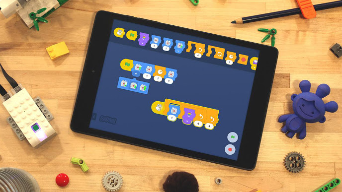
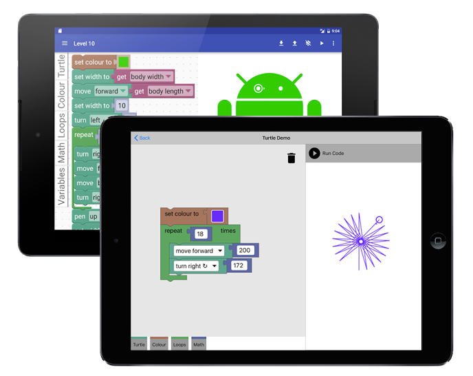

Blockly  |  Google Developers

## Try Blockly

Logic
Loops
Math
Text
Lists
Color

Variables
Functions
1Count ▾3≤ ▾Hello World!Count ▾1+ ▾setCount ▾toprintrepeatwhile ▾dosetCount ▾to

Language:

* * *

var  Count;Count  =  1;while  (Count  <=  3)  { window.alert('Hello World!');  Count  =  Count  +  1;}

play_arrow

The Blockly library adds an editor to your app that represents coding concepts as interlocking blocks. It outputs syntactically correct code in the language of your choice. Custom blocks may be created to connect to your own application.

[Learn more](https://developers.google.com/blockly/guides/overview)

## Built with Blockly

Blockly is being used by hundreds of projects, most of them educational:

## Blockly for Web

Blockly in a browser allows web pages to include a visual code editor for any of Blockly's five supported programming languages, or your own. In Blockly Games, pictured here, users can solve a maze using Blockly's editor on the right.

Blockly is...

- Pure JavaScript library. Under 150kb over the wire.
- 100% client side. No server side dependencies.
- Compatible with all major browsers: Chrome, Firefox, Safari, Opera, and IE.
- Highly customizable and extensible.

[Get started](https://developers.google.com/blockly/guides/get-started/web)

## Scratch Blocks (developer preview)

Google and the MIT Media Lab’s Scratch Team are collaborating on the development of a new generation of graphical programming blocks, called Scratch Blocks. Scratch Blocks builds on Google’s Blockly technology and the Scratch team’s expertise in designing creative interfaces for young learners.

Scratch Blocks is...

- A collaboration between MIT and Google, built on Blockly.
- Beginner friendly with an icon based horizontal UI.
- Scratch's standard vertical UI (in progress).
- Designed specifically for younger kids.

[Explore Scratch Blocks](http://scratch.mit.edu/developers)

## iOS and Android (developer previews)

Developer previews of Blockly running natively on iOS and Android demonstrate improved performance and tighter integration with platform UI frameworks. In addition to standard features, Blockly for iOS includes experimental support for multitouch capabilities and block animations. Blockly for Android provides deep support for Fragments and UI customization.

The Blockly team is actively working on achieving feature parity and supporting cross platform development.

[Get started on iOS](https://developers.google.com/blockly/guides/get-started/ios)[Get started on Android](https://developers.google.com/blockly/guides/get-started/android)