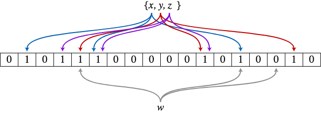

Bloom filters explained

# Bloom filters explained

yourbasic.org

A Bloom filter is a prob­abi­listic data struc­ture used to test set member­ship.

- [» Bloom filter basics](https://yourbasic.org/algorithms/bloom-filter/#bloom-filter-basics)

- [» Example: A blacklist of shady websites](https://yourbasic.org/algorithms/bloom-filter/#example-a-blacklist-of-shady-websites)

- [» Implementation](https://yourbasic.org/algorithms/bloom-filter/#implementation)

- [» Performance](https://yourbasic.org/algorithms/bloom-filter/#performance)

## Bloom filter basics

The Bloom filter data structure tells whether an element **may be** in a set, or **definitely isn’t**. The only possible errors are **false positives**: a search for a nonexistent element can give an incorrect answer. With more elements in the filter, the error rate increases.

Bloom filters are both **fast** and **space-efficient**. However, elements can only be added, not removed.

Content distribution networks use them to avoid caching one-hit wonders, files that are seen only once. Web browsers use them to check for potentially harmful URLs.

## Example: A blacklist of shady websites

This piece of code, which uses the Go Bloom filter implementation in package [github.com/yourbasic/bloom](https://github.com/yourbasic/bloom), shows a typical Bloom filter use case.

	// A Bloom filter with room for at most 100000 elements.
	// The error rate for the filter is less than 1/200.
	blacklist := bloom.New(10000, 200)

	// Add an element to the filter.
	url := "https://rascal.com"
	blacklist.Add(url)

	// Test for membership.
	if blacklist.Test(url) {
	    fmt.Println(url, "may be blacklisted.")
	} else {
	    fmt.Println(url, "has not been added to our blacklist.")
	}

`https://rascal.com may be blacklisted.`

## Implementation

An empty Bloom filter is a [bit array](https://yourbasic.org/algorithms/your-basic-int/#simple-sets) of *m* bits, all set to 0. There are also *k* different hash functions, each of which maps a set element to one of the *m* bit positions.

- To add an element, feed it to the hash functions to get *k* bit positions, and set the bits at these positions to 1.
- To test if an element is in the set, feed it to the hash functions to get *k* bit positions.
    - If any of the bits at these positions is 0, the element**definitely isn’t** the set.
    - If all are 1, then the element **may be** in the set.

### Example

Here is a Bloom filter with three elements *x*, *y * and *z*. It consists of 18 bits and uses 3 hash functions. The colored arrows point to the bits that the elements of the set are mapped to.

The element *w* definitely isn’t in the set, since it hashes to a bit position containing 0.

> Try this cool > [> interactive Bloom filter demonstration](https://www.jasondavies.com/bloomfilter/)>  by Jason Davies!

## Performance

For a fixed error rate, adding a new element and testing for membership are both constant time operations, and a filter with room for *n* elements requires *O*(*n*) space.

In fact, a filter with error rate 1/p can be implemented with 0.26⋅ln(p) bytes per element using ⌈1.4⋅ln(p)⌉ bit array lookups per test.

This means that the example code above, with 100,000 entries and error rate 1/200, can be implemented using 135 KiB and 8 hash functions.

The Wikipedia [Bloom filter](https://en.wikipedia.org/wiki/Bloom_filter) article has a detailed mathematical analysis.

**Share this page:**       