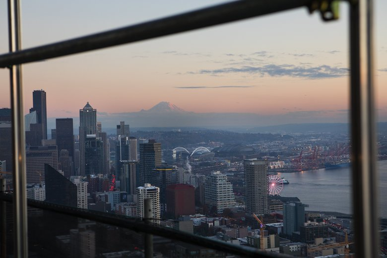
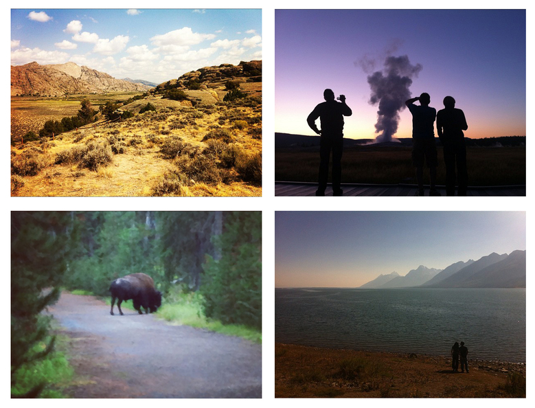

Boomtown Seattle: Why we move here — and how we’re all in it together

# Why we move here — and how we’re all in it together

The bastards are here — and they’re procreating, inviting their friends and settling in.

For years, we have been defying [the cries of late Seattle newspaper columnist Emmett Watson](http://community.seattletimes.nwsource.com/archive/?date=20010520&slug=emmett0), whose decades of tongue-in-cheek plotting to prevent new arrivals to the city (readers were deputized as KBO agents to “Keep the Bastards Out”) became consistent newsprint fodder and a rallying cry for some.

And now — amid the Amazon-fueled tech boom — we bastards are arriving in numbers [rivaling the Gold Rush](https://www.seattletimes.com/seattle-news/data/seattles-population-boom-approaching-gold-rush-numbers/).

### We want to hear from you

[What changes have you seen in Seattle recently? We want to know.](https://www.seattletimes.com/seattle-news/what-changes-have-you-noticed-in-seattle-recently-we-want-to-know/)

Watson’s sentiments take a new form these days: Jokes on Facebook about hiding those gorgeous mountain photos or feigning that it rains every day.

Have you heard the horror story of the Amazombies spreading through Capitol Hill like a virus and infecting it with wealth?

Yes, rents are rising. No, [traffic is not going to get better soon](https://projects.seattletimes.com/2018/one-center-city/). [Neighborhoods](https://www.seattletimes.com/seattle-news/central-districts-shrinking-black-community-wonders-whats-next/) [are](https://www.seattletimes.com/pacific-nw-magazine/as-prices-push-people-out-of-seattle-white-center-celebrates-community-and-diversity/) [changing](https://www.seattletimes.com/life/lifestyle/culture-clash-on-capitol-hill/). It’s rarely comfortable, particularly as [many struggle to get by](https://www.seattletimes.com/seattle-news/homeless/). We lose some things we love.

But, those newcomers? We don’t all work in tech. We’re not all filthy rich. And, the reasons many of us ascribe to moving here — to enjoy the beautiful environment, to feel support for our identities, to pursue love, to participate in progressive politics — are the reasons many Seattleites laid roots long ago.

Now, as Seattle’s population swells, old-timers and newcomers alike feel growth’s pressures and reckon with its impacts.

Seattle’s not shrinking anytime soon. Whether Emmett Watson would like it or not, we’re all in this together.

* * *

![THOROUGHLY SEATTLE | Kimberly Cisson clearly remembers piloting her little Nissan pickup truck, her most prized possession stuffed with the rest of her belongings, over I-90 and into downtown Seattle. “I was like, ‘Oh my God; they have skyscrapers,’ ” Cisson said. She knew she would fit in after watching the film “Go Fish.” One of the characters had a hippie friend — a granola type who lived in Seattle, a fact that apparently made her “extra crunchy.” Cisson, a seventh-generation Texan, didn’t know exactly what that meant, but mountains, grunge and living somewhere considered gay-friendly sounded a lot better than where she was living in New Mexico, whose motto she’d adjusted to “Land of Entrapment.” Twenty-three years later, Cisson might fit on a poster for stereotypical Seattle. She’s been making her West Seattle yard more environmentally friendly and hopes to help rehabilitate Longfellow Creek so coho salmon don’t die in pollution before they spawn. She’s an avid thrift shopper. And she counts “a full moon in the woods on snowshoes” as a highlight. (Dean Rutz / The Seattle Times](../_resources/825162202cb785c3db9b430dc675e27d.jpg)

THOROUGHLY SEATTLE | Kimberly Cisson clearly remembers piloting her little Nissan pickup truck, her most prized possession stuffed with the rest of her belongings, over I-90 and into downtown Seattle. “I was like, ‘Oh my God; they have skyscrapers,’ ” Cisson said. She knew she would fit in after watching the film “Go Fish.” One of the characters had a hippie friend — a granola type who lived in Seattle, a fact that apparently made her “extra crunchy.” Cisson, a seventh-generation Texan, didn’t know exactly what that meant, but mountains, grunge and living somewhere considered gay-friendly sounded a lot better than where she was living in New Mexico, whose motto she’d adjusted to “Land of Entrapment.” Twenty-three years later, Cisson might fit on a poster for stereotypical Seattle. She’s been making her West Seattle yard more environmentally friendly and hopes to help rehabilitate Longfellow Creek so coho salmon don’t die in pollution before they spawn. She’s an avid thrift shopper. And she counts “a full moon in the woods on snowshoes” as a highlight. (Dean Rutz / The Seattle Times

* * *

## Seattle the boomtown

Seattle is a city [perpetually remaking itself](https://www.seattle.gov/cityarchives/seattle-facts/brief-history-of-seattle).

Since the [Denny Party](http://old.seattletimes.com/news/local/seattle_history/articles/story2.html) first arrived at Alki, we’ve been [razing our hills](https://www.seattletimes.com/entertainment/books/too-high-too-steep-when-seattles-hills-came-falling-down/) and dumping the soil into Elliott Bay, [chopping canals](https://www.seattletimes.com/pacific-nw-magazine/our-ship-canal-has-provided-a-century-of-connections/) and bending rivers into shipping lanes.

### Introducing 'New Seattle'

Editor's note:

*It’s not easy living here. Rents have skyrocketed. Property ownership is out of reach for most. Even ordinary things — like groceries, burgers and beers — are more expensive in Seattle than ever before. But we’re drawn to this place, its beauty, politics, prosperity.*

*Seattle has always been a boom-and-bust town. And we’re in the midst of an Amazon-fueled boom now.*

*As more people come here, seeking opportunity, the city will continue its metamorphic change, gaining some things while losing others.*

*That leaves us, as the region’s biggest newsroom, with more stories to tell. And we don’t want to miss any of them.*

*This one, by [ex-Texan and Seattle Times reporter Evan Bush](https://www.seattletimes.com/seattle-news/how-i-came-to-seattle-a-trip-ill-never-forget/), about what it means to pick up and move to an unfamiliar outpost in the country’s northwest, is the first from a new team we’re calling “New Seattle.”*

*Follow [Evan Bush](https://www.seattletimes.com/author/evan-bush/), fellow reporter [Paige Cornwell](https://www.seattletimes.com/author/paige-cornwell/) and other Times staff members for more stories — like this one — over the coming months. Send us your ideas, too, about what you want us to explore.*

Now, [skyscrapers](https://www.seattletimes.com/business/real-estate/seattle-has-most-cranes-in-the-country-for-2nd-year-in-a-row-and-lead-is-growing/) are sprouting like weeds after a spring rain.

### Sign up for the Morning Brief

Delivered bright and early weekday mornings, this email provides a quick overview of top stories and need-to-know news.

Seattle is an instant city, said [Margaret O’Mara](https://history.washington.edu/people/margaret-omara), a University of Washington history professor. “Seattle and San Francisco are very similar. They’re gold-rush cities … they take off in rapid moments of economic growth.”

Our newcomers have arrived in waves, first to log and mine and extract. Later, they [riveted war machines](https://www.seattletimes.com/business/boeing-aerospace/from-the-archives-how-boeing-hid-its-bomber-factory/), pioneered air travel and then set out on digital frontiers, first with Microsoft and then Amazon.

“Everyone’s an immigrant, right? Unless you’re native Coast Salish people, you’re an immigrant from somewhere else,” O’Mara said.

Seattle’s economic booms have been intense; the busts less so.

[ *[The newcomers | Who are Seattle’s newest residents?](https://projects.seattletimes.com/2017/fyi-quiz-newcomers/)* ]

“You have economic downturns, but people stick around, and new industries are being born pretty rapidly out of others,” O’Mara said.

Englishman John Gray, 92, never intended to come to Seattle. During World War II, he’d trained as an airplane navigator in Canada and planned to settle there after the war. In 1958, he left England for a job with Canadair.

John Gray, 92, in his Bellevue home. An Englishman, he settled in the Seattle area and began working at Boeing as the space race dawned in the late 1950s. Seattle was a smaller town back then. Parking downtown was plentiful. “If you had a reasonable job, you could save … there was no problem getting a house,” Gray said, wistfully. (Courtney Pedroza / The Seattle Times)

But the company lost a key contract as he was moving and arranged to send Gray and other workers to Boeing in Seattle a few months after he arrived. Soon, he became a U.S. citizen and worked on top-secret projects.

“It was very exciting. It was the start of the space race,” Gray said. “Boeing was involved in building the lunar orbiter. I got to work on that … and support the mission to photograph the surface of the moon.”

Seattle was a smaller town back then. Parking downtown was plentiful. “If you had a reasonable job, you could save … there was no problem getting a house,” Gray said, wistfully.

> There’s something about choosing your state. I picked Washington out of all 50.” - Reuel Robertson, 59

Decades later, when Reuel Robertson, 59, fell in love with the region, it was Microsoft leading the region’s growth.

He’d been working at Bell Labs, a respected but “somewhat conservative” company in New Jersey. After visiting, Robertson became determined to live in Seattle, which reminded him of Alaska, his childhood home. His uncles balked when he told them about a little company called Microsoft that had offered him a job.

When Robertson arrived in Redmond in 1990, he was 31, and felt like the old man of Microsoft’s exhilarating culture.

“It was the Wild West,” Robertson said. “Every competitor we wanted to crush.”

At one meeting, he remembers, the leader of a competing company was hung in effigy as employees cheered.

Robertson settled in Woodinville, and over the years, he went from “living out in the country” to “watching the whole area build up around me.”

Life is slower now. He spends his free time boating on Puget Sound. His kids are studying at Washington public colleges. He considers himself a Washingtonian.

“When I hear someone tell me [they were] born here, I think that’s great. It’s a badge of honor,” he said. “But there’s something about choosing your state. I picked Washington out of all 50.”

![Reuel Robertson, 59, moved here in 1990 to work for Microsoft. “When I hear someone tell me [they were\] born here, I think that’s great. It’s a badge of honor,” he said. “But there’s something about choosing your state. I picked Washington out of all 50.” (Courtesy of Reuel Robertson)](../_resources/383d9c1ea4f8bc400924ca6e12f9edcb.jpg)

Reuel Robertson, 59, moved here in 1990 to work for Microsoft. “When I hear someone tell me [they were] born here, I think that’s great. It’s a badge of honor,” he said. “But there’s something about choosing your state. I picked Washington out of all 50.” (Courtesy of Reuel Robertson)

* * *

## Why we move

In Robertson’s day, it was Microsoft’s hard-driving culture making headlines. Enter Amazon.

Sociologists will tell you that it’s economic opportunity that draws people here, and certainly Amazon, which has added [more than 35,000 jobs](https://www.seattletimes.com/business/amazon/thanks-to-amazon-seattle-is-now-americas-biggest-company-town/)since 2010, has offered plenty.

“Economic drivers are the single most important reason some areas grow faster than others,” said [Charles Hirschman](https://faculty.washington.edu/charles/), sociology professor emeritus at the University of Washington.

Jobs might be a magnet, but their pull is not always obvious.

“It (economic opportunity) is amplified by social networks, cultural preferences, climate, and all sorts of different things,” Hirschman said.

> I see the melting pot that is Seattle. I don’t see Silicon Valley.” - Natasia Tebeck, 32

Public-relations firm Quinn Thomas last year polled both newcomers to King County (arrivals within the past five years), and longtime residents (people here for 15 or more years) on [what they value about Seattle](http://www.quinnthomas.com/wp-content/uploads/2017/09/Merge-Ahead-FINAL.pdf). It also conducted focus groups.

“When you ask people, ‘What do you like about living here?’ It wasn’t jobs or economic opportunity,” said Zach Knowling, a vice president at the agency. “They choose to live here and the job supports them.”

We come for myriad reasons.

Liz Dodds, a retired librarian, moved to Seattle in 2016 to be near her grandchildren, as their busy parents work demanding jobs.

### "Portal to the Pacific"

[How I came to Seattle — a trip I'll never forget »](https://www.seattletimes.com/seattle-news/how-i-came-to-seattle-a-trip-ill-never-forget/)

“We’re helping with dinner at times, or helping them put the kids to bed,” she said.

Moises Himmelfarb, a professional dancer from Mexico who works as a cultural attaché at the country’s Seattle consulate, came here in 2016 to pursue a relationship with a Seattle man. They recently married in Pioneer Square.

“It was kind of a leap of faith,” he said. “It was him at first, but then, the city was wonderful.”

On visits nearly a decade ago, Nastasia Tebeck, 32, a user-experience designer, fell in love with Seattle’s artistic vibe and slower pace.

She could walk through a crosswalk without hearing snarls from angry drivers. People seemed casual and comfortable in their own skin.

“I’d seen so many women walking around with jeans and hoodies … and practically no makeup,” she said, which felt different from Chicago, which she left in 2016.

> I enjoy the fact that Seattle is a mecca now.” - Anton Gielen, 63

Although other Seattle firms were interested, she chose Seattle’s fastest-growing company, Amazon. “They have the relocation-package game down,” Tebeck explained.

She didn’t realize her place of employment would draw an occasional sideways glance from locals channeling Emmett Watson’s spirit.

“Whenever I meet people in Seattle, I never tell them where I work,” until they get to know her, she said.

She knows the stereotype about Amazon is that employees are all “international men cloned” or “23-year-old white dudes who dropped out to write programs in [their] garage.”

She sees a company that attracts talent and lets people be themselves.
“I see the melting pot that is Seattle. I don’t see Silicon Valley.”

Nastasia Tebeck, 32

Chicago in 2016. She sees her employer, Amazon, as a company that attracts talent and lets people be themselves. “I see the melting pot that is Seattle. I don’t see Silicon Valley.” (Courtesy of Nastasia Tebeck)

* * *

## More in common than not

Perhaps we’re not so different.

When asked to describe what they appreciated about Seattle for the Quinn Thomas poll, both newcomers and long-term residents highlighted Seattle’s natural beauty, the environment and acceptance.

About three-quarters of both groups — particularly the self-described liberals — agreed that Seattleites shared their values.

“Their values are aligned. They’re not distinct and alien populations,” Knowling said.

The groups shared concern over traffic and housing prices.

But newcomers didn’t share long-term residents’ sense of loss that accompanied growth, Knowling said. They hadn’t known the Seattle that John Gray misses.

For some old-timers, Seattle’s rise has inspired internal conflict.

“I enjoy the fact that Seattle is a mecca now,” said Anton Gielen, 63, who emigrated from Victoria, British Columbia, in the late 1970s. Gielen met his future wife, then a UW student, here while partying with friends. For three years, the two corresponded by mail, until he moved south to marry her, become a citizen and build a life.

“I don’t want to deny the growth. I don’t want to deny the success. When the town was sleepier it was nice, too. Sometimes it’s hard to reconcile the two,” he said. “There comes a time as you get older … it’s not your world anymore. There’s another generation now that has to make their life here. I just hope they don’t screw it up, so I can stay living here.”

Longtime Seattleites, who have seen property taxes and prices soar, aren’t the only ones worried about sticking around.

Forty-eight percent of newcomers polled by Quinn Thomas said they were at least somewhat likely to leave Seattle in the next five years. Most of the people looking at leaving reported that they worried about their finances.

That statistic’s interpretation depends on perspective. Either newcomers aren’t committed to Seattle, or they’re still scrambling for a foothold in the place they desperately want to live.

* * *

![NEIGHBORHOOD ACTIVIST | Long enthralled with Seattle’s beauty and vibrant LGBTQ community, Gunner Scott moved to Seattle from Boston about five years ago to work at the Pride Foundation. Scott and his husband purchased a home in West Seattle’s Highland Park neighborhood, something that would not have been possible in Boston. As a gay couple, Scott said he wondered how they would be received. But, soon after they moved in, a woman came by and referenced a lesbian couple who had lived in the house before. “The girls lived in that house. Now the boys do,” she told Scott. “She was kind of saying, ‘Oh, the gay couple has come back and now we’re complete.’” Concerned about gentrification, Scott joined a focus group for the Housing Affordability and Livability Agenda. “I could see our neighborhood rapidly changing that doesn’t reflect the folks who have lived here 20, 30, 40, 50 years,” he said. (Erika Schultz / The Seattle Times)](../_resources/532632c897533adcf1c84a0bcfcfce66.jpg)

NEIGHBORHOOD ACTIVIST | Long enthralled with Seattle’s beauty and vibrant LGBTQ community, Gunner Scott moved to Seattle from Boston about five years ago to work at the Pride Foundation. Scott and his husband purchased a home in West Seattle’s Highland Park neighborhood, something that would not have been possible in Boston. As a gay couple, Scott said he wondered how they would be received. But, soon after they moved in, a woman came by and referenced a lesbian couple who had lived in the house before. “The girls lived in that house. Now the boys do,” she told Scott. “She was kind of saying, ‘Oh, the gay couple has come back and now we’re complete.’” Concerned about gentrification, Scott joined a focus group for the Housing Affordability and Livability Agenda. “I could see our neighborhood rapidly changing that doesn’t reflect the folks who have lived here 20, 30, 40, 50 years,” he said. (Erika Schultz / The Seattle Times)

* * *

## “Blue politics,” dogs and shared values

Newcomers are searching for a city that welcomes them, supports their identities and hears their concerns.

“It made me feel incredibly brave to move across the country on my own,” said Kelly Williams, 37, who moved here in 2013 from Atlanta to live in a city offering a “car-free lifestyle” and “blue politics.”

She doesn’t miss the humidity or the mosquitoes of the South. Seattle’s “breathtaking” views never get old. Williams bought her first pair of hiking boots here and loves dog-friendly Seattle for her pup, Scooter.

But, she has grown to appreciate the “Southern hospitality” she left behind. Williams said she’s had to be “proactive” to make friends in Seattle.

“I really played up the Southern card — ‘Oh my gosh, I moved here from Georgia …’”

Kelly Williams, 37, holds her dog Scooter on the rooftop of her Belltown home. “It made me feel incredibly brave” to move from Atlanta in 2013, said Kelly Williams, who moved here to live in a city offering a “car-free lifestyle” and “blue politics.” She found Seattle’s lack of diversity “more jarring” than expected. “I feel people here just want to avoid the race topic … Not speaking about it is contributing to the problem.” (Ellen M. Banner / The Seattle Times)

Williams, who is black, also found Seattle’s lack of diversity “more jarring” than expected, and felt like Seattle’s progressive politics did not extend to race.

“I feel people here just want to avoid the race topic,” she said. “Seattle people just want to look away from it. Not speaking about it is contributing to the problem.”

When she began taking barre exercise classes at a studio in Lower Queen Anne, her classes were filled almost exclusively with white women, she said. Its marketing reflected the studio’s customers, she said.

Williams talked to the owner and pushed for more inclusive imagery. The owner was receptive.

“The first time I got an email from them and they had a black model, I teared up,” she said. “If you now go to that studio, you see all ages and races … If you use your voice, people will listen.”

[ *[Quiz | Can you can pronounce the names of Washington towns and historical attractions?](http://projects.seattletimes.com/2015/pronunciation-quiz/)  *]

Before moving to Seattle from Boston in 2016, Eunice Brady, who is Filipina, compared Seattle neighborhoods’ census demographics, seeking a neighborhood where she could expect to see people who looked like her. She settled on Beacon Hill.

Brady, who had lived in Portland and visited Seattle several times nearly a decade ago, said she was always attracted to cities known for local arts, culture and environmental sustainability.

When she settled here, Seattle surprised her. In the few years since her visits, Seattle had become no more affordable than Boston. Entire neighborhoods, like South Lake Union, had transformed and felt culturally homogeneous.

“My assumption of Seattle has changed,” she said. Some areas seemed to be composed of people “all from the same background, and the same way of thinking and the same level of privilege.”

As a social worker who helps clients facing homelessness, Brady said she worries for people “living on the edge” that have been pushed from their homes and neighborhoods, and the city altogether.

She realizes she’s part of the change, of course.

On one hand, “If I hadn’t found the neighborhood I’m in, I would have regretted moving to Seattle.”

But at the same time, “I do add to gentrification. I have my own privilege. I’m educated,” she said. “What am I doing to make sure I’m investing in my community?”

As this boomtown expands again, newcomers are grappling with their own presence, too. Of the shared values bonding Seattleites new and old — the environment, natural beauty, liberal politics — worry might be the strongest.

*Correction: An earlier version of this story misspelled the name of Charles Hirschman, sociology professor emeritus at the University of Washington.*