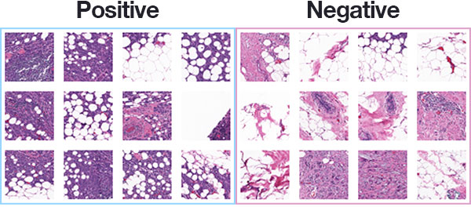
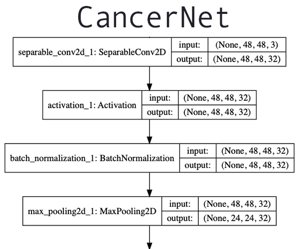

Breast cancer classification with Keras and Deep Learning - PyImageSearch

# Breast cancer classification with Keras and Deep Learning

By  [Adrian Rosebrock](https://www.pyimagesearch.com/author/adrian/)  on  February 18, 2019  in  [Deep Learning](https://www.pyimagesearch.com/category/deep-learning-2/), [Keras](https://www.pyimagesearch.com/category/keras/), [Tutorials](https://www.pyimagesearch.com/category/tutorials/)

In this tutorial, you will learn how to train a Keras deep learning model to predict breast cancer in breast histology images.

Back 2012-2013 I was working for the National Institutes of Health (NIH) and the National Cancer Institute (NCI) to develop a suite of image processing and machine learning algorithms to **automatically analyze breast histology images for cancer risk factors**, a task that took trained pathologists *hours* to complete. Our work helped facilitate further advancements in breast cancer risk factor prediction

**Back then deep learning was not as popular and “mainstream” as it is now.** For example, the ImageNet image classification challenge had only launched in 2009 and it wasn’t until 2012 that Alex Krizhevsky, Ilya Sutskever, and Geoffrey Hinton won the competition with the now infamous AlexNet architecture.

To analyze the cellular structures in the breast histology images we were instead leveraging basic computer vision and image processing algorithms, *but combining them in a novel way.* These algorithms worked really well — but also required quite a bit of work to put together.

Today I thought it would be worthwhile to explore deep learning in the context of breast cancer classification.

Just last year a close family member of mine was diagnosed with cancer. And similarly, I would be willing to bet that every single reader of this blog knows someone who has had cancer at some point as well.

As deep learning researchers, practitioners, and engineers it’s important for us to gain hands-on experience applying deep learning to medical and computer vision problems — this experience can help us develop deep learning algorithms to better aid pathologists in predicting cancer.

**To learn how to train a Keras deep learning model for breast cancer prediction, *just keep reading!***

Looking for the source code to this post?

[Jump right to the downloads section.](https://www.pyimagesearch.com/2019/02/18/breast-cancer-classification-with-keras-and-deep-learning/#)

## Breast cancer classification with Keras and Deep Learning

In the first part of this tutorial, we will be reviewing our breast cancer histology image dataset.

From there we’ll create a Python script to split the input dataset into three sets:

1. A training set
2. A validation set
3. A testing set

Next, we’ll use Keras to define a Convolutional Neural Network which we’ll appropriately name “CancerNet”.

Finally, we’ll create a Python script to train CancerNet on our breast histology images.

We’ll wrap the blog post by reviewing our results.

### The breast cancer histology image dataset

**Figure 1:** The [Kaggle Breast Histopathology Images](https://www.kaggle.com/paultimothymooney/breast-histopathology-images) dataset was curated by [Janowczyk and Madabhushi](https://www.ncbi.nlm.nih.gov/pubmed/27563488) and [Roa et al.](http://spie.org/Publications/Proceedings/Paper/10.1117/12.2043872) The most common form of breast cancer, Invasive Ductal Carcinoma (IDC), will be classified with deep learning and Keras.

The dataset we are using for today’s post is for Invasive Ductal Carcinoma (IDC), the most common of all breast cancer.

The dataset was originally curated by [Janowczyk and Madabhushi](https://www.ncbi.nlm.nih.gov/pubmed/27563488) and [Roa et al.](http://spie.org/Publications/Proceedings/Paper/10.1117/12.2043872) but is available in public domain on [Kaggle’s website](https://www.kaggle.com/paultimothymooney/breast-histopathology-images).

The original dataset consisted of 162 slide images scanned at 40x.

Slide images are naturally massive (in terms of spatial dimensions), so in order to make them easier to work with, a total of **277,524 patches** of *50×50* pixels were extracted, including:

- **198,738 negative examples** (i.e., no breast cancer)
- **78,786 positive examples** (i.e., indicating breast cancer was found in the patch)

There is clearly an **imbalance in the class data** with ***over 2x*** the number of negative data points than positive data points.

Each image in the dataset has a specific filename structure. An example of an image filename in the dataset can be seen below:

10253_idx5_x1351_y1101_class0.png
We can interpret this filename as:

- **Patient ID:** 10253_idx5
- ***x*-coordinate of the crop:** 1,351
- ***y*-coordinate of the crop:** 1,101
- **Class label:** 0 (0 indicates no IDC while 1 indicates IDC)

**Figure 1** above shows examples of both positive and negative samples — our goal is to train a deep learning model capable of discerning the difference between the two classes.

### Preparing your deep learning environment for Cancer classification

All of the Python packages you will use here today are installable via pip, a Python package manager.

I recommend that you install them into a virtual environment for this project, or that you add to one of your existing data science environments. Virtual environments are outside the scope of today’s blog post, but all of [my installation guides](https://www.pyimagesearch.com/opencv-tutorials-resources-guides/) will show you how to set them up.

If you need to set up a full blown deep learning system using recent OS’es, including [macOS Mojave](https://www.pyimagesearch.com/2019/01/30/macos-mojave-install-tensorflow-and-keras-for-deep-learning/) or [Ubuntu 18.04](https://www.pyimagesearch.com/2019/01/30/ubuntu-18-04-install-tensorflow-and-keras-for-deep-learning/), visit the respective links.

Here’s the gist of what you’ll need after your system prerequisites and virtual environment are ready (provided you are using a Python virtual environment, of course):

Breast cancer classification with Keras and Deep Learning

Shell

|     |     |
| --- | --- |
| 1 2 3 4 5 6 | $  workon  <env_name>  #if you are using a virtualenv $  pip install numpy opencv-contrib-python $  pip install pillow $  pip install tensorflow keras $  pip install imutils $  pip install scikit-learn matplotlib |

***Note:*** *None of our scripts today require OpenCV, butimutils  has an OpenCV dependency.*

### Project structure

Go ahead and grab the ***“Downloads”*** for today’s blog post.
From there, unzip the file:
Breast cancer classification with Keras and Deep Learning

Shell

|     |     |
| --- | --- |
| 1 2 | $  cd  path/to/downloaded/zip $  unzip breast-cancer-classification.zip |

Now that you have the files extracted, it’s time to put the dataset inside of the directory structure.

Go ahead and make the following directories:
Breast cancer classification with Keras and Deep Learning

Python

|     |     |
| --- | --- |
| 1 2 3 | $  cd  breast-cancer-classification $  mkdir datasets $  mkdir datasets/orig |

Then, head on over to Kaggle’s website and log-in. From there you can click the following link to download the dataset into your project folder:

**[Click here to download the data from Kaggle.](https://www.kaggle.com/paultimothymooney/breast-histopathology-images/downloads/IDC_regular_ps50_idx5.zip/1)**

***Note: **You will need create an account on Kaggle’s website (if you don’t already have an account) to download the dataset.*

Be sure to save the .zip file in thebreast-cancer-classification/datasets/orig  folder.

Now head back to your terminal, navigate to the directory you just created, and unzip the data:

Breast cancer classification with Keras and Deep Learning

Shell

|     |     |
| --- | --- |
| 1 2 | $  cd  path/to/breast-cancer-classification/datasets/orig $  unzip IDC_regular_ps50_idx5.zip |

And from there, let’s go back to the project directory and use thetree  command to inspect our project structure:

Breast cancer classification with Keras and Deep Learning

Python

|     |     |
| --- | --- |
| 1 2 3 4 5 6 7 8 9 10 11 12 13 14 15 16 17 18 19 20 21 22 23 24 25 26 27 28 29 30 31 32 33 34 | $  cd  ../.. $  tree  --dirsfirst  -L  4 . ├──  datasets │    └──  orig │       ├──  10253 │       │    ├──  0 │       │    └──  1 │       ├──  10254 │       │    ├──  0 │       │    └──  1 │       ├──  10255 │       │    ├──  0 │       │    └──  1 ...[omitting similar folders] │       ├──  9381 │       │    ├──  0 │       │    └──  1 │       ├──  9382 │       │    ├──  0 │       │    └──  1 │       ├──  9383 │       │    ├──  0 │       │    └──  1 │       └──  IDC_regular_ps50_idx5.zip ├──  pyimagesearch │    ├──  __init__.py │    ├──  config.py │    └──  cancernet.py ├──  build_dataset.py ├──  train_model.py └──  plot.png 840  directories,  7  files |

As you can see, our dataset is in thedatasets/orig  folder and is then broken out by faux patient ID. These images are separated into either benign (0/ ) or malignant (1/ ) directories.

Today’spyimagesearch/  module contains our configuration and CancerNet.
Today we’ll review the following Python files in this order:

- config.py : Contains our configuration that will be used by both our dataset builder and model trainer.
- build_dataset.py : Builds our dataset by splitting images into training, validation, and testing sets.
- cancernet.py : Contains our CancerNet breast cancer classification CNN.
- train_model.py : Responsible for training and evaluating our Keras breast cancer classification model.

### The configuration file

Before we can build our dataset and train our network let’s review our configuration file.

For deep learning projects that span multiple Python files (such as this one), I like to create a single Python configuration file that stores all relevant configurations.

Let’s go ahead and take a look atconfig.py :
Breast cancer classification with Keras and Deep Learning

Python

|     |     |
| --- | --- |
| 1 2 3 4 5 6 7 8 9 10 11 12 13 14 15 16 17 18 19 20 21 | # import the necessary packages import  os # initialize the path to the *original* input directory of images ORIG_INPUT_DATASET  =  "datasets/orig" # initialize the base path to the *new* directory that will contain # our images after computing the training and testing split BASE_PATH  =  "datasets/idc" # derive the training, validation, and testing directories TRAIN_PATH  =  os.path.sep.join([BASE_PATH,  "training"]) VAL_PATH  =  os.path.sep.join([BASE_PATH,  "validation"]) TEST_PATH  =  os.path.sep.join([BASE_PATH,  "testing"]) # define the amount of data that will be used training TRAIN_SPLIT  =  0.8 # the amount of validation data will be a percentage of the # *training* data VAL_SPLIT  =  0.1 |

First, our configuration file contains the path to the original input dataset downloaded from Kaggle (**Line 5**).

From there we specify the base path to where we’re going to store our image files after creating the training, testing, and validation splits (**Line 9**).

Using theBASE_PATH , we derive paths to training, validation, and testing output directories (**Lines 12-14**).

OurTRAIN_SPLIT  is the percentage of data that will be used for *training* (**Line 17**). Here I’ve set it to 80%, where the remaining 20% will be used for *testing*.

Of the *training* data, we’ll reserve some images for *validation*. **Line 21** specifies that 10% of the *training* data (after we’ve split off the testing data) will be used for *validation*.

We’re now armed with the information required to build our breast cancer image dataset, so let’s move on.

### Building the breast cancer image dataset

**Figure 2:** We will split our deep learning breast cancer image dataset into training, validation, and testing sets. While this 5.8GB deep learning dataset isn’t large compared to most datasets, I’m going to treat it like it is so you can learn by example. Thus, we will use the opportunity to put the [Keras ImageDataGenerator](https://www.pyimagesearch.com/2018/12/24/how-to-use-keras-fit-and-fit_generator-a-hands-on-tutorial/) to work, yielding small batches of images. This eliminates the need to have the whole dataset in memory.

Our breast cancer image dataset consists of **198,783 images**, each of which is *50×50* pixels.

If we were to try to load this entire dataset in memory at once we would need a little over 5.8GB.

For most modern machines, especially machines with GPUs, 5.8GB is a reasonable size; however, I’ll be making the assumption that your machine does not have that much memory.

Instead, we’ll organize our dataset on disk so we can use **[Keras’ ImageDataGenerator class](https://www.pyimagesearch.com/2018/12/24/how-to-use-keras-fit-and-fit_generator-a-hands-on-tutorial/) to yield batches of images from disk**  *without* having to keep the entire dataset in memory.

But first we need to organize our dataset. Let’s build a script to do so now.
Open up thebuild_dataset.py  file and insert the following code:
Breast cancer classification with Keras and Deep Learning

Python

|     |     |
| --- | --- |
| 1 2 3 4 5 6 7 8 9 10 11 12 13 14 15 16 17 18 19 20 21 22 23 24 25 26 27 28 29 | # import the necessary packages from  pyimagesearch import  config from  imutils import  paths import  random import  shutil import  os # grab the paths to all input images in the original input directory # and shuffle them imagePaths  =  list(paths.list_images(config.ORIG_INPUT_DATASET)) random.seed(42) random.shuffle(imagePaths) # compute the training and testing split i  =  int(len(imagePaths)  *  config.TRAIN_SPLIT) trainPaths  =  imagePaths[:i] testPaths  =  imagePaths[i:] # we'll be using part of the training data for validation i  =  int(len(trainPaths)  *  config.VAL_SPLIT) valPaths  =  trainPaths[:i] trainPaths  =  trainPaths[i:] # define the datasets that we'll be building datasets  =  [ ("training",  trainPaths,  config.TRAIN_PATH), ("validation",  valPaths,  config.VAL_PATH), ("testing",  testPaths,  config.TEST_PATH) ] |

This script requires that weimport  ourconfig  settings andpaths  for collecting all the image paths. We also will userandom  to randomly shuffle our paths,shutil  to copy images, andos  for joining paths and making directories. Each of these imports is listed on **Lines 2-6**.

To begin, we’ll grab all theimagePaths  for our dataset andshuffle  them (**Lines 10-12**).

We then compute the index of the training/testing split (**Line 15**). Using that index,i , ourtrainPaths  andtestPaths  are constructed via slicing theimagePaths  (**Lines 16 and 17**).

OurtrainPaths  are further split, this time reserving a portion for validation,valPaths  (**Lines 20-22**).

**Lines 25-29** define a list calleddatasets . Inside are three tuples, each with the information required to organize all of ourimagePaths  into training, validation, and testing data.

Let’s go ahead and loop over thedatasets  list now:
Breast cancer classification with Keras and Deep Learning

Python

|     |     |
| --- | --- |
| 31 32 33 34 35 36 37 38 39 40 41 42 43 44 45 46 47 48 49 50 51 52 53 54 55 56 57 58 59 | # loop over the datasets for  (dType,  imagePaths,  baseOutput)  in  datasets: # show which data split we are creating print("[INFO] building '{}' split".format(dType)) # if the output base output directory does not exist, create it if  not  os.path.exists(baseOutput): print("[INFO] 'creating {}' directory".format(baseOutput)) os.makedirs(baseOutput) # loop over the input image paths for  inputPath in  imagePaths: # extract the filename of the input image and extract the # class label ("0" for "negative" and "1" for "positive") filename  =  inputPath.split(os.path.sep)[-1] label  =  filename[-5:-4] # build the path to the label directory labelPath  =  os.path.sep.join([baseOutput,  label]) # if the label output directory does not exist, create it if  not  os.path.exists(labelPath): print("[INFO] 'creating {}' directory".format(labelPath)) os.makedirs(labelPath) # construct the path to the destination image and then copy # the image itself p  =  os.path.sep.join([labelPath,  filename]) shutil.copy2(inputPath,  p) |

On **Line 32**, we define a loop over our dataset splits. Inside, we:

- Create the base output directory (**Lines 37-39**).
- Implement a nested loop over all input images in the current split (**Line 42**):
    - Extract thefilename  from the input path (**Line 45**) and then extract the classlabel  from the filename (**Line 46**).
    - Build our outputlabelPath  as well as create the label output directory (**Lines 49-54**).
    - And finally, copy each file into its destination (**Lines 58 and 59**).

Now that our script is coded up, go ahead and create the training, testing, and validation split directory structure by executing the following command:

Breast cancer classification with Keras and Deep Learning

Shell

|     |     |
| --- | --- |
| 1 2 3 4 5 6 7 8 9 10 11 12 13 14 15 16 17 18 19 20 21 22 23 24 25 26 27 28 29 30 31 32 33 34 35 36 37 | $  python build_dataset.py [INFO]  building  'training'  split [INFO]  'creating datasets/idc/training'  directory [INFO]  'creating datasets/idc/training/0'  directory [INFO]  'creating datasets/idc/training/1'  directory [INFO]  building  'validation'  split [INFO]  'creating datasets/idc/validation'  directory [INFO]  'creating datasets/idc/validation/0'  directory [INFO]  'creating datasets/idc/validation/1'  directory [INFO]  building  'testing'  split [INFO]  'creating datasets/idc/testing'  directory [INFO]  'creating datasets/idc/testing/0'  directory [INFO]  'creating datasets/idc/testing/1'  directory $ $  tree  --dirsfirst  --filelimit  10 . ├──  datasets │    ├──  idc │    │    ├──  training │    │    │    ├──  0  [143065  entries] │    │    │    └──  1  [56753  entries] │    │    ├──  validation │    │    \|   ├──  0  [15962  entries] │    │    \|   └──  1  [6239  entries] │    │    └──  testing │    │        ├──  0  [39711  entries] │    │        └──  1  [15794  entries] │    └──  orig  [280  entries] ├──  pyimagesearch │    ├──  __init__.py │    ├──  config.py │    └──  cancernet.py ├──  build_dataset.py ├──  train_model.py └──  plot.png 14  directories,  8  files |

The output of our script is shown under the command.

I’ve also executed thetree  command again so you can see how our dataset is now structured into our training, validation, and testing sets.

***Note:** I didn’t bother expanding our originaldatasets/orig/  structure — you can scroll up to the “Project Structure” section if you need a refresher.*

### CancerNet: Our breast cancer prediction CNN

**Figure 3:** Our Keras deep learning classification architecture for predicting breast cancer ([click](https://www.pyimagesearch.com/wp-content/uploads/2019/02/cancernet_arch_raw.png) to expand)

The next step is to implement the CNN architecture we are going to use for this project.

To implement the architecture I used the Keras deep learning library and designed a network appropriately named “CancerNet” which:

1. Uses exclusively *3×3* CONV filters, similar to VGGNet

2. Stacks multiple *3×3* CONV filters on top of each other prior to performing max-pooling (again, similar to VGGNet)

3. But unlike VGGNet, uses **depthwise separable convolution** rather than standard convolution layers

Depthwise separable convolution is not a “new” idea in deep learning.

In fact, they were first utilized by Google Brain intern, Laurent Sifre in 2013.

Andrew Howard utilized them in 2015 when working with MobileNet.

And perhaps most notably, Francois Chollet used them in 2016-2017 when creating the famous Xception architecture.

**A detailed explanation of the differences between standard convolution layers and depthwise separable convolution is outside the scope of this tutorial (for that, [refer to this guide](https://towardsdatascience.com/a-basic-introduction-to-separable-convolutions-b99ec3102728)), but the gist is that depthwise separable convolution:**

1. Is more efficient.
2. Requires less memory.
3. Requires less computation.
4. Can perform better than standard convolution in some situations.

I haven’t used depthwise separable convolution in any tutorials here on PyImageSearch so I thought it would be fun to play with it today.

With that said, let’s get started implementing CancerNet!
Open up thecancernet.py  file and insert the following code:
Breast cancer classification with Keras and Deep Learning

Python

|     |     |
| --- | --- |
| 1 2 3 4 5 6 7 8 9 10 11 12 13 14 15 16 17 18 19 20 21 22 23 24 25 | # import the necessary packages from  keras.models import  Sequential from  keras.layers.normalization import  BatchNormalization from  keras.layers.convolutional import  SeparableConv2D from  keras.layers.convolutional import  MaxPooling2D from  keras.layers.core import  Activation from  keras.layers.core import  Flatten from  keras.layers.core import  Dropout from  keras.layers.core import  Dense from  keras import  backend as  K class  CancerNet: @staticmethod def  build(width,  height,  depth,  classes): # initialize the model along with the input shape to be # "channels last" and the channels dimension itself model  =  Sequential() inputShape  =  (height,  width,  depth) chanDim  =  -1 # if we are using "channels first", update the input shape # and channels dimension if  K.image_data_format()  ==  "channels_first": inputShape  =  (depth,  height,  width) chanDim  =  1 |

Our Keras imports are listed on **Lines 2-10**. We’ll be using Keras’Sequential  API to buildCancerNet .

An import you haven’t seen on the PyImageSearch blog isSeparableConv2D . This convolutional layer type allows for depthwise convolutions. For further details, [please refer to the documentation](https://keras.io/layers/convolutional/#separableconv2d).

The remaining imports/layer types are all discussed in both my introductory **[*Keras Tutorial*](https://www.pyimagesearch.com/2018/09/10/keras-tutorial-how-to-get-started-with-keras-deep-learning-and-python/)** and in even greater detail inside of **[*Deep Learning for Computer Vision with Python*](https://www.pyimagesearch.com/deep-learning-computer-vision-python-book/)**.

Let’s go ahead and define ourCancerNet  class on **Line 12** and then proceed tobuild  it on **Line 14**.

Thebuild  method requires four parameters:

- width ,height , anddepth : Here we specify the input image volume shape to our network, wheredepth  is the number of color channels each image contains.
- classes : The number of classes our network will predict (forCancerNet , it will be2 ).

We go ahead and initialize ourmodel  on **Line 17** and subsequently, specify ourinputShape  (**Line 18**). In the case of using TensorFlow as our backend, we’re now ready to add layers.

Other backends that specify"channels_first"  require that we place thedepth  at the front of theinputShape  and image dimensions following (**Lines 23-24**).

Let’s define ourDEPTHWISE_CONV  =>  RELU  =>  POOL  layers:
Breast cancer classification with Keras and Deep Learning

Python

|     |     |
| --- | --- |
| 27 28 29 30 31 32 33 34 35 36 37 38 39 40 41 42 43 44 45 46 47 48 49 50 51 52 53 54 55 56 | # CONV => RELU => POOL model.add(SeparableConv2D(32,  (3,  3),  padding="same", input_shape=inputShape)) model.add(Activation("relu")) model.add(BatchNormalization(axis=chanDim)) model.add(MaxPooling2D(pool_size=(2,  2))) model.add(Dropout(0.25)) # (CONV => RELU => POOL) * 2 model.add(SeparableConv2D(64,  (3,  3),  padding="same")) model.add(Activation("relu")) model.add(BatchNormalization(axis=chanDim)) model.add(SeparableConv2D(64,  (3,  3),  padding="same")) model.add(Activation("relu")) model.add(BatchNormalization(axis=chanDim)) model.add(MaxPooling2D(pool_size=(2,  2))) model.add(Dropout(0.25)) # (CONV => RELU => POOL) * 3 model.add(SeparableConv2D(128,  (3,  3),  padding="same")) model.add(Activation("relu")) model.add(BatchNormalization(axis=chanDim)) model.add(SeparableConv2D(128,  (3,  3),  padding="same")) model.add(Activation("relu")) model.add(BatchNormalization(axis=chanDim)) model.add(SeparableConv2D(128,  (3,  3),  padding="same")) model.add(Activation("relu")) model.add(BatchNormalization(axis=chanDim)) model.add(MaxPooling2D(pool_size=(2,  2))) model.add(Dropout(0.25)) |

ThreeDEPTHWISE_CONV  =>  RELU  =>  POOL  blocks are defined here with increasing stacking and number of filters. I’ve applied BatchNormalization  andDropout  as well.

Let’s append our fully connected head:
Breast cancer classification with Keras and Deep Learning

Python

|     |     |
| --- | --- |
| 58 59 60 61 62 63 64 65 66 67 68 69 70 | # first (and only) set of FC => RELU layers model.add(Flatten()) model.add(Dense(256)) model.add(Activation("relu")) model.add(BatchNormalization()) model.add(Dropout(0.5)) # softmax classifier model.add(Dense(classes)) model.add(Activation("softmax")) # return the constructed network architecture return  model |

OurFC  =>  RELU  layers and softmax classifier make the head of the network.

The output of the softmax classifier will be the prediction percentages for each class our model will predict.

Finally, ourmodel  is returned to the training script.

### Our training script

The last piece of the puzzle we need to implement is our actual training script.

Create a new file namedtrain_model.py , open it up, and insert the following code:

Breast cancer classification with Keras and Deep Learning

Python

|     |     |
| --- | --- |
| 1 2 3 4 5 6 7 8 9 10 11 12 13 14 15 16 17 18 19 20 21 22 23 24 | # set the matplotlib backend so figures can be saved in the background import  matplotlib matplotlib.use("Agg") # import the necessary packages from  keras.preprocessing.image import  ImageDataGenerator from  keras.callbacks import  LearningRateScheduler from  keras.optimizers import  Adagrad from  keras.utils import  np_utils from  sklearn.metrics import  classification_report from  sklearn.metrics import  confusion_matrix from  pyimagesearch.cancernet import  CancerNet from  pyimagesearch import  config from  imutils import  paths import  matplotlib.pyplot as  plt import  numpy as  np import  argparse import  os # construct the argument parser and parse the arguments ap  =  argparse.ArgumentParser() ap.add_argument("-p",  "--plot",  type=str,  default="plot.png", help="path to output loss/accuracy plot") args  =  vars(ap.parse_args()) |

Our imports come from 7 places:

1. matplotlib : A scientific plotting package that is the de-facto standard for Python. On **Line 3** we set matplotlib to use the"Agg"  backend so that we’re able to save our training plots to disk.

2. keras : We’ll be taking advantage of theImageDataGenerator ,LearningRateScheduler ,Adagrad  optimizer, andnp_utils .

3. sklearn : From scikit-learn we’ll need its implementation of aclassification_report  and aconfusion_matrix .

4. pyimagesearch : We’re going to be putting our newly defined CancerNet to use (training and evaluating it). We’ll also need our config to grab the paths to our three data splits. This module is *not* pip-installable; it is included the ***“Downloads”**** *section of today’s post.

5. imutils : I’ve made my convenience functions publicly available as a pip-installable package. We’ll be using thepaths  module to grab paths to each of our images.

6. numpy : The typical tool used by data scientists for numerical processing with Python.

7. Python: Bothargparse  andos  are built into Python installations. We’ll [use `argparse` to parse a command line argument](https://www.pyimagesearch.com/2018/03/12/python-argparse-command-line-arguments/).

Let’s parse our one and only command line argument,--plot . With this argument provided in a terminal at runtime, our script will be able to dynamically accept different plot filenames. If you don’t specify a command line argument with the plot filename, a default ofplot.png  will be used.

Now that we’ve imported the required libraries and we’ve parsed command line arguments, let’s define training parameters including our training image paths and account for class imbalance:

Breast cancer classification with Keras and Deep Learning

Python

|     |     |
| --- | --- |
| 26 27 28 29 30 31 32 33 34 35 36 37 38 39 40 41 42 43 | # initialize our number of epochs, initial learning rate, and batch # size NUM_EPOCHS  =  40 INIT_LR  =  1e-2 BS  =  32 # determine the total number of image paths in training, validation, # and testing directories trainPaths  =  list(paths.list_images(config.TRAIN_PATH)) totalTrain  =  len(trainPaths) totalVal  =  len(list(paths.list_images(config.VAL_PATH))) totalTest  =  len(list(paths.list_images(config.TEST_PATH))) # account for skew in the labeled data trainLabels  =  [int(p.split(os.path.sep)[-2])  for  p  in  trainPaths] trainLabels  =  np_utils.to_categorical(trainLabels) classTotals  =  trainLabels.sum(axis=0) classWeight  =  classTotals.max()  /  classTotals |

**Lines 28-30** define the number of training epochs, initial learning rate, and batch size.

From there, we grab our training image paths and determine the total number of images in each of the splits (**Lines 34-37**).

We’ll go ahead and compute theclassWeight  for our training data to account for class imbalance/skew.

Let’s initialize our data augmentation object:
Breast cancer classification with Keras and Deep Learning

Python

|     |     |
| --- | --- |
| 45 46 47 48 49 50 51 52 53 54 55 56 57 58 | # initialize the training data augmentation object trainAug  =  ImageDataGenerator( rescale=1  /  255.0, rotation_range=20, zoom_range=0.05, width_shift_range=0.1, height_shift_range=0.1, shear_range=0.05, horizontal_flip=True, vertical_flip=True, fill_mode="nearest") # initialize the validation (and testing) data augmentation object valAug  =  ImageDataGenerator(rescale=1  /  255.0) |

Data augmentation, a form of regularization, is important for nearly all deep learning experiments to assist with model generalization. The method purposely perturbs training examples, changing their appearance slightly, before passing them into the network for training. This partially alleviates the need to gather more training data, though more training data will rarely hurt your model.

Our data augmentation object,trainAug  is initialized on **Lines 46-55**. As you can see, random rotations, shifts, shears, and flips will be applied to our data as it is generated. Rescaling our image pixel intensities to the range *[0, 1]* is handled by thetrainAug  generator as well as thevalAug  generator defined on **Line 58**.

Let’s initialize each of our generators now:
Breast cancer classification with Keras and Deep Learning

Python

|     |     |
| --- | --- |
| 60 61 62 63 64 65 66 67 68 69 70 71 72 73 74 75 76 77 78 79 80 81 82 83 84 85 | # initialize the training generator trainGen  =  trainAug.flow_from_directory( config.TRAIN_PATH, class_mode="categorical", target_size=(48,  48), color_mode="rgb", shuffle=True, batch_size=BS) # initialize the validation generator valGen  =  valAug.flow_from_directory( config.VAL_PATH, class_mode="categorical", target_size=(48,  48), color_mode="rgb", shuffle=False, batch_size=BS) # initialize the testing generator testGen  =  valAug.flow_from_directory( config.TEST_PATH, class_mode="categorical", target_size=(48,  48), color_mode="rgb", shuffle=False, batch_size=BS) |

Here we initialize the training, validation, and testing generator. Each generator will provide batches of images on demand, as is denoted by thebatch_size  parameter.

Let’s go ahead and initialize ourmodel  and start training!
Breast cancer classification with Keras and Deep Learning

Python

|     |     |
| --- | --- |
| 87 88 89 90 91 92 93 94 95 96 97 98 99 100 101 | # initialize our CancerNet model and compile it model  =  CancerNet.build(width=48,  height=48,  depth=3, classes=2) opt  =  Adagrad(lr=INIT_LR,  decay=INIT_LR  /  NUM_EPOCHS) model.compile(loss="binary_crossentropy",  optimizer=opt, metrics=["accuracy"]) # fit the model H  =  model.fit_generator( trainGen, steps_per_epoch=totalTrain  //  BS, validation_data=valGen, validation_steps=totalVal  //  BS, class_weight=classWeight, epochs=NUM_EPOCHS) |

Our model is initialized with theAdagrad  optimizer on **Lines 88-90**.

We then compile  our model with a"binary_crossentropy" loss  function (since we only have two classes of data), as well as learning rate decay (**Lines 91 and 92**).

Making a call to the [Keras `fit_generator` method](https://www.pyimagesearch.com/2018/12/24/how-to-use-keras-fit-and-fit_generator-a-hands-on-tutorial/), our **training process is initiated.** Using this method, our image data can reside on disk and be yielded in batches rather than having the whole dataset in RAM throughout training. While not 100% necessary for today’s 5.8GB dataset, you can see how useful this is if you had a 200GB dataset, for example.

After training is complete, we’ll evaluate the model on the testing data:
Breast cancer classification with Keras and Deep Learning

Python

|     |     |
| --- | --- |
| 103 104 105 106 107 108 109 110 111 112 113 114 115 116 | # reset the testing generator and then use our trained model to # make predictions on the data print("[INFO] evaluating network...") testGen.reset() predIdxs  =  model.predict_generator(testGen, steps=(totalTest  //  BS)  +  1) # for each image in the testing set we need to find the index of the # label with corresponding largest predicted probability predIdxs  =  np.argmax(predIdxs,  axis=1) # show a nicely formatted classification report print(classification_report(testGen.classes,  predIdxs, target_names=testGen.class_indices.keys())) |

**Lines 107 and 108** make predictions on all of our testing data (again using a generator object).

The highest prediction indices are grabbed for each sample (**Line 112**) and then aclassification_report  is printed conveniently to the terminal (**Lines 115 and 116**).

Let’s gather additional evaluation metrics:
Breast cancer classification with Keras and Deep Learning

Python

|     |     |
| --- | --- |
| 118 119 120 121 122 123 124 125 126 127 128 129 130 | # compute the confusion matrix and and use it to derive the raw # accuracy, sensitivity, and specificity cm  =  confusion_matrix(testGen.classes,  predIdxs) total  =  sum(sum(cm)) acc  =  (cm[0,  0]  +  cm[1,  1])  /  total sensitivity  =  cm[0,  0]  /  (cm[0,  0]  +  cm[0,  1]) specificity  =  cm[1,  1]  /  (cm[1,  0]  +  cm[1,  1]) # show the confusion matrix, accuracy, sensitivity, and specificity print(cm) print("acc: {:.4f}".format(acc)) print("sensitivity: {:.4f}".format(sensitivity)) print("specificity: {:.4f}".format(specificity)) |

Here we compute theconfusion_matrix  and then derive the accuracy,sensitivity , andspecificity  (**Lines 120-124**). The matrix and each of these values is then printed in our terminal (**Lines 127-130**).

Finally, let’s generate and store our training plot:
Breast cancer classification with Keras and Deep Learning

Python

|     |     |
| --- | --- |
| 132 133 134 135 136 137 138 139 140 141 142 143 144 | # plot the training loss and accuracy N  =  NUM_EPOCHS plt.style.use("ggplot") plt.figure() plt.plot(np.arange(0,  N),  H.history["loss"],  label="train_loss") plt.plot(np.arange(0,  N),  H.history["val_loss"],  label="val_loss") plt.plot(np.arange(0,  N),  H.history["acc"],  label="train_acc") plt.plot(np.arange(0,  N),  H.history["val_acc"],  label="val_acc") plt.title("Training Loss and Accuracy on Dataset") plt.xlabel("Epoch #") plt.ylabel("Loss/Accuracy") plt.legend(loc="lower left") plt.savefig(args["plot"]) |

Our training history plot consists of training/validation loss and training/validation accuracy. These are plotted over time so that we can spot over/underfitting.

### Breast cancer prediction results

We’ve now implemented all the necessary Python scripts!
Let’s go ahead and train CancerNet on our breast cancer dataset.
Before continuing, ensure you have:

1. Configured your deep learning environment with the necessary libraries/packages listed in the *“Preparing your deep learning environment for Cancer classification”* section.

2. Used the ***“Downloads”*** section of this tutorial to download the source code.

3. Downloaded the breast cancer dataset from Kaggle’s website.

4. Unzipped the dataset and executed thebuild_dataset.py  script to create the necessary image + directory structure.

After you’ve ticked off the four items above, open up a terminal and execute the following command:

Breast cancer classification with Keras and Deep Learning

Shell

|     |     |
| --- | --- |
| 1 2 3 4 5 6 7 8 9 10 11 12 13 14 15 16 17 18 19 20 21 22 23 24 25 26 27 28 29 30 31 32 | $  python train_model.py Found  199818  images belonging to  2  classes. Found  22201  images belonging to  2  classes. Found  55505  images belonging to  2  classes. Epoch  1/40 6244/6244  [==============================]  -  255s  41ms/step  -  loss:  0.3648  -  acc:  0.8453  -  val_loss:  0.4504  -  val_acc:  0.8062 Epoch  2/40 6244/6244  [==============================]  -  254s  41ms/step  -  loss:  0.3382  -  acc:  0.8563  -  val_loss:  0.3790  -  val_acc:  0.8410 Epoch  3/40 6244/6244  [==============================]  -  253s  41ms/step  -  loss:  0.3341  -  acc:  0.8577  -  val_loss:  0.3941  -  val_acc:  0.8348 ... Epoch  38/40 6244/6244  [==============================]  -  252s  40ms/step  -  loss:  0.3230  -  acc:  0.8636  -  val_loss:  0.3565  -  val_acc:  0.8520 Epoch  39/40 6244/6244  [==============================]  -  252s  40ms/step  -  loss:  0.3237  -  acc:  0.8629  -  val_loss:  0.3565  -  val_acc:  0.8515 Epoch  40/40 6244/6244  [==============================]  -  252s  40ms/step  -  loss:  0.3234  -  acc:  0.8636  -  val_loss:  0.3594  -  val_acc:  0.8507 [INFO]  evaluating network...               precision    recall  f1-score   support            0       0.93      0.85      0.89     39808            1       0.69      0.85      0.76     15697    micro avg       0.85      0.85      0.85     55505    macro avg       0.81      0.85      0.83     55505 weighted avg       0.86      0.85      0.85     55505 [[33847  5961]  [  2402  13295]] acc:  0.8493 sensitivity:  0.8503 specificity:  0.8470 |

**Figure 4:** Our CancerNet classification model training plot generated with Keras.

Looking at our output you can see that our model achieved **~85% accuracy**; however, that raw accuracy is heavily weighted by the fact that we classified *“benign/no cancer”* correctly 93% of the time.

To understand our model’s performance at a deeper level we compute the **sensitivity** and the **specificity**.

Our sensitivity measures the proportion of the *true positives* that were also predicted as positive (85.03%).

Conversely, specificity measures our *true negatives* (84.70%).

We need to be really careful with our false negative here — **we don’t want to classify someone as *“No cancer”* when they are in fact *“Cancer positive”.***

Our false positive rate is also important — **we don’t want to mistakenly classify someone as *“Cancer positive”* and then subject them to painful, expensive, and invasive treatments when they don’t actually need them.**

There is always a balance between sensitivity and specificity that a machine learning/deep learning engineer and practitioner must manage, but when it comes to deep learning and healthcare/health treatment, that balance becomes *extremely important*.

For more information on sensitivity, specificity, true positives, false negatives, true negatives, and false positives, [refer to this guide](https://dzone.com/articles/ml-metrics-sensitivity-vs-specificity-difference).

## Summary

In this tutorial, you learned how to use the Keras deep learning library to train a Convolutional Neural Network for breast cancer classification.

To accomplish this task, we leveraged a breast cancer histology image dataset curated by [Janowczyk and Madabhushi](https://www.ncbi.nlm.nih.gov/pubmed/27563488) and [Roa et al.](http://spie.org/Publications/Proceedings/Paper/10.1117/12.2043872)

The histology images themselves are massive (in terms of image size on disk and spatial dimensions when loaded into memory), so in order to make the images easier for us to work with them, Paul Mooney, part of the community advocacy team at Kaggle, converted the dataset to *50×50* pixel image patches and then uploaded the modified dataset directly to the [Kaggle dataset archive](https://www.kaggle.com/paultimothymooney/breast-histopathology-images).

A total of **277,524 images** belonging to two classes are included in the dataset:

1. **Positive (+):** 78,786
2. **Negative (-):** 198,738

Here we can see there is a **class imbalance** in the data with over *2x* more negative samples than positive samples.

The class imbalance, along with the challenging nature of the dataset, lead to us obtaining **~86% classification accuracy**, **~85% sensitivity**, and **~85% specificity**.

I invite you to use this code as a template for starting your own breast cancer classification experiments.

**To download the source code to this post, and be notified when future tutorials are published here on PyImageSearch, *just enter your email address in the form below!***

## Downloads:

If you would like to download the code and images used in this post, please enter your email address in the form below. Not only will you get a .zip of the code, I’ll also send you a **FREE 17-page Resource Guide on Computer Vision, OpenCV, and Deep Learning.** Inside you'll find my hand-picked tutorials, books, courses, and libraries to help you master CV and DL! Sound good? If so, enter your email address and I’ll send you the code immediately!

Email address:

### Resource Guide (it’s totally free).

Enter your email address below to get my **free 17-page Computer Vision, OpenCV, and Deep Learning Resource Guide PDF**. Inside you'll find my hand-picked tutorials, books, courses, and Python libraries to help you master computer vision and deep learning!

**  [cnn](https://www.pyimagesearch.com/tag/cnn/), [convolutional neural network](https://www.pyimagesearch.com/tag/convolutional-neural-network/), [deep learning](https://www.pyimagesearch.com/tag/deep-learning/), [keras](https://www.pyimagesearch.com/tag/keras/), [medical](https://www.pyimagesearch.com/tag/medical/)