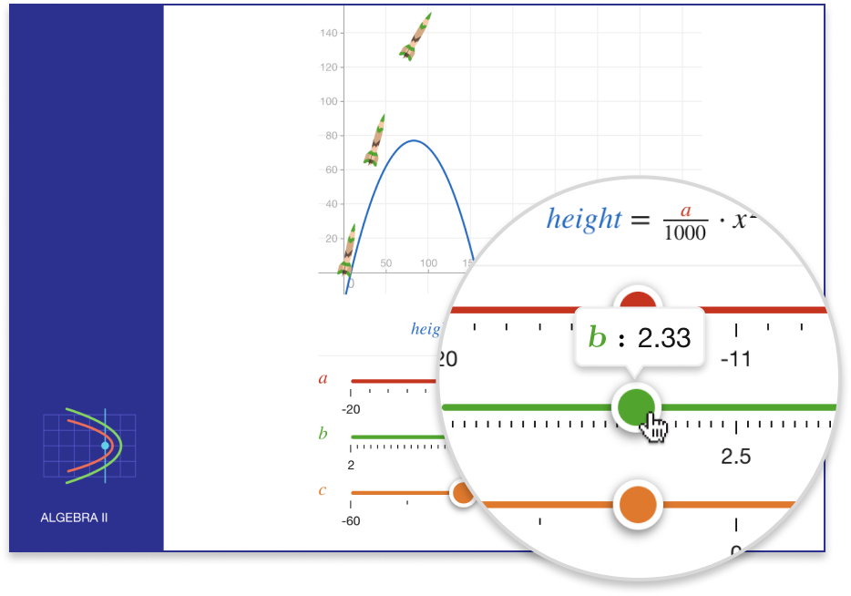
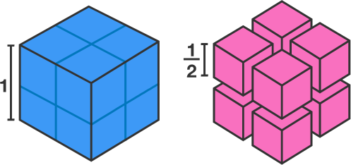
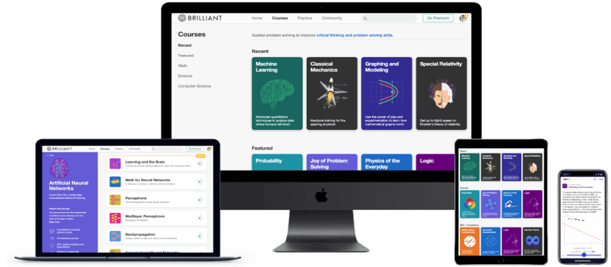

Brilliant | Math and science done right

 [Brilliant](https://brilliant.org/)  [Log in](https://brilliant.org/account/login/)

#  Math and science done right

Master key ideas in math, science, and computer science through ***problem solving***.

 [Sign up for free](https://brilliant.org/account/signup/)

-

-

-

-

-

-

-

-

### Effective and fun

Learn through interactive problem solving – proven to be [more effective](https://brilliant.org/principles/) than lectures.

-

### Leading instructors

Enjoy thousands of explorations written by [award-winning teachers, researchers, and professionals.](https://brilliant.org/educator-bios/)

-

### Bite-sized learning

Stay sharp in math and science – solve [daily challenges](https://brilliant.org/daily-problems/) in bite-sized sessions, made for ages 10 to 110.

## Why learn on Brilliant?

Whether you want to hone your quantitative skills, improve your knowledge of science and technology, be a smarter parent for your inquisitive kid, or simply stay sharp, Brilliant helps you grow as a curious and ambitious person.

 

## Finish your day

a little bit smarter

Brilliant’s entertaining and educational course library is perfect for beginners, but also includes intermediate and advanced topics for professionals and lifelong learners.

[See our Courses page](https://brilliant.org/courses/)

 

##### **4.7**/5

Average app store rating
from 40,000+ ratings

 

Excellent app, beautifully laid out, engaged community.

Joshua T. 

## Experience world-class lifelong learning

Brilliant’s inspiring, interactive learning experiences have garnered tens of thousands of 5-star ratings, and rave reviews around the world.

[See our Testimonials page](https://brilliant.org/testimonials/)

 

## Become a better

problem solver

Brilliant guides you through an interactive exploration of concepts and principles, and helps you build your quantitative intuition. Learn frameworks for thinking and solving challenging problems, instead of memorizing formulas.

[See our Principles of Learning](https://brilliant.org/principles/)

 

### New challenges daily

Stay fresh by solving [daily challenges](https://brilliant.org/daily-problems/) with an engaged community of lifelong learners.

 

### Learn anywhere

Easily switch between your computer and mobile device. Learn anywhere with our Android and iOS apps.

Join over 7 million problem solvers on Brilliant!

###  Start your learning journey

 [Sign up for free](https://brilliant.org/account/signup/)

- [(L)](https://twitter.com/brilliantorg)

- [(L)](https://www.facebook.com/brilliantorg)

- [(L)](https://www.youtube.com/brilliantorg?sub_confirmation=1)

- [About](https://brilliant.org/about/)

- [Courses](https://brilliant.org/courses/)

- [Pricing](https://brilliant.org/premium/)

- [Careers](https://brilliant.org/careers/)

- [Topics](https://brilliant.org/algebra/)

- [Testimonials](https://brilliant.org/testimonials/)

- [Help](https://brilliant.org/help/)

- [Terms](https://brilliant.org/terms-of-use/)

- [Privacy](https://brilliant.org/privacy/)

- © Brilliant 2019

 [Practice math and science questions on the Brilliant iOS app.](https://itunes.apple.com/app/apple-store/id913335252?pt=105095803&ct=brilliant_website_footer&mt=8)  [Practice math and science questions on the Brilliant Android app.](https://play.google.com/store/apps/details?id=org.brilliant.android&referrer=utm_source%3Dbrilliant%26utm_medium%3Dsite%26utm_campaign%3Dplaystore_full_footer_icon)