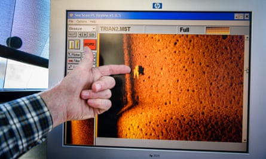
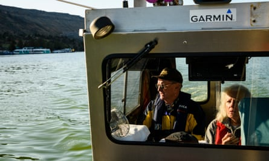
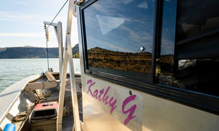

Bring up the bodies: the retired couple who find drowning victims | Science | The Guardian

[The long read](https://www.theguardian.com/news/series/the-long-read)

# Bring up the bodies: the retired couple who find drowning victims

Gene and Sandy Ralston are a married couple in their 70s, who also happen to be among North America’s leading experts at searching for the dead. By   [Doug Horner](https://www.theguardian.com/profile/doug-horner)

Main image: Gene and Sandy Ralston on Lake Billy Chinook in Jefferson County, Oregon. Photograph: Leah Nash/The Guardian

Thu 16 Jan 2020 06.00 GMTLast modified on Thu 16 Jan 2020 10.14 GMT

- 
- 
- 

Shares

539

When Gene and Sandy Ralston returned to their truck after a day on the Beardsley reservoir in northern California in March 2002, they discovered several handwritten notes taped to the doors and windscreen: “Call Lieutenant Lunney as soon as you get back to town. It’s urgent.”

The Ralstons, a married couple from rural Idaho, had been scientists until the late 1980s, when they began helping out on local search and rescue missions. By the winter of 2002, they had volunteered on more than a dozen searches for victims of drowning across the US, and had developed an uncanny ability to find bodies. They had just helped Lt Lunney’s sheriff’s department locate the remains of a man who had drowned in the reservoir three-and-a-half years earlier, after falling off his boat while fishing. Divers had brought him back to the surface that afternoon.

 

##   [Lose yourself in a great story: Sign up for the long read email]()

   

Read more

 [(L)](https://www.theguardian.com/info/ng-interactive/2017/may/05/sign-up-for-the-long-read-email)

As the notes instructed, the Ralstons drove to the nearby town of Sonora to meet Lunney. Their expertise was needed by some other folks, he said, although he wasn’t allowed to tell them who. The next morning, the Ralstons were briefed by FBI agents on a series of kidnappings for ransom that had turned into murders. The families of four victims of abduction had wired more than $1.2m between them to an account in New York, which then transferred the money to a bank in Dubai. But the bodies of the victims were now thought to be lying at the bottom of a reservoir just east of Yosemite national park. The killers, the FBI said, were possibly connected to the Russian mafia.

This was the Ralstons’ first homicide case. Until this moment, they had only used their specialised sonar system to scour the lake- and riverbeds for victims of accidents or suicides. Before they agreed to help find the bodies, Gene called his cousin, a recently retired FBI agent, for advice. “He said the Russians weren’t really into murdering people,” Gene told me. “So we didn’t really have to worry about them doing any retaliation if we went ahead with the search.”

Advertisement

Gene and Sandy are modest, unassuming people, but bring a relentlessness to their often monotonous work. They call it “mowing the lawn” – towing their sonar equipment back and forth through the water, piloting their boat in slow, overlapping strips. Typically, a corpse descends through water with its chest facing the surface. When the feet hit the bottom, the knees buckle and the body spills on to its back, arms outstretched. That is the shape the Ralstons usually look for with their sonar. They knew a murder victim would look different, though. “We call it ‘packaged’ – tied up and weighted,” Gene said.

It took them two weeks to find the four murder victims, who were, as suspected, lying at the bottom of the New Melones reservoir. “Gene and Sandy got up early, went out and located the first body on their own,” James Davidson, one of the FBI’s primary investigators on the case, told me. “That’s how determined they were.”

TV police dramas have popularised the image of a diver in a scuba suit emerging from a pond with a crucial piece of evidence. But the New Melones reservoir is more than 90 metres deep in some places, far beyond what is considered a safe depth for non-specialist divers. In order to retrieve the bodies, the FBI had to fly in a small, unmanned submarine – known as a remotely operated vehicle, or ROV – from the headquarters of its dive team in New York. The ROV had a mechanical arm that hooked the bodies and brought them within nine metres of the surface, where they were met by a team of divers. When the bodies surfaced, agents could see that they had been bound to gym weights with cable ties.

Advertisement

The last recovery proved the hardest. All sorts of rubbish had been dumped into the water from a bridge and it was tricky to sort through the sonar images of fridges and washing machines strewn across the bottom of the reservoir. When Gene and Sandy finally found something that looked like a body, the ROV operator dismissed it as a rock. Gene told him to nudge it gently. “It was like bumping into a beehive,” Gene said. “All kinds of little bugs took off. Why are the bugs there? Because it’s a food source.”

An FBI agent and scuba diver named Tony Tindal was part of the team that met each of the bodies as the ROV returned from the bottom. “I felt like someone needed to be with them,” Tindal said. “They’re brought up from their cold, chilly graves, all the way up to the surface, and now they’re ready to tell their story.”

That story revealed details about the awful way these people died and also hard evidence that directly implicated the perpetrators, who turned out to be an independent group without any connection to the mafia. Among other things, the same type of cable ties used to bind the victims’ bodies to the weights were found at the home of one of the suspects. Six people were eventually sentenced for their participation in the plot, which included another kidnapping and murder in the autumn of 2001, and two of them are currently on death row. “The crimes that were committed against these victims, how egregious the suspects were,” Tindal said. “It was just meant to be that Sandy and Gene were where they were at the right time.”

The Ralstons are now in their 70s and spend most of every year travelling to search sites or on the water, looking for bodies. They have clocked more than 31,000 miles on their motorhome in a single year. In almost two decades of searching, they have found 120 victims of drowning in lakes and rivers across the US and Canada. They are considered among the best underwater search and recovery specialists in North America, and have worked for agencies from the Royal Canadian Mounted Police to Nasa (hunting for the wreckage of the space shuttle Columbia, which disintegrated on atmospheric entry in February 2003, killing all seven crew members). They have helped solve crimes and generations-old mysteries.

When the Ralstons’ home phone rings with a search request, though, it is usually a family member of a missing person – someone reaching out after an official search has been called off. By the time the Ralstons arrive at the scene of a disappearance, no one expects the missing person to be found alive. What Gene and Sandy offer is not the hope of rescue, but the solace of finality. They have spent years crisscrossing North America in the service of grief.

* * *

Drowning is surprisingly silent and swift. People fighting to avoid suffocating in water quickly exhibit what is known as the “instinctive drowning response”, an involuntary physiological reaction that renders them unable to wave or yell for help. Every part of the bodily system is recruited for a singular purpose: to keep the mouth above water. This effort can only be sustained for somewhere between 20 and 60 seconds before a person slips below the surface for good.

Advertisement

Ten people die from drowning every day in the US, according to the Centers for Disease Control and Prevention – in lakes, rivers, swimming pools, the ocean. Men drown much more frequently than women. In Canada, eight out of 10 fatal drownings are men, according to the Canadian Lifesaving Society.

The bodies of the drowned sometimes surface on their own, but this depends on the qualities of the water. The putrefaction of flesh produces gases, primarily in the chest and gut, that inflate a corpse like a balloon. In warm, shallow water, decomposition works quickly, surfacing a corpse within two or three days. But cold water slows decay, and people who drown in deep lakes, 30 metres or below, may never surface. The weight of the water pins down their bodies.

There are scuba divers and underwater cameras, dogs trained to detect the gases released by a body underwater – but none of these are good at searching large areas or probing deep water. Suspended sediment in water, whether it is created by soft mud or decaying plants, makes it difficult to see with artificial light, so divers often have to grope along the floor in darkness. The farthest down the Ralstons have found a body, though, is 174 metres – a 33-year-old man on the floor of François Lake in British Columbia. He had been missing for 29 years.

   Gene Ralston displays an image of a past body they found using side-scan sonar. Photograph: Leah Nash/The Guardian

Unless there is a suspicion of wrongdoing, most local authorities will only spend a week or two searching for a drowning victim. Then it is up to the family of the missing person, or volunteers. Some families spend thousands of dollars a day on commercial diving services. Others drag the bottom of lakes with grappling hooks. Sometimes they chance upon the victim; often they work until their resources and spirits are spent.

Advertisement

Gene and Sandy are anomalies in the world of search and rescue. They pursue this work full-time, but they work for free, only charging travel expenses. They take a scientist’s methodical approach to everything they do. Gene even has a system when it comes to remembering his wedding anniversary, which is on 26 August. “My birthday is the 16th, Sandy’s birthday is the 29th, so there are 13 days in between those two dates, and the same month of April, which is four, the fourth month, so there’s two of us, two times four is eight and that is the eighth month and two times 13 is 26, the day,” he said.

They are fastidious about covering every inch of a search area before moving on. To get clear images, Sandy has to pilot their boat at no more than 2.5mph (2.16 knots), which is slower than walking on flat ground. A search can go for 10 hours a day and last for weeks. The onboard bathroom consists of a plastic bedpan stowed in a hatch by the boat’s motor. “After the fifth or sixth day of searching, you get almost zombie-like,” Gene said. He says underwater searches consist of long periods of boredom interrupted by brief moments of terror.

Successful underwater searches also require investigative acumen, and the Ralstons have become seasoned detectives. They are adept at interviewing witnesses and pinpointing search areas using whatever scant evidence is available. In June 2019, the Ralstons located the body of Daniel McGuckin under 98 metres of water in Lake Powell in Utah; they were the only ones to look at the GPS data of the houseboat McGuckin had jumped off before disappearing.

Knowing where someone goes under, what search and rescue teams call the “point of last seen”, is often crucial. The rule of thumb, the Ralstons said, is that a person will sink to the bottom of a lake within a radius equal to the depth of the water. In 2004, the Ralstons found the bodies of 27-year-old twin brothers who had drowned in a California reservoir after their fishing boat sank in high winds; they were lying just metres apart.

Occasionally, the Ralstons feel as if they are operating under divine guidance. There have been several times when they lowered their equipment almost directly on top of a body. It happened twice in a single day in 2001, on Hayden Lake in Idaho, where they found the bodies of two men, one who had drowned 19 months earlier, and one who had drowned the previous week. “It was like picking a page out of a book somewhere and that page having the quote that you want,” Gene said. Once, on the Clearwater River in northern Canada, he woke at dawn, raised the curtain on their motorhome window and spotted the body of a 19-year-old boy in a shallow only five metres from shore. “That blew our minds,” he said.

The Ralstons have helped the US military locate the wreckage of a pair of F18 fighter jets that collided over the Columbia River in Oregon. They have also helped a living person search for their favourite prosthetic leg, although that is still lying at the bottom of Idaho’s Lake Lowell. The oldest body the Ralstons has ever recovered had been lying at the bottom of Idaho’s Priest Lake for as long as 100 years; they had been searching for the body of a local firefighter who had disappeared while sailing. No one witnessed the accident, so the Ralstons had to scan an immense area. The greatest number of bodies they have found in a single day is four, in Idaho’s American Falls Lake, in August 2010. A man had got into trouble while swimming and so someone jumped in the water to help. After the second man began to struggle, a third followed, and when he too ended up in distress, in jumped a fourth. All of them drowned.

Advertisement

The only body the Ralstons ever found wearing a lifejacket was that of a man trying to ride his modified motorcycle at night across Canyon Ferry Lake in Montana. The bike stalled halfway across and the rider became tangled. He sank with his bike.

* * *

The Ralstons never set out to become experts at finding drowning victims. The story of how they got where they are today is what Gene would call a “six-pack-of-beer story”, the unit of storytelling that comes after “the really long story”. Gene has a gentle, grandfatherly way about him, as quick with a corny joke as he is with a detailed account of the physics of propagating soundwaves in water. Sandy wears bright, solid colours that make her white hair and blue eyes stand out, but she is more reserved than Gene. She hurries him along to the point, either by summing up the story herself or ushering him forward with a flick of her fingers.

The Ralstons, who both have postgraduate degrees in the biological sciences, started dating in about 1970 while on a trip to Mexico organised by the College of Idaho’s biology programme. The group travelled around the country for more than two months studying the vegetation. They camped wherever they found a good place to pull off the highway. Gene helped Sandy adjust to the rustic conditions. “He was a farm kid and I was a city kid,” she said. “And I thought he was a pretty cool-looking guy.” They married 47 years ago, in August 1972, on the top of a mountain in Idaho called Heaven’s Gate.

In 1979, the Ralstons started their own environmental consulting firm, surveying waterways for fish and evaluating the environmental impacts of proposed dam projects across Idaho and neighbouring states. Then, in March 1983, the Ralstons helped the sheriff in Boise, Idaho, find a middle-aged woman who had jumped off a bridge into the Boise River. “Spotted her body draped over a tree that had washed into the river,” Gene said. “That was really the first body I remember recovering, and that started the whole process. Got a really, really nice thank you from the family.”

Over the next 16 years, the Ralstons volunteered for Idaho’s search and rescue operation, and recovered a couple more bodies on the Boise River. Then, in the spring of 1999, Gene heard about the search for a young man who had drowned after his rowing boat capsized on the Wolf Creek reservoir in Oregon. The man’s family had hired a search team who claimed to have equipment on loan from the military that was “100% effective” at locating drowning victims. Gene asked if he could join them on the search to see what the hype was all about.

The team was using “side-scan sonar”. Explaining how it works, Gene compares it to the best method for finding a small screw or pin that has fallen on the ground. “Take a flashlight and lay down and roll it on the floor. You’ll see the shadow of the pin before you see the pin itself.” Instead of light, sonar emits pulses of sound, which travel easily through water, reflecting back off solid objects – rocks, human bodies, sunken treasure. Software then translates those reflections into images displayed on a computer aboard the boat. The sonar device is housed in a torpedo-shaped casing almost two metres long, weighing 70kg and is towed behind the boat close to the bottom of the lake.

Get the Guardian’s award-winning long reads sent direct to you every Saturday morning

Advertisement

This kind of sonar was developed in the early 60s and was used by the US military to find a missing nuclear submarine off the coast of Boston in 1963. In the 70s, the celebrated undersea explorer Jacques Cousteau used the technology to find shipwrecks and even to try to capture an image of the Loch Ness monster. In 1985, side-scan sonar also played a role in locating the Titanic about 370 miles south-east of Newfoundland, Canada, more than two miles below the surface of the Atlantic.

It was immediately clear to Gene, when he saw the sonar at work on the Wolf Creek reservoir, that the technology was revolutionary – but he wasn’t impressed with the people operating it. The sonar picked up an image of the missing man on the first afternoon out. “I didn’t know what a body should look like, but it sure looked like arms and legs and a body to me,” Gene said. But they continued searching for another four days. Eventually, they located the body again – then charged the family $30,000.

Gene and Sandy already had some experience with people desperate to find the body of a loved one. They knew people would pay anything, do anything, to find some measure of resolution. When they decided to buy their own sonar rig, they resolved that their time and expertise would be free. They ordered the equipment in spring 2000, including 275 metres of electromechanical cable so they could lower the sonar array to the bottom of even the deepest lakes. All told, Gene estimated it cost them $100,000.

“I don’t know if ‘old-fashioned’ is the word,” the Ralstons’ longtime friend John Zeman said when I asked him about the couple working for free. “But they’re not for modern things. Sandy, she’s always watching for a sale and Gene, he likes a truck with crank [non-automatic] windows. They’re just people that aren’t materialistic at all. There are no frills.”

The Ralstons’ first search with the new equipment was for a 24-year-old named Brandon Larsen, who drowned in August 2000 while swimming off his friends’ boat in Bear Lake, Utah. “He apparently was a bit of a jokester, so to speak, and his friends thought he was just kidding when he was splashing around, calling for help,” Gene said. “Then all of a sudden, he just disappeared.”

The Ralstons arrived six weeks later and found Larsen’s body at a depth of 45 metres the next day. “The day of the recovery, they were there, probably 12 or 15 of them – family members, friends – in the parking lot. Lots of hugs went around and a few tears shed,” Gene said. Returning Larsen’s body to his family also bound the family to the Ralstons. Larsen’s father is still in regular contact with them, and the Ralstons had planned to attend his sister’s wedding last April until they were called to another search.

* * *

Within two weeks of finding Larsen, the Ralstons began to receive telephone calls from families in desperate situations who had heard about them on the radio. The first was from a mother whose 18-year-old daughter had been abducted, raped, tortured and murdered a dozen years earlier. Her body had been found, but they were still trying to bring the killer to justice. The mother hoped the Ralstons could help with the investigation by locating her daughter’s car in a lake in Wyoming. “I could hear a lot of pain in her voice,” Gene said. “It affected us a lot. I couldn’t wait to get there.” (In the end, the Ralstons were unable to find the car.) Another call came from the family of a young man who had jumped off the Chesapeake Bay Bridge in Maryland, on the opposite side of the country. “I don’t remember how they found out about us from that far away,” Gene said. “We had no idea that it would develop into such a nationwide, and continent-wide practically, situation for us.”

Advertisement

In lighter moments, the Ralstons refer to anything that happened prior to the autumn of 2000 as “BSS” – before side-scan sonar. In those BSS days, they used to go on one or two big scuba-diving trips a year to dive in places like the Caribbean, or to fish for salmon off the west coast of Canada. “Used to – as in, the good old days,” Sandy said.

The more successful searches the Ralstons carried out, the more they were covered by the press, and the more calls they received. By 2004, the couple had stopped promoting their environmental consulting business because it interfered with how quickly they could respond to search requests. “I would have to tell a family that we couldn’t come for two or three weeks and that bothered me,” Gene said.

Their last consulting job was in 2005. The Ralstons don’t have a great amount of money, but they are frugal. “What better use for what money you have than to help somebody else out when everybody else has given up on helping them?” Gene said.

For the families and friends, coping with the loss of a loved one who has drowned without a trace is a special kind of pain. “The human brain can’t let go unless there is evidence of transformation from life to death,” says Pauline Boss, a professor emeritus at the University of Minnesota and a family therapist, who has spent the last half-century researching what it means to reunite families with the bodies of the deceased. Without recovering a body, a haunting anguish takes the place of grief and eventual closure. Some people report catching glimpses of their lost loved ones in everyday situations – in the aisles of the supermarket, say – for years after they go missing. “You need to see that the person is no longer breathing,” Boss said. “Or you need to see the bones.”

   Gene and Sandy Ralston aboard the Kathy G on Lake Billy Chinook in Jefferson County, Oregon. Photograph: Leah Nash/The Guardian

Advertisement

To add to the cruelties of what Boss calls “ambiguous loss”, the law, too, struggles to recognise death in the absence of a body. Courts, banks, insurance companies and creditors need the corpse as proof. “That [situation] freezes the person who is missing, it freezes all of their assets and it freezes all of their loved ones or anybody else who’s depending upon them,” says Robert Jarvis, a law professor at the Shepard Broad College of Law in Florida, who has published several articles on how the law treats those who are only presumed dead.

In December 2006, the Ralstons went looking for the body of a young man named Shane Pierce who had drowned in a boating accident on a Kentucky lake that September. Without a body, Shane’s family hadn’t been able to get a death certificate, and without a death certificate, they had to continue making the payments for their son’s truck and for the mortgage on his house. “It almost sunk us,” Shane’s father, Roger Pierce, told me. The family also couldn’t sell the boat their son was driving the day he drowned, because it was registered in his name. The windshield of the boat was smashed where he had apparently hit his head and been knocked unconscious before being thrown from the boat.

“Man, that was tough,” Roger said. “The boat stood out here in my driveway and every time I looked at it, I’d think of Shane.” At least five different search and rescue groups had tried to find Shane’s body before the Ralstons showed up. “Gene and Sandy started their search and found Shane in six minutes,” Pierce said. “If I hadn’t hooked up with Gene and Sandy, I don’t know what would have happened.”

The Ralstons helped Gina Hoogendoorn find her father, Rick Herren, who had been missing for 15 years. The couple found his body on the bottom of Wyoming’s Flaming Gorge reservoir in the spring of 2012. Hoogendoorn was 18 when her father disappeared and, after an initial search, local officials told her family they would have to get used to the idea of never finding him. She described the feeling of not knowing where her father was, of having nowhere to go to visit and remember him, as “an unbelievable hurt”.

It wasn’t until she was 33, when she happened to catch a TV show about a drowning victim whose body was recovered years after they went missing, that Hoogendoorn realised she could still try to find her father’s body. She looked online and found the Ralstons. She called and described her story to Gene. “And he said: ‘Yep. We’ll be down. We’ll be down at the end of the week.’”

Once the Ralstons were out on the reservoir it took them eight minutes to locate the body. Divers with the sheriff’s office did the recovery a month later. “They brought him off the boat and set him down and me and my brother and my mom just loved on him,” Hoogendoorn said. The water was deep and cold so his body was relatively well preserved. “He still had form to him and so I could feel his chest, and it felt like his chest,” Hoogendoorn went on. “His shoulder felt like a shoulder, and it was very, very surreal to be able to hug him again. It was the most happy, saddest day of my life. We got to find him, then I had to say goodbye again.”

* * *

Advertisement

In April 2019, I went searching for a body with the Ralstons and John Zeman, their longtime friend. We were on Washburn Pond, a horseshoe-shaped band of water in a sparsely populated area of Washington state. The Ralstons’ boat is seven metres long and made from aluminium. There is just enough space in the cabin for the Ralstons to sit shoulder-to-shoulder, with a couple of people behind them. The name “Kathy G” has been stencilled in pink letters under one of the cabin’s windows since 2008 – the boat is named after a young woman whose body the Ralstons found in a lake in Alaska that spring; her family donated money that enabled the Ralstons to buy a new motor.

We were looking for the body of a 20-year-old named Alexander Bravo Marroquin, who had disappeared 12 days earlier when a canoe he was in with his brother capsized. The local authorities had called the Ralstons after conducting an extensive search. As we set out on the water, we passed a band of yellow police tape strung up on a shrub to mark where Bravo Marroquin’s brother remembered swimming to shore. As Sandy slowly piloted the boat, Gene watched images generated by the sonar scrolling down a large computer monitor. He was in his usual uniform: a collared flannel shirt tucked into a crisp pair of blue jeans. Sandy was wearing a baggy sweatshirt with an illustration of a cat in flippers and a scuba mask.

“Spotted something suspicious,” Zeman announced, about 15 minutes after leaving the boat launch.

“Not a body that I can tell,” Gene responded as we passed over it again, from the opposite direction. The shape on the monitor looked too round and too small. But Gene marked the location using GPS.

“Do you want to do a 90?” asked Sandy.
“I suppose we can do it – there’s something there,” Gene said.

   The Ralstons’ seven-metre aluminium boat, Kathy G. Photograph: Leah Nash/The Guardian

Advertisement

Sandy turned the boat around to come at the object from a perpendicular angle. We watched in silence as images of the lake bottom slowly ticked down the screen in shades of yellow. About 50 metres from land, the distance it would take a strong amateur swimmer to cover in about a minute, the distinct shape of a human body appeared headfirst in the monitor’s top left corner.

“Wow,” Gene murmured. “That’s him.” The body looked out of place on the barren lakebed. Gene took the wheel of the boat while Sandy and Zeman went on deck to drop a marker by the body – two plastic milk crates, which make a clear image on the sonar, attached to a white buoy. Then we hurried back to shore.

A couple of hours later, a dive team from the sheriff’s department went to recover Bravo Marroquin’s body. As we stood on the deck of the Kathy G and watched the divers go down, a series of guttural bird calls rang out high above us. “Sandhill cranes,” Gene said. “I love that sound.” Four birds with long thin necks and expansive wingspans soared over the pond.

I looked back down and saw the divers reach the surface. They were holding the body. His nose and forehead, along with a shock of thick dark hair, broke the surface of the water. When we got back to shore, the divers laid him out on the concrete slabs of the boat launch. Bravo Marroquin was the oldest of five siblings and his family had held a lakeside vigil every day since he went missing. About 20 of them had stood quietly at one end of a gravel parking lot by the lake earlier that morning. Now they were able to touch and pray with his body.

The Ralstons had decided a while back that they were going to stop after they recovered their 100th body. But Bravo Marroquin was the 114th, and they would go on to find six more in 2019. They no longer accept cross-country search missions, but Gene said that they would continue to answer calls in the western US for as long as their health permitted. “How do you say no to someone in that position?” he said. Gene turned 74 the day they found Bravo Marroquin on the bottom of Washburn Pond.

The Ralstons told me about another of the families they had helped. In the late summer of 2017, they spent more than five weeks searching for the body of a 26-year-old Irishman named David Gavin. He and some friends had taken a break from their roadtrip to jump off a bridge over the Kinbasket reservoir in British Columbia, Canada. He surfaced briefly, but then went down again and didn’t come back up. Gavin’s family had flown in from Ireland days after the accident and had set up a makeshift camp on a dusty gravel road overlooking the bridge. After a few days, the Royal Canadian Mounted police called off the official search, but a RCMP diver gave the Ralstons’ phone number to the Gavins. David’s father, Mick, credited the Ralstons with keeping the search and his family going that summer. “If they left, we had nothing else,” Mick told me. “They knew that, and they could see it in our eyes and talked to us every day. They couldn’t pull back from it.”

Advertisement

“I think what we do, having been around so much death, has to have had an influence on us,” Gene said to me at one point. Some recoveries were harder to forget than others. “One in particular was a little 12-year-old boy that was struck by a boat in Shasta Lake [in California]. That haunts me every once in a while,” he said.

Gene mentioned an expression often used by those in the emergency-response community: I wish my brain could forget what my eyes have seen. “Sandy has a way of dealing with that a little better, puts it out of her mind.”

“On several of the very first searches, there was always a coroner there and they always seemed to be a woman and very comfortable around what they were doing,” Sandy said. “I guess I adopted that.” Finding and recovering bodies was just one of those jobs that needed doing.

• Follow the Long Read on Twitter at [@gdnlongread](https://twitter.com/gdnlongread), and sign up to the long read weekly email [here](https://www.theguardian.com/info/ng-interactive/2017/may/05/sign-up-for-the-long-read-email).

##  As 2020 begins…

… we’re asking readers, like you, to make a new year contribution in support of the Guardian’s open, independent journalism. This has been a turbulent decade across the world – protest, populism, mass migration and the escalating climate crisis. The Guardian has been in every corner of the globe, reporting with tenacity, rigour and authority on the most critical events of our lifetimes. At a time when factual information is both scarcer and more essential than ever, we believe that each of us deserves access to accurate reporting with integrity at its heart.

You’ve read 29 articles in the last four months. More people than ever before are reading and supporting our journalism, in more than 180 countries around the world. And this is only possible because we made a different choice: to keep our reporting open for all, regardless of where they live or what they can afford to pay.

We have upheld our editorial independence in the face of the disintegration of traditional media – with social platforms giving rise to misinformation, the seemingly unstoppable rise of big tech and independent voices being squashed by commercial ownership. The Guardian’s independence means we can set our own agenda and voice our own opinions. Our journalism is free from commercial and political bias – never influenced by billionaire owners or shareholders. This makes us different. It means we can challenge the powerful without fear and give a voice to those less heard.

None of this would have been attainable without our readers’ generosity – your financial support has meant we can keep investigating, disentangling and interrogating. It has protected our independence, which has never been so critical. We are so grateful.

As we enter a new decade, we need your support so we can keep delivering quality journalism that’s open and independent. And that is here for the long term. Every reader contribution, however big or small, is so valuable. **Support The Guardian from as little as £1 – and it only takes a minute. Thank you.**

 [Support The Guardian](https://support.theguardian.com/uk/contribute?REFPVID=k5impkgg2swasrfl5xus&INTCMP=gdnwb_copts_memco_2020-01-06_global_new_year_Epic_round2__with_article_count_v2_2020_begins&acquisitionData=%7B%22source%22%3A%22GUARDIAN_WEB%22%2C%22componentId%22%3A%22gdnwb_copts_memco_2020-01-06_global_new_year_Epic_round2__with_article_count_v2_2020_begins%22%2C%22componentType%22%3A%22ACQUISITIONS_EPIC%22%2C%22campaignCode%22%3A%22gdnwb_copts_memco_2020-01-06_global_new_year_Epic_round2__with_article_count_v2_2020_begins%22%2C%22abTest%22%3A%7B%22name%22%3A%222020-01-06_global_new_year_Epic_round2__with_article_count%22%2C%22variant%22%3A%22v2_2020_begins%22%7D%2C%22referrerPageviewId%22%3A%22k5impkgg2swasrfl5xus%22%2C%22referrerUrl%22%3A%22https%3A%2F%2Fwww.theguardian.com%2Fscience%2F2020%2Fjan%2F16%2Fbring-up-the-bodies-gene-sandy-ralston-drowning-victims-sonar%22%7D)

 [Why support matters](https://www.theguardian.com/membership/2020/jan/06/support-guardian-readers-2020s-hope?INTCMP=2020-support-article)

 

Topics

- [The long read/](https://www.theguardian.com/news/series/the-long-read)
- [Death and dying/](https://www.theguardian.com/society/death-and-dying)
- [features/](https://www.theguardian.com/tone/features)
- 
- 
- 
- [Share on LinkedIn](http://www.linkedin.com/shareArticle?mini=true&title=Bring%20up%20the%20bodies%3A%20the%20retired%20couple%20who%20find%20drowning%20victims&url=https%3A%2F%2Fwww.theguardian.com%2Fscience%2F2020%2Fjan%2F16%2Fbring-up-the-bodies-gene-sandy-ralston-drowning-victims-sonar)
- [Share on Pinterest](http://www.pinterest.com/pin/find/?url=https%3A%2F%2Fwww.theguardian.com%2Fscience%2F2020%2Fjan%2F16%2Fbring-up-the-bodies-gene-sandy-ralston-drowning-victims-sonar)
- [Reuse this content](https://syndication.theguardian.com/automation/?url=https%3A%2F%2Fwww.theguardian.com%2Fscience%2F2020%2Fjan%2F16%2Fbring-up-the-bodies-gene-sandy-ralston-drowning-victims-sonar&type=article&internalpagecode=7007700)

Advertisement

##  Read The

Guardian without
interruption on all
your devices

 [Subscribe now](https://support.theguardian.com/uk/subscribe/digital?acquisitionData=%7B%22componentType%22%3A%22ACQUISITIONS_OTHER%22%2C%22source%22%3A%22GUARDIAN_WEB%22%2C%22campaignCode%22%3A%22shady_pie_open_2019%22%2C%22componentId%22%3A%22shady_pie_open_2019%22%7D&INTCMP=shady_pie_open_2019)  