Brooklyn Bridge, Star of the City: Here’s a Tour - The New York Times

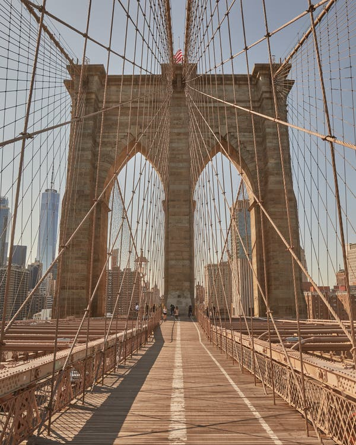

Credit...Zack DeZon for The New York Times

[Skip to content](https://www.nytimes.com/2020/05/06/arts/design/brooklyn-bridge-virtual-tour-virus.html?action=click&module=Top%20Stories&pgtype=Homepage&contentCollection=AtHome&package_index=0#site-content)[Skip to site index](https://www.nytimes.com/2020/05/06/arts/design/brooklyn-bridge-virtual-tour-virus.html?action=click&module=Top%20Stories&pgtype=Homepage&contentCollection=AtHome&package_index=0#site-index)

[![](data:image/svg+xml,%3csvg xmlns='http://www.w3.org/2000/svg' class='' viewBox='0 0 184 25' fill='%23000'%3e%3cpath d='M13.8 2.9c0-2-1.9-2.5-3.4-2.5v.3c.9 0 1.6.3 1.6 1 0 .4-.3 1-1.2 1-.7 0-2.2-.4-3.3-.8C6.2 1.4 5 1 4 1 2 1 .6 2.5.6 4.2c0 1.5 1.1 2 1.5 2.2l.1-.2c-.2-.2-.5-.4-.5-1 0-.4.4-1.1 1.4-1.1.9 0 2.1.4 3.7.9 1.4.4 2.9.7 3.7.8v3.1L9 10.2v.1l1.5 1.3v4.3c-.8.5-1.7.6-2.5.6-1.5 0-2.8-.4-3.9-1.6l4.1-2V6l-5 2.2C3.6 6.9 4.7 6 5.8 5.4l-.1-.3c-3 .8-5.7 3.6-5.7 7 0 4 3.3 7 7 7 4 0 6.6-3.2 6.6-6.5h-.2c-.6 1.3-1.5 2.5-2.6 3.1v-4.1l1.6-1.3v-.1l-1.6-1.3V5.8c1.5 0 3-1 3-2.9zm-8.7 11l-1.2.6c-.7-.9-1.1-2.1-1.1-3.8 0-.7 0-1.5.2-2.1l2.1-.9v6.2zm10.6 2.3l-1.3 1 .2.2.6-.5 2.2 2 3-2-.1-.2-.8.5-1-1V9.4l.8-.6 1.7 1.4v6.1c0 3.8-.8 4.4-2.5 5v.3c2.8.1 5.4-.8 5.4-5.7V9.3l.9-.7-.2-.2-.8.6-2.5-2.1L18.5 9V.8h-.2l-3.5 2.4v.2c.4.2 1 .4 1 1.5l-.1 11.3zM34 15.1L31.5 17 29 15v-1.2l4.7-3.2v-.1l-2.4-3.6-5.2 2.8v6.6l-1 .8.2.2.9-.7 3.4 2.5 4.5-3.6-.1-.4zm-5-1.7V8.5l.2-.1 2.2 3.5-2.4 1.5zM53.1 2c0-.3-.1-.6-.2-.9h-.2c-.3.8-.7 1.2-1.7 1.2-.9 0-1.5-.5-1.9-.9l-2.9 3.3.2.2 1-.9c.6.5 1.1.9 2.5 1v8.3L44 3.2c-.5-.8-1.2-1.9-2.6-1.9-1.6 0-3 1.4-2.8 3.6h.3c.1-.6.4-1.3 1.1-1.3.5 0 1 .5 1.3 1v3.3c-1.8 0-3 .8-3 2.3 0 .8.4 2 1.6 2.3v-.2c-.2-.2-.3-.4-.3-.7 0-.5.4-.9 1.1-.9h.5v4.2c-2.1 0-3.8 1.2-3.8 3.2 0 1.9 1.6 2.8 3.4 2.7v-.2c-1.1-.1-1.6-.6-1.6-1.3 0-.9.6-1.3 1.4-1.3.8 0 1.5.5 2 1.1l2.9-3.2-.2-.2-.7.8c-1.1-1-1.7-1.3-3-1.5V5l8 14h.6V5c1.5-.1 2.9-1.3 2.9-3zm7.3 13.1L57.9 17l-2.5-2v-1.2l4.7-3.2v-.1l-2.4-3.6-5.2 2.8v6.6l-1 .8.2.2.9-.7 3.4 2.5 4.5-3.6-.1-.4zm-5-1.7V8.5l.2-.1 2.2 3.5-2.4 1.5zM76.7 8l-.7.5-1.9-1.6-2.2 2 .9.9v7.5l-2.4-1.5V9.6l.8-.5-2.3-2.2-2.2 2 .9.9V17l-.3.2-2.1-1.5v-6c0-1.4-.7-1.8-1.5-2.3-.7-.5-1.1-.8-1.1-1.5 0-.6.6-.9.9-1.1v-.2c-.8 0-2.9.8-2.9 2.7 0 1 .5 1.4 1 1.9s1 .9 1 1.8v5.8l-1.1.8.2.2 1-.8 2.3 2 2.5-1.7 2.8 1.7 5.3-3.1V9.2l1.3-1-.2-.2zm18.6-5.5l-1 .9-2.2-2-3.3 2.4V1.6h-.3l.1 16.2c-.3 0-1.2-.2-1.9-.4l-.2-13.5c0-1-.7-2.4-2.5-2.4s-3 1.4-3 2.8h.3c.1-.6.4-1.1 1-1.1s1.1.4 1.1 1.7v3.9c-1.8.1-2.9 1.1-2.9 2.4 0 .8.4 2 1.6 2V13c-.4-.2-.5-.5-.5-.7 0-.6.5-.8 1.3-.8h.4v6.2c-1.5.5-2.1 1.6-2.1 2.8 0 1.7 1.3 2.9 3.3 2.9 1.4 0 2.6-.2 3.8-.5 1-.2 2.3-.5 2.9-.5.8 0 1.1.4 1.1.9 0 .7-.3 1-.7 1.1v.2c1.6-.3 2.6-1.3 2.6-2.8s-1.5-2.4-3.1-2.4c-.8 0-2.5.3-3.7.5-1.4.3-2.8.5-3.2.5-.7 0-1.5-.3-1.5-1.3 0-.8.7-1.5 2.4-1.5.9 0 2 .1 3.1.4 1.2.3 2.3.6 3.3.6 1.5 0 2.8-.5 2.8-2.6V3.7l1.2-1-.2-.2zm-4.1 6.1c-.3.3-.7.6-1.2.6s-1-.3-1.2-.6V4.2l1-.7 1.4 1.3v3.8zm0 3c-.2-.2-.7-.5-1.2-.5s-1 .3-1.2.5V9c.2.2.7.5 1.2.5s1-.3 1.2-.5v2.6zm0 4.7c0 .8-.5 1.6-1.6 1.6h-.8V12c.2-.2.7-.5 1.2-.5s.9.3 1.2.5v4.3zm13.7-7.1l-3.2-2.3-4.9 2.8v6.5l-1 .8.1.2.8-.6 3.2 2.4 5-3V9.2zm-5.4 6.3V8.3l2.5 1.8v7.1l-2.5-1.7zm14.9-8.4h-.2c-.3.2-.6.4-.9.4-.4 0-.9-.2-1.1-.5h-.2l-1.7 1.9-1.7-1.9-3 2 .1.2.8-.5 1 1.1v6.3l-1.3 1 .2.2.6-.5 2.4 2 3.1-2.1-.1-.2-.9.5-1.2-1V9c.5.5 1.1 1 1.8 1 1.4.1 2.2-1.3 2.3-2.9zm12 9.6L123 19l-4.6-7 3.3-5.1h.2c.4.4 1 .8 1.7.8s1.2-.4 1.5-.8h.2c-.1 2-1.5 3.2-2.5 3.2s-1.5-.5-2.1-.8l-.3.5 5 7.4 1-.6v.1zm-11-.5l-1.3 1 .2.2.6-.5 2.2 2 3-2-.2-.2-.8.5-1-1V.8h-.1l-3.6 2.4v.2c.4.2 1 .3 1 1.5v11.3zM143 2.9c0-2-1.9-2.5-3.4-2.5v.3c.9 0 1.6.3 1.6 1 0 .4-.3 1-1.2 1-.7 0-2.2-.4-3.3-.8-1.3-.4-2.5-.8-3.5-.8-2 0-3.4 1.5-3.4 3.2 0 1.5 1.1 2 1.5 2.2l.1-.2c-.3-.2-.6-.4-.6-1 0-.4.4-1.1 1.4-1.1.9 0 2.1.4 3.7.9 1.4.4 2.9.7 3.7.8V9l-1.5 1.3v.1l1.5 1.3V16c-.8.5-1.7.6-2.5.6-1.5 0-2.8-.4-3.9-1.6l4.1-2V6l-5 2.2c.5-1.3 1.6-2.2 2.6-2.9l-.1-.2c-3 .8-5.7 3.5-5.7 6.9 0 4 3.3 7 7 7 4 0 6.6-3.2 6.6-6.5h-.2c-.6 1.3-1.5 2.5-2.6 3.1v-4.1l1.6-1.3v-.1L140 8.8v-3c1.5 0 3-1 3-2.9zm-8.7 11l-1.2.6c-.7-.9-1.1-2.1-1.1-3.8 0-.7.1-1.5.3-2.1l2.1-.9-.1 6.2zm12.2-12h-.1l-2 1.7v.1l1.7 1.9h.2l2-1.7v-.1l-1.8-1.9zm3 14.8l-.8.5-1-1V9.3l1-.7-.2-.2-.7.6-1.8-2.1-2.9 2 .2.3.7-.5.9 1.1v6.5l-1.3 1 .1.2.7-.5 2.2 2 3-2-.1-.3zm16.7-.1l-.7.5-1.1-1V9.3l1-.8-.2-.2-.8.7-2.3-2.1-3 2.1-2.3-2.1L154 9l-1.8-2.1-2.9 2 .1.3.7-.5 1 1.1v6.5l-.8.8 2.3 1.9 2.2-2-.9-.9V9.3l.9-.6 1.5 1.4v6l-.8.8 2.3 1.9 2.2-2-.9-.9V9.3l.8-.5 1.6 1.4v6l-.7.7 2.3 2.1 3.1-2.1v-.3zm8.7-1.5l-2.5 1.9-2.5-2v-1.2l4.7-3.2v-.1l-2.4-3.6-5.2 2.8v6.8l3.5 2.5 4.5-3.6-.1-.3zm-5-1.7V8.5l.2-.1 2.2 3.5-2.4 1.5zm14.1-.9l-1.9-1.5c1.3-1.1 1.8-2.6 1.8-3.6v-.6h-.2c-.2.5-.6 1-1.4 1-.8 0-1.3-.4-1.8-1L176 9.3v3.6l1.7 1.3c-1.7 1.5-2 2.5-2 3.3 0 1 .5 1.7 1.3 2l.1-.2c-.2-.2-.4-.3-.4-.8 0-.3.4-.8 1.2-.8 1 0 1.6.7 1.9 1l4.3-2.6v-3.6h-.1zm-1.1-3c-.7 1.2-2.2 2.4-3.1 3l-1.1-.9V8.1c.4 1 1.5 1.8 2.6 1.8.7 0 1.1-.1 1.6-.4zm-1.7 8c-.5-1.1-1.7-1.9-2.9-1.9-.3 0-1.1 0-1.9.5.5-.8 1.8-2.2 3.5-3.2l1.2 1 .1 3.6z'%3e%3c/path%3e%3c/svg%3e)](https://www.nytimes.com/)

Critic’s Notebook

# Brooklyn Bridge, Star of the City: Here’s a Tour

Our critic explores the bridge and the neighborhoods on either side with the architects Marion Weiss and Michael Manfredi.

Credit...Zack DeZon for The New York Times

By [Michael Kimmelman](https://www.nytimes.com/by/michael-kimmelman)

- May 6, 2020

-

    - 
    - 
    - [](https://www.nytimes.com/2020/05/06/arts/design/brooklyn-bridge-virtual-tour-virus.html?action=click&module=Top%20Stories&pgtype=Homepage&contentCollection=AtHome&package_index=0mailto:?subject=NYTimes.com%3A%20Brooklyn%20Bridge%2C%20Star%20of%20the%20City%3A%20Here%E2%80%99s%20a%20Tour&body=From%20The%20New%20York%20Times%3A%0A%0ABrooklyn%20Bridge%2C%20Star%20of%20the%20City%3A%20Here%E2%80%99s%20a%20Tour%0A%0AOur%20critic%20explores%20the%20bridge%20and%20the%20neighborhoods%20on%20either%20side%20with%20the%20architects%20Marion%20Weiss%20and%20Michael%20Manfredi.%0A%0Ahttps%3A%2F%2Fwww.nytimes.com%2F2020%2F05%2F06%2Farts%2Fdesign%2Fbrooklyn-bridge-virtual-tour-virus.html%3Fsmid%3Dem-share)

    -
    -

When they were home in Brooklyn Heights, Emily Roebling and her husband, Washington, could look toward the East River and see how work was progressing on the Brooklyn Bridge. Washington was in charge of construction. He took over after his father, the bridge’s genius engineer, John Augustus Roebling, died in 1869. Then Washington suffered the bends working in the pneumatic caissons he had designed for the underwater foundations of the towers, and [Emily](https://bklyner.com/brooklyn-heights-emily-warren-roebling/) saw the project through to completion.

When the bridge opened in 1883, she was the first to cross it in a carriage.

The architects Marion Weiss and Michael Manfredi have lived since the early 1990s around the corner from where the Roeblings did. They like to walk to work. The couple are co-founders of Weiss/Manfredi, an architecture, landscape and urban design firm whose [projects](http://www.weissmanfredi.com/projects/) include the United States Embassy in New Delhi, [Hunter’s Point South Park](https://www.nytimes.com/2018/08/09/arts/design/east-river-brooklyn-bridge-park-pier-3-hunters-point-south-domino.html)in Queens, Seattle’s Olympic Sculpture Park and the La Brea Tar Pits in Los Angeles. Ms. Weiss teaches architecture at the University of Pennsylvania, Mr. Manfredi, urban design at Harvard.

Their office is on Hudson Street in Manhattan, overlooking the Holland Tunnel. On their walk, they start out along the Brooklyn Heights Promenade, jog through Cadman Plaza Park and stroll across the Brooklyn Bridge.

This is the latest [in a series](https://www.nytimes.com/2020/04/01/arts/design/nyc-museums-architecture-tour-virus.html) of what, out of respect for self-quarantining, have become [virtual walks](https://www.nytimes.com/2020/04/15/arts/design/rockefeller-center-virtual-tour-virus.html)around the city with [architects and others](https://www.nytimes.com/2020/04/22/arts/design/nyc-skyscrapers-virtual-tour-virus.html). I spoke with Ms. Weiss and Mr. Manfredi by phone. Our conversation has been edited and condensed.

The walk also takes in City Hall Park and Duane Park, the Woolworth Building, the newish apartment tower Frank Gehry designed on Spruce Street, nearby, and the former Western Union Building, an Art Deco landmark a few blocks from the Weiss/Manfredi offices and the Hudson River.

River to river. Not quite three miles.

We “met” on Remsen Street, a block of 19th-century rowhouses that dead-ends at the Promenade.

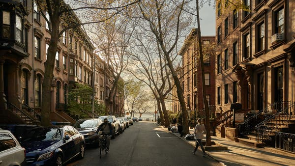

Image

The view down Remsen Street, toward the Brooklyn Heights Promenade.Credit...Zack DeZon for The New York Times

**Michael Kimmelman** I used to live over the [Damascus Bakery](http://www.damascusbakery.com/damascus-about-us/)on Atlantic Avenue and took Remsen to get to the Promenade.

**Marion Weiss **We love how the canopy of trees along Remsen frames the Manhattan skyline. You can’t tell whether the street goes all the way down to the East River until you reach the Promenade. It comes as a complete surprise to discover you’re on a bluff. When I first moved to the city, Michael wanted to introduce me to the beauty of Brooklyn, so, of course, he brought me to the Promenade. I remember it was a rainy evening. Manhattan shimmered, and the Promenade’s lights reflected on the wet paving like cotton balls. I couldn’t believe it. And it was so quiet. The Promenade is such an improbable infrastructural invention. I had no idea we were standing on top of an expressway.

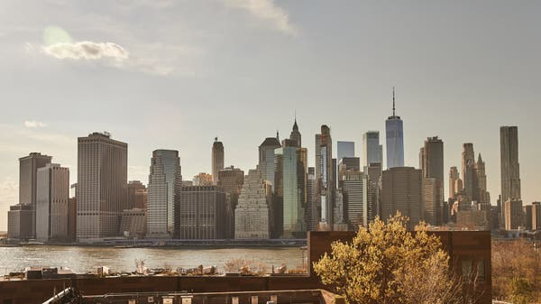

Image

The view of Lower Manhattan from the Brooklyn Heights Promenade.Credit...Zack DeZon for The New York Times

Image

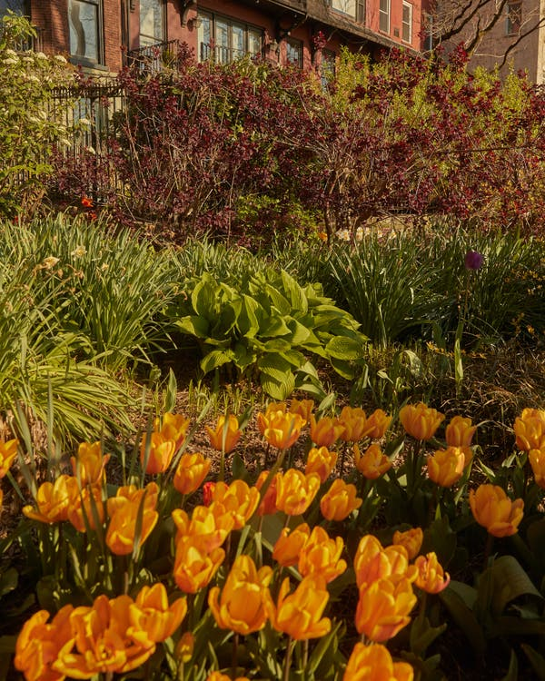

Credit...Zack DeZon for The New York Times
Image

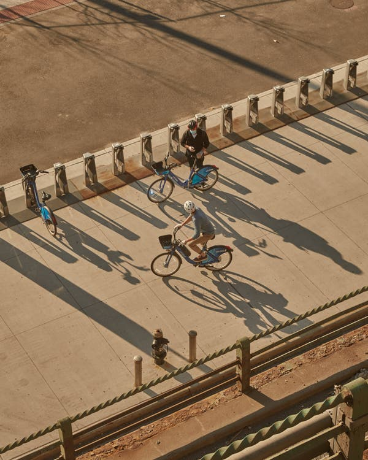

Credit...Zack DeZon for The New York Times

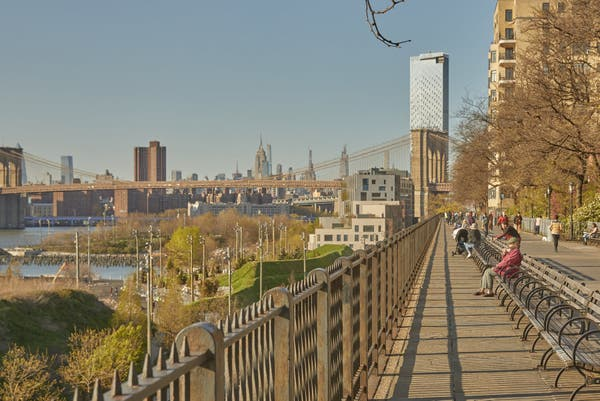

Image

A view of the Brooklyn Bridge, with Brooklyn Bridge Park in the foreground, from the Promenade.Credit...Zack DeZon for The New York Times

**The ****[Brooklyn-Queens Expressway](https://www.nytimes.com/2019/04/10/arts/design/bqe-construction-nyc.html?searchResultPosition=1)****. It’s an engineering feat not quite on par with the bridge, but remarkable: bunk-bedded roadways cantilevered from the Heights, the Promenade, the top bunk.**

**Michael Manfredi **Michael Rapuano and Gilmore Clarke were the Promenade’s landscape architects. This is one of the great urban designs of the last century — taming the B.Q.E. and also creating an oasis with a view. We used to stand at the edge of the Promenade and look down on the old Brooklyn waterfront, which was mostly empty warehouses. Now it’s [Brooklyn Bridge Park](https://www.nytimes.com/2018/08/09/arts/design/east-river-brooklyn-bridge-park-pier-3-hunters-point-south-domino.html).

**Weiss **We love Brooklyn Bridge Park, which is so democratic and lively. But we loved the ratty charm of the waterfront before the park was built.

Advertisement

[Continue reading the main story](https://www.nytimes.com/2020/05/06/arts/design/brooklyn-bridge-virtual-tour-virus.html?action=click&module=Top%20Stories&pgtype=Homepage&contentCollection=AtHome&package_index=0#after-story-ad-3)

**The****[River Café](https://rivercafe.com/)**** and ****[Bargemusic](https://www.bargemusic.org/)****, the concert venue, are left from the old days.**

**Manfredi **We were married at the Barge. We still go to concerts there. It used to be that if you went to concerts at night you’d hurry home. You didn’t want to hang around after dark. It was an industrial neighborhood. I took my car to a repair shop near the Barge, run by a grumpy mechanic with a passion for old BMWs.

**That got turned into a nice restaurant.**

**Weiss **Sometimes we go down to the waterfront when we walk home. But on the way to work we take in the Promenade — and the little gardens of the brownstones that face onto it — then turn onto one of the fruit streets, Pineapple or Cranberry or Orange.

Image

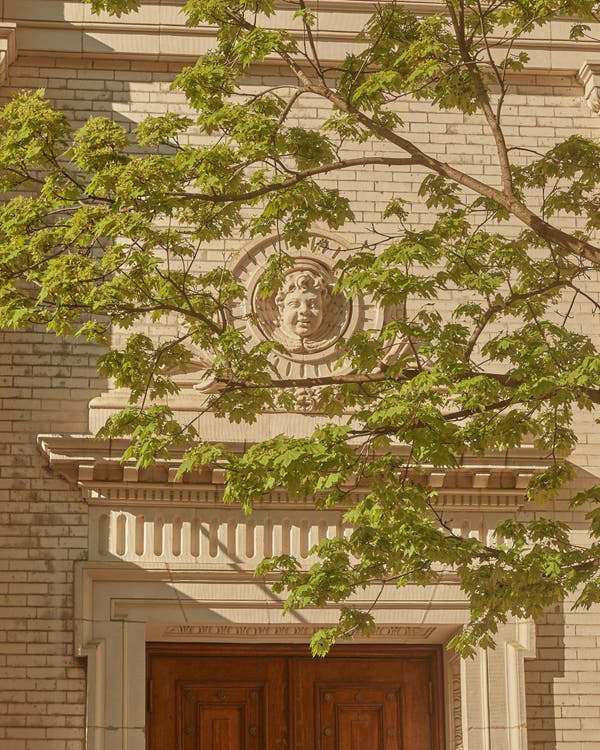

Credit...Zack DeZon for The New York Times
Image

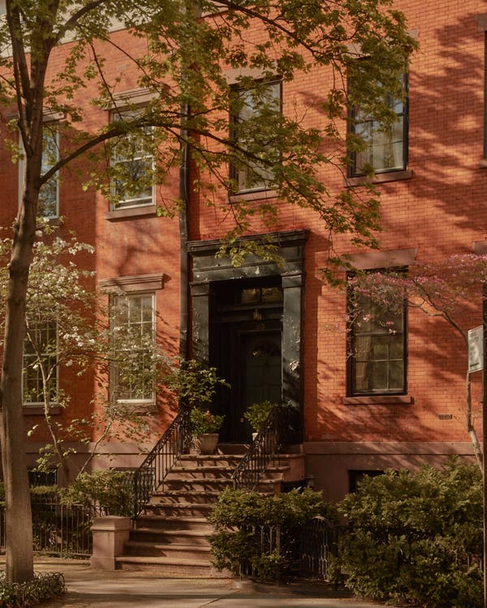

Credit...Zack DeZon for The New York Times

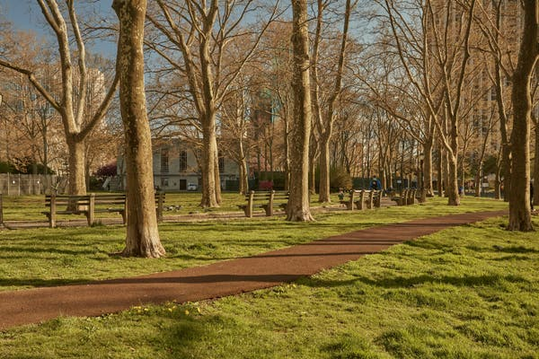

Image

Cadman Plaza Park, with its tall London plane trees.Credit...Zack DeZon for The New York Times

**The Roebling house, 110 Columbia Heights, was on the corner of Orange Street, I believe, where Hart Crane, who wrote the great ****[poem](https://poets.org/poem/brooklyn-bridge)**** about the Brooklyn Bridge, also lived. Robert Moses, in effect, tore it down after the war to make way for the B.Q.E.**

**Weiss** Orange, Cranberry, Pineapple, Hicks, they’re all intimate streets lined with churches and wooden buildings and houses like the one from the 1820s on Cranberry that’s now a [veterinary hospital](https://www.bhvh59.com/our-hospital/). There are still neighborhood stores and restaurants. It’s a dramatic transition from there to the civic scale of Cadman Plaza Park, with its allées of tall London plane trees.

Advertisement

[Continue reading the main story](https://www.nytimes.com/2020/05/06/arts/design/brooklyn-bridge-virtual-tour-virus.html?action=click&module=Top%20Stories&pgtype=Homepage&contentCollection=AtHome&package_index=0#after-story-ad-4)

**Another Moses-era development.**

**Manfredi **London plane trees were favorites of the Parks Department during Moses’s day because they grow quickly and are very hardy — not beautiful in the fall, but urban-scaled. A real city tree.

**Weiss **They’re all over Rome and Paris, too.

**Manfredi **The park lets us take a breath before climbing the stairs to the bridge.

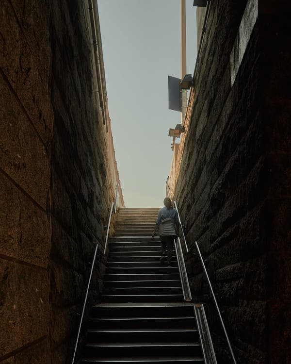

Image

A staircase leading up to the Brooklyn Bridge.Credit...Zack DeZon for The New York Times

**Weiss **A tight, compressed stairway leading to an entirely different topography.

**Topography?**

**Weiss** I mean, the topography of the pedestrian path over the bridge, which creates a long, gentle hill, rising and falling in midair, stretching across the water.

**Manfredi **A path that feels soft underfoot because the walkway is made of wood.

**Weiss **You feel that softness and also feel the path bounded by the bridge’s catenary cables — the path feels like the nave of a Gothic cathedral.

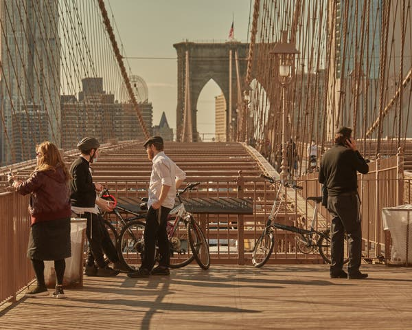

Image

The wooden walkway, with its soft hill, over the Brooklyn Bridge.Credit...Zack DeZon for The New York Times

Advertisement

[Continue reading the main story](https://www.nytimes.com/2020/05/06/arts/design/brooklyn-bridge-virtual-tour-virus.html?action=click&module=Top%20Stories&pgtype=Homepage&contentCollection=AtHome&package_index=0#after-story-ad-5)

Image

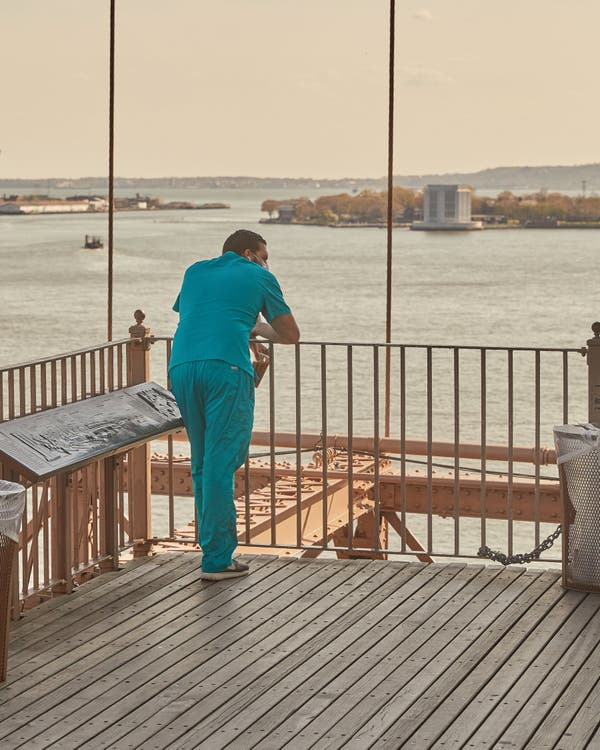

Credit...Zack DeZon for The New York Times
Image

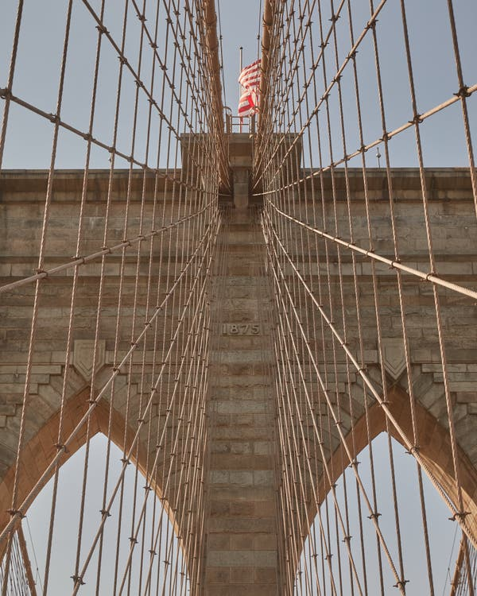

Credit...Zack DeZon for The New York Times

**The architecture of the bridge is neo-Gothic and those views through crisscrossing cables always make me think of stained glass.**

**Manfredi **The cables descend at the highest point of the bridge — that’s where you get an unobstructed view of not just Lower Manhattan but of the whole sweep of the harbor and the Verrazzano-Narrows Bridge. During the late ’60s, when I was a child, I visited New York for the first time with my family. We came by boat from Italy, where we lived. We arrived during the early morning, sailing under the Verrazzano. I saw the Brooklyn Bridge, with its wonderful arc, and the skyscrapers, which looked to me like they were floating. I thought New York was Oz.

**Weiss **We can still get chills walking over the bridge into Lower Manhattan — in the morning light the Woolworth Building, the Gehry building, the Municipal Building all dematerialize. The walkway lands near the base of the Municipal Building, a big-shouldered civic extrusion with a flourish of wedding cake decorations on top and towering arcades along the street that announce the ambition of the city. This was the first building in New York to incorporate a subway station, which exits under the shelter of the arcades.

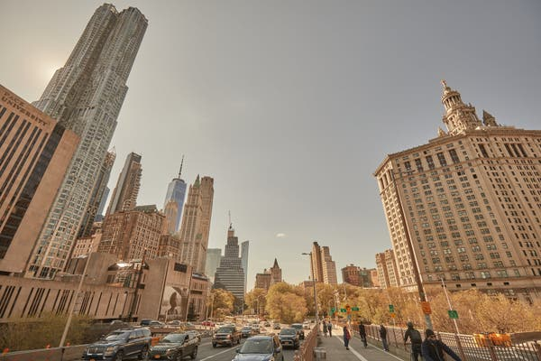

Image

The Brooklyn Bridge leads into Manhattan and the David N. Dinkins Manhattan Municipal Building, to the right.Credit...Zack DeZon for The New York Times

Image

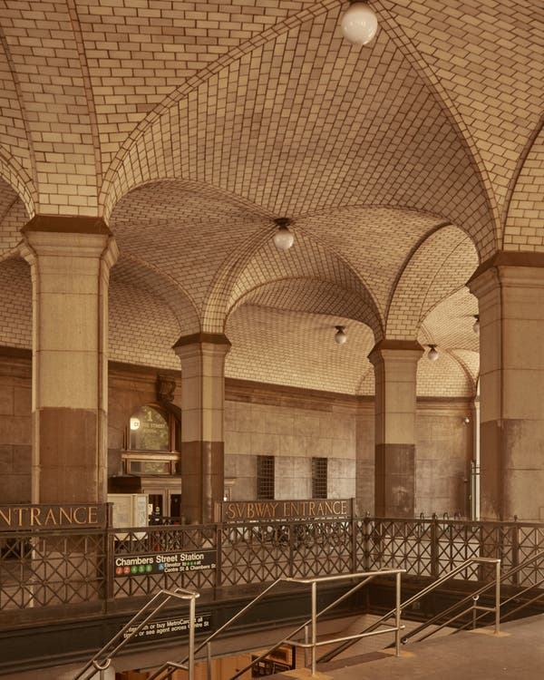

Credit...Zack DeZon for The New York Times
Image

Credit...Zack DeZon for The New York Times
Advertisement

[Continue reading the main story](https://www.nytimes.com/2020/05/06/arts/design/brooklyn-bridge-virtual-tour-virus.html?action=click&module=Top%20Stories&pgtype=Homepage&contentCollection=AtHome&package_index=0#after-story-ad-6)

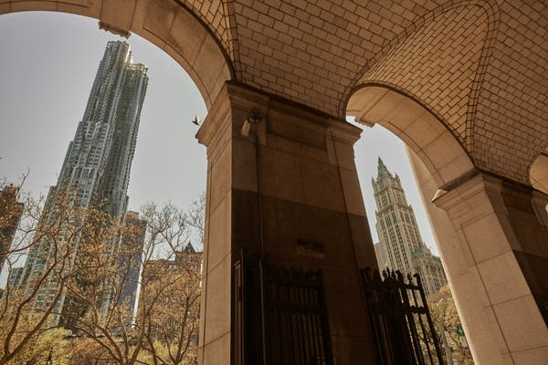

Image

New York by Gehry, left, and the Woolworth Building, right, as seen from the arcade of the Manhattan Municipal Building, tiled by Guastavino. Credit...Zack DeZon for The New York Times

**The ****[Guastavinos](https://untappedcities.com/2020/01/29/15-beautiful-locations-to-find-guastavino-tiles-in-nyc/?displayall=true)**** tiled those arcades. What’s officially called the David N. Dinkins Manhattan Municipal Building dates from the same era as Grand Central Terminal — not long after the city consolidated all five boroughs. It represented the new supersized New York. William M. Kendall, at McKim, Mead & White, was the architect.**

**Manfredi **A much-underrated designer, I think. The last of New York’s great Beaux-Arts architects. We like to look from Kendall’s Municipal Building, which has such gravitas and weight, at Gehry’s apartment tower, a couple of blocks south, which is slim and light, a chameleon.

**New York by Gehry, it’s called, at 8 Spruce Street, from 2011, clad on three of four sides in waves of shimmery stainless steel.**

**Manfredi **That pleated, fabric-like facade is always changing with the light: It’s bright pink in the morning, orange in the late afternoon, leaden on an overcast day. Something similar happens with the Woolworth Building.

Image

New York by Gehry, clad on three of four sides in shimmery waves of stainless steel, which change with the light.Credit...Zack DeZon for The New York Times

Advertisement

[Continue reading the main story](https://www.nytimes.com/2020/05/06/arts/design/brooklyn-bridge-virtual-tour-virus.html?action=click&module=Top%20Stories&pgtype=Homepage&contentCollection=AtHome&package_index=0#after-story-ad-7)

**Cass Gilbert’s sublime cathedral to the Walmart of its day, from 1913 — the tallest building in the world for many years.**

**Manfredi** You can see Woolworth when you look at the Gehry Building. Gilbert covered Woolworth in terra-cotta tiles. They glow and change hues at different times of day. The super-scale Gothic details at the crown make its profile legible from great distances. Woolworth is a huge, imposing presence on the street, like the Municipal Building, but the tiles give it a delicacy on the skyline that most big buildings don’t have.

**Weiss **And a dynamism. This was the headquarters for a five-and-dime company that, a century ago, was the symbol of American dynamism and of the emerging middle class when anything seemed possible in the country. It’s another transition, from Woolworth to City Hall Park, which is like an English garden. Suddenly, you almost imagine you’re not in New York. We take the path between the north end of City Hall and the south side of the old Tweed Courthouse. The north side of Tweed, designed by John Kellum, is architecture at arm’s length. But the wing at the southern end is wonderful, a Romanesque design by Leopold Eidlitz.

Image

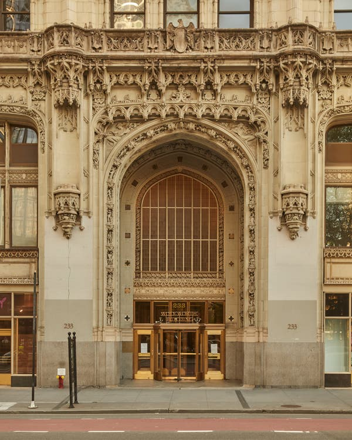

The entrance to the Woolworth Building.Credit...Zack DeZon for The New York Times

Image

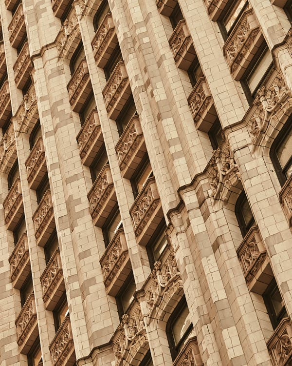

Woolworth’s terra-cotta tiling.Credit...Zack DeZon for The New York Times
Image

City Hall Park recalls an English garden.Credit...Zack DeZon for The New York Times

Image

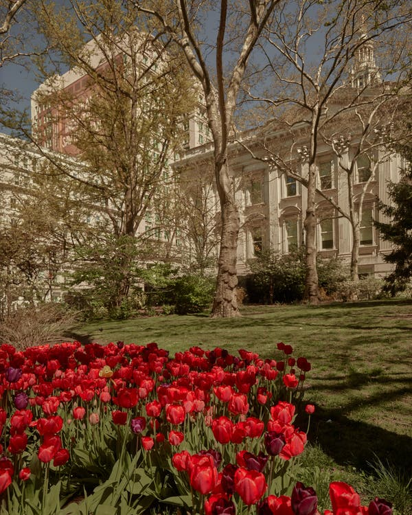

A path winds between City Hall and the former Tweed Courthouse.Credit...Zack DeZon for The New York Times

**Manfredi** Gracefully proportioned with enormous windows. There’s an openness to the architecture you don’t ordinarily find in masonry buildings from that era.

Advertisement

[Continue reading the main story](https://www.nytimes.com/2020/05/06/arts/design/brooklyn-bridge-virtual-tour-virus.html?action=click&module=Top%20Stories&pgtype=Homepage&contentCollection=AtHome&package_index=0#after-story-ad-8)

**Weiss** And we love the park. There are cherry trees with pink blossoms in the spring. When it rains, the ginkgos plaster their golden leaves like confetti on the stone pavers. We were so inspired by the painterly effect that we designed a carpet based on the ginkgo leaves. The honking cars fade away. You hear birds, smell flowers.

**Manfredi **Then we head west on Warren Street and north to Duane Park, which reminds us of an Italian piazza — surrounded by low-rise, 19th century cast-iron buildings with big awnings. The city apparently bought the site from Trinity Church in 1795 for $5. It used to be the center of the butter, cheese and egg trade. I suppose those awnings covered the carts and wagons that brought the eggs and cheese and butter from ships to what used to be a market here.

**Weiss **And now the market is a perfect little urban park, the opposite of the leftover spaces when a developer builds tall buildings and the city gets some dark, awkward plaza as compensation. Here the density of Lower Manhattan pulls back to create a kind of stage set of a public square that could be in Siena or Rome.

Image

Duane Park in Manhattan is on a site that used to be the center of the butter, cheese and egg trade.Credit...Zack DeZon for The New York Times

**Which is almost in the shadow of the former Western Union Building, at ****[60 Hudson Street](https://www.google.com/maps/search/60+Hudson+Street?entry=gmail&source=g)****, by Ralph Thomas Walker.**

**Manfredi **Like Woolworth, conceived a century ago to represent a mighty American company. If Woolworth was Walmart, Western Union was Microsoft or Google — a quintessential, technologically driven, unbelievably sophisticated global business. This was the communication hub of the world, a city within the city. Unlike lots of corporate headquarters today, it was open to the public and to the streets, with a huge, remarkable arcade that passes straight through the building.

Advertisement

[Continue reading the main story](https://www.nytimes.com/2020/05/06/arts/design/brooklyn-bridge-virtual-tour-virus.html?action=click&module=Top%20Stories&pgtype=Homepage&contentCollection=AtHome&package_index=0#after-story-ad-9)

**Weiss **The arcade reminds me of a great train station, with the same tapestry of bricks that is on the outside of the building. Western Union is like a hulking, geologic mass — an entire urban block extruded in brick. The setbacks look like chunks carved out of a mountain. We love the awkwardness.

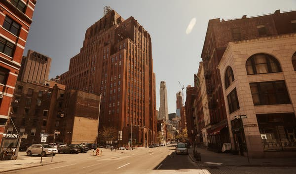

Image

60 Hudson Street, left, the former Western Union Building, was designed by Ralph Thomas Walker and is an Art Deco landmark.Credit...Zack DeZon for The New York Times

Image

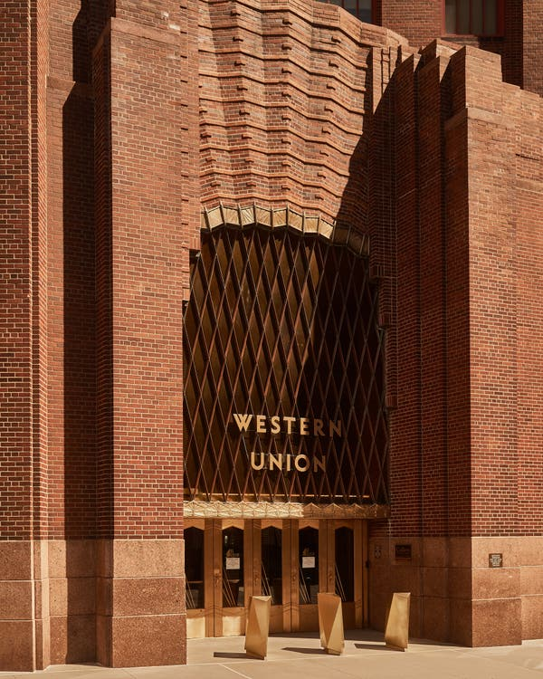

Credit...Zack DeZon for The New York Times
Image

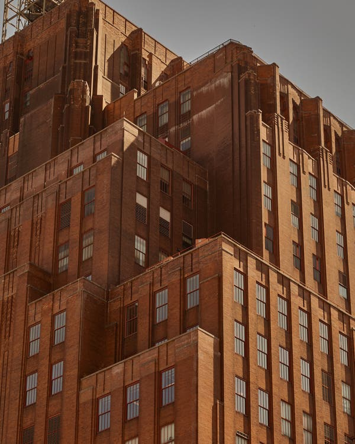

Credit...Zack DeZon for The New York Times

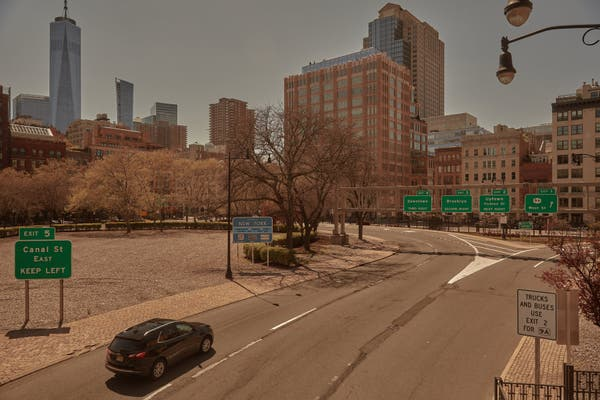

Image

The exit from the Holland Tunnel at Canal Street.Credit...Zack DeZon for The New York Times

**And a few blocks north is your office.**

**Weiss **Overlooking the exit from the Holland Tunnel, which creates this vista of open land, light and air.

**Traffic circle as urban prairie.**

**Weiss **That amount of sky and light is a gift in New York. Our building is one of those early-20th-century industrial lofts designed to support giant printing machines, so it has wide-open concrete floor plates with 25-foot column spans and big windows. Very resilient and adaptable. From our office windows we see over the Holland Tunnel to Greenwich Village and west to New Jersey.

Advertisement

[Continue reading the main story](https://www.nytimes.com/2020/05/06/arts/design/brooklyn-bridge-virtual-tour-virus.html?action=click&module=Top%20Stories&pgtype=Homepage&contentCollection=AtHome&package_index=0#after-story-ad-10)

**And to the Hudson River.**

**Weiss** Right. From the Brooklyn Bridge, over the East River, we watch the sun rise on our walk. From our office, we can watch it set over the Hudson.

**Manfredi **It’s a reminder. New York is a city of horizons.

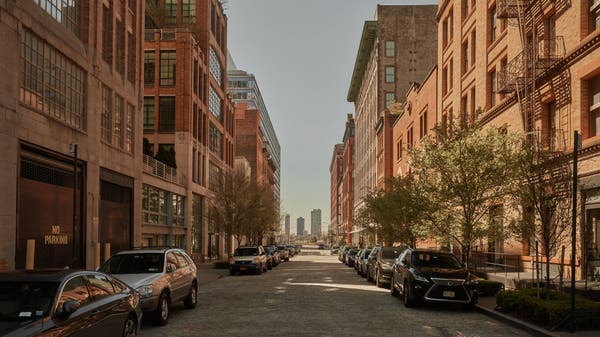

Image

The view from Hubert Street toward the Hudson River.Credit...Zack DeZon for The New York Times

Advertisement

[Continue reading the main story](https://www.nytimes.com/2020/05/06/arts/design/brooklyn-bridge-virtual-tour-virus.html?action=click&module=Top%20Stories&pgtype=Homepage&contentCollection=AtHome&package_index=0#after-bottom)